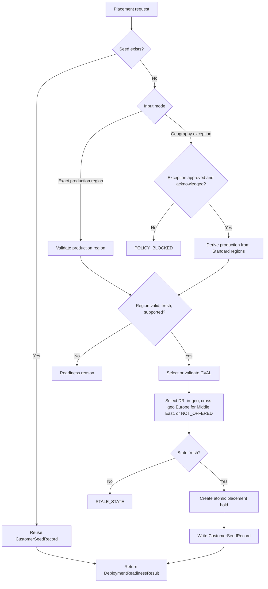

**Project:** Azure Capacity Reservation Management Engine (ACRME)  
**Classification:** Principal Cloud Architect - Architecture Governance  
**Version:** 2.4  
**Date:** 7 September 2026  
**Status:** Accepted - supersedes ADR-001 v2.2 region-selection content; reconciled to Baseline v2.4  
**Part of:** ACRME Architecture Decision Records - aligned to Capacity & Quota Management Requirements Baseline v2.4.

> **About ADRs.** An Architecture Decision Record captures a significant architectural decision, the context that forced it, the options considered, the choice made, and its consequences. This ADR states the accepted region-selection decision matching the consolidated requirements baseline — notably the five-geography region model with per-geography distribution models and mandatory two-region CVAL/DR co-location (PLC-010a). Evidence tags: `[Documented]`, `[Decided]`, `[Derived]`, `[Assumed]`.
>
> **v2.4 reconciliation note — reservation-model gaps.** Baseline v2.4 folds in the *reservation-model* gaps (seed-at-0 matrix CAP-022, per-AZ CRG structure CAP-023, reactive discovery CAP-024, Availability-Set ineligibility CAP-020/021, even zone-distribution PLC-011, naming convention OPS-006/C-12). **None of these change the region-selection or DR-placement decision recorded here** — the five-geography model, per-geography distribution models, exact-production-region-first placement, `CustomerSeedRecord` and two-region CVAL/DR co-location (PLC-010a) are all unchanged by the reservation-model work. The new per-AZ CRG structure (CAP-023) operates **within** a selected region and is specified in ADR-002/ADR-004, not here.
>
> **v2.4 (amended) note — Middle East DR now offered (cross-geo to Europe).** As of the 11 Sep 2026 amendment to baseline v2.4, the Middle East `DR_NOT_OFFERED` position (former DEC-001) is **superseded**. Middle East DR **is now offered** as a **cross-geo DR** distribution model: **Prod and CVAL co-locate in a selected Middle East Standard region** (separate CRGs — co-location in a region is not capacity sharing, ENV-003) and **DR is placed cross-geo in a weighted-selected Europe Standard region**. Both the Middle East (Prod+CVAL) and Europe (DR) selections run through the **weighted capacity placement model**. New codes: **DR-020** (cross-geo DR ME→Europe), **PLC-010b** (cross-geo DR override to the PLC-010a co-location rule), **A-ME1** (data-residency assumption). This introduces a **third distribution model** — *cross-geo DR* — distinct from the US three-region model and the standard two-region co-located model. The CVAL-sacrifice DR bootstrap (DR-005/006) does **not** apply to the Middle East; ME DR uses dedicated reserved capacity in Europe. Europe now additionally serves as a **cross-geo DR destination** for the Middle East. The relevant sections below carry inline **[Amended v2.4]** markers.

---

# ADR-001 - Region Selection and Customer Placement

**Status:** Accepted  
**Date:** 27 August 2026  
**Deciders:** Principal Cloud Architect, Platform Engineering, DR Owner, Product Platform  
**Related requirements:** REG-001..REG-005, PLC-001..PLC-010, RDY-001..RDY-004, DR-014, DR-016..DR-019, DAT-002, DAT-005  
**Related constraints:** ENV-003, CAP-011, CAP-012, QUA-012, NFR-002, NFR-010

## Context

Requirements v2.1 changes the placement model from repeated geography-driven selection to a seeded, production-region-first model. Customers and product teams must know the exact Azure production region up front because a broad geography selection creates contract churn, data-residency ambiguity, and inconsistent product placement for the same customer. `[Derived]`

ACRME must still calculate CVAL and DR placement using current capacity, reservation, quota, zone, sharing, restriction, and DR-readiness state. The first valid decision becomes an authoritative seed that future products reuse. `[Decided]`

Key forces:

- Production protection is the primary objective. `[Decided]`
- Region, zone, quota, and capacity are hard isolation boundaries; capacity is never counted across regions or zones. `[Documented]`
- Region strategy is configuration-driven and spans **five supported geographies** (US, EU, Australia, Asia Pacific, Middle East), each catalogued with an explicit **distribution model** (baseline Section 6, REG-001). The US is the only three-region geography; EU, Australia and Asia Pacific are standard two-region (co-located CVAL/DR) geographies; **the Middle East is a cross-geo DR geography [Amended v2.4]**. New regions (e.g. Japan East, pending) are policy data added by config, not automatic rollout commitments. `[Derived]`
- **Middle East DR is now offered as a cross-geo DR model [Amended v2.4] (DR-020, PLC-010b; supersedes DR-014/DEC-001 `DR_NOT_OFFERED`).** Per the 11 Sep 2026 amendment to baseline v2.4, **Prod and CVAL co-locate in a selected Middle East Standard region** (separate CRGs — ENV-003) and **DR is placed cross-geo in a weighted-selected Europe Standard region**. Both selections run the weighted capacity placement model. Data-residency for the DR copy is governed by assumption **A-ME1** (Europe as the approved cross-geo destination); per-country legal carve-outs remain possible but are out of scope of the automated engine. `[Documented]`
- Placement must return a fresh, machine-readable readiness state to AEP/provisioning and must fail safely on stale or incomplete state. `[Decided]`

## Decision

Adopt a **production-region-first, seeded placement architecture**:

1. **Exact production region is the default input.** The default onboarding path requires the customer or platform workflow to provide the exact Azure production region. ACRME validates it rather than deriving it from a broad geography. `[Decided]`

2. **Geography-only selection is an exception path.** Geography input is retained only with explicit exception approval and customer acknowledgement that the selected production region becomes fixed until an approved migration changes the seed. `[Decided]`

3. **Customer seed record is authoritative.** The first placement decision writes `CustomerSeedRecord`; subsequent products/environments for the same customer and geography reuse it instead of re-running production selection. `[Decided]`

4. **CVAL and DR are selected after production is fixed.** Once the production region is validated, ACRME selects or validates CVAL and DR using current readiness, environment separation, restriction flags, workload distribution, quota/capacity state, and state freshness. `[Derived]`

5. **Placement creates readiness output, not just a region tuple.** Every evaluation returns a `DeploymentReadinessResult` state:

   ```text
   READY | READY_WITH_RISK | QUOTA_DEFICIT | RESERVATION_DEFICIT |
   CAPACITY_UNAVAILABLE | STALE_STATE | POLICY_BLOCKED | VALIDATION_REQUIRED
   ```

   `[Decided]`

6. **Atomic holds prevent double-commit.** Committed placement creates a hold keyed by customer, region, zone, SKU/family, environment, policy version, and snapshot version. Conditional writes reject concurrent requests that attempt to consume the same headroom. `[Decided]`

7. **DR placement contributes to the DR index.** The seed drives the `SourceDestinationDRIndex` maintained by ADR-003 so a declared source-region failure activates only that source's mapped standby set. `[Derived]`

## Region Classification and Policy

`PlacementPolicy` is the authoritative, versioned region catalogue. It includes region classification, supported geographies, **per-geography distribution model** (three-region, two-region co-located, or cross-geo DR — see below), zone support, SKU/family eligibility, separation class, approved cross-geo extension paths, `DR_NOT_OFFERED` flags, stale-state thresholds, weights, and exception metadata. `[Decided]`

| Attribute | Requirement |
|---|---|
| Standard region | Eligible for automated placement and scoring. |
| Restricted region | Never recommended, scored, or auto-selected; usable only for explicit production-region exception. |
| Cross-geo DR destination | **[Amended v2.4]** A geography approved to host cross-geo DR for another geography's source regions. **Europe is the approved cross-geo DR destination for the Middle East** (A-ME1): the DR region is **weighted-selected among Europe Standard regions** (DR-020, PLC-010b), not a single fixed region. |
| `DR_NOT_OFFERED` | Produces seed value `DR region = NOT_OFFERED`; ACRME must not silently substitute another geography. **No longer set for the Middle East [Amended v2.4]** — the former Middle East default (DR-014/DEC-001) is superseded by the cross-geo DR model (DR-020). The flag remains available for any future geography/country that Legal declares no-DR. |
| Policy version | Every change increments version and is recorded with approver, reason, effective date, and replay/audit metadata. |

The number of regions per geography is set by the catalogue's **distribution model**, not a universal minimum. There are **three distribution models [Amended v2.4]**:

1. **Three-region (US).** Production, CVAL and DR each sit in a distinct in-geo region.
2. **Two-region co-located (EU, Australia, Asia Pacific).** Production is placed in one region and **CVAL and DR are co-located in the other region** (mandatory rule **PLC-010a**, via environment separation ENV-003). This delivers in-geo Prod + CVAL + DR **without** any cross-geo path — co-location is the standard model, not a fallback.
3. **Cross-geo DR (Middle East) [Amended v2.4].** **Prod and CVAL co-locate in a selected Middle East Standard region** (separate CRGs; co-location in a region is not capacity sharing, ENV-003) and **DR is placed cross-geo in a weighted-selected Europe Standard region** (DR-020, PLC-010b). Both the source (Middle East Prod+CVAL) and destination (Europe DR) selections run the weighted capacity placement model. This model **overrides** the PLC-010a co-location rule for the Middle East: CVAL co-locates with **Prod locally**, not with DR, so the CVAL-sacrifice DR bootstrap (DR-005/006) does not apply — ME DR uses dedicated reserved capacity in Europe. The former Middle East `DR_NOT_OFFERED` position (DR-014/DEC-001) is superseded. `[Derived]`

## Placement Flow



## CustomerSeedRecord

`CustomerSeedRecord` must include:

- seed ID and customer/realm identifier;
- geography;
- production region;
- CVAL region;
- DR region or `NOT_OFFERED`;
- products covered;
- region/zone/SKU-family policy context;
- decision timestamp;
- policy version and engine version;
- capacity/quota snapshot references and freshness;
- exception approval reference and customer acknowledgement, where applicable;
- active hold IDs;
- migration status and audit metadata. `[Decided]`

Seeds are not regenerated on upgrades, rebuilds, or routine deployments. Changes require an approved migration/exception workflow with impact analysis. `[Decided]`

## Validation Rules

| Rule | Check | Failure state |
|---|---|---|
| Exact Prod default | Request includes a specific production region unless an exception is approved. | `POLICY_BLOCKED` |
| Region catalogue | Region is present in active `PlacementPolicy`. | `VALIDATION_REQUIRED` |
| Standard automated path | Automated selection uses Standard regions only. | `POLICY_BLOCKED` |
| Restricted region exception | Restricted regions require explicit production-only request and approval. | `POLICY_BLOCKED` |
| `DR_NOT_OFFERED` | Geography/country flagged as no-DR writes `NOT_OFFERED` and blocks cross-geo substitution. | `READY_WITH_RISK` or `POLICY_BLOCKED` per policy |
| Region-model gate (geography-aware) **[Amended v2.4]** | Placement satisfies the geography's **distribution model** (REG-001): a **three-region** geography (US) requires Prod, CVAL and DR in three distinct regions; a **two-region co-located** geography (EU, Australia, Asia Pacific) requires Prod in one region and **CVAL + DR co-located** in the other (PLC-010a); a **cross-geo DR** geography (Middle East) requires Prod + CVAL co-located in a Middle East region and DR in a weighted-selected Europe region (DR-020, PLC-010b). A universal "three distinct regions" minimum is **not** enforced. | `POLICY_BLOCKED` |
| Freshness | Snapshot age <= configured maximum or synchronous refresh succeeds. | `STALE_STATE` |
| Capacity | Required reserved capacity exists or over-allocation is approved. | `RESERVATION_DEFICIT` or `CAPACITY_UNAVAILABLE` |
| Quota | Consumer/deploying subscription has required quota. | `QUOTA_DEFICIT` |
| Concurrency | Atomic hold commit succeeds. | `VALIDATION_REQUIRED` |

## Consequences

**Positive**

- Avoids production-region ambiguity and customer contract churn. `[Derived]`
- Produces stable placement across products for the same customer/geography. `[Decided]`
- Makes CVAL/DR decisions replayable from seed, policy version, and snapshot references. `[Decided]`
- Gives AEP/provisioning an explicit readiness contract instead of implicit success/failure. `[Decided]`

**Negative / trade-offs**

- Geography-only onboarding now needs exception governance and customer acknowledgement. `[Decided]`
- Seed migration becomes a governed workflow, not a simple re-run of scoring. `[Derived]`
- `DR_NOT_OFFERED` can create a readiness-with-risk outcome that must be handled commercially and operationally. `[Derived]`
- **[Amended v2.4]** Cross-geo DR for the Middle East adds a cross-geography dependency: Europe Standard regions now absorb Middle East DR load, and both the Middle East (Prod+CVAL) and Europe (DR) legs must be weighted-selected and held atomically. Data residency of the DR copy is governed by A-ME1 and must be re-validated if Legal changes the approved destination. `[Derived]`
- Atomic holds add state-management complexity but are required to prevent double-committed capacity/quota. `[Decided]`

## Alternatives Considered

| Alternative | Why rejected or constrained |
|---|---|
| Geography selection as default | Caused ambiguous customer intent and inconsistent product placement. `[Derived]` |
| Re-run placement per product | Risks drift across products for the same customer/geography. `[Decided]` |
| Use stale daily/weekly snapshots for deployment | Can deploy into capacity/quota that is no longer available. `[Derived]` |
| Auto-select cross-geo DR for two-region co-located geographies | Rejected. EU, Australia and Asia Pacific co-locate CVAL and DR in-geo (PLC-010a); cross-geo substitution is never silent for them. **[Amended v2.4]** Cross-geo DR is now the **explicit, catalogued** distribution model for the Middle East only (DR-020, PLC-010b): DR is weighted-selected among **Europe Standard regions** (not a single fixed region such as the former Switzerland North example), and the former `DR_NOT_OFFERED` seed is superseded. `[Decided]` |
| Fix a single Europe region (e.g. Switzerland North) for Middle East cross-geo DR | Rejected **[Amended v2.4]**. Baseline v2.4 requires the Europe DR region to be chosen through the **weighted capacity placement model** among Europe Standard regions so DR placement reflects live capacity/quota, not a hard-coded region. Switzerland North remains only a default example. `[Decided]` |

---

## Appendix - ADR Summary

| ADR | Requirements Applied | Key Open Items |
|---|---|---|
| ADR-001 Region Selection and Customer Placement | REG-001..005, PLC-001..010a, **PLC-010b**, RDY-001..004, DR-014, **DR-020**, **A-ME1** | ~~DEC-001~~ **RESOLVED — Middle East DR now offered (cross-geo to Europe, v2.4 amended)**; DEC-003 geography exception approver; production stale-state threshold; per-country ME data-residency carve-outs (Legal) |

## Appendix - Status Legend

| Status | Meaning |
|---|---|
| **Proposed** | Under discussion; not yet ratified |
| **Accepted** | Ratified and in force |
| **Deprecated** | No longer recommended but not yet replaced |
| **Superseded** | Replaced by a later ADR |

## Appendix - Evidence Tag Taxonomy

| Tag | Meaning |
|---|---|
| `[Documented]` | Traceable to Azure platform behaviour or documentation |
| `[Decided]` | An explicit ACRME design choice recorded in this ADR set |
| `[Derived]` | A logical consequence of a documented constraint or decision |
| `[Assumed]` | Architectural judgement pending proof-of-concept validation |

## Related ADRs

- **ADR-002 - Quota and Capacity Management** (`acrme_adr_002_quota_and_capacity_management.md`)
- **ADR-003 - Capacity Management during Disaster Recovery (DR)** (`acrme_adr_003_capacity_management_during_dr.md`)
- **ADR-004 - Forecast, Reconciliation, and Increase of Capacity and Quota** (`acrme_adr_004_forecast_and_increase_of_capacity_and_quota.md`)

---

**Document Status:** Accepted  
**Next Review:** After DEC-003 decision, readiness API contract review, and first seed-record implementation test. (DEC-001 resolved — Middle East DR now offered as cross-geo DR to Europe, v2.4 amended 11 Sep 2026.)
