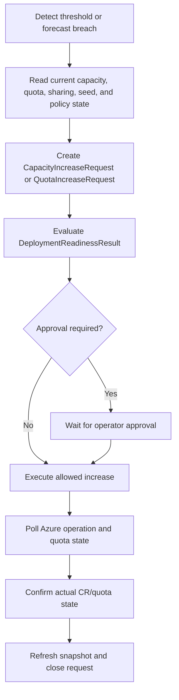

**Project:** Azure Capacity Reservation Management Engine (ACRME)  
**Classification:** Principal Cloud Architect - Architecture Governance  
**Version:** 2.4  
**Date:** 7 September 2026  
**Status:** Accepted - supersedes ADR-004 v1.2 forecast-only sizing content; reconciled to Baseline v2.4 (seed matrix + reactive discovery)  
**Part of:** ACRME Architecture Decision Records - aligned to Capacity & Quota Management Requirements Baseline v2.4.

> **About ADRs.** An Architecture Decision Record captures a significant architectural decision, the context that forced it, the options considered, the choice made, and its consequences. This ADR separates continuous reconciliation from longer-horizon forecasting and quota/capacity increase workflows. The **v2.4 revision** adds the seed-matrix initialisation model (**CAP-022**) and the reactive SKU/AZ discovery workflow (**CAP-024**) — see *Seed Matrix Initialisation and Reactive Discovery* below. Evidence tags: `[Documented]`, `[Decided]`, `[Derived]`, `[Assumed]`.

---

# ADR-004 - Forecast, Reconciliation, and Increase of Capacity and Quota

**Status:** Accepted  
**Date:** 27 August 2026  
**Deciders:** Principal Cloud Architect, Platform Engineering, FinOps, Capacity Planning, Operations  
**Related requirements:** CAP-003..CAP-010, **CAP-019, CAP-020..CAP-024**, QUA-006..QUA-010, RDY-001..RDY-004, FIN-001..FIN-006, OBS-001..OBS-005, NFR-003..NFR-010, OPS-001..OPS-006  
**Related POCs:** POC-004, POC-005, POC-008, POC-009, POC-010

## Context

The earlier ADR treated forecast demand as the primary capacity sizing formula. Requirements v2.1 splits this into two distinct control loops:

- **Continuous reconciliation** keeps current reservations aligned to actual allocated demand plus a configurable buffer.
- **Forecast and increase planning** predicts future demand, quota needs, and cost exposure, then drives approval-gated quota/capacity changes. `[Decided]`

This distinction matters because associated-but-deallocated VMs should not automatically preserve expensive reservations, while production growth still needs proactive planning and alerting. `[Derived]`

## Decision

Adopt a **two-path capacity management model**:

1. **Reconciliation floor is allocated demand plus buffer.** The normative steady-state floor is:

   ```text
   Target Reserved Capacity = Allocated VM Count + Configured Buffer
   ```

   `[Decided]`

2. **Forecasting is advisory and proactive.** Forecasting estimates future peaks and produces recommendations, quota lead-time alerts, and increase requests; it does not override the reconciliation floor without policy approval. `[Decided]`

3. **Associated-but-deallocated VMs are separate.** They are visible in dashboards and restart-risk reporting, but they do not automatically force reservation retention unless policy explicitly requires it. `[Decided]`

4. **The reconciliation interval is configurable.** The reference implementation runs as a container-app job every six minutes; production interval is tuned from API throttling, cost, operational risk, and deployment responsiveness. `[Decided]`

5. **Scale-up failure is surfaced, not hidden.** If allocated demand rises and Azure cannot supply capacity, ACRME holds the current safe state, raises an alert, exposes the buffer deficit, and records the Microsoft/Azure negotiation path. `[Decided]`

6. **Scale-down is guarded.** Reductions apply minimum-hold interval, DR protection, maintenance exclusion, approved overrides, cost policy, and Azure safety validation. `[Decided]`

7. **No automatic deletion.** Normal reconciliation can reduce to zero where Azure permits but never deletes CRGs or reservation definitions. Deletion is a separate approved decommissioning workflow. `[Decided]`

## Reconciliation Loop

Each reconciliation cycle reads:

- scope-file desired state and policy version;
- reservation quantity;
- allocated VM count;
- associated VM count;
- available reserved capacity;
- configured production/DR buffer;
- quota assigned/used/available;
- sharing relationships;
- state age and Azure API health. `[Decided]`

Decision logic:

```text
target = allocated_vm_count + configured_buffer

if reserved_quantity < target:
    attempt scale-up to target
    if Azure cannot supply:
        keep current reservation
        alert buffer deficit

if reserved_quantity > target:
    reduce toward target only after hold interval, DR guard,
    maintenance exclusion, override, and cost-policy checks
```

The loop is idempotent, uses durable operation keys for mutations, and confirms Azure resource-provider state before committing engine state. `[Decided]`

## Seed Matrix Initialisation and Reactive Discovery (CAP-022, CAP-024)

The reconciliation floor above assumes a reservation object already exists for each managed SKU/AZ. Baseline v2.4 makes explicit **how that set of reservation objects comes into being** and **how newly-observed SKU/AZ combinations are absorbed** — the two ends of the reconciliation lifecycle that were previously implicit.

### Seed-at-0 eligible-SKU/AZ matrix and budget governance — CAP-022 `[Decided]`

*(Extends CAP-009 zero-capacity support.)* The managed set of **SKU/VM-family × region × availability-zone** combinations is initialised as a **seed matrix of count-0 reservations** ("**seed reservations**"). Normative rules:

1. **Seed at 0.** Every eligible combination in the scope file is created in Azure at reserved quantity **0** (CAP-009 zero-support) inside the correct **regional or per-AZ CRG** (CAP-023), so reconciliation can scale each up from a known baseline the instant allocated demand first appears (CAP-007). Reaching or starting at 0 is a normal state, **not** a decommission (CAP-010).
2. **Eligibility.** A combination is eligible only if its placement is **reservation-eligible** — an availability zone (preferred), or regional placement only where the SKU has no zonal reservation support (CAP-020). Availability-Set VMs are excluded and carry the CAP-021 deallocate/redeploy-to-AZ remediation.
3. **Budget governance.** A SKU/AZ combination enters the seed matrix **only with a named owning product team and an approved budget line**, because any reservation scaled above 0 incurs cost. Populating and expanding the matrix is therefore governed by **product-team budget approval**, not by the engine alone.
4. **Configuration-driven & versioned.** The matrix, its eligibility rules, and its budget owners live in the **scope file** (CAP-019) and are versioned; changes follow scope-file governance.
5. **Terminology.** A "**seed reservation**" here is a **zero-count capacity reservation** — distinct from the placement **seed record** (`CustomerSeedRecord`, PLC-003), which records *where* a customer is placed. This ADR never conflates the two.

```text
# Seed-matrix initialisation (per scope-file entry)
for (sku, region, az) in scope_file.eligible_combinations:
    assert placement_is_reservation_eligible(sku, region, az)      # CAP-020
    assert has_owning_product_team(sku) and has_approved_budget(sku) # CAP-022 governance
    crg = resolve_crg(env, region, az)        # per-AZ CRG, or regional CRG if SKU non-zonal (CAP-023)
    ensure_crg_exists(crg)                     # name per OPS-006 / C-12
    ensure_reservation(crg, sku, quantity=0)   # seed reservation at 0 (CAP-009)
# Reconciliation later scales each seed up from 0 on first allocated demand (CAP-003/CAP-007)
```

### Reactive SKU/AZ discovery reconciled with governance — CAP-024 `[Decided]`

*(Reconciles CAP-019 scope-file governance with CAP-002 Azure-first protection.)* When reconciliation or a deployment detects an **allocated VM of a SKU/AZ combination not yet in the seed matrix** (e.g. a product team deployed a new SKU), the engine performs **both** of the following, in order, so that live production is never left unprotected while governance catches up:

1. **Protect capacity first (auto-create).** Auto-create the corresponding reservation — the **CRG if absent** plus a reservation sized at **`allocated + buffer`** (CAP-003) in the correct **per-AZ or regional CRG** (CAP-023). This protects production immediately and preserves CAP-002 (the Azure resource still precedes config activation).
2. **Raise governance simultaneously.** Raise a **scope-file governance item** (CAP-019) so the discovered SKU/AZ is ratified into the scope file with an **owning product team and budget** (CAP-022).
3. **Reconcile to authoritative or roll back.** Governance reconciliation then either makes the reactive addition **authoritative** (ratified into the versioned scope file), or — if rejected — triggers the **approved decommissioning workflow** (CAP-010) to roll the reactive reservation back. Reconciliation itself never deletes the reactive reservation; only the decommissioning workflow does.
4. **Governance SLA, not precondition.** Scope-file consistency (CAP-019) is restored **within the governance SLA** rather than being a blocking precondition of protecting live production — this is the explicit resolution of the CAP-019 ↔ CAP-002 tension.

```text
# Reactive discovery (per reconciliation cycle)
for vm in allocated_vms:
    key = (vm.sku, vm.region, vm.az)
    if key not in seed_matrix and reservation_eligible(vm):     # CAP-020 gate
        crg = resolve_crg(vm.env, vm.region, vm.az)             # CAP-023
        ensure_crg_exists(crg)                                  # OPS-006 / C-12 name
        ensure_reservation(crg, vm.sku, quantity=allocated(key) + buffer)  # CAP-003 — protect now
        raise_scope_file_governance_item(key, needs=["product_team", "budget"])  # CAP-019/CAP-022
        # ratify -> authoritative in versioned scope file, OR reject -> decommissioning workflow (CAP-010)
```

Both flows emit operation resources, durable operation keys, and audit records on the same terms as the reconciliation loop, and surface readiness/alerting states (below) — e.g. a reactive auto-create with a pending governance item is reported distinctly from a fully-ratified reservation.

## Forecast and Increase Formula

Forecasting remains a separate planning signal:

```text
Forecast_Quantity = ceil(Forecast_Peak * (1 + Growth_Buffer) + Approved_DR_Buffer)
```

Variables:

- `Forecast_Peak`: predicted peak allocated or policy-protected demand for the horizon;
- `Growth_Buffer`: configurable uncertainty/growth percentage;
- `Approved_DR_Buffer`: DR-specific buffer from ADR-003 policy, not a fixed percentage clone;
- `Forecast_Horizon`: configurable, with 30/60/90 days retained as starting options. `[Decided]`

Forecast output can create a `CapacityIncreaseRequest` or `QuotaIncreaseRequest`, but Phase 1 execution remains approval-gated. `[Decided]`

## Capacity and Quota Increase Workflow



Increase requests record justification, target workload, SKU/family, region, amount, existing usage, target date, owner, policy version, approval, and before/after values. Requests without sufficient justification are not auto-escalated to Microsoft. `[Decided]`

## Readiness and Alerting Integration

Reconciliation and forecast output feed the readiness states defined in ADR-001:

| Condition | State or alert |
|---|---|
| Snapshot older than max age and refresh fails | `STALE_STATE` |
| Reservation below target | `RESERVATION_DEFICIT` and production/DR buffer alert |
| Azure cannot raise reservation | Scale-up failure alert and exposed buffer deficit |
| Consumer quota below deployment requirement | `QUOTA_DEFICIT` |
| Reservation exists but quota cannot deploy it | `READY_WITH_RISK` or `QUOTA_DEFICIT` by policy |
| Policy exception required | `POLICY_BLOCKED` |
| Unknown Azure/preview behavior | `VALIDATION_REQUIRED` |
| Sustained zero allocation with cost | Idle reservation cost alert |

Core metrics include reserved quantity, allocated count, associated count, available reserved capacity, configured buffer, buffer deficit/surplus, quota assigned/used/available, pooled quota, reservation utilization, unused reservation cost, reconciliation success/failure, throttling/latency, state age, and deployment blocks. `[Decided]`

## Scale-Down and Cost Policy

Scale-down is cost-positive but risk-sensitive:

- never reduce below allocated demand plus protected buffer;
- do not treat associated-but-deallocated VMs as allocated, but report restart risk;
- respect DR protection and CVAL earmarks from ADR-003;
- honor active maintenance windows and manual overrides;
- apply minimum-hold intervals to avoid thrashing;
- reduce unused reservations to zero where allowed instead of deleting them;
- require separate approval for deletion/decommissioning. `[Decided]`

## API and Operational Controls

All mutating operations return an operation resource rather than implying synchronous completion. Mutations require idempotency key, caller identity, expected state version, policy version, dry-run support for high-impact changes, structured precondition failures, and an operation polling URL. `[Decided]`

Operators can pause mutation while retaining inventory and alerting. Manual overrides must include owner, reason, desired value, expiry, and audit metadata; reconciliation must not overwrite an active approved override. `[Decided]`

## Consequences

**Positive**

- Aligns reservation cost with actual allocated demand while preserving configurable buffers. `[Decided]`
- Prevents non-paying or deliberately deallocated associated VMs from silently driving paid reservation retention. `[Derived]`
- Keeps forecast planning useful without making it a destructive automation path. `[Decided]`
- Produces clear AEP/provisioning readiness states and operational alerts. `[Decided]`

**Negative / trade-offs**

- Reductions require richer policy checks and may be slower than simple right-sizing. `[Derived]`
- Forecast recommendations remain advisory until accuracy and false-positive rates are measured. `[Assumed]`
- Six-minute reference reconciliation must be tuned at scale to avoid API storms. `[Assumed]`
- Zero-capacity behavior must be validated per Azure scenario before broad production dependency. `[Assumed]`

## Alternatives Considered

| Alternative | Disposition |
|---|---|
| Forecast formula as the continuous floor | Rejected; continuous floor is allocated demand plus buffer. `[Decided]` |
| Preserve reservations for all associated VMs | Rejected as too costly unless explicitly required by policy. `[Decided]` |
| Automatic deletion of unused reservations | Rejected; set to zero where possible and use separate decommissioning workflow. `[Decided]` |
| Fixed five-minute or six-minute production interval | Rejected as a universal guarantee; six minutes is the reference implementation only. `[Decided]` |
| Silent fallback when Azure cannot supply capacity | Rejected; alert and expose the deficit. `[Decided]` |

---

## Appendix - ADR Summary

| ADR | Requirements Applied | Key Open Items |
|---|---|---|
| ADR-004 Forecast, Reconciliation, and Increase | CAP-003..010, **CAP-019, CAP-020..024**, QUA-006..010, RDY-001..004, OBS-001..005, OPS-001..006 | POC-004 throttling, POC-005 allocation states, POC-008/009 buffer policies, POC-010 production interval; seed-matrix budget-governance workflow and reactive-discovery governance SLA to be validated in first reconciliation dry-run |

## Appendix - Status Legend

| Status | Meaning |
|---|---|
| **Proposed** | Under discussion; not yet ratified |
| **Accepted** | Ratified and in force |
| **Deprecated** | No longer recommended but not yet replaced |
| **Superseded** | Replaced by a later ADR |

## Appendix - Evidence Tag Taxonomy

| Tag | Meaning |
|---|---|
| `[Documented]` | Traceable to Azure platform behaviour or documentation |
| `[Decided]` | An explicit ACRME design choice recorded in this ADR set |
| `[Derived]` | A logical consequence of a documented constraint or decision |
| `[Assumed]` | Architectural judgement pending proof-of-concept validation |

## Related ADRs

- **ADR-001 - Region Selection and Customer Placement** (`acrme_adr_001_region_selection.md`)
- **ADR-002 - Quota and Capacity Management** (`acrme_adr_002_quota_and_capacity_management.md`)
- **ADR-003 - Capacity Management during Disaster Recovery (DR)** (`acrme_adr_003_capacity_management_during_dr.md`)

---

**Document Status:** Accepted  
**Next Review:** After POC-004, POC-005, POC-008, POC-009, POC-010, and first reconciliation dry-run against production-like scope.
