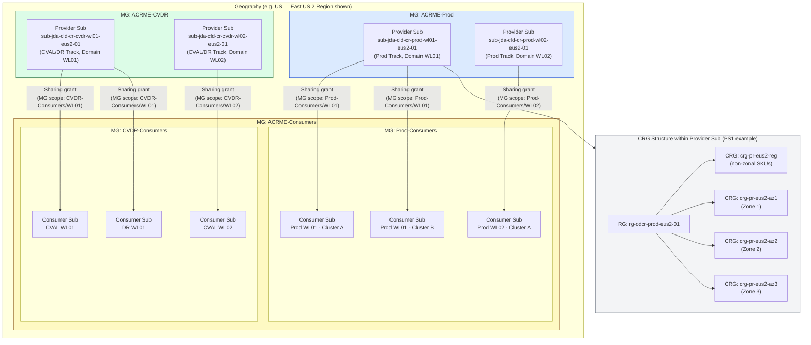

# ADR-007 — CRG/CR Deployment Model

**Architecture Decision Record**

| Field               | Value                                                                  |
|---------------------|------------------------------------------------------------------------|
| **ADR ID**          | ADR-007                                                                |
| **Title**           | Capacity Reservation Group and Capacity Reservation Deployment Model   |
| **Status**          | PROPOSED — Pending POC-001, POC-006, DEP-001                          |
| **Date**            | 2026-09-09                                                             |
| **Baseline**        | Requirements Baseline v2.4 (7 Sep 2026)                               |
| **Author(s)**       | ACRME Platform Architecture                                            |
| **Reviewers**       | Capacity Engineering, FinOps, Security, Platform Engineering           |
| **Supersedes**      | None (first CRG deployment model ADR)                                  |
| **Cross-references**| ADR-001 (Region Selection), ADR-002 (Quota), ADR-003 (DR Capacity),   |
|                     | ADR-005 (Distributed DR), ADR-006 (Quota/Reservation Enforcement)      |

---

> **Label conventions used in this document:**
> - `[Verified Azure Fact]` — Confirmed from live MS Learn documentation (fetched September 2026); treated as authoritative platform behaviour.
> - `[Baseline Requirement]` — Sourced directly from Requirements Baseline v2.4.
> - `[Architecture Recommendation]` — Derived position from this ADR; not yet POC-validated.
> - `[Assumption]` — Stated assumption; carries risk if incorrect; flagged for POC or documentation.
> - `[Preview Risk]` — Applies only while CRG Sharing remains in Public Preview; must be re-evaluated on GA.

---

## 1. Executive Summary

This ADR defines the **authoritative deployment model** for Capacity Reservation Groups (CRGs) and Capacity Reservations (CRs) across the ACRME-managed estate. It answers three architectural questions that Requirements Baseline v2.4 leaves partially open:

1. **How are CRGs organised relative to environments, subscriptions, regions, and availability zones?**
2. **Can a single common CRG operating model serve both modern (one-sub-per-env) and heritage (multi-env-per-sub) subscription topologies?**
3. **How does cross-subscription CRG sharing apply within the Azure-imposed 100-consumer limit when NFR-004 requires operation across hundreds of subscriptions?**

### Finding

The hypothesis of a single common CRG operating model is **partially viable but not unconditionally** so. A common structural model (the "Aligned Model," §7) is achievable, but it requires:

- **Strict subscription alignment** as a hard prerequisite for any subscription that uses CRG Sharing (heritage subscriptions mixing Prod and non-Prod violate ENV-003 and are excluded from the sharing path until remediated);
- A **mandatory sharding strategy** to address the 100-consumer-per-CRG hard limit imposed by Azure when NFR-004 scale is reached;
- **Management Group scoping** as the primary RBAC dispatch mechanism for sharing grants, which the baseline does not yet prescribe;
- **One corrected wording** in CAP-013 ("up to ~100" → "exactly 100 — a hard limit by Azure design, not a Preview restriction").

The recommendation is **Option C — Aligned Subscription-Bounded CRG Model** with workload-domain sharding for scale-out: a single structural model, two isolation tracks (Prod-only track and CVAL/DR-shared track per ENV-003), CRGs owned in a dedicated platform "provider" subscription per region per environment group, and consumer subscriptions added by explicit list or Management Group scope.

Where a heritage subscription cannot be immediately restructured, a **coexistence path** allows heritage workloads to operate with local (non-shared) CRGs under the same structural rules until they are migrated to the modern topology or Availability-Set VMs are remediated under CAP-021.

---

## 2. Assumptions and Confirmed Azure Constraints

### 2.1 Verified Azure Facts (from MS Learn — fetched live, September 2026)

The following facts were retrieved from the authoritative Microsoft documentation for Capacity Reservation Group sharing (`https://learn.microsoft.com/en-us/azure/virtual-machines/capacity-reservation-group-share`) and are treated as platform ground truth.

`[Verified Azure Fact — FC-01]` **CRG Sharing is in Public Preview** as of October 2025. It is not GA. Production reliance without enterprise Preview approval is not sanctioned. *(DEP-001 tracks GA status.)*

`[Verified Azure Fact — FC-02]` **The sharing unit is the Capacity Reservation Group**, not the individual Capacity Reservation. When a CRG is shared, all member CRs are accessible to authorised consumer subscriptions. Individual CRs cannot be independently shared or isolated within a shared CRG.

`[Verified Azure Fact — FC-03]` **Consumer subscription limit: exactly 100 per CRG.** This is a hard platform limit by design, not a Preview restriction. The baseline (CAP-013) uses "up to ~100" — the tilde is incorrect and must be removed. See §15.

`[Verified Azure Fact — FC-04]` **Consumer subscriptions must be listed explicitly** — no wildcard, no tenant-level sharing. The granting mechanism is either an explicit subscription list or a Management Group scope (all subscriptions in the specified MG inherit the grant).

`[Verified Azure Fact — FC-05]` **Management Group scoping is supported.** A grant may be scoped to all consumer subscriptions within a specified Management Group, which allows MG-level grants to reach multiple subscriptions without enumerating them individually.

`[Verified Azure Fact — FC-06]` **CRG Sharing is same-region, same-availability-zone only.** Cross-region and cross-availability-zone sharing are not supported. This is a fundamental platform constraint, not a Preview limitation.

`[Verified Azure Fact — FC-07]` **RBAC requirements for sharing:**
  - **Provider** must grant `Microsoft.Compute/capacityReservationGroups/share/action` to consumer principals.
  - **VM owners in consumer subscriptions** must have read and deploy rights on the shared CRG/CR.
  - Least-privilege grants scoped to the specific CRG are required.

`[Verified Azure Fact — FC-08]` **VMSS reprovisioning in a shared CRG is not supported during a zone outage** (Preview limitation). This must be re-evaluated on GA.

`[Verified Azure Fact — FC-09]` **No extra charges** for the sharing feature itself. Unused reserved capacity is charged to the provider subscription. VM usage is charged to the consumer subscription (the subscription that deploys the VM). Double-billing does not occur.

`[Verified Azure Fact — FC-10]` **Known issue (Preview):** The `List by subscription ID` operation returns an incorrect response if no local CRG exists in the region. Workaround: create a local CRG or use an Azure Resource Graph query.

`[Verified Azure Fact — FC-11]` **Microsoft's own guidance explicitly warns against a cross-sharing matrix.** The documentation recommends one main provider subscription per application, workload, or usage scope. Large-scale hub-provider patterns are an anti-pattern per Microsoft's advisory.

`[Verified Azure Fact — FC-12]` **CR is a child object of exactly one CRG.** A CR cannot span, be moved between, or be split across CRGs. The `--capacity-reservation-group` parameter is mandatory on CR creation.

`[Verified Azure Fact — FC-13]` **CRG is created at region level; AZ is specified per CR** within the group. A CRG scoped to a region may contain multiple CRs, each specifying a different AZ.

### 2.2 Baseline Requirements (Requirements Baseline v2.4)

The following requirements constrain this ADR. All are mandatory unless tagged [POC-gated].

`[Baseline Requirement — ENV-003]` **Hard separation constraints:**
- Non-prod (CVAL) and prod **cannot share capacity**.
- DR and prod **cannot share capacity**.
- DR **may share with non-prod** (CVAL/DR co-location permitted per PLC-010).

`[Baseline Requirement — CAP-013]` Support cross-subscription reservation sharing within the supported Azure scope (same region and same AZ; up to approximately 100 subscriptions per CRG — see §15 for required correction). Track provider/consumer subscriptions, sharing permissions, consumption, and revocation.

`[Baseline Requirement — CAP-023]` For each environment within a subscription and region, reservations are organised into: **one regional (non-zonal) CRG** plus **one CRG per availability zone** in the region. Environments are never mixed within a CRG. CRG, resource-group, and subscription names follow the OPS-006/C-12 convention.

`[Baseline Requirement — OPS-006 / C-12]` Deterministic naming convention:
- **Resource group:** `rg-odcr-<env>-<region>-<NN>` (e.g. `rg-odcr-prod-eus2-01`)
- **CRG:** `crg-<env>-<region>-<scope>` where `scope ∈ {reg, az1, az2, az3}` (e.g. `crg-pr-eus2-az1`)
- **Subscription:** `sub-<org>-<domain>-<purpose>-<NN>` (e.g. `sub-jda-cld-core-01`)

`[Baseline Requirement — NFR-004]` The engine operates across **hundreds** of subscriptions, multiple regions/zones, VM families, products, and seed records.

`[Baseline Requirement — PLC-010a]` In a two-region geography (Europe, Australia, Asia Pacific, Middle East), CVAL and DR co-locate deterministically in the non-Prod region. This is mandatory, not optional. HC-6 and HC-7 combined-capacity checks apply to the shared co-located pool.

`[Baseline Requirement — CAP-020]` Availability-Set VMs are ineligible for zonal on-demand capacity reservations. They are rejected from the zonal reservation / per-AZ CRG path at onboarding.

`[Baseline Requirement — CAP-021]` VMs in an Availability Set must first be deallocated and redeployed into an availability zone before they can participate in reservation management.

`[Baseline Requirement — GOV-001–003]` Least-privilege identity, separation of duties, and automation scoped by tenant/MG/subscription/RG/region/zone/SKU.

`[Baseline Requirement — POC-001 — POC-gated]` Quota behaviour in consumer subscriptions when consuming a shared reservation is unconfirmed. QUA-013 assumes quota lives in the consumer subscription; this remains a top technical unknown requiring POC validation before production reliance.

`[Baseline Requirement — POC-006 — POC-gated]` DR subscription topology (dedicated DR subscription vs shared production subscription) is an open decision. This ADR makes a recommendation but marks it POC-gated.

`[Baseline Requirement — DEP-001]` CRG Sharing Preview → GA status must be tracked. Production use requires enterprise approval of the Preview feature or GA transition.

### 2.3 Assumptions (Carry Risk)

`[Assumption — A-01]` Heritage subscriptions are defined as subscriptions hosting more than one environment class (e.g. Prod + CVAL in the same subscription) or hosting Availability-Set VMs. *Risk: if the actual heritage surface is larger or smaller, the coexistence scope changes.*

`[Assumption — A-02]` Modern subscriptions are defined as subscriptions aligned one-to-one with a single environment class per region per workload domain. *Risk: definition may not align with existing organisational taxonomy.*

`[Assumption — A-03]` The platform "provider" subscription model is operationally feasible — a dedicated subscription per region per environment group can be created and maintained. *Risk: subscription quota or organisational policy may block creation.*

`[Assumption — A-04]` Management Group scoping for CRG sharing grants is available in the target Azure tenants. *Risk: not all Azure tenants have MG-based RBAC for this action. POC-003 must validate.*

`[Assumption — A-05]` Quota in consumer subscriptions is independently provisioned and sufficient for the VM SKUs being deployed against shared CRGs. *Risk: POC-001 is the top open unknown here — if Azure charges quota to the provider, the whole billing model changes.*

---

## 3. Topology Interpretation

### 3.1 Modern Subscription Topology

A **modern subscription** is one that:
- Hosts exactly one environment class (Prod, CVAL, or DR);
- Is scoped to a single workload domain (product group, team, or platform layer);
- Uses availability zones (not Availability Sets);
- Follows the OPS-006/C-12 naming convention.

In a modern topology, each consumer subscription aligns to a single environment, making ENV-003 enforced at the subscription boundary rather than within it. CRG sharing can be applied cleanly: a Prod CRG provider subscription shares with all Prod consumer subscriptions; a CVAL/DR CRG provider subscription shares with all CVAL and DR consumer subscriptions.

Modern subscriptions map cleanly to the recommended model and require no remediation prior to adoption of CRG sharing.

### 3.2 Heritage Subscription Topology

A **heritage subscription** is one that:
- Hosts more than one environment class (e.g. Prod + CVAL in a single subscription); **or**
- Hosts Availability-Set VMs (CAP-020 ineligible); **or**
- Pre-dates the OPS-006/C-12 naming standard.

Heritage subscriptions violate ENV-003 when brought into a shared CRG context because:
- Sharing a CRG with a subscription that contains both Prod and CVAL VMs means the platform cannot enforce Prod/CVAL capacity isolation at the CRG level; both environments consume from the same pool.
- Sharing a CRG provider's Prod CRG with a heritage subscription where CVAL also runs creates a cross-environment capacity path that ENV-003 prohibits.

Heritage subscriptions are therefore **excluded from the CRG sharing path** until they are remediated:
- Mixed-environment subscriptions must be split or reconfigured so each subscription hosts exactly one environment class; or
- Availability-Set workloads must be deallocated and redeployed to AZ (CAP-021) before onboarding.

Until remediation, heritage subscriptions use **local (non-shared) CRGs** under the same structural rules (same naming, same regional+per-AZ structure per CAP-023).

### 3.3 Target State

The target state is a **unified structural model** — the same CRG hierarchy, naming, and placement logic — that:
- Applies to both modern and remediated heritage subscriptions via the shared-CRG path;
- Applies to un-remediated heritage subscriptions via the local-CRG path;
- Converges progressively as heritage subscriptions are remediated.

There is **no separate operating model** for modern vs heritage once the structural model is unified. The difference is the access path (shared vs local), not the structure.

---

## 4. Architecture Principles

The following principles govern all design choices in this ADR:

| # | Principle | Rationale |
|---|-----------|-----------|
| P-01 | **Environment isolation is structurally enforced** | ENV-003 separation cannot rely on naming or accounting alone; it must be enforced by the Azure object model (separate CRGs, separate subscriptions). |
| P-02 | **Provider subscription owns CRG lifetime** | CRGs must outlive any individual consumer. A dedicated provider subscription ensures CRGs are not deleted when a consumer subscription is retired or restructured. |
| P-03 | **CRG is the sharing unit, not the CR** | FC-02 — individual CRs cannot be selectively shared; all CRs in a shared CRG are accessible to all authorised consumers. Governance must account for this. |
| P-04 | **Scale via sharding, not limit violation** | The 100-consumer limit per CRG (FC-03) is hard and by design. Scale-out is achieved by introducing additional CRGs (shards) per workload domain, not by expecting Microsoft to raise the limit. |
| P-05 | **MG scope preferred for sharing grants** | Explicit subscription enumeration at hundreds-of-subs scale is operationally untenable. Management Group scoping (FC-05) allows a single grant to propagate to all subscriptions within an MG boundary. |
| P-06 | **Heritage subscriptions use local CRGs until remediated** | Rather than blocking heritage workloads, they operate with local CRGs under the same structural rules. The local→shared migration is a reconciliation operation, not a redesign. |
| P-07 | **Naming drives automation** | OPS-006/C-12 naming patterns are the primary mechanism by which the engine discovers, classifies, and reconciles CRGs. Non-conforming names are governance exceptions. |
| P-08 | **Preview features are not production-grade without approval** | DEP-001 tracks CRG sharing GA status. Any production reliance on sharing requires explicit enterprise approval of the Preview feature. |
| P-09 | **DR bootstrap must be satisfiable without sharing** | Until POC-001 confirms quota behaviour and DEP-001 clears the Preview flag, the DR capacity model must be achievable via non-shared CRGs in dedicated DR subscriptions. Sharing is additive, not foundational. |
| P-10 | **Zone isolation is structural, not accounting** | CAP-023 / CAP-011 — per-AZ CRGs are mandatory because zone-1 capacity must never be counted as available in another zone. This applies equally to shared and local CRGs. |

---

## 5. Options Considered

Five deployment options were evaluated. All options assume CAP-023 structural compliance (regional + per-AZ CRG per environment per region).

### Option A — Centralised Hub CRG Subscription (Single Provider per Region)

**Description:** One provider subscription per region hosts all CRGs for all environments and all workload domains. Consumer subscriptions are granted access to the appropriate CRG(s) from this central hub.

**Strengths:**
- Minimal provider subscription sprawl.
- Single administrative point per region.

**Critical weaknesses:**
- `[Verified Azure Fact — FC-11]` Microsoft explicitly warns against this pattern.
- A single hub provider subscription for all environments violates ENV-003 if any Prod CRG and any non-Prod CRG share the same subscription (the subscription itself does not enforce capacity isolation between CRGs within it; only separate subscriptions and RBAC do).
- At NFR-004 scale (hundreds of consumers), a single hub would require enumeration or MG grants for all subscriptions across all domains — creating an enormous, ungovernable RBAC surface.
- The 100-consumer limit applies per CRG (FC-03); at scale a hub CRG would need to shard anyway, making the "single hub" concept hollow.
- No workload domain isolation: a reservation for product group A is in the same CRG as product group B; any consumer of the CRG can consume any reservation.

**Verdict:** **Rejected.** Violates FC-11 advisory, ENV-003 risk, and creates unacceptable RBAC sprawl at NFR-004 scale.

---

### Option B — Per-Subscription Local CRGs (No Sharing)

**Description:** Every subscription creates and owns its own CRGs. No cross-subscription CRG sharing is used. This is the pre-Preview model.

**Strengths:**
- Eliminates all Preview feature dependency (DEP-001).
- Simplest RBAC model — each subscription's own identity manages its own CRGs.
- No 100-consumer limit concern.
- Heritage and modern subscriptions treated identically.

**Weaknesses:**
- DR capacity cannot be pre-staged and then "activated" via a shared reservation path; DR subscriptions must hold their own CRs, which must be pre-provisioned at full DR size — the cost and quota impact is the highest of all options.
- The CVAL/DR co-location model (PLC-010a, DR-005/DR-006) is harder to implement without a shared CRG — if CVAL and DR are in separate subscriptions with separate CRGs, the "sacrifice CVAL capacity for DR" step requires complex coordination across subscription boundaries rather than a simple VM disassociation + consumer subscription reassignment.
- DR-017 (max-not-sum sizing) relies on the ability to draw DR capacity across the non-Prod pool; without sharing, each DR subscription must self-contain its DR reservation, which pushes sizing back toward the less efficient full-copy approach.
- No scale-out benefit from the sharing feature's economics.

**Verdict:** **Retained as fallback baseline** only. Valid if DEP-001 never clears or POC-001 reveals quota behaviour incompatible with shared model. Not the recommended path.

---

### Option C — Aligned Subscription-Bounded CRG Model (Recommended)

**Description:** CRGs are created in dedicated provider subscriptions aligned to environment group and workload domain. Prod CRGs are in Prod-class provider subscriptions; CVAL/DR CRGs are in CVAL/DR-class provider subscriptions (one provider per workload domain per region per environment group). Consumer subscriptions for each domain are granted access via MG-scoped or explicitly listed grants.

Sharding by workload domain (product group tier) keeps consumer counts within the 100-subscription limit.

**Strengths:**
- ENV-003 is enforced at the subscription level (Prod provider subscription never shares with CVAL/DR consumer subscriptions).
- MG-scoped grants allow hundreds of subscriptions to be served without per-subscription enumeration.
- Sharding by domain scales horizontally with organisational growth.
- CRG lifetime decoupled from individual consumer subscriptions.
- Aligns with Microsoft advisory (one provider per scope/domain).
- Local CRG coexistence path for heritage subscriptions.

**Weaknesses:**
- Requires provider subscription management as a platform engineering concern (additional subscription lifecycle work).
- Sharding requires the engine to maintain a CRG shard registry — which shard serves which consumer.
- MG-scoped grants must be validated (POC-003 / FC-05 / A-04).

**Verdict:** **Recommended.** Best balance of isolation, scale, and operational clarity. See §7 for full detail.

---

### Option D — Geography-Level Elevated CRG Subscription

**Description:** One super-provider subscription per geography (not per region) hosts all CRGs across all regions in the geography. Consumer subscriptions across all regions in the geography are granted access.

**Strengths:**
- Fewer provider subscriptions globally.
- Geography-wide visibility from a single subscription.

**Critical weaknesses:**
- `[Verified Azure Fact — FC-06]` CRG sharing is same-region, same-AZ only. A geography-level provider subscription can still only serve consumers in the same region as each CRG — geography-level elevation provides no cross-region sharing benefit.
- The geography-level subscription still needs per-region CRGs (4 per environment per 3-zone region per CAP-023); it simply combines management of multiple regions' CRGs in one subscription.
- The 100-consumer limit still applies per CRG — geography scope does not raise it.
- Combining multiple regions' CRG management in one subscription increases blast radius of credential compromise or policy misconfiguration.
- At NFR-004 scale across five geographies, geography-level subscriptions still require sharding.

**Verdict:** **Rejected.** The geography-elevation provides no sharing advantage (FC-06), increases blast radius, and still requires sharding.

---

### Option E — Environment-Aligned CRG Subscription (No Domain Sharding)

**Description:** One provider subscription per environment per region (one Prod provider, one CVAL/DR provider per region across all workload domains). All product groups / workload domains share the same provider subscription.

**Strengths:**
- Fewer provider subscriptions than Option C.
- ENV-003 enforced at subscription boundary.

**Weaknesses:**
- No domain isolation within the Prod or CVAL/DR provider: a product group A reservation is visible and potentially consumable (at RBAC grant level) to product group B consumers.
- A single Prod provider subscription per region immediately hits the 100-consumer limit as the number of Prod consumer subscriptions grows past 100 (at NFR-004 scale, multiple product groups × multiple regional subscriptions per group will exceed 100 consumers per CRG within a single provider).
- Mandatory sharding still required once limit is reached; without domain-aligned sharding, the shard assignment is arbitrary and loses governance meaning.
- No workload domain boundary for cost attribution or governance.

**Verdict:** **Rejected.** Defers the sharding problem rather than solving it, and loses domain-level isolation.

---

## 6. Options Comparison Matrix

Scores: **1 = Poor, 3 = Acceptable, 5 = Excellent**

| Criterion                         | Weight | A — Centralised Hub | B — Local Only | C — Aligned (Rec.) | D — Geography-Level | E — Env-Aligned |
|-----------------------------------|--------|---------------------|----------------|---------------------|---------------------|-----------------|
| **Scalability** (NFR-004 hundreds of subs) | High | 1 | 5 | 4 | 2 | 2 |
| **Isolation** (ENV-003, domain separation) | Critical | 2 | 5 | 5 | 3 | 3 |
| **Operational Simplicity**        | Medium | 3 | 4 | 3 | 2 | 3 |
| **Governance** (RBAC, least-privilege) | High | 1 | 5 | 4 | 2 | 3 |
| **Cost Transparency** (per-domain chargeback) | Medium | 1 | 3 | 5 | 2 | 2 |
| **Migration Effort** (from current state) | Medium | 4 | 5 | 3 | 3 | 3 |
| **Topology Suitability** (modern + heritage) | High | 2 | 5 | 5 | 3 | 3 |
| **Weighted Assessment**           | —      | **Low** | **Medium** | **High** | **Low** | **Medium-Low** |

**Scoring rationale:**
- Option A scores 1 on Isolation because mixing all environments in a hub provider creates cross-env RBAC surface; GOV-003 least-privilege is unachievable at scale.
- Option B scores highest on Migration (no new provider subscriptions) and Local Only (no sharing dependency), but lowest on cost and DR operational model.
- Option C trades some operational simplicity for strong isolation and scalability; the shard registry adds engine complexity but is manageable.
- Option D loses points on Scalability and Governance because geography-elevation provides no sharing range benefit (FC-06) while increasing blast radius.
- Option E defers the sharding problem; loses Governance and Scalability points for the same reason as A at scale.

---

## 7. Recommended Target Model — Option C: Aligned Subscription-Bounded CRG Model

### 7.1 Structural Overview

The recommended model establishes:

1. **Two isolation tracks per region:**
   - **Prod Track** — one or more provider subscriptions per workload domain, hosting only Prod CRGs.
   - **CVAL/DR Track** — one or more provider subscriptions per workload domain, hosting CVAL and DR CRGs (ENV-003 permits DR/CVAL co-location; this track exploits it for the CVAL-sacrifice DR bootstrap pattern per DR-005/DR-006).

2. **One provider subscription per workload domain per region per track** as the baseline shard unit. When the consumer count for a domain grows beyond 100 per CRG, an additional CRG shard is introduced for that domain (see §10).

3. **Each provider subscription hosts the full CAP-023 CRG set** for its domain × region × track combination:
   - `crg-pr-<region>-reg` (regional, non-zonal SKUs)
   - `crg-pr-<region>-az1`, `crg-pr-<region>-az2`, `crg-pr-<region>-az3` (per-AZ, zonal SKUs)
   - Equivalent set for CVAL/DR track with appropriate environment token.

4. **Consumer subscriptions** are granted access via MG-scoped or explicit-list grants from the provider subscription, subject to the RBAC model in §12.

5. **Heritage subscriptions** operate with local CRGs (same naming, same structure) until remediated. Local CRGs are invisible to the shared provider but follow identical CAP-023 structure to ensure operational consistency.

### 7.2 Environment Group Isolation

```
┌─────────────────────────────────────────────────────────────┐
│               PROD ISOLATION TRACK                          │
│  Provider Sub: sub-jda-cld-cr-prod-<domain>-<region>-NN    │
│  CRGs: crg-pr-<region>-reg, az1, az2, az3                  │
│  Consumers: Prod consumer subscriptions (domain, ≤100)     │
└─────────────────────────────────────────────────────────────┘
                    ← ENV-003 hard boundary →
┌─────────────────────────────────────────────────────────────┐
│               CVAL/DR SHARED TRACK                          │
│  Provider Sub: sub-jda-cld-cr-cvdr-<domain>-<region>-NN    │
│  CRGs: crg-cv-<region>-reg, az1, az2, az3                  │
│        (DR bootstrap CRs in same CRG per PLC-010)          │
│  Consumers: CVAL subs + DR subs (domain, ≤100 combined)    │
└─────────────────────────────────────────────────────────────┘
```

The two tracks are separated at the subscription level. No cross-track sharing is possible. ENV-003 is enforced by the Azure subscription boundary, not by naming or accounting alone.

### 7.3 CRG/CR Hierarchy per Provider Subscription

For a three-zone region (e.g. East US 2), a single workload domain, Prod track:

```
Provider Subscription: sub-jda-cld-cr-prod-wl01-eus2-01
└── Resource Group: rg-odcr-prod-eus2-01
    ├── CRG: crg-pr-eus2-reg          (regional, non-zonal SKUs)
    │   └── CR: cr-pr-eus2-reg-standarddv4-01   (e.g. Standard_D4s_v4, no zone)
    ├── CRG: crg-pr-eus2-az1          (Zone 1, zonal SKUs)
    │   └── CR: cr-pr-eus2-az1-standarddv4-01
    ├── CRG: crg-pr-eus2-az2          (Zone 2, zonal SKUs)
    │   └── CR: cr-pr-eus2-az2-standarddv4-01
    └── CRG: crg-pr-eus2-az3          (Zone 3, zonal SKUs)
        └── CR: cr-pr-eus2-az3-standarddv4-01
```

For the CVAL/DR track, the CVAL CRGs host the seed reservations that serve as the CVAL pool; DR bootstrap CRs are in the same CRGs (PLC-010 co-location):

```
Provider Subscription: sub-jda-cld-cr-cvdr-wl01-eus2-01
└── Resource Group: rg-odcr-cv-eus2-01
    ├── CRG: crg-cv-eus2-reg          (CVAL+DR shared, regional)
    ├── CRG: crg-cv-eus2-az1          (CVAL+DR shared, Zone 1)
    ├── CRG: crg-cv-eus2-az2          (CVAL+DR shared, Zone 2)
    └── CRG: crg-cv-eus2-az3          (CVAL+DR shared, Zone 3)
```

> **Design note — FC-02:** Because all CRs within a shared CRG are accessible to all authorised consumers, the CVAL+DR co-location in a single set of CRGs is feasible without a separate DR CRG. DR bootstrap CRs sit alongside CVAL CRs in the same CRG; the engine tracks which CRs are DR-earmarked and enforces the HC-6/HC-7 combined-capacity checks. The isolation is **logical** (engine-maintained DR floor) rather than structural (separate CRG). This is consistent with ADR-006: quota governs allocation; the CR/CRG governs the capacity guarantee.

---

## 8. Logical Architecture Diagram



**Diagram notes:**
- The ENV-003 boundary is between the Prod MG and the CVDR MG. No sharing grant crosses this boundary.
- MG-scoped grants (FC-05) allow a single sharing operation to cover all subscriptions in a child MG — domain-aligned child MGs keep grant blast radius bounded.
- Each provider subscription expands to the full 4-CRG set (regional + 3 per-AZ) per CAP-023.
- Heritage subscriptions (not shown) connect to their own local CRGs directly, with no sharing grants.

---

## 9. CRG Hierarchy and Resource-Placement Example

### 9.1 Worked Example — East US 2, Three-Zone Region

**Workload Domain:** Platform Core (wl01)  
**Prod consumer subscriptions:** sub-jda-cld-plat-prod-01, sub-jda-cld-plat-prod-02 (2 subs, same domain)  
**CVAL consumer subscriptions:** sub-jda-cld-plat-cv-01  
**DR consumer subscriptions:** sub-jda-cld-plat-dr-01  

**Provider Subscription (Prod Track):** sub-jda-cld-cr-prod-wl01-eus2-01

```
Resource Group: rg-odcr-prod-eus2-01
├── CRG: crg-pr-eus2-reg
│   Reservations: SKUs without AZ support
│   Consumer access: sub-jda-cld-plat-prod-01, sub-jda-cld-plat-prod-02
│
├── CRG: crg-pr-eus2-az1
│   Reservations:
│     cr-pr-eus2-az1-stddsv4-01 → 50 × Standard_D4s_v4 (Zone 1)
│     cr-pr-eus2-az1-stddsv4-02 → 20 × Standard_D4s_v4 (Zone 1, buffer)
│   Consumer access: sub-jda-cld-plat-prod-01, sub-jda-cld-plat-prod-02
│   Zone-1 total reserved: 70 units
│
├── CRG: crg-pr-eus2-az2
│   Reservations:
│     cr-pr-eus2-az2-stddsv4-01 → 48 × Standard_D4s_v4 (Zone 2)
│   Consumer access: sub-jda-cld-plat-prod-01, sub-jda-cld-plat-prod-02
│   Zone-2 total reserved: 48 units
│
└── CRG: crg-pr-eus2-az3
    Reservations:
      cr-pr-eus2-az3-stddsv4-01 → 52 × Standard_D4s_v4 (Zone 3)
    Consumer access: sub-jda-cld-plat-prod-01, sub-jda-cld-plat-prod-02
    Zone-3 total reserved: 52 units
```

**Provider Subscription (CVAL/DR Track):** sub-jda-cld-cr-cvdr-wl01-eus2-01

```
Resource Group: rg-odcr-cv-eus2-01
├── CRG: crg-cv-eus2-reg
│   Reservations: CVAL non-zonal SKU reservations
│
├── CRG: crg-cv-eus2-az1
│   Reservations:
│     cr-cv-eus2-az1-stddsv4-01 → 20 × Standard_D4s_v4 (CVAL, Zone 1)
│     cr-cv-eus2-az1-stddsv4-dr → 8  × Standard_D4s_v4 (DR bootstrap, Zone 1)
│   Engine flag: cr-cv-eus2-az1-stddsv4-dr → DR_EARMARKED; not counted as CVAL headroom
│   HC-6 check: dr_crg_free(az1) + nonprod_effective_free(az1) ≥ customer_dr_demand
│   Consumer CVAL access: sub-jda-cld-plat-cv-01
│   Consumer DR access: sub-jda-cld-plat-dr-01
│   [ENV-003: Prod subs EXCLUDED — no sharing grant from this provider]
│
├── CRG: crg-cv-eus2-az2  (same structure)
└── CRG: crg-cv-eus2-az3  (same structure)
```

### 9.2 CAP-016 Pre-Deploy Validation Against This Hierarchy

Before a consumer VM is deployed into a shared CRG, the engine (CAP-016) validates:
1. Reservation exists in the CRG — CR is present and active.
2. SKU matches — VM SKU == CR SKU.
3. Region matches — VM target region == CRG region.
4. Zone matches — VM target zone == CR zone (or non-zonal for regional CRG).
5. Consumer subscription is authorised — sharing grant exists (provider → consumer subscription or MG).
6. Sufficient reserved capacity — (`cr.reservedQuantity − cr.allocatedQuantity`) ≥ 1.
7. Required quota available in the consumer subscription — `[POC-001 gated]` consumer sub has sufficient vCPU quota for the VM SKU.

CAP-017: If any check fails and enforcement is mandatory, the deployment fails safely with a structured error. No silent over-allocation.

---

## 10. Consumer-Subscription Allocation and Sharding Strategy

### 10.1 The 100-Subscription Hard Limit

`[Verified Azure Fact — FC-03]` Azure's hard limit is **exactly 100 consumer subscriptions per CRG**. This is not a Preview limitation; it is a design constraint that will persist after GA.

The baseline (CAP-013) uses "up to ~100" — this is inaccurate. See §15 for the required wording correction.

At NFR-004 scale (hundreds of subscriptions), a single CRG cannot serve all consumers. Sharding is mandatory.

### 10.2 Consumer Count Estimation

For a single workload domain (product group) in a single region:

| Environment | Estimated Consumer Subscriptions |
|-------------|----------------------------------|
| Prod | 1–20 (one per cluster/product team cluster) |
| CVAL | 1–5 |
| DR | 1–5 |
| **Per domain total** | **~30 (well within 100)** |

Across all workload domains per region:

| Scenario | Domains | Subs/Domain (Prod) | Total Prod Subs (region) |
|----------|---------|-------------------|--------------------------|
| Small | 3 | 5 | 15 |
| Medium | 10 | 10 | 100 — at limit |
| Large (NFR-004) | 15+ | 10+ | **150+ — exceeds limit** |

At medium and large scale, a single Prod provider CRG per region hits the limit. Sharding by workload domain is the resolution.

### 10.3 Sharding Design

**Shard unit:** One provider subscription per workload domain per region per track.

**Shard registry:** The engine maintains a shard registry (`CRGShardRegistry`) mapping:
```
(domain_id, region, environment_track) → provider_subscription_id → [CRG IDs]
```

**Consumer assignment:** When a new consumer subscription is onboarded, the engine:
1. Looks up its domain and environment track.
2. Identifies the target provider subscription for that domain.
3. Checks current consumer count on each CRG in that provider subscription.
4. If any CRG has `consumer_count < 100`: add the consumer subscription.
5. If all CRGs in the provider are at 100: provision a new provider subscription (shard) and add the consumer there.

**MG-scope optimisation:** When all consumers of a domain are in a single MG subtree, the sharing grant is MG-scoped (one grant covers all children). This means in practice the "100 subscriptions" counter is only relevant when consumers span multiple MGs or when explicit-list grants are used.

**Shard naming convention (C-12 extension):**

Provider subscriptions follow `sub-<org>-cld-cr-<track>-<domain>-<region>-<NN>` where:
- `<track>` ∈ {prod, cvdr}
- `<domain>` = workload domain short code (e.g. wl01, wl02)
- `<NN>` = shard counter (01, 02, ... for multi-shard domains)

Example (second shard for wl01 Prod in East US 2):  
`sub-jda-cld-cr-prod-wl01-eus2-02`

### 10.4 Scale-Out Trigger

| Condition | Action |
|-----------|--------|
| Consumer count on any CRG in a provider subscription reaches 90 | Alert platform team; prepare new shard |
| Consumer count reaches 100 | Block new consumer additions to this CRG; new consumers route to next shard |
| New shard provisioned | Create provider subscription → create RG → create 4 CRGs (regional + 3 per-AZ per CAP-023) → register in shard registry |

The 90-subscription alert threshold provides a 10-subscription runway for shard provisioning before the hard limit is hit.

---

## 11. Production, CVAL, and DR Treatment

### 11.1 Production

- **Track:** Prod isolation track.
- **Provider:** Dedicated Prod provider subscription per domain per region.
- **CRGs:** Full CAP-023 set (regional + per-AZ). Prod VMs deploy against zonal CRGs (per-AZ) wherever the SKU supports it; non-zonal SKUs use the regional CRG.
- **CRs:** Provisioned per SKU × AZ at `allocated_vms + buffer` quantity (CAP-002 formula).
- **Seed reservations:** Zero-count CRs created for the eligible SKU/AZ matrix (CAP-022) so reconciliation can scale from a known baseline.
- **ENV-003 enforcement:** No sharing grant from a Prod provider subscription to any non-Prod subscription. The sharing grant list for Prod CRGs is authorised against the Prod consumer MG only.
- **Core subscription:** All VMs in the core/production subscription are classified as production (CAP-001a). The core subscription is a consumer of the Prod track CRGs.
- **Break-glass:** Documented per GOV-005 — authorised identity, reason, bounded scope, expiry, audit.

### 11.2 CVAL (Non-Production)

- **Track:** CVAL/DR shared track.
- **CRGs:** Shared with DR in the same CVAL/DR provider subscription (per PLC-010, ENV-003 permits DR/CVAL co-location).
- **CRs:** CVAL CRs sized at CVAL demand. DR bootstrap CRs are in the same CRG but engine-flagged as DR_EARMARKED.
- **Warming role:** CVAL VMs keep the CVAL CRs warm (allocated, not merely associated) so the capacity pool remains exercised and the AZ slot is proven available (DR-005).
- **HC-7 enforcement:** NonProd allocation is bounded by `effective_nonprod_ceiling = NonProd_DR_Group_Limit − DR_Floor_vCPU`. Engine rejects CVAL allocation requests that would breach the DR floor.
- **CVAL sacrifice:** On DR declaration (DR-006 Stage 3), eligible CVAL VMs are shut down and disassociated. Their reservation slots are released to DR consumers. The engine records the sacrifice event and reacquires CVAL CRs post-failback.
- **Two-region geographies (PLC-010a):** In Europe, Australia, Asia Pacific, and Middle East, CVAL and DR mandatory co-locate in the single non-Prod region. This is the default outcome, not an exception. HC-6/HC-7 apply to the combined pool.

### 11.3 DR

- **Track:** CVAL/DR shared track (co-located per PLC-010).
- **CRGs:** Same CRGs as CVAL (shared provider subscription). DR bootstrap CRs are DR_EARMARKED within those CRGs.
- **DR bootstrap sizing:** Configurable bootstrap quantity per product type (POC-007 open). At minimum: control-plane nodes + P0 customer set.
- **DR-001 assumption:** Only one region fails at a time. Max-not-sum sizing (DR-017) applies: DR reservation covers the maximum customer DR demand across the hosted source regions, not the sum.
- **HC-6 enforcement:** DR placement is rejected if `dr_crg_free + nonprod_effective_free < customer_dr_demand`. The combined CVAL+DR pool must absorb DR demand.
- **DR declaration sequence (DR-006):**
  1. Activate bootstrap headroom (pre-staged DR CRs).
  2. Allocate available DR CR capacity in destination region.
  3. Shut down and disassociate eligible CVAL VMs to free slots (sacrifice pattern).
  4. Share or reassign reservations within region/zone boundaries.
  5. Allocate pooled quota to DR consumer subscriptions.
  6. Request additional Azure quota/capacity if required.
  7. Report unrecoverable capacity gaps.
- **Failback:** CVAL CRs are re-provisioned post-failback; the DR bootstrap state is restored.
- **Middle East:** DR track is `DR_NOT_OFFERED` per DR-014/DEC-001 until legal approval. No DR consumer subscriptions are granted access in Middle East geographies under current legal status.
- **POC-006:** Dedicated DR subscription vs shared production subscription remains open. This ADR recommends a dedicated DR subscription in the CVAL/DR track (separate from CVAL consumer subscriptions) to maintain sub-level audit separation. `[Architecture Recommendation — POC-gated]`

### 11.4 Annual Mock DR

During the annual drill (DR-012), the engine reshuffles CVAL capacity per region to validate failover paths and right-size DR bootstrap reservations. The CRG structure and sharing grants remain stable; only CR quantities are adjusted. The engine logs all quantity changes as governed change events (GOV-004/GOV-006).

---

## 12. RBAC and Governance Model

### 12.1 Role Assignment Design

RBAC for CRG sharing follows GOV-001 (least privilege) and GOV-002 (separation of duties).

| Role | Scope | Permission | Assignee |
|------|-------|------------|----------|
| **CRG Provider Owner** | Provider subscription | Full CRG/CR management + sharing grant creation | Platform Engineering MI (Managed Identity) |
| **CRG Sharing Grantor** | Provider subscription CRG | `Microsoft.Compute/capacityReservationGroups/share/action` | ACRME Automation MI (scoped per CRG) |
| **CRG Consumer Reader** | Shared CRG (read) | `Microsoft.Compute/capacityReservationGroups/read` | Consumer subscription VM deployment identity |
| **CRG Consumer Deployer** | Shared CRG (deploy) | `Microsoft.Compute/capacityReservationGroups/*/write` + read | Consumer subscription provisioning identity (AEP) |
| **CRG Inventory Reader** | MG level | `Microsoft.Compute/capacityReservationGroups/read` (read-only, all subs in MG) | ACRME Reporting MI |
| **Break-Glass Operator** | Specific CRG, time-bounded | Full CRG/CR management (PIM-activated, time-limited) | Named SRE (PIM eligible role) |

### 12.2 Management Group Structure for RBAC

```
Tenant Root
└── MG: ACRME-Platform
    ├── MG: ACRME-Providers
    │   ├── MG: ACRME-Prod-Providers     ← Provider subs for Prod track
    │   └── MG: ACRME-CVDR-Providers     ← Provider subs for CVAL/DR track
    └── MG: ACRME-Consumers
        ├── MG: ACRME-Prod-Consumers     ← Prod consumer subs (domain sub-MGs)
        │   ├── MG: Domain-WL01-Prod
        │   └── MG: Domain-WL02-Prod
        └── MG: ACRME-CVDR-Consumers     ← CVAL/DR consumer subs
            ├── MG: Domain-WL01-CVDR
            └── MG: Domain-WL02-CVDR
```

**ENV-003 MG enforcement:** The Prod-Consumers MG and the CVDR-Consumers MG are **separate MG subtrees**. Sharing grants from Prod provider subscriptions are scoped to the Prod-Consumers MG (or its children). Sharing grants from CVDR provider subscriptions are scoped to the CVDR-Consumers MG. Azure Policy or a governance check can enforce that no cross-MG sharing grant exists.

### 12.3 Sharing Grant Lifecycle

| Event | Action |
|-------|--------|
| New consumer subscription onboarded | ACRME Automation grants `share/action` to consumer MI; registers in shard registry |
| Consumer subscription offboarded | Revoke sharing grant; deregister from shard registry; verify no associated VMs remain |
| Provider subscription decommissioned | Migrate consumers to new shard; revoke all grants on old provider; delete CRGs only after all VMs disassociated |
| DR declaration | No sharing grant changes — DR consumers already authorised; DR VMs activate against pre-granted CRs |
| Break-glass | PIM role activation; SOC ticket created; scope, reason, expiry recorded; revoked automatically at expiry (GOV-005) |

### 12.4 Audit and Compliance (GOV-006)

- Every sharing grant create/revoke is logged to the platform audit store.
- Every CRG/CR quantity change is a governed change event with approver identity, reason, timestamp.
- SOC-2-ready evidence: who authorised Prod capacity changes, when, why, and what was the pre/post state.
- Sharing grant audit reports: per-CRG report of authorised consumers, active VMs consuming capacity, and utilisation ratio.

---

## 13. IaC and Operational Model

### 13.1 IaC Approach

All CRG and CR infrastructure is managed as code. The engine generates and applies IaC artefacts; manual portal changes are treated as drift and reconciled.

**Provider subscription bootstrap (one-time per domain/region/track):**

```bicep
// Provider subscription CRG bootstrap — Prod Track, Domain WL01, East US 2
resource rg 'Microsoft.Resources/resourceGroups@2024-03-01' = {
  name: 'rg-odcr-prod-eus2-01'
  location: 'eastus2'
}

// Regional CRG (non-zonal SKUs)
resource crgReg 'Microsoft.Compute/capacityReservationGroups@2024-07-01' = {
  name: 'crg-pr-eus2-reg'
  location: 'eastus2'
  scope: rg
  zones: []    // No zone — regional
}

// Per-AZ CRG (Zone 1)
resource crgAz1 'Microsoft.Compute/capacityReservationGroups@2024-07-01' = {
  name: 'crg-pr-eus2-az1'
  location: 'eastus2'
  scope: rg
  zones: ['1']
}
// Repeat for az2, az3
```

**Capacity Reservation within a CRG (engine-managed, reconciliation-driven):**

```bicep
resource cr 'Microsoft.Compute/capacityReservationGroups/capacityReservations@2024-07-01' = {
  name: 'cr-pr-eus2-az1-stddsv4-01'
  parent: crgAz1
  location: 'eastus2'
  sku: {
    name: 'Standard_D4s_v4'
    capacity: 50
  }
  zones: ['1']
}
```

**Sharing grant (ACRME Automation applies via ARM/REST):**

```json
// PUT /subscriptions/{providerSubId}/resourceGroups/{rg}/providers/
//   Microsoft.Compute/capacityReservationGroups/{crgName}/share
{
  "subscriptionIds": [],
  "managementGroupIds": ["/providers/Microsoft.Management/managementGroups/Domain-WL01-Prod"]
}
```

### 13.2 Reconciliation Loop

The ACRME reconciliation loop (CAP-019/CAP-024) runs at the configured interval (POC-010 pending) and performs:

1. **Inventory** — enumerate all managed CRGs and CRs via ARM + ARG; compare to shard registry.
2. **Drift detection** — identify CRs where `desired_quantity ≠ current_quantity` or non-conforming names (OPS-006/C-12).
3. **Allocation compute** — for each CRG/CR: `desired_quantity = allocated_vms + buffer` (CAP-002); apply DR earmark floor (HC-7).
4. **Capacity validation** — apply HC-6 combined-capacity check for CVAL/DR CRGs.
5. **Apply changes** — increase CR quantities as needed; apply decommissioning workflow for decreases (CAP-008/CAP-010).
6. **Sharing grant audit** — verify consumer list matches shard registry; remediate stale or missing grants.
7. **Name validation** — flag non-conforming CRG/CR/RG names as governance exceptions (C-12/OPS-006).
8. **Zone distribution check** — apply PLC-011 even-distribution formula `target = 1 / zone_count` per zone; flag zones outside tolerance for rebalancing.

### 13.3 State Machine — CRG Lifecycle

```
┌──────────────────┐
│   PROVISIONED    │  ← CRG created; CRs initialised at seed count (CAP-022)
└────────┬─────────┘
         │ Consumer onboarded
         ▼
┌──────────────────┐
│   ACTIVE         │  ← VMs deploying; CRs scaling per reconciliation
└────────┬─────────┘
         │ DR declared (CVAL/DR track only)
         ▼
┌──────────────────┐
│   DR_ACTIVE      │  ← CVAL VMs sacrificed; DR VMs allocated; DR earmark consumed
└────────┬─────────┘
         │ Failback complete
         ▼
┌──────────────────┐
│   FAILBACK       │  ← DR VMs disassociating; CVAL CRs re-provisioning
└────────┬─────────┘
         │ Restored
         ▼
┌──────────────────┐
│   ACTIVE         │  ← Returns to ACTIVE; DR earmark restored
└────────┬─────────┘
         │ Domain decommissioned
         ▼
┌──────────────────┐
│   DECOMMISSIONING│  ← All VMs must disassociate before CR deletion (CAP-008)
└────────┬─────────┘
         │ All VMs clear
         ▼
┌──────────────────┐
│   DECOMMISSIONED │  ← CRs deleted; CRG deleted; sharing grants revoked
└──────────────────┘
```

### 13.4 ARG Query Workaround for Preview Known Issue

`[Verified Azure Fact — FC-10]` The `List by subscription ID` operation returns incorrect results if no local CRG exists in the region. ACRME uses Azure Resource Graph queries (not ARM list operations) for CRG inventory to avoid this.

```kusto
// ARG query: enumerate all managed CRGs across provider subscriptions
Resources
| where type == "microsoft.compute/capacityreservationgroups"
| where name matches regex @"^crg-(pr|cv)-[a-z0-9]+-[a-z0-9]+"
| project subscriptionId, resourceGroup, name, location, zones, properties
| order by subscriptionId, name
```

---

## 14. Migration and Coexistence Plan

### 14.1 Migration Phases

Migration from the current state (local CRGs in consumer subscriptions, if any exist) to the recommended model proceeds in four phases.

**Phase 0 — Assessment and Remediation Identification**

| Activity | Output |
|----------|--------|
| Inventory all existing CRGs and CRs across the estate | CRG/CR inventory report |
| Classify subscriptions as modern or heritage (A-01/A-02) | Subscription classification map |
| Identify Availability-Set VMs (CAP-020) | AS-VM remediation backlog |
| Identify mixed-environment subscriptions | Environment-split backlog |
| Confirm DEP-001 status (Preview vs GA) and POC-001 result | Go/no-go gate for sharing path |

**Phase 1 — Provider Infrastructure Bootstrap**

For each workload domain × region × track:
1. Create provider subscription.
2. Create resource group (`rg-odcr-<env>-<region>-01`).
3. Create the 4 CRGs per CAP-023 (regional + 3 per-AZ).
4. Seed CRs at count 0 (CAP-022 seed matrix) for eligible SKU/AZ combinations.
5. Register provider subscription and CRGs in shard registry.
6. Apply sharing grants (MG-scoped where possible) to consumer MGs.

**Phase 2 — Modern Subscription Onboarding**

For each modern consumer subscription:
1. Verify subscription is environment-aligned (one environment class).
2. Add to the correct consumer MG subtree (Prod or CVDR).
3. Apply sharing grant from the domain's provider subscription.
4. Migrate any existing local CRs: associate VMs to shared CRGs; delete local CRs after confirmed association.
5. Update the seed record (PLC-003) to reference the shared CRG.

**Phase 3 — Heritage Subscription Coexistence**

Heritage subscriptions that cannot yet be remediated operate with **local CRGs** under the same structural rules:
1. Create local CRGs following the OPS-006/C-12 naming convention.
2. Provision local CRs in the consumer subscription itself (no provider subscription involved).
3. Register as local-only in the shard registry; no sharing grant.
4. Flag in the governance dashboard as "heritage-coexistence" with a remediation target date.

Availability-Set VMs (CAP-020/CAP-021): ACRME marks these as `AS_INELIGIBLE`. They appear in the onboarding exception report. Remediation = deallocate + redeploy to AZ + re-onboard.

**Phase 4 — Heritage Remediation (Progressive)**

For each heritage subscription in the backlog:
1. Coordinate with workload team for planned maintenance window.
2. Split mixed-environment subscription (if applicable): create new sub per environment; migrate VMs.
3. Remediate Availability-Set VMs: deallocate → redeploy to AZ (CAP-021).
4. Onboard remediated subscription via Phase 2 path.
5. Decommission heritage local CRGs after all VMs migrated.

### 14.2 Coexistence Invariants

During coexistence, the following invariants must hold:

| Invariant | Verification |
|-----------|-------------|
| A local CRG VM and a shared CRG VM never share the same CRG | CRG-type flag in shard registry (local vs shared) |
| Heritage subscriptions never appear in a Prod provider's sharing grant list | Automated grant audit check at reconciliation |
| ENV-003 never violated: no Prod VM in a CVAL/DR CRG | VM-association audit at CAP-016 validation |
| OPS-006 naming is enforced on all new CRGs | Name validation in reconciliation loop |

### 14.3 Rollback

If the shared CRG model proves untenable (e.g. POC-001 reveals quota behaviour is provider-scoped):
1. All VMs are disassociated from shared CRGs.
2. VMs are associated to local CRGs in their own consumer subscription.
3. Provider subscriptions are retained but sharing grants are revoked.
4. The engine switches to Option B (local-only CRGs) via a configuration flag.
5. Provider subscriptions are decommissioned after all consumers migrate.

Rollback is designed to be executed without VM redeployment — only VM association changes, not VM moves.

---

## 15. Requirement v2.4 Impact and Proposed Wording Corrections

### 15.1 CAP-013 — Capacity Sharing (Wording Correction Required)

**Current wording (v2.4):**
> "Support cross-subscription reservation sharing within the supported Azure scope (same region **and** same availability zone; up to **~100** subscriptions per tenant) once approved."

**Issue:** The "~" (approximate) qualifier is incorrect. The limit is exactly 100 consumer subscriptions per CRG by Azure platform design, not a soft cap or Preview approximation. Microsoft documentation states this as a hard limit.

**Proposed correction:**
> "Support cross-subscription reservation sharing within the supported Azure scope (same region **and** same availability zone; **exactly 100 consumer subscriptions per CRG — a hard platform limit, not a Preview restriction**) once approved. Where more than 100 consumer subscriptions must be served, the engine applies workload-domain sharding to introduce additional provider CRGs per domain. The sharing unit is the CRG (not the individual CR); all member CRs are accessible to all authorised consumer subscriptions."

**Rationale:** `[Verified Azure Fact — FC-03/FC-02]`. Accuracy prevents mis-scoping of sharding requirements.

### 15.2 CAP-013 — Management Group Scoping (Addition Required)

**Current wording:** Does not mention Management Group scoping as a sharing mechanism.

**Proposed addition (new clause in CAP-013):**
> "The sharing grant may be scoped to an explicit subscription list or to a Management Group (all subscriptions within the specified MG inherit the grant). MG-scoped grants are the preferred mechanism at estate scale; explicit subscription enumeration is used only where MG alignment is not possible."

**Rationale:** `[Verified Azure Fact — FC-05]`. MG scoping is a key scalability mechanism not currently captured in the baseline.

### 15.3 CAP-013 — Preview Status Traceability (Addition Required)

**Proposed addition:**
> "CRG Sharing is currently in **Public Preview** (as of 7 Sep 2026). Production reliance requires enterprise approval of the Preview feature or GA transition tracked under DEP-001. The engine must be designed to operate under both sharing-enabled and sharing-disabled modes."

**Rationale:** `[Verified Azure Fact — FC-01]`. The baseline does not flag CRG Sharing as a Preview dependency; this must be explicit for risk management.

### 15.4 New Requirement — CRG Provider Subscription Model (Addition Required)

The baseline has no requirement governing the provider subscription model. This ADR proposes the following new requirement:

**Proposed CAP-025 — CRG provider subscription model:**
> "Each workload domain × region × environment track (Prod; CVAL/DR) shall have a dedicated platform **provider subscription** that owns all CRGs and CRs for that scope. Provider subscriptions are infrastructure-only — they do not host customer workload VMs. The ACRME engine manages CRG and CR lifecycle within provider subscriptions. Consumer workload subscriptions are granted access via sharing grants; they do not own or manage the CRGs they consume. A **shard registry** maps (domain, region, track) → provider subscription → CRG IDs for the engine. Additional provider subscriptions (shards) are introduced when the 100-consumer limit is approached (alert at 90 consumers, hard stop at 100)."

### 15.5 New Requirement — Sharing Grant Lifecycle (Addition Required)

**Proposed CAP-026 — Sharing grant lifecycle:**
> "The ACRME engine manages the lifecycle of CRG sharing grants: (a) granting access when a consumer subscription is onboarded; (b) revoking access when a consumer subscription is offboarded or decommissioned; (c) auditing the grant state at each reconciliation cycle; and (d) detecting and alerting on any sharing grant that spans the ENV-003 isolation boundary (Prod → CVAL/DR or CVAL/DR → Prod). Grant changes are governed change events (GOV-004/GOV-006)."

### 15.6 Existing Requirements — Compatibility Assessment

| Requirement | Compatibility | Note |
|-------------|---------------|------|
| ENV-003 | ✅ Compatible | Model enforces Prod/CVAL/DR separation at subscription boundary. |
| CAP-011 | ✅ Compatible | Per-AZ CRG structure maintained. |
| CAP-023 | ✅ Compatible | Full regional+per-AZ CRG set per environment per provider sub. |
| OPS-006/C-12 | ✅ Compatible | Naming convention applied to provider subscriptions and all CRGs. |
| NFR-004 | ✅ Compatible with sharding | Hundreds of subscriptions served via workload-domain sharding. |
| GOV-001–003 | ✅ Compatible | Least-privilege RBAC; MG-scoped grants; automation scoped by domain. |
| CAP-016/017 | ✅ Compatible | Pre-deploy validation includes consumer-subscription authorisation check. |
| CAP-020/021 | ✅ Compatible | Heritage AS VMs excluded from shared CRG path until remediated. |
| PLC-010a | ✅ Compatible | CVAL/DR co-location in shared CVAL/DR provider sub per track. |
| HC-6/HC-7 | ✅ Compatible | Combined capacity checks applied to shared CVAL/DR CRGs. |
| POC-001 | ⚠️ Dependency | Quota in consumer sub — must be validated before production reliance. |
| POC-006 | ⚠️ Dependency | Dedicated DR sub recommendation is POC-gated. |
| DEP-001 | ⚠️ Dependency | Sharing path requires Preview approval or GA. |

---

## 16. Risks, Mitigations, Dependencies, and Unresolved Decisions

### 16.1 Risk Register for This ADR

| Risk ID | Risk | Probability | Impact | Mitigation |
|---------|------|-------------|--------|------------|
| R-01 | **POC-001 reveals quota is provider-scoped** — consumer sub quota is not consumed; capacity is billed to provider. Fundamentally changes the cost model. | Medium | Critical | Design fallback (Option B — local CRGs) remains viable. Engine must support both modes. |
| R-02 | **DEP-001 — CRG Sharing does not reach GA** / enterprise declines Preview approval. Sharing path blocked. | Low-Medium | High | Option B coexistence path is the fallback. DR model reverts to pre-staged dedicated DR CRs per consumer sub. |
| R-03 | **100-consumer limit increase not expected** — platform team assumes "~100 means ~100, limit may be raised." | High (misunderstanding likely) | High | CAP-013 wording correction (§15) removes ambiguity. Sharding design must be implemented from day 1. |
| R-04 | **VMSS reprovisioning in shared CRG not supported during zone outage (FC-08)** | Known Preview limitation | Medium | Do not rely on VMSS reprovisioning during zone outage while in Preview. Document as a deployment constraint. |
| R-05 | **Heritage subscription remediation blocked** — workload teams do not complete AS-VM remediation (CAP-021) or environment split on time. | High | Medium | Heritage coexistence path allows indefinite operation under local CRGs; coexistence is not a risk to Prod safety, only to sharing economics. |
| R-06 | **MG-scoped sharing grants not available in target tenants** (A-04) | Medium | Medium | POC-003 must validate MG scope for sharing grants. Fallback: explicit subscription list (higher operational burden). |
| R-07 | **Shard registry becomes stale** — consumer subscriptions move between MGs or domains without notifying the engine. Grants become orphaned. | Medium | Medium | Automated grant audit at every reconciliation cycle (§13.2 Step 6). Alerts on orphaned grants. |
| R-08 | **FC-11 — Microsoft's advisory against hub-provider pattern is violated** if a single provider subscription is shared too broadly. | Low (mitigated by domain sharding) | Medium | Domain sharding keeps each provider subscription scoped to one domain; not a cross-domain hub. Monitor provider sub consumer counts. |
| R-09 | **Preview — FC-10 known issue** — ARG workaround required for CRG list operations. | Known, mitigated | Low | ARG-based inventory (§13.4) already designed as the primary inventory method. |
| R-10 | **ENV-003 enforcement depends on MG structure integrity** — if a Prod consumer sub is accidentally placed in the CVDR-Consumers MG, it inherits CVDR sharing grants. | Low | Critical | Azure Policy rule: subscriptions in Prod-Consumers MG may not receive CVDR sharing grants. Automated audit at reconciliation. |

### 16.2 Dependencies

| Dependency | Blocks | Owner | Target Date |
|------------|--------|-------|-------------|
| **POC-001** — Quota behaviour in consumer subscriptions | Production reliance on sharing path | Capacity Engineering | TBD |
| **POC-003** — Zone/subscription boundary validation + MG scope | MG-scoped sharing grant design | Capacity Engineering | TBD |
| **POC-006** — DR subscription topology | Dedicated DR sub recommendation | Platform Architecture | TBD |
| **POC-011** — Max-not-sum overcommit safety | DR-017 sizing validation | DR Architecture | TBD |
| **DEP-001** — CRG Sharing Preview → GA | Production sharing path | Platform Engineering | Tracked |
| **ACRME Shard Registry** component | Scale-out for > 100 consumers | Platform Engineering | Phase 1 |
| **MG taxonomy alignment** | MG-scoped sharing grants | Azure Landing Zone team | Phase 0 |
| **OPS-006/C-12 naming rollout** | Name-driven automation | Platform Engineering | Phase 0 |

### 16.3 Unresolved Decisions

| Decision ID | Question | Options | Due |
|-------------|----------|---------|-----|
| DEC-002 | **What is the workload domain taxonomy?** How many domains, what are their codes, how do they map to MGs? | Product group alignment vs platform layer alignment | Platform Architecture |
| DEC-003 | **Shard registry storage** — where is the canonical shard registry stored? (Options: Azure Table Storage, Cosmos DB, config file in key vault, ACRME state store) | TBD | Engineering Design |
| DEC-004 | **VMSS on shared CRG** — should VMSS be prohibited from shared CRGs while FC-08 (Preview VMSS limitation) is active? | Prohibit VMSS on shared CRGs (safer) vs accept risk with documented limitation | Architecture Review |
| DEC-005 | **DR sub: dedicated vs shared** — POC-006 outcome drives this. If shared, ENV-003 requires VMs to be classifiable by environment within the shared subscription. | Dedicated DR sub (recommended pending POC) vs shared with VM tagging | POC-006 |
| DEC-006 | **Break-glass CRG modification** — should the break-glass path allow direct CR quantity changes without engine intermediation? | Direct ARM (faster but unlogged in engine) vs engine-mediated with break-glass flag | Security/SRE |

---

## 17. Final ADR — Architecture Decision Record

### ADR-007 Summary

| Field | Value |
|-------|-------|
| **Decision** | Adopt the **Aligned Subscription-Bounded CRG Model (Option C)** as the target CRG deployment model for ACRME. |
| **Status** | PROPOSED — conditional on POC-001, POC-003, DEP-001 |
| **Effective from** | Phase 1 bootstrap (provider subscription creation) may begin; sharing path requires DEP-001/POC-001 clearance. |

### Decision

The ACRME CRG/CR deployment model shall use **dedicated provider subscriptions per workload domain per region per environment track (Prod; CVAL/DR)** to own and share CRGs with consumer subscriptions. The structural model (one regional CRG + one per-AZ CRG per environment per region per CAP-023) is common to both modern and heritage topologies. Heritage subscriptions use local CRGs with the same structural rules until remediated.

### Rationale

1. **ENV-003 enforcement** requires Prod capacity to be strictly isolated from non-Prod capacity. Only a subscription-level separation of provider CRGs guarantees this — a single hub provider subscription or RG-level separation is insufficient.
2. **NFR-004 scale** (hundreds of subscriptions) requires sharding; the 100-consumer hard limit (FC-03) is exact, not approximate. Domain-aligned sharding is the only operationally coherent scale-out path.
3. **MG-scoped sharing grants** (FC-05) allow hundreds of consumer subscriptions to be governed without per-subscription enumeration, which is the only operationally sustainable RBAC model at NFR-004 scale.
4. **Microsoft's advisory** (FC-11) against cross-domain hub providers validates domain-bounded sharding over a centralised hub.
5. **Heritage coexistence** (local CRGs with identical structure) prevents migration from blocking Prod operations; remediation is progressive and independently scheduled per heritage subscription.
6. **DR-005/DR-006 CVAL-sacrifice pattern** is best served by co-locating CVAL and DR in the same CVAL/DR provider subscription (same CRGs) — the engine controls DR earmarking at the CR level, not the CRG level.

### Alternatives Considered and Rejected

| Option | Rejection Reason |
|--------|-----------------|
| A — Centralised Hub | Violates FC-11; RBAC sprawl; no domain isolation. |
| B — Local Only | Highest DR cost; CVAL-sacrifice pattern requires cross-subscription coordination without sharing. Retained as fallback. |
| D — Geography-Level | FC-06: sharing is same-region-only; geography elevation provides no benefit. |
| E — Env-Aligned (no domain sharding) | Defers the 100-sub problem; no domain-level cost transparency or governance. |

### Conditions and Gates

This decision is conditional on:

| Gate | Condition | Impact if failed |
|------|-----------|-----------------|
| DEP-001 | CRG Sharing must reach GA or enterprise Preview approval | Sharing path blocked; Option B fallback activates for affected domains |
| POC-001 | Consumer-sub quota behaviour confirmed | Cost model may change; quota provisioning requirements updated |
| POC-003 | MG-scoped sharing grants validated | Fallback to explicit subscription list (operational cost only) |
| POC-006 | DR subscription topology confirmed | DR sub recommendation may change from dedicated to shared |

### Trade-offs Accepted

| Trade-off | Accepted Because |
|-----------|-----------------|
| Provider subscription management overhead | The isolation and scale benefits outweigh the cost of managing ~2–4 provider subs per domain |
| Shard registry complexity | Necessary at NFR-004 scale; designed as a first-class ACRME component |
| Heritage subscriptions excluded from sharing until remediated | Local CRG coexistence path ensures no production impact; remediation is a risk-based, progressive programme |
| Preview feature dependency | Option B fallback is production-viable; Preview is additive to the DR economics model |

### Impact Summary

| Area | Impact |
|------|--------|
| Requirements Baseline | CAP-013 wording correction (remove "~100"); add CAP-025 (provider subscription model); add CAP-026 (grant lifecycle) |
| Operational Processes | Shard registry management; provider subscription lifecycle; sharing grant audit at reconciliation |
| Security | MG taxonomy alignment; ENV-003 MG enforcement via Azure Policy |
| Cost | Provider subscriptions incur no VM cost; unused CRs are charged to provider (existing baseline behaviour) |
| DR Model | No structural change; CVAL/DR co-location in shared provider sub simplifies sacrifice pattern |
| Migration | Four-phase plan (§14.1); heritage subscriptions require no immediate action |

---

*End of ADR-007*

---

## Appendix A — Naming Convention Summary (OPS-006/C-12)

| Resource | Pattern | Example |
|----------|---------|---------|
| Provider subscription (Prod) | `sub-<org>-cld-cr-prod-<domain>-<region>-<NN>` | `sub-jda-cld-cr-prod-wl01-eus2-01` |
| Provider subscription (CVAL/DR) | `sub-<org>-cld-cr-cvdr-<domain>-<region>-<NN>` | `sub-jda-cld-cr-cvdr-wl01-eus2-01` |
| Resource group | `rg-odcr-<env>-<region>-<NN>` | `rg-odcr-prod-eus2-01` |
| CRG (regional) | `crg-<env>-<region>-reg` | `crg-pr-eus2-reg` |
| CRG (per-AZ) | `crg-<env>-<region>-az<N>` | `crg-pr-eus2-az1` |
| CR | `cr-<env>-<region>-az<N>-<sku-short>-<NN>` | `cr-pr-eus2-az1-stddsv4-01` |

Environment tokens: `pr` = Prod, `cv` = CVAL/NonProd, `dr` = DR (standalone), `cv` = shared CVAL/DR in CVAL/DR track.

---

## Appendix B — HC-6 and HC-7 Formulas (Capacity Gate — CVAL/DR Track)

### HC-6 — DR_COVERAGE_FLOOR (evaluated on DR placement requests)

```
REJECT DR placement in region R if:

  dr_crg_free_slots(R) + nonprod_crg_effective_free(R) < customer_requested_dr_slots

where:
  customer_requested_dr_slots  = prod_vm_count × dr_ratio_max
  nonprod_crg_effective_free   = nonprod_crg_free_slots − nonprod_crg_dr_overflow_reserve
  dr_ratio_max                 = 0.40   (policy constant, per HC-6 definition)
```

### HC-7 — DR_FLOOR_INTEGRITY (evaluated on NonProd/CVAL placement requests)

```
REJECT NonProd placement in region R if:

  nonprod_quota_used(R) + (requested_vm_count × vCPU_per_instance) > effective_nonprod_ceiling(R)

where:
  effective_nonprod_ceiling(R) = NonProd_DR_Group_Limit(R) − DR_Floor_vCPU(R)
```

Both checks apply to the shared CVAL/DR CRG pool. HC-7 protects the DR floor; HC-6 ensures the combined pool can absorb DR demand.

---

## Appendix C — POC Requirements Mapping

| POC | ADR-007 Dependency | ADR Position | Fallback if POC Fails |
|-----|-------------------|--------------|----------------------|
| POC-001 | Quota in consumer sub | Assume consumer-sub quota (A-05) | Renegotiate cost model; may require quota in provider sub |
| POC-003 | MG-scoped sharing grants | Preferred grant mechanism | Explicit subscription list |
| POC-006 | Dedicated DR sub | Recommended (§11.3) | Shared sub with VM-level environment tagging |
| POC-011 | Max-not-sum DR sizing | DR-017 design | Conservative sum-based sizing (C-11) |
| DEP-001 | CRG Sharing GA | Required for production sharing path | Option B (local CRGs) |

