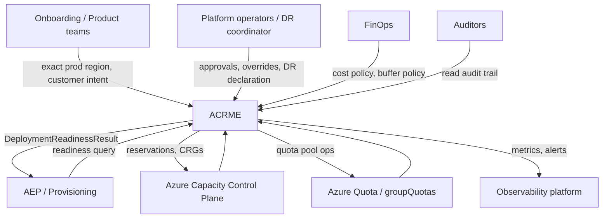
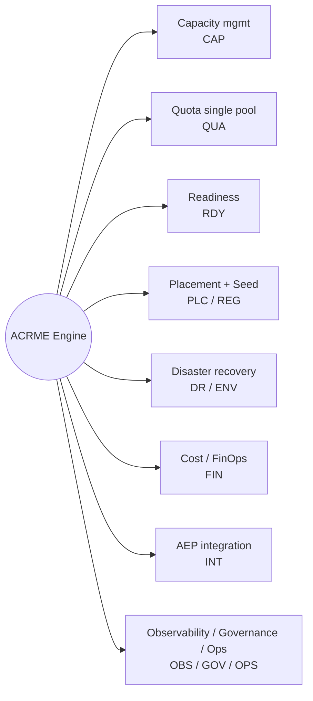
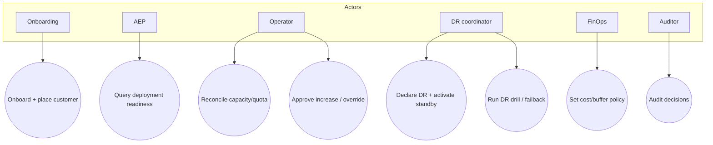
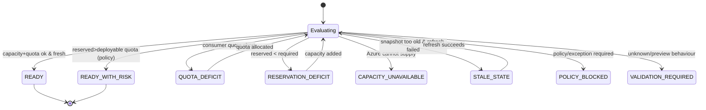
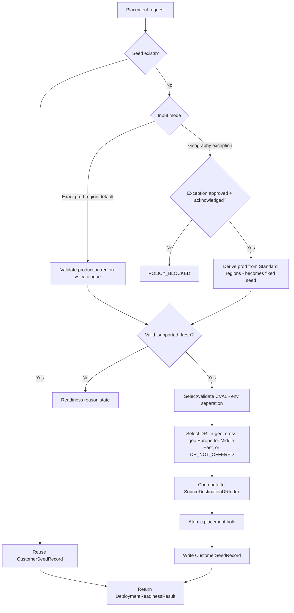
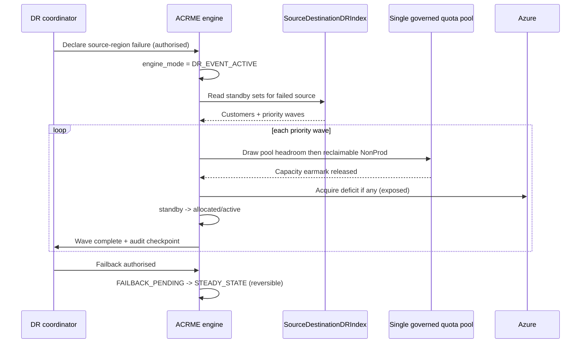
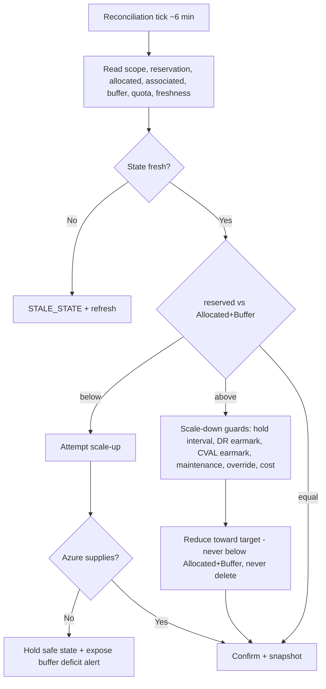

# ACRME — Functional Design Document (FDD)

| | |
|---|---|
| **Title** | Azure Capacity Reservation Management Engine (ACRME) — Functional Design Document |
| **Version** | 1.0 (net-new) |
| **Date** | 2 September 2026 |
| **Status** | Draft for review — supersedes the Executive Design Document as the functional design of record |
| **Baseline** | Azure Capacity & Quota Management — Consolidated Requirements Baseline **v2.4** (7 Sep 2026) |
| **Owner** | Vishnuvardhan Reddy · Principal Cloud Architect |
| **Audience** | Business, architecture, operations, audit, onboarding, FinOps |
| **Companion** | Technical Design Document (`acrme_technical_design_document.md`) |

> **Purpose.** This FDD describes **what** ACRME does — its functional behaviour, flows, states, and rules — traceable to every requirement in Baseline v2.4. It is implementation-neutral; the **how** (components, data, algorithms, interfaces, security, NFRs) is in the companion TDD. This document is **self-contained**: all normative detail (readiness states, engine modes, formulas, classification tables, validation rules) is inlined, not referenced externally.

> **Reconciliation note (v2.4 — reservation-model gaps).** This revision folds the reviewed architecture-diagram gaps into the functional design: **reservation eligibility** now explicitly excludes **Availability-Set VMs** (CAP-020) and requires a **deallocate/redeploy-to-AZ onboarding precondition** (CAP-021); the managed estate is initialised as a **seed matrix of count-0 reservations** per eligible SKU×region×AZ under **product-team budget governance** (CAP-022), reconciled with **reactive SKU/AZ discovery** that auto-creates a reservation and simultaneously raises a scope-file governance item (CAP-024, reconciling CAP-019); reservations are organised into an explicit **regional + per-AZ CRG structure per environment** (CAP-023); VMs are placed toward an **even ≈1/zone_count per-zone distribution with a rebalancing action** (PLC-011); a shared **core subscription is classified entirely production** (CAP-001a); the **decommissioning-workflow boundary** (automatic right-sizing to `allocated + buffer` vs gated retirement/deletion) is made explicit (CAP-008/CAP-010); and a deterministic **RG/CRG/subscription naming convention + counter** is adopted (OPS-006, C-12). "**Seed reservation**" (a count-0 reservation) is disambiguated from the placement "**seed record**" (PLC-003).

> **Reconciliation note (v2.3).** This document reflects the confirmed v2.3 design decisions: **single governed quota pool** as the primary model (QUA-004); **max-not-sum** DR destination sizing (DR-017); **exact-production-region-first** onboarding with a governed **seed record** (PLC-001..005); distributed, reciprocal DR with a **source→destination DR index** (DR-016/018) and **standby activation waves** (DR-019). *(The Middle East DR position is superseded by the v2.4-amended note below.)*
>
> **⚠️ [Amended v2.4 — 11 Sep 2026] Middle East DR now offered (cross-geo to Europe).** The former Middle East `DR_NOT_OFFERED` position (DR-014/DEC-001) is **superseded**. Middle East DR **is now offered** as a **cross-geo DR** model: **Prod and CVAL co-locate in a selected Middle East Standard region** (separate CRGs — co-location in a region is not capacity sharing, ENV-003) and **DR is placed cross-geo in a weighted-selected Europe Standard region**. Both selections run the **weighted capacity placement model** (REG-002/REG-003). New codes: **DR-020** (cross-geo DR ME→Europe), **PLC-010b** (cross-geo DR override to PLC-010a), **A-ME1** (data-residency assumption: Europe is the approved destination). The CVAL-sacrifice DR bootstrap (DR-005/006) does **not** apply to the Middle East (CVAL co-locates with Prod locally). This is a **third distribution model** — *cross-geo DR* — alongside the US three-region and the standard two-region co-located models. Affected passages below carry inline **[Amended v2.4]** markers.
>
> **Region model update (baseline Section 6, [Amended v2.4]).** The supported footprint is **five geographies** with an explicit per-geography **distribution model**, of which there are now **three**: the **US is the only three-region geography** (West US 3, Central US, Canada Central; East US 2 Restricted); **EU, Australia and Asia Pacific are two-region co-located geographies** where **CVAL and DR co-locate** in the non-production region (mandatory rule **PLC-010a**); and the **Middle East is a cross-geo DR geography [Amended v2.4]** — Prod and CVAL co-locate in a selected Middle East region and DR is placed cross-geo in a **weighted-selected Europe region** (DR-020, PLC-010b). The region catalogue remains versioned and configuration-driven (REG-001); Japan East is a **pending** Asia Pacific addition awaiting confirmation.

---

## 1. Introduction

### 1.1 Purpose and scope
ACRME governs Azure capacity reservations and VM-family quota across a managed fleet so that every managed deployment has **both** reserved physical capacity and deployable quota, in the right region/zone/SKU, before it is allowed to proceed — while keeping idle cost low through lean DR and dynamic reconciliation.

**In scope (baseline Section 5):** capacity reservation lifecycle (CAP), quota governance and pooling (QUA), combined deployment readiness (RDY), region selection and customer placement (PLC/REG), disaster recovery (DR), cost/FinOps signals (FIN), AEP/provisioning integration (INT), data/state (DAT), observability (OBS), governance (GOV), operations (OPS), and non-functional behaviour (NFR).

**Out of scope:** the actual provisioning of customer workloads (owned by AEP), Azure control-plane implementation, and any automation not gated by policy in Phase 1 (destructive VM-association changes remain blocked — see Section 4.5).

### 1.2 Definitions
| Term | Meaning |
|---|---|
| **CRG** | Capacity Reservation Group — Azure construct holding reserved capacity per region/zone/SKU. |
| **CVAL** | Customer validation environment; its capacity may contribute to DR readiness under earmark. |
| **AEP** | Azure/Application Enablement Platform — the provisioning consumer of ACRME readiness. |
| **Seed record** | Authoritative customer record holding production, CVAL, and DR regional placement (PLC-003). |
| **Single governed quota pool** | One governed quota group per region/quota family covering Prod + NonProd/CVAL + DR (QUA-004). |
| **DR bootstrap capacity** | Minimum reserved standby capacity to initiate recovery, not a fixed % of production (DR-007). |
| **max-not-sum** | Destination DR sizing = largest single non-concurrent protected source portion (DR-017). |
| **Source→destination DR index** | Reverse-of-seed mapping driving source-specific standby activation (DR-018). |
| **Readiness state** | Machine-readable deployment-readiness verdict returned to AEP (RDY-002). |

### 1.3 Traceability approach
Every functional capability in Section 4 cites the requirement IDs it satisfies. Section 9 is a full matrix mapping **every** Baseline v2.3 ID (REG/ENV/CAP/QUA/RDY/PLC/DR/FIN/INT/DAT/OBS/GOV/NFR/OPS + POC/DEC/DEP dependencies) to an FDD section.

---

## 2. Solution Overview

ACRME is a policy-driven control engine sitting between the customer/onboarding intent and Azure's capacity and quota control planes. It continuously reconciles desired vs actual state and answers a single question for every managed deployment: *is this deployment ready, and if not, exactly why?*

**Capability map → requirement groups:**

| Capability | Requirement group | FDD section |
|---|---|---|
| Capacity reservation management | CAP | Section 4.1 |
| Quota governance & single-pool management | QUA | Section 4.2 |
| Combined deployment readiness | RDY | Section 4.3 |
| Region selection & customer placement (seed) | PLC, REG | Section 4.4 |
| Disaster recovery (distributed, max-not-sum) | DR, ENV | Section 4.5 |
| Cost & FinOps | FIN | Section 4.6 |
| Provisioning & AEP integration | INT | Section 4.7 |
| Observability & governance & operations | OBS, GOV, OPS | Section 4.8 |
| Data & state (functional view) | DAT | Section 6 |
| Non-functional behaviour | NFR | Section 4 (each), Section 6 |

### F1 — System context



### F2 — Capability map



---

## 3. Actors and Stakeholders

| Actor | Role in ACRME | Key requirements |
|---|---|---|
| Onboarding / product team | Supplies exact production region and customer intent; requests placement. | PLC-001, PLC-002, REG-001 |
| AEP / provisioning | Queries readiness before deploying; consumes readiness contract. | INT-001..007, RDY-001..004 |
| Platform operator | Approves increases/overrides, runs reconciliation, manages scope files. | GOV-001..009, OPS-001..005, CAP-006 |
| DR coordinator | Declares DR events, orders priority waves, authorises CVAL release, drives failback. | DR-004..013, DR-019 |
| FinOps | Sets cost/buffer policy; monitors idle cost and overcommit. | FIN-001..008 |
| Auditor | Reads immutable audit trail of all decisions and mutations. | GOV-004..009, DAT-005 |
| Microsoft/Azure | Capacity & quota provider and feature-maturity dependency. | DEP-001, POC-001..011 |

### F3 — Actor / use-case overview



---

## 4. Functional Capabilities

### 4.1 Capacity reservation management (CAP-001..024)
- ACRME maintains reservation state per subscription/region/zone/SKU-family/environment/product and correlates it with quota state (CAP-001, CAP-002). VMs in a shared **core subscription are classified production** for buffer/coverage purposes (CAP-001a). `[Decided]`
- **Steady-state reservation floor** is normative: `Target Reserved Capacity = Allocated VM Count + Configured Buffer` (CAP-003). Associated-but-deallocated VMs are reported separately and do not automatically preserve paid reservation (CAP-004, CAP-013). `[Decided]`
- Azure resource creation precedes config activation: create/validate the CRG/reservation first, then activate the deployment config that references it (CAP-007, CAP-008). `[Decided]`
- **Zero-capacity, not deletion:** an unused managed reservation is reduced to zero where Azure permits; deletion is a separate approved decommissioning workflow (CAP-009, CAP-010). `[Decided]`
- Over-allocation (reserved < associated demand) is explicit and policy-approved, never silent (CAP-011, CAP-012). Capacity sharing across subscriptions is validated for SKU/region/zone/authorisation (CAP-014..019). `[Decided]`

**Reservation eligibility & onboarding (CAP-020/CAP-021).**
- **Availability-Set VMs are ineligible** for Capacity Reservations — the constructs are mutually exclusive. ACRME excludes them from eligibility and from the `allocated`/`associated` counts that drive CAP-003 targets, and surfaces any managed-scope Availability-Set VM as a non-eligible exception with a remediation action (CAP-020). `[Decided]`
- **Onboarding precondition:** a VM must occupy a reservation-eligible placement — an availability zone (preferred), or regional placement only where the SKU has no zonal support. An ineligible VM must first be **deallocated and redeployed into an AZ** (or migrated per runbook); ACRME records the required action and never auto-migrates running workloads (CAP-021). `[Decided]`

**Seed matrix, reactive discovery & CRG structure (CAP-022/CAP-023/CAP-024).**
- The managed estate is initialised as a **seed matrix of count-0 reservations** ("seed reservations") for every eligible SKU×region×AZ, created in the correct CRG at reserved quantity 0 so reconciliation can scale up the instant demand appears. Entry into the matrix requires an owning **product team + approved budget line** (CAP-022). This "seed reservation" is distinct from the placement "seed record" (PLC-003). `[Decided]`
- Reservations are organised into an explicit **regional + per-AZ CRG structure per environment** — one regional (non-zonal) CRG plus one CRG per AZ (e.g. `crg-pr-eus2-reg`, `crg-pr-eus2-az1..az3`); environments are never mixed in a CRG (CAP-023, ENV-003). `[Decided]`
- On **reactive discovery** of an allocated SKU/AZ not yet in the matrix, ACRME **auto-creates** the CRG (if absent) + reservation at `allocated + buffer` to protect production immediately, **and simultaneously raises a scope-file governance item** to ratify the SKU/AZ with owner + budget — reconciling the reactive path with CAP-019/CAP-002 within the governance SLA (CAP-024). `[Decided]`

**Decommissioning-workflow boundary (CAP-008/CAP-010).** Automatic reconciliation may **right-size a retained reservation down to `allocated + buffer`** after a decommission, but reducing a reservation **to 0 as an intentional retirement**, deleting a CRG/reservation object, or removing a SKU/AZ from the scope file requires the **separate approved decommissioning workflow** (approval + impact analysis + audit). ACRME never infers teardown intent from a transient drop in allocated VMs. `[Decided]`

### 4.2 Quota management — single governed pool (QUA-001..014)
- **Primary model (QUA-004): one governed quota pool per region and quota family**, covering Prod, NonProd/CVAL, and DR together. All eligible default per-region quota is hoarded into the pool (QUA-003) and allocated on demand to whichever environment needs it — maximising flexibility, improving utilisation, and **cutting quota-increase requests to Microsoft**. `[Decided]`
- **Prod protection inside the shared pool** is by logical earmark, not physical separation: `Prod_Reserved_Floor` and `DR_Earmark_vCPU` are never allocatable to NonProd; NonProd allocation fail-safes at `Allocatable_NonProd = 0` (QUA-006..009). `[Decided]`
- **Quota-as-governor (QUA-005):** quota caps deployable capacity per product/env/subscription/region/family; every increase is justified and recorded — unallocated pooled quota is not auto-distributed. `[Decided]`
- **Exception topology (QUA-004 clause):** a two-group/multi-group model is used only when Azure Quota Group limits or a mandatory Prod-isolation governance boundary make one pool impossible; each such case is recorded in the Decision Log and reverts to one pool when the constraint lifts. `[Decided]`
- Reclamation never drops a subscription below current usage, committed demand, Prod buffer, or approved DR need (QUA-010..014). `[Decided]`

### 4.3 Combined readiness (RDY-001..004)
ACRME returns a single machine-readable **deployment readiness state** to AEP (RDY-001, RDY-002). The enumerated states are normative:

```text
READY | READY_WITH_RISK | QUOTA_DEFICIT | RESERVATION_DEFICIT |
CAPACITY_UNAVAILABLE | STALE_STATE | POLICY_BLOCKED | VALIDATION_REQUIRED
```

Readiness combines capacity **and** quota **and** freshness: a reservation without deployable quota is `READY_WITH_RISK`/`QUOTA_DEFICIT`, never "ready" (RDY-003). State older than the configured maximum, when synchronous refresh fails, is `STALE_STATE` and fails safe (RDY-004, NFR-002). `[Decided]`

### F8 — Deployment readiness state model (RDY-002)



### 4.4 Region selection & customer placement (PLC-001..010, REG-001..003)
- **Exact production region is the default validated input (PLC-001).** ACRME validates the supplied region against the versioned catalogue rather than deriving it from a broad geography. `[Decided]`
- **Geography-only selection is an exception path (PLC-002):** it requires explicit exception approval and customer acknowledgement that the derived production region becomes **fixed** (the seed) until a governed migration changes it. `[Decided]`
- **Seed-once, reuse-across-products (PLC-003..005):** the first valid decision writes `CustomerSeedRecord`; later products/environments for the same customer/geography reuse it. Seed changes require an approved migration workflow. `[Decided]`
- CVAL and DR are selected after production is fixed, using current readiness, environment separation (ENV-003), restriction flags, workload distribution, quota/capacity, and freshness (PLC-006..009). `[Derived]`
- **CVAL/DR co-location double-count guard (PLC-010):** earmarked CVAL capacity counts toward DR headroom, never as both live CVAL and available DR. `[Decided]`
- **Two-region CVAL/DR co-location is mandatory (PLC-010a):** in every two-region **co-located** geography (EU, Australia, Asia Pacific), production is in one region and **CVAL and DR are co-located in the other region**. The three-region US geography places production, CVAL and DR across distinct regions. `[Decided]`
- **Cross-geo DR for the Middle East (PLC-010b, DR-020) [Amended v2.4]:** the Middle East is **not** a two-region co-located geography. **Prod and CVAL co-locate in a selected Middle East Standard region** (separate CRGs — co-location in a region is not capacity sharing, ENV-003) and **DR is placed cross-geo in a weighted-selected Europe Standard region**. This **overrides** PLC-010a co-location for the Middle East (CVAL co-locates with Prod locally, not with DR). Both selections run the weighted capacity placement model; the DR copy's residency is governed by A-ME1. `[Decided]`
- **Region catalogue (REG-001..003) [Amended v2.4]:** versioned, configuration-driven; the catalogue defines **five geographies** each with an explicit **distribution model** — now **three models**: the US **three-region** geography; the EU/Australia/Asia Pacific **two-region co-located** geographies; and the Middle East **cross-geo DR** geography (Prod+CVAL in a Middle East region, DR weighted-selected in Europe). There is no universal three-region minimum. Region examples come from authoritative config (REG-002 — the Europe DR region is weighted-selected among Europe Standard regions, Switzerland North as a default example, not a fixed region); Japan East is a **pending** Asia Pacific addition awaiting confirmation. `[Decided]`
- **Even per-zone distribution target + rebalancing (PLC-011):** within a placement region, ACRME distributes VMs across the availability zones toward an **even target of ≈1/zone_count per zone** (≈33% for a three-zone region). Each placement selects the eligible zone with the greatest deficit from target subject to capacity/quota/restriction constraints; when the observed distribution drifts beyond the configurable tolerance band (**C-13**, default ±10 percentage points), a **rebalancing action** is raised so future placements (and, where policy allows, redeploys) restore balance. The target and tolerance are configuration-driven and the algorithm is defined in Baseline Appendix A.9. `[Decided]`

**Region classification (functional view) [Amended v2.4]:** Standard (auto-selectable/scored), Restricted (production-only by exception, never CVAL/DR — e.g. East US 2, North Europe, West Europe), **Cross-Geo DR Destination** (a geography approved to host another geography's DR — **Europe is the approved cross-geo DR destination for the Middle East**, with the specific Europe region **weighted-selected** among Europe Standard regions per DR-020/PLC-010b, A-ME1), and `DR_NOT_OFFERED` (no cross-border substitution — **no longer set for the Middle East**; retained for any future geography/country Legal declares no-DR). Where `DR_NOT_OFFERED` is set it is evaluated **before** any cross-geo path. `[Decided]`

### F4 — Onboarding + placement flow



### 4.5 Disaster recovery (DR-001..019)
- **Distributed, reciprocal DR (DR-016):** each region concurrently hosts Prod, CVAL, and DR standby for multiple *different* source regions. No dedicated DR-only regions. `[Decided]`
- **Lean bootstrap (DR-007):** DR holds a configurable bootstrap target by workload/product/region/zone/SKU — never a fixed 30-40% clone; zero bootstrap only by explicit approved policy. `[Decided]`
- **max-not-sum sizing (DR-017):** each destination sizes to the largest single non-concurrent protected source portion; a SUM override covers contractual simultaneous-failure needs. `[Decided]`
- **Source→destination index (DR-018)** drives **source-specific standby activation in business-priority waves (DR-009, DR-019)** via staged acquisition (DR-006), reversible on failback (DR-013). `[Decided]`
- **Staged capacity acquisition order (DR-006):** bootstrap → destination quota/capacity → approved CVAL release → approved sharing → pooled quota → Azure request with exposed deficit. Because all environments share one governed quota pool, the emergency DR draw needs **no cross-group transfer**. `[Decided]`
- **Cross-geo DR for the Middle East (DR-020, PLC-010b) [Amended v2.4]:** Middle East regions are **DR sources** whose destinations are **weighted-selected Europe Standard regions**. ME customers produce `dr_region = <Europe region>` seeds, add cross-geo `source → destination` rows to the `SourceDestinationDRIndex`, and the DR standby is **sized max-not-sum and earmarked as dedicated reserved capacity in the Europe destination** (no CVAL sacrifice — DR-005/006 do not apply to ME). Subject to sovereignty/zone-alignment (HC-10) and residency assumption A-ME1. This supersedes the former ME `DR_NOT_OFFERED` position (DR-014/DEC-001). `[Decided]`
- **`DR_NOT_OFFERED` (DR-014):** where sovereignty/contract forbids cross-border DR, the seed records no DR and ACRME never silently substitutes. **No longer set for the Middle East [Amended v2.4]**; retained for any future geography/country Legal declares no-DR (and, by config, for specific ME countries with per-country carve-outs, A-ME1). `[Decided]`
- **DR drills and role flip (DR-010..012):** annual drill/rotation validate the model without a real incident; destructive VM-association changes remain **blocked in Phase 1**. `[Decided]`

### F6 — Distributed DR reference model (Section 12A)
See the rendered reference diagram (reused): `adr/diagrams/acrme_three_region_capacity_model.png` — each region hosts Prod + CVAL + DR standby tagged with its `src Rn` source region; each destination sizes by max-not-sum.

### F7 — DR event → standby activation waves



### 4.6 Cost & FinOps (FIN-001..008)
- Idle reservation cost is surfaced and alerted (FIN-001, FIN-002); lean DR + max-not-sum minimises idle standby cost (FIN-003). `[Decided]`
- Cost-before-expansion: increases carry cost exposure and justification (FIN-004, FIN-005). `[Decided]`
- Shared-DR **overcommit accounting** exposes `Overcommit_Ratio` per destination so the savings of distributed DR are visible and bounded by a safety ceiling (FIN-006..008, POC-011). `[Derived]`

### 4.7 Provisioning & AEP integration (INT-001..007)
- ACRME exposes a functional contract: input (customer, exact region, SKU/family, environment, product, intended demand) → output (`DeploymentReadinessResult` + reason + operation handle) (INT-001..003). `[Decided]`
- All mutating calls are **idempotent** with operation handles and expected-state versions; AEP polls rather than assuming synchronous completion (INT-004..006, NFR-007). `[Decided]`
- AEP never treats provider quota as proof of consumer deployability (INT-007, POC-001). `[Assumed]`

### 4.8 Observability, governance & operations (OBS, GOV, OPS)
- **Observability (OBS-001..005):** metrics/alerts for buffer deficit, per-destination DR max-source coverage and gap, source↔destination mapping dashboard, activation state by wave, idle cost, staleness. `[Decided]`
- **Governance (GOV-001..009):** RBAC, managed identity, approval gates, break-glass, immutable audit of every decision and mutation with before/after values and correlation IDs; versioned scope files with decision traceability (DAT-005). `[Decided]`
- **Operations (OPS-001..005):** runbooks for DR declaration, standby activation, CVAL release, quota allocation, sharing activation, emergency override, regional recovery, and failback. `[Decided]`

---

## 5. End-to-End Functional Flows

1. **Onboarding + placement** (F4): exact-region validation (or geography exception) → CVAL/DR selection → seed write → readiness.
2. **Steady-state reconciliation** (F5): every ~6 min, compare `Allocated + Buffer` to reserved; scale up (or alert deficit), guarded scale-down, never delete.
3. **Single-region DR event** (F7): declare → index lookup → priority-wave activation from the shared pool → audited failback.
4. **DR drill / failback**: scheduled role-flip validating the index, waves, and reversibility without a real incident.

### F5 — Steady-state reconciliation behaviour



---

## 6. Functional States and Data (functional view)

**Engine mode machine (functional view, DR-004..008, NFR-002):**

```text
STEADY_STATE → DR_DECLARATION_PENDING → DR_EVENT_ACTIVE → FAILBACK_PENDING → STEADY_STATE
                                                     ↘ INCIDENT_HOLD (safe degraded)
```

Entering `DR_EVENT_ACTIVE` does not auto-authorise service-impacting CVAL action; each action keeps its own policy gate.

**Functional data entities (DAT-001..006):** `CustomerSeedRecord` (PLC-003), `SourceDestinationDRIndex` (DR-018), `CVALEarmarkRecord` (PLC-010), `PlacementPolicy` (versioned catalogue), reservation/quota snapshots with freshness metadata, and the immutable decision/audit log. Full technical schema is in the TDD Section 6.

---

## 7. Acceptance Criteria Mapping (baseline Section 20)

| Acceptance theme | Functional evidence | Section |
|---|---|---|
| Deployment allowed only when capacity+quota+freshness pass | Readiness states, fail-safe on stale | Section 4.3, F8 |
| Exact-region-first onboarding, seed reuse | Placement flow, seed record | Section 4.4, F4 |
| Lean, distributed, max-not-sum DR with source-specific activation | DR capabilities, activation waves | Section 4.5, F6, F7 |
| Single governed quota pool with Prod protection | Quota capability, earmarks | Section 4.2 |
| No silent deletion / no silent cross-border DR substitution (cross-geo DR is explicit & catalogued) | Zero-capacity, cross-geo DR (DR-020), `DR_NOT_OFFERED` | Section 4.1, Section 4.5 |
| Full auditability of decisions and mutations | Governance | Section 4.8 |

---

## 8. Assumptions, Decisions, POC Dependencies (baseline Section 22–Section 24)

| Ref | Item | Functional impact |
|---|---|---|
| POC-001 | Consumer quota under shared reservation | Readiness must validate consumer quota until proven. |
| POC-006/007 | DR topology & bootstrap sizing | Confirms distributed model and lean targets. |
| POC-011 | max-not-sum overcommit safety | Sets overcommit safety ceiling / alert. |
| DEC-001 | Middle East DR policy | **RESOLVED [Amended v2.4 — 11 Sep 2026]: Middle East DR now offered as cross-geo DR to Europe** (Prod+CVAL in a Middle East region, DR weighted-selected in a Europe Standard region; DR-020, PLC-010b, A-ME1). Supersedes the former `DR_NOT_OFFERED` position. Per-country data-residency carve-outs remain a Legal matter (config). |
| DEC-002 | Failback duration | ~1-year run vs ~30-day failback. |
| DEC-003 | Geography exception approver | Governs the PLC-002 exception path. |
| DEP-001 | Quota Group / `groupType` maturity | Single-pool enforcement depends on feature maturity. |

---

## 9. Requirement Traceability Matrix (Baseline v2.4 → FDD)

| Requirement group (IDs) | FDD section(s) |
|---|---|
| REG-001..003 | Section 4.4 (catalogue, per-geography distribution model incl. cross-geo DR, weighted Europe DR selection) |
| PLC-010a / PLC-010b | Section 4.4 (two-region CVAL/DR co-location; Middle East cross-geo DR override) |
| ENV-001..007 | Section 4.4 (env separation), Section 4.5 (roles) |
| CAP-001, CAP-001a (core = production) | Section 4.1, Section 5(2), F5 |
| CAP-002..019 | Section 4.1, Section 5(2), F5 |
| CAP-020 (Availability-Set ineligible), CAP-021 (deallocate/migrate-to-AZ onboarding) | Section 4.1 (eligibility & onboarding), F5 |
| CAP-022 (seed-at-0 matrix + budget governance), CAP-024 (reactive SKU discovery ↔ CAP-019) | Section 4.1, Section 5(2), F5 |
| CAP-023 (regional + per-AZ CRG structure) | Section 4.1, Section 6 (entities), TDD Section 6 |
| QUA-001..014 | Section 4.2 |
| RDY-001..004 | Section 4.3, F8 |
| PLC-001..010 | Section 4.4, F4 |
| PLC-011 (even zone-distribution target + rebalancing) | Section 4.4, F4 |
| DR-001..019 | Section 4.5, F6, F7, Section 6 |
| FIN-001..008 | Section 4.6 |
| INT-001..007 | Section 4.7, F1 |
| DAT-001..006 | Section 6 |
| OBS-001..005 | Section 4.8 |
| GOV-001..009 | Section 4.8, Section 7 |
| NFR-001..010 | Section 4.3 (fail-safe), Section 4.7 (idempotency), Section 5, Section 6 |
| OPS-001..005 | Section 4.8, Section 5 |
| OPS-006 (naming convention + counter) | Section 4.8, Section 5 |
| C-1..C-13 (configurable items incl. naming C-12, zone target C-13) | Section 4.4, Section 7 |
| POC-001..011 / DEC-001..003 / DEP-001 | Section 8 |

*Every Baseline v2.4 requirement ID (including the reservation-model additions CAP-020..024, PLC-011, OPS-006, C-12/C-13) resolves to at least one FDD section above. Detailed component/algorithm-level traceability is completed in the TDD Section 17.*

---

**Document Status:** Draft for review · **Next:** ratify alongside the TDD; supersede the Executive Design Document (archived).
