# UML Diagram 2: Operation Tracking & Saga Model

**Purpose:** Track multi-step Azure operations, compensation chains, and VM impact audit trails.

**Status:** Design-first (70% complete) — saga pattern outlined; exact compensation lambda structure TBD.

```mermaid
classDiagram
    %% ===== SAGA & OPERATION TRACKING =====
    class OperationRecord {
        +String operationId [PK]
        +OperationType operationType
        +OperationStatus status
        +String initiatedBy
        +DateTime startedAt
        +DateTime completedAt
        +String targetResourceId
        +Map~String,Any~ parameters
        +List~CompensationStep~ compensationChain
        +String currentStepIndex
        +String parentOperationId
        +List~String~ childOperationIds
        +String errorMessage
        +Int retryCount
        +executeNextStep() Boolean
        +compensate() Boolean
        +markCompleted() void
        +markFailed(error) void
    }

    class CompensationStep {
        +String stepId
        +Int sequenceOrder
        +CompensationAction action
        +Map~String,Any~ actionPayload
        +StepStatus status
        +DateTime executedAt
        +String executionResult
        +Int retryCount
        +execute() Boolean
        +canRetry() Boolean
    }

    class VM_ImpactRecord {
        +String impactId [PK]
        +String vmId
        +String vmName
        +String subscriptionId
        +String resourceGroup
        +ImpactType impactType
        +String sourceCRGId
        +String targetCRGId
        +VMState priorState
        +VMState postState
        +String operationRecordId
        +String transferId
        +DateTime impactedAt
        +String impactedBy
        +Boolean requiresRestart
        +String auditTrail
        +getImpactSummary() String
    }

    class IncidentRecord {
        +String incidentId [PK]
        +IncidentType type
        +IncidentSeverity severity
        +String affectedRegion
        +DateTime declaredAt
        +DateTime resolvedAt
        +String declaredBy
        +String externalITSMReference
        +IncidentStatus status
        +List~String~ relatedTransferIds
        +List~String~ relatedOperationIds
        +String resolutionNotes
        +isActive() Boolean
        +allowsEmergencyTransfer() Boolean
    }

    class AuditEvent {
        +String eventId [PK]
        +EventType eventType
        +String principalId
        +String targetResourceId
        +String operationRecordId
        +Map~String,Any~ beforeState
        +Map~String,Any~ afterState
        +DateTime timestamp
        +String sourceIP
        +String clientId
        +EventSeverity severity
        +getChangeSet() Map
    }

    %% ===== ENUMERATIONS =====
    class OperationType {
        <<enumeration>>
        CREATE_CRG
        UPDATE_CRG_QUANTITY
        UPDATE_SHARING_PROFILE
        REMOVE_CONSUMER
        INCREASE_CAPACITY
        EMERGENCY_TRANSFER_TIER1
        EMERGENCY_TRANSFER_TIER2
        EMERGENCY_TRANSFER_TIER3
        VM_DISASSOCIATION
        PLACEMENT_ASSIGNMENT
        QUOTA_VALIDATION
    }

    class OperationStatus {
        <<enumeration>>
        PENDING
        IN_PROGRESS
        AWAITING_APPROVAL
        STEP_1_COMPLETE
        STEP_2_COMPLETE
        COMPENSATING
        COMPLETED
        FAILED
        ROLLED_BACK
    }

    class CompensationAction {
        <<enumeration>>
        RESTORE_CRG_QUANTITY
        RESTORE_SHARING_PROFILE
        RE_ASSOCIATE_VM_TO_CRG
        RESTORE_QUOTA_ALLOCATION
        RELEASE_PLACEMENT_HOLD
        REVERT_ZONE_MAPPING
    }

    class StepStatus {
        <<enumeration>>
        PENDING
        EXECUTING
        COMPLETED
        FAILED
        SKIPPED
        COMPENSATED
    }

    class ImpactType {
        <<enumeration>>
        DISASSOCIATION_PATH_A_DEALLOCATE
        DISASSOCIATION_PATH_B_CLEAR_REF
        CRG_QUANTITY_REDUCTION
        FORCED_CONSUMER_REMOVAL
        ZONE_REMAPPING
    }

    class VMState {
        <<enumeration>>
        RUNNING
        DEALLOCATED
        STOPPED
        UNKNOWN
    }

    class IncidentType {
        <<enumeration>>
        REGIONAL_OUTAGE
        PARTIAL_ZONE_FAILURE
        QUOTA_EXHAUSTION
        MANUAL_DR_DRILL
    }

    class IncidentSeverity {
        <<enumeration>>
        SEV1_CRITICAL
        SEV2_HIGH
        SEV3_MEDIUM
    }

    class IncidentStatus {
        <<enumeration>>
        DECLARED
        IN_PROGRESS
        RESOLVED
        CANCELLED
    }

    class EventType {
        <<enumeration>>
        PLACEMENT_CREATED
        CRG_CREATED
        CRG_QUANTITY_INCREASED
        SHARING_ENABLED
        CONSUMER_ADDED
        CONSUMER_REMOVED
        EMERGENCY_TRANSFER_INITIATED
        VM_DISASSOCIATED
        QUOTA_VALIDATED
        APPROVAL_GRANTED
        APPROVAL_DENIED
        OPERATION_FAILED
    }

    class EventSeverity {
        <<enumeration>>
        INFO
        WARNING
        ERROR
        CRITICAL
    }

    %% ===== RELATIONSHIPS =====
    OperationRecord "1" o-- "*" CompensationStep : compensationChain
    OperationRecord "1" --> "0..1" OperationRecord : parent
    OperationRecord "1" --> "*" OperationRecord : children
    OperationRecord "1" --> "*" VM_ImpactRecord : tracks
    OperationRecord "1" --> "*" AuditEvent : generates
    EmergencyCapacityTransfer "1" --> "1" OperationRecord : trackedBy
    CapacityIncreaseRequest "1" --> "1" OperationRecord : trackedBy
    IncidentRecord "1" --> "*" EmergencyCapacityTransfer : triggers
    IncidentRecord "1" --> "*" OperationRecord : relatedTo
    VM_ImpactRecord "*" --> "1" EmergencyCapacityTransfer : causedBy
    OperationRecord --> OperationType : type
    OperationRecord --> OperationStatus : status
    CompensationStep --> CompensationAction : action
    CompensationStep --> StepStatus : status
    VM_ImpactRecord --> ImpactType : type
    VM_ImpactRecord --> VMState : priorState
    VM_ImpactRecord --> VMState : postState
    IncidentRecord --> IncidentType : type
    IncidentRecord --> IncidentSeverity : severity
    IncidentRecord --> IncidentStatus : status
    AuditEvent --> EventType : type
    AuditEvent --> EventSeverity : severity

    %% ===== NOTES ON COMPENSATION PATTERN =====
    note for OperationRecord "Saga pattern: each mutating operation builds a compensation chain. If step N fails, steps N-1...1 execute in reverse order."
    note for CompensationStep "Exact lambda/function signature TBD. Each action must be idempotent and retryable."
    note for VM_ImpactRecord "Immutable audit record. Created for every VM state change during Tier 3 transfers."
```

## Known Gaps (to be resolved in design session):

### Operation Tracking (incomplete):
- **OperationRecord.compensationChain**: Exact structure of compensation lambdas/functions TBD (Python callable? Azure Function? Stored procedure?)
- **OperationRecord.parameters**: Schema varies by `operationType` — need type-safe payload definitions
- **OperationRecord.currentStepIndex**: Multi-step operations like Tier 3 need explicit step enumeration (validate → reduce → disassociate → confirm)
- **Retry logic**: Max retry count, backoff strategy, dead-letter queue handling TBD

### Saga Patterns (design questions):
- **Compensation idempotency**: How to ensure `RESTORE_CRG_QUANTITY` is safe to retry if partially applied?
- **Compensation rollback**: What if compensation itself fails? Manual intervention SOP TBD
- **Parent-child operations**: If parent operation fails mid-flight, do all children auto-compensate?
- **Async saga coordination**: Are steps synchronous (block until ARM confirms) or async (poll for completion)?

### VM Impact Tracking:
- **VM_ImpactRecord.auditTrail**: Free-text field or structured JSON? Compliance requirements TBD
- **requiresRestart flag**: How is this determined for Path B disassociation (which claims VM keeps running)?
- **Cross-subscription VM discovery**: How does ACRME enumerate VMs in consumer subscription for Tier 3? (G-14 blocker)

### Incident Management:
- **IncidentRecord.externalITSMReference**: Integration with external ticketing (ServiceNow, Jira) — API contract TBD
- **allowsEmergencyTransfer()**: Business rule — does every SEV1 auto-enable Tier 1/2/3, or requires explicit approval?
- **Incident lifecycle**: Who can declare/resolve? Dual-approval required for resolution?

### Audit Events:
- **AuditEvent retention**: Cosmos DB TTL or archive to cold storage? Compliance retention period TBD
- **beforeState / afterState**: Full entity snapshots or delta only? Size implications for Cosmos DB RU cost
- **Append-only guarantee**: How is immutability enforced? (Cosmos DB change feed? Separate append-only container?)
