# UML Diagram 3: Service Layer & Architecture

**Purpose:** Core services, interfaces, and dependencies for ACRME control plane.

**Status:** Design-first (70% complete) — service boundaries defined; exact FastAPI route signatures and DTOs TBD.

```mermaid
classDiagram
    %% ===== CORE SERVICES =====
    class PlacementEngine {
        -PlacementPolicyRepository policyRepo
        -RegionalSnapshotCache snapshotCache
        -QuotaGroupRepository quotaRepo
        -CustomerAssignmentRepository assignmentRepo
        -AuditService auditService
        +evaluatePlacement(customerId, environment, policy) CustomerRegionAssignment
        +calculatePlacementScore(region, environment, snapshot, policy) Float
        +applyHardConstraints(candidateRegions, policy) List~Region~
        +selectNonProdRegion(policy, snapshot) Region
        +selectDRRegion(policy, snapshot, prodRegion) Region
        +reservePlacementHold(assignment) PlacementHold
        +releasePlacementHold(holdId) Boolean
        -validateRegionDistinctness(prod, nonprod, dr) Boolean
        -calculatePS_NonProd(snapshot, policy) Float
        -calculatePS_DR(snapshot, policy) Float
        -calculatePS_Prod(snapshot, policy) Float
    }

    class ReconciliationService {
        -CRGRepository crgRepo
        -AzureARMClient armClient
        -RegionalSnapshotService snapshotService
        -IncreaseRequestService increaseService
        -ConfigService configService
        +reconcileAllCRGs() ReconciliationSummary
        +reconcileCRG(crgId) ReconciliationResult
        +detectDrift(crgId) DriftReport
        +evaluateAutoIncreaseTriggers(crgId) Boolean
        +createIncreaseRequestIfNeeded(crgId, threshold) CapacityIncreaseRequest
        +sweepPartitionedFraction() void
        +reconcileRecentChanges() void
        -applyDebounceGuard(crgId, crgType) Boolean
        -getReconciliationInterval(resourceType) Duration
    }

    class CapacityTransferService {
        -EngineModeService modeService
        -QuotaValidationService quotaService
        -VMDisassociationService vmService
        -OperationTracker operationTracker
        -IncidentRepository incidentRepo
        +initiateTier1Transfer(transferRequest) EmergencyCapacityTransfer
        +initiateTier2Transfer(transferRequest) EmergencyCapacityTransfer
        +initiateTier3Transfer(transferRequest) EmergencyCapacityTransfer
        +executeDirectExpansion(transfer) OperationRecord
        +executeQuotaNeutralTransfer(transfer) OperationRecord
        +executeDestructiveTransfer(transfer) OperationRecord
        +validateTransferPreconditions(tier, sourceRegion, targetRegion) Boolean
        +requiresDualApproval(tier) Boolean
        -checkEmergencyHeadroom(targetCRG) Int
        -reduceSourceCRG(sourceCRG, quantity) Boolean
        -expandTargetCRG(targetCRG, quantity) Boolean
    }

    class QuotaValidationService {
        -AzureQuotaClient quotaClient
        -QuotaGroupRepository quotaGroupRepo
        -ConfigService configService
        +validateQuotaAvailability(subscriptionId, region, skuFamily, demandVCPUs) QuotaValidationResult
        +preValidateBeforeMutation(operation) Boolean
        +getQuotaGroupHeadroom(groupId) Int
        +enforceQuotaGroupFloor(groupId, drDemandVCPUs) Boolean
        +calculateQuotaUsage(subscriptionId, region, family) QuotaUsage
        +requestQuotaIncrease(subscriptionId, region, family, targetQuota) QuotaRequest
        -getProviderQuota(subscriptionId, region, family) Int
        -getCommittedByCRs(subscriptionId, region, family) Int
    }

    class SharingManagementService {
        -CRGRepository crgRepo
        -AzureARMClient armClient
        -ZoneMappingService zoneMappingService
        -SharingRelationshipRepository sharingRepo
        +enableSharing(crgId, scope) OperationRecord
        +addConsumer(crgId, consumerSubscriptionId) OperationRecord
        +removeConsumer(crgId, consumerSubscriptionId, force) OperationRecord
        +listActiveConsumers(crgId) List~SharingRelationship~
        +validateConsumerLimit(crgId) Boolean
        +checkActiveVMs(crgId, consumerSubscriptionId) Int
        -updateSharingProfile(crgId, apiVersion, sharingPayload) Boolean
        -ensureZoneMappingExists(providerSub, consumerSub, region) Boolean
    }

    class ZoneMappingService {
        -ZoneMappingRepository mappingRepo
        -AzureSubscriptionClient subClient
        +getZoneMapping(providerSub, consumerSub, region) ZoneMappingRecord
        +translateLogicalZone(providerZone, consumerSub, region) String
        +validateZoneMapping(providerSub, consumerSub, region) Boolean
        +refreshZoneMapping(providerSub, consumerSub, region) ZoneMappingRecord
        -queryProviderZonePeers(providerSub, region, zone) List~String~
        -queryConsumerZonePeers(consumerSub, region) Map~String,String~
    }

    class VMDisassociationService {
        -AzureComputeClient computeClient
        -VM_ImpactRepository impactRepo
        -OperationTracker operationTracker
        +selectVMsForDisassociation(nonProdVMs, targetVCPUs) List~VM~
        +executePathB(vmId, sourceCRGId) VM_ImpactRecord
        +executePathA(vmId, sourceCRGId) VM_ImpactRecord
        +validateVMEligibility(vmId) Boolean
        +getVMEnvironmentTag(vmId) String
        +orderVMsByPriority(vms) List~VM~
        -reduceCRProviderQuantity(crgId, quantity) Boolean
        -clearVMCRGReference(vmId) Boolean
        -deallocateVM(vmId) Boolean
    }

    class RegionalSnapshotService {
        -AzureARMClient armClient
        -AzureResourceGraphClient argClient
        -RedisCache cache
        -CosmosDBRepository cosmosRepo
        +captureRegionalSnapshot(region) RegionalSnapshot
        +getCachedSnapshot(region) RegionalSnapshot
        +refreshSnapshotIfStale(region) RegionalSnapshot
        +listAllCRGsInRegion(region) List~CRGSummary~
        +aggregateQuotaData(region) Map~String,QuotaData~
        +calculateZoneCapacity(region) Map~String,ZoneCapacity~
        -queryCRGsViaARG(region) List~CRGSummary~
        -queryQuotaViaARM(subscriptionId, region) QuotaData
    }

    class EngineModeService {
        -EngineModeRepository modeRepo
        -IncidentRepository incidentRepo
        -ConfigService configService
        +getCurrentMode() EngineModeState
        +transitionToMode(targetMode, reason, approver) Boolean
        +declareDREvent(incidentId) Boolean
        +resolveDREvent(incidentId) Boolean
        +allowsEmergencyTransfer() Boolean
        +requiresDualApproval(operation) Boolean
        -validateTransition(currentMode, targetMode) Boolean
        -applyTransitionGuards(targetMode) Boolean
    }

    %% ===== SUPPORTING INFRASTRUCTURE =====
    class AzureARMClient {
        +executeARMRequest(method, url, body, apiVersion) ARMResponse
        +getCRG(resourceId) CapacityReservationGroup
        +updateCRG(resourceId, payload) OperationRecord
        +listCRsInCRG(crgId) List~CapacityReservation~
        +applyConcurrencyLimit(subscriptionId) void
        +handleThrottling(response) void
    }

    class AzureResourceGraphClient {
        +queryResources(kqlQuery) List~Resource~
        +findConsumerCRGs(consumerSubscriptionId) List~CRG~
        +findVMsByCRG(crgId) List~VM~
    }

    class RedisCache {
        +get(key) Any
        +set(key, value, ttl) void
        +delete(key) void
        +exists(key) Boolean
    }

    class CosmosDBRepository {
        +save(entity) void
        +findById(id, partitionKey) Entity
        +query(sqlQuery) List~Entity~
        +upsert(entity) void
        +delete(id, partitionKey) void
    }

    class OperationTracker {
        +createOperation(type, target, params) OperationRecord
        +addCompensationStep(operationId, action, payload) void
        +markStepCompleted(operationId, stepIndex) void
        +executeCompensation(operationId) Boolean
        +recordAuditEvent(operationId, event) void
    }

    class AuditService {
        +logEvent(eventType, principal, resource, beforeState, afterState) AuditEvent
        +logPlacementDecision(assignment, scoreBreakdown) void
        +logApproval(operationId, approver, decision) void
    }

    %% ===== DTOs & REQUEST/RESPONSE MODELS (Partial) =====
    class PlacementRequest {
        +String customerId
        +String environment
        +String policyVersionId
        +Int demandVCPUs
    }

    class TransferRequest {
        +TransferTier tier
        +String sourceRegion
        +String targetRegion
        +Int transferVCPUs
        +String incidentId
        +String requestedBy
    }

    class QuotaValidationResult {
        +Boolean isValid
        +Int availableQuota
        +Int shortfall
        +String reason
    }

    class ReconciliationSummary {
        +Int totalCRGs
        +Int driftDetected
        +Int autoIncreaseTriggered
        +List~String~ errors
        +DateTime completedAt
    }

    %% ===== RELATIONSHIPS =====
    PlacementEngine --> RegionalSnapshotService : uses
    PlacementEngine --> QuotaValidationService : validates
    PlacementEngine --> AuditService : logs
    PlacementEngine --> CosmosDBRepository : persists

    ReconciliationService --> RegionalSnapshotService : refreshes
    ReconciliationService --> AzureARMClient : queries
    ReconciliationService --> QuotaValidationService : triggers

    CapacityTransferService --> EngineModeService : checksMode
    CapacityTransferService --> QuotaValidationService : validates
    CapacityTransferService --> VMDisassociationService : executesDisassociation
    CapacityTransferService --> OperationTracker : tracks
    CapacityTransferService --> AzureARMClient : mutates

    SharingManagementService --> ZoneMappingService : ensuresMapping
    SharingManagementService --> AzureARMClient : updates
    SharingManagementService --> CosmosDBRepository : persists

    VMDisassociationService --> AzureARMClient : modifies
    VMDisassociationService --> OperationTracker : tracks

    RegionalSnapshotService --> AzureARMClient : queries
    RegionalSnapshotService --> AzureResourceGraphClient : queries
    RegionalSnapshotService --> RedisCache : caches
    RegionalSnapshotService --> CosmosDBRepository : persists

    EngineModeService --> CosmosDBRepository : persists

    %% ===== NOTES =====
    note for PlacementEngine "HC-1..HC-7 hard constraints applied before scoring. Deterministic placement with optional jitter (seed must be persisted for replay)."
    note for ReconciliationService "5-min loop (configurable). Debounce guard: 30-min cooldown per region+CRG type after auto-increase trigger."
    note for CapacityTransferService "ONLY callable when engine_mode == DR_EVENT_ACTIVE. Tier 1/2/3 escalation enforced via policy gates."
    note for VMDisassociationService "G-14 blocker: cross-subscription VM credential model unresolved. Phase 1: user-provided VM list only."
```

## Known Gaps (to be resolved in design session):

### Service Contracts (FastAPI routes TBD):
- **Exact endpoint signatures**: Request/response DTOs for every service method TBD
- **Authentication/Authorization**: Which endpoints require operator approval? RBAC roles TBD
- **Rate limiting**: Per-service or per-endpoint throttle budgets TBD
- **Versioning strategy**: API version in URL path (`/v1/...`) or header? Backward compatibility TBD

### Service Dependencies:
- **Circular dependency risk**: ReconciliationService → IncreaseRequestService → (approver) → ReconciliationService?
- **Async vs sync**: Are service calls blocking (wait for ARM) or async (queue + poll)? Service Bus integration TBD
- **Retry & circuit breaker**: Which services need circuit breakers for Azure ARM failures? Polly/resilience patterns TBD

### Placement Engine:
- **Hard constraint HC-1..HC-7**: Exact predicate logic TBD (e.g., HC-2 quota check formula, HC-6 DR floor enforcement)
- **Scoring formula normalization**: Are alpha/beta/gamma/delta/epsilon weights configurable per customer or global?
- **Concurrent placement race (B-7)**: How to prevent two placements from selecting same region before either commits? Optimistic locking? Placement hold reservation?
- **Jitter seed persistence**: If random jitter is used for tie-breaking, where is seed stored for deterministic replay?

### Reconciliation Service:
- **Partition sweep strategy**: How is the CRG estate partitioned for partial reconciliation cycles?
- **Drift policy**: When drift is detected (manual Azure change), does engine auto-revert, alert-only, or enter maintenance mode?
- **Reconciliation SLA**: 5-min target interval — what happens if reconciliation itself takes >5 min at scale?

### Capacity Transfer Service:
- **Tier escalation logic**: Does Tier 1 failure auto-escalate to Tier 2, or require operator decision?
- **Rollback on partial failure**: If Tier 2 reduces NonProd but expanding DR fails, is reduction compensated immediately or left incomplete?
- **Dual approval mechanism**: Exact approval workflow (email? ITSM ticket? dedicated UI?) TBD

### Quota Validation Service:
- **Quota formula validation**: `availableQuota = providerQuota - (quota_used - committed_by_crs)` — double-counting risk (R-39). Exact API semantics TBD.
- **Quota increase request**: Automated quota increase submission via Azure Support API? Or manual ticket creation?

### VM Disassociation Service:
- **Credential acquisition (G-14)**: How does ACRME get write access to consumer-owned VMs? UAMI? Service Principal? User-provided credentials?
- **VM environment tagging**: What tag schema? `Environment=Dev|Test|Staging|Prod`? Custom tag key?
- **Path B validation**: How to confirm VM "keeps running" post-disassociation? ARM state check? Or user validation SOP?
- **VMSS rejection**: Phase 1 blocks VMSS Tier 3. How is VMSS detected? Resource type check? Explicit VMSS list?

### Regional Snapshot Service:
- **ARG staleness**: ARG can be minutes behind ARM. How is staleness quantified? Acceptable staleness threshold TBD.
- **Snapshot consistency**: If CRG query and quota query run at different times, snapshot may be inconsistent. Timestamp coordination TBD.
- **Redis cache eviction**: 5-min TTL. What if cache eviction happens mid-placement? Fallback to Cosmos DB? Or re-capture?

### Engine Mode Service:
- **State machine transitions**: Full state diagram TBD (see Diagram 4)
- **Transition guards**: What blocks STEADY_STATE → DR_EVENT_ACTIVE? Active incident record required?
- **Failback conditions**: When is FAILBACK_PENDING → STEADY_STATE safe? Readiness gate TBD.
