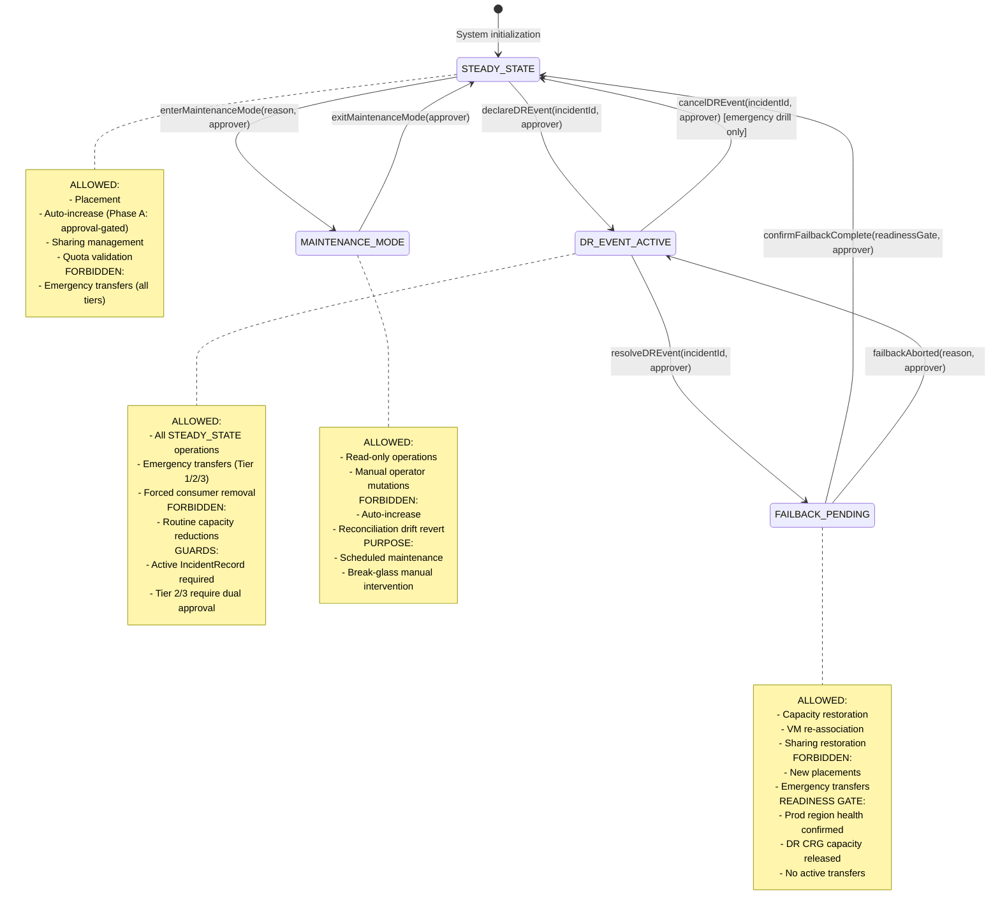
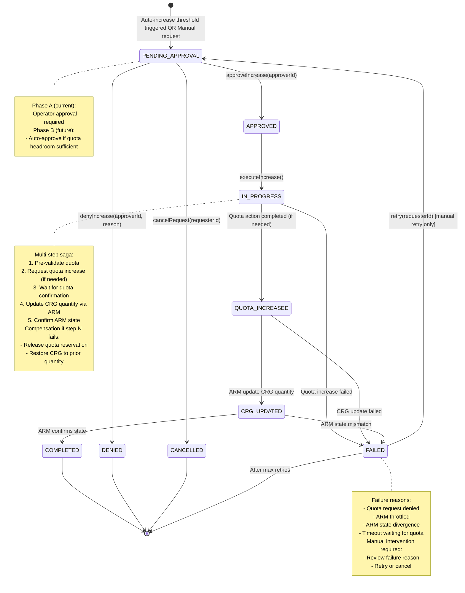
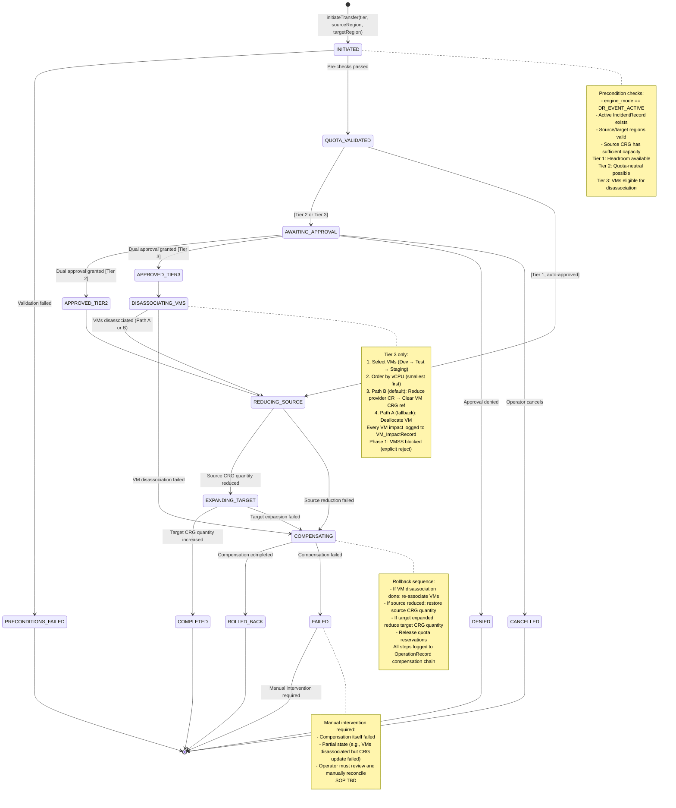

# UML Diagram 4: State Machines

**Purpose:** State transitions for engine mode, capacity increase requests, and emergency transfers.

**Status:** Design-first (60% complete) — high-level states identified; exact transition guards and events TBD (G-15/B-3 blocker).

## 4.1 Engine Mode State Machine

**Purpose:** Control when emergency transfers and autonomous operations are permitted.

**Status:** INCOMPLETE — G-15/B-3 production blocker. Transition guards, concurrency controls, and operator APIs TBD.

### Known Gaps — Engine Mode (G-15/B-3):

**Transition Guards (TBD):**
- `declareDREvent`: Requires `incidentId` + dual approval? Or single approver for SEV1?
- `resolveDREvent`: All active transfers must be `COMPLETED` or `ROLLED_BACK`? Or can resolve with transfers in-flight?
- `confirmFailbackComplete`: Exact readiness gate criteria TBD (health check? manual validation?)
- `enterMaintenanceMode`: Who can trigger? Time-bounded role? Require explicit exit?

**Concurrency Controls (TBD):**
- Can multiple incidents trigger concurrent DR events? Or one active incident at a time?
- If `declareDREvent` called while already in `DR_EVENT_ACTIVE`, is it idempotent or error?
- Lock acquisition: Does mode transition acquire a distributed lock to prevent concurrent state changes?

**Recovery Rules (TBD):**
- If system crashes mid-transition, how is mode recovered? Cosmos DB read? Event log replay?
- If mode is `DR_EVENT_ACTIVE` but incident is externally resolved (ITSM ticket closed), does engine auto-transition? Or require operator confirmation?

**Operator APIs (TBD):**
- FastAPI endpoint signatures for `declareDREvent`, `resolveDREvent`, `confirmFailbackComplete` TBD
- Approval workflow: Inline API parameter? Or external approval system integration?
- Audit trail: Every mode transition logged to `AuditEvent` with approver identity?

---

## 4.2 Capacity Increase Request Lifecycle

**Purpose:** Track steady-state and emergency capacity increase workflows.

### Known Gaps — Increase Request:

**Approval Logic (Phase A vs B):**
- Phase A: Every request requires explicit operator approval. Approval timeout? Auto-deny after N hours?
- Phase B: Auto-approve only when `quota_headroom >= demandVCPUs`. Exact formula TBD.
- Can operator override auto-denial in Phase B?

**Quota Increase Workflow:**
- Is quota increase request automated (Azure Support API)? Or manual ticket creation?
- If manual, how does system know when quota is granted? Polling ARM? Or operator manual confirmation?
- Timeout for quota grant: 24h? 48h? SLA varies by region/SKU.

**Retry Strategy:**
- Max retries: 3? 5? Configurable?
- Backoff: Exponential? Fixed interval?
- Dead-letter: After max retries, send to manual queue?

**Saga Compensation:**
- If quota was granted but CRG update failed, is quota "returned" via another quota decrease request? Or left as headroom?
- If CRG quantity was increased but ARM state check failed, is CRG reverted? Or left as-is pending reconciliation?

---

## 4.3 Emergency Transfer Workflow (Tier 1 / Tier 2 / Tier 3)

**Purpose:** Track destructive capacity transfer lifecycle.

### Known Gaps — Transfer Workflow:

**Tier Escalation:**
- Does Tier 1 failure auto-escalate to Tier 2? Or require operator decision?
- If Tier 2 approved but fails (e.g., ARM throttled), can operator retry or must re-request approval?
- Tier 3 fallback: If Path B fails, does system auto-retry Path A? Or require operator approval?

**Dual Approval Mechanism:**
- Exact workflow TBD: Two approvers via API? ITSM ticket workflow? Dedicated UI?
- Approval timeout: Auto-deny after N hours? Or pending indefinitely?
- Approver eligibility: RBAC role? Pre-configured approver list?

**Compensation Edge Cases:**
- If VM re-association (compensation) fails, is VM left orphaned? Or manual SOP?
- If target CRG expansion succeeded but source reduction failed (inconsistent state), does compensation revert target? Or leave as-is?
- If compensation itself times out (ARM throttled), how long to retry before escalating to manual intervention?

**Cross-Subscription VM Access (G-14 blocker):**
- How does ACRME get write permissions to consumer-owned VMs for Tier 3 disassociation?
- User-assigned Managed Identity (UAMI) delegated per consumer subscription? Service Principal with certificates? User-provided credentials?
- Credential revocation: If consumer revokes access mid-transfer, does transfer fail gracefully?

**VMSS Phase 1 Limitation:**
- How is VMSS detected? Resource type check (`Microsoft.Compute/virtualMachineScaleSets`)? Or explicit VMSS list in config?
- If VMSS detected in VM list for Tier 3, does transfer fail entire operation? Or skip VMSS and proceed with standalone VMs?

---

## Design Session Next Steps (to resolve gaps):

### G-15/B-3: Engine Mode State Machine
1. **Define authoritative transition table** with guards, events, and approver requirements
2. **Concurrency control mechanism**: Distributed lock (Redis)? Optimistic versioning (Cosmos DB etag)?
3. **Recovery on crash**: Event sourcing? Or read-from-Cosmos on startup?
4. **Operator API contracts**: FastAPI endpoint signatures, request/response DTOs
5. **Audit trail**: Every transition logged with approver identity, timestamp, reason

### IncreaseRequest Lifecycle
1. **Phase A → Phase B transition criteria**: Exact headroom threshold, approval bypass conditions
2. **Quota increase automation**: Azure Support API integration? Or manual SOP?
3. **Retry strategy**: Max retries, backoff algorithm, dead-letter handling
4. **Compensation edge cases**: Quota granted but CRG update failed — revert quota? Leave as headroom?

### Transfer Workflow
1. **Tier escalation decision tree**: Auto-escalate vs. operator-gated
2. **Dual approval workflow**: ITSM integration? Inline API? Timeout policy?
3. **Compensation failure SOP**: Manual reconciliation steps, runbook
4. **G-14 resolution**: Select credential model (UAMI vs. Service Principal), test in consumer subscription, security approval
5. **VMSS rejection logic**: Detection mechanism, error message, Phase 2 roadmap for VMSS support

### Cross-Cutting Concerns
1. **State persistence**: All state machines → Cosmos DB entities (EngineModeState, IncreaseRequest, EmergencyTransfer)
2. **Event sourcing**: Optional — emit state change events to Event Grid for downstream consumers?
3. **Idempotency**: Every state transition must be retryable (e.g., calling `declareDREvent` twice with same `incidentId` is safe)
4. **Time-to-live (TTL)**: `COMPLETED`, `ROLLED_BACK`, `FAILED` states — archive after N days? Or retain indefinitely for audit?
