# Azure Capacity Reservation Management Engine Production-Readiness Review and Final Architecture
*Vishnuvardhan Reddy — August 27, 2026*  
*Reconciled against Capacity & Quota Management Requirements v2.1*

# Part I — Production-Readiness Review

## 1. Executive Decision

The Design Review Council’s decision is:

> **ACRME is not production ready for unrestricted, destructive, or autonomous disaster-recovery automation.** [Undocumented — architectural judgement]

A conditional pilot is supportable for non-destructive, operator-approved scenarios after the pilot gates in this report are met. [Undocumented — architectural judgement] The permissible pilot scope is limited to discovery, inventory, zone-resolution validation, placement recommendations, quota visibility, sharing setup in explicitly approved subscriptions, Capacity Reservation quantity increases, and tested Tier 1 operations. [Undocumented — architectural judgement]

The following are production blockers:

1. **The consumer credential model is unresolved.** Tier 3 requires ACRME to modify VM-to-CRG associations in consumer-owned subscriptions, but the design has not selected and governed either delegated Managed Identity access or a cross-tenant service principal model. [Derived]
2. **The engine state machine is incomplete.** `STEADY_STATE`, `DR_EVENT_ACTIVE`, and `FAILBACK_PENDING` are referenced, but authoritative transition rules, concurrency controls, recovery rules, and operator APIs are not fully specified. [Derived]
3. **CRG Sharing is a preview dependency in the supplied design.** Preview behavior and internal POC results are not contractual Microsoft commitments. [Assumed]
4. **The quota-group topology is unresolved against the v2.1 preference for one governed pool.** The existing two-group design remains a pilot hypothesis until governance isolation, Azure limits, and quota-neutral transfer behavior are proven. [Derived]
5. **The quota-neutral Tier 2 transfer claim remains conditional.** It depends on group-pool release, subscription-level eligibility, and propagation behavior that must be measured rather than presumed. [Derived]
6. **Tier 3 is blocked for VM Scale Sets in Phase 1.** The engine must reject VMSS entries rather than claim automated support. [Derived]
7. **Distributed DR overcommit is unproven.** Max-not-sum sizing is valid only under the single-region-failure assumption and requires POC-011 plus an explicit SUM override for stricter customers. [Derived]
8. **Concurrent placement and mutation races are not fully controlled.** Two placements can evaluate the same capacity snapshot and both pass before either commits. [Derived]

Governance may accept preview risk for a bounded pilot, but it must not represent preview behavior, workbook expectations, or POC observations as an Azure SLA or Microsoft contractual commitment. [Undocumented — architectural judgement]

## 2. Review Scope and Evidence Standard

This review reconciles the [original engine design](./research/azure_cr_management_engine_design.md), the [final multi-region placement design](./research/multi_region_placement_design.md), the [change summary](./research/design_change_summary.md), the [requirements traceability review](./research/acrme_requirements_traceability_review.md), and the [POC workbook](./research/azure_cr_poc_test_workbook.md). [Derived] All five source documents are published under [`docs/research/`](./research/) (see the Sources section). [Derived]

The original design defines 49 functional sub-requirements, 29 non-functional sub-requirements, a microservice architecture, 99 initial backlog stories, and operational patterns for CR lifecycle, sharing, quota, placement, DR, forecasting, and cost optimization. [Derived]

The final architecture adds:

- A three-CRG-per-region policy default: Prod, NonProd, and DR, with SKU/zone/isolation sharding when required. [Derived]
- One governed quota group per applicable scope is preferred by v2.1; the existing Prod plus NonProd/DR two-group topology remains an explicitly justified pilot fallback where governance isolation requires it. [Derived]
- Environment-specific placement formulas. [Derived]
- Configurable lean DR bootstrap capacity rather than a fixed percentage copy of production. [Derived]
- Distributed DR sizing using the maximum workload portion over non-concurrent source regions, with SUM as a conservative override. [Derived]
- A 30% emergency-transfer headroom target only as a tunable scenario parameter. [Assumed]
- Separate steady-state and crisis operating systems. [Derived]
- Tier 1, Tier 2, and Tier 3 emergency escalation. [Derived]

The traceability review reports 48 of 49 functional requirements as fully covered, one as partially covered, and significant gaps in scalability testing and sovereign-cloud readiness. [Derived] Design coverage is not the same as implemented, tested, supportable, or production-ready behavior. [Undocumented — architectural judgement]

### Evidence hierarchy

| Evidence class | Treatment |
|---|---|
| Official Microsoft behavior with claim-level source support | May be marked `[Documented]` |
| Executed POC with retained logs and reproducible result | May support an internal tested conclusion, but not a Microsoft commitment |
| Workbook expected result | Remains `[Assumed]` until executed |
| Formula or consequence of the supplied design | `[Derived]` |
| Council recommendation or risk disposition | `[Undocumented — architectural judgement]` |

The supplied workbook describes tests through POC-51 while the mandate refers to a 48-POC workbook. [Derived] The reconciliation is that numbering and test count are not interchangeable: the sequence contains gaps and extensions, so the highest identifier does not establish the number of executable test cases. [Derived] The authoritative test inventory must therefore be generated from the workbook index before gate reporting. [Undocumented — architectural judgement]

## 3. Original Design Assessment

The original design is broad and internally coherent, but it overstates maturity in several places.

### Strengths

- Desired-state and actual-state reconciliation is the correct control-plane pattern for a system that manages mutable Azure resources. [Undocumented — architectural judgement]
- Idempotent operations, saga persistence, dead-letter handling, audit records, circuit breakers, and per-subscription rate limiting are appropriate reliability controls. [Derived]
- The design separates provider quota, consumer quota, reserved quantity, and allocated VM count. [Derived]
- Safe unsharing, zone mapping, quota pre-validation, and DR pre-positioning are treated as explicit workflows rather than informal operator knowledge. [Derived]
- The original design recognizes that deletion, sharing, and DR operations have different safety properties and should not be handled as generic CRUD. [Derived]

### Weaknesses

The design describes 99 stories and 77 MVP stories, yet several safety-critical behaviors remain assumptions or workbook expectations. [Derived] This is too large for a first production release and obscures the minimum safe control plane. [Undocumented — architectural judgement]

The security model is inconsistent. One section favors Managed Identity while another retains service-principal certificates and per-subscription credentials. [Derived] Managed Identity tokens are not stored secrets, so treating them as Key Vault-managed credentials confuses token acquisition with secret custody. [Undocumented — architectural judgement]

The original quota calculation risks double counting if `quota_used` already includes capacity-reservation consumption and `committed_by_crs` is subtracted again. [Derived] The exact semantics must be validated per quota API and SKU family before the formula is implemented. [Undocumented — architectural judgement]

The design also states concrete ARM limits, cost-data delays, quota-processing windows, and retry parameters without exposing claim-level official evidence in the supplied material. [Derived] Those figures must be configuration defaults or validation hypotheses, not platform guarantees. [Undocumented — architectural judgement]

## 4. Final Multi-Region Design Assessment

The final design improves separation of steady-state and emergency operations, but it introduces concentrated risks.

### Three-CRG model

Exactly one Prod CRG, one NonProd CRG, and one DR CRG per region is a policy default that simplifies reporting. [Derived] It may not scale where multiple SKUs, zones, hardware generations, isolation requirements, or customer-specific CRGs are needed. [Derived] A CRG count multiplier must therefore be modeled rather than assuming three CRGs is sufficient for every region. [Undocumented — architectural judgement]

### Distributed DR reference model

Each region may simultaneously host its own production, CVAL for another source region, and standby DR for customers from multiple source regions. [Derived] The authoritative `SourceDestinationDRIndex` maps source region, destination region, customer/realm, standby instance set, SKU/quantity, activation state, policy version, and freshness. [Derived] Destination standby capacity is sized as the maximum protected workload portion across non-concurrent source regions, not the sum; the single-region-failure assumption is the explicit safety boundary. [Derived] Customers requiring simultaneous-failure coverage use the configurable SUM override. [Undocumented — architectural judgement]

### NonProd and DR co-location

Allowing NonProd and DR to share a region enables capacity reuse but introduces correlated regional loss. [Derived] Co-location is permitted only when the engine-enforced DR floor and CVAL earmark rules prevent double counting. [Derived] If both are in the same region, a regional outage can remove both the DR target and the NonProd overflow pool for that customer. [Derived] The co-location rule is therefore acceptable only when the failure-domain policy confirms that the shared region remains independent of Prod and the customer accepts simultaneous NonProd loss. [Undocumented — architectural judgement]

### Sequential placement

Sequential selection is transparent, but it is not guaranteed to produce the best portfolio outcome. [Undocumented — architectural judgement] The claim that sequential and joint optimization are nearly always equivalent is not supported by a proof or executed workload study in the supplied evidence. [Derived] The engine should compute both approaches in shadow mode during the pilot and quantify divergence. [Undocumented — architectural judgement]

### Scoring formulas

The formulas improve auditability but contain structural weaknesses:

- `PS_NonProd` applies the same effective-free ratio to both alpha and delta, giving it a combined default weight of 0.45. [Derived]
- `PS_Prod` divides NonProd effective free by Prod quantity, mixing different resource pools and potentially producing a value above 1.0. [Derived]
- Several components are not explicitly clamped to the zero-to-one interval despite the design saying sub-scores are normalized. [Derived]
- A random jitter conflicts with strict determinism unless its seed is persisted and replayable. [Derived]
- Region fairness by customer count ignores customer size. [Derived] A customer with one VM and a customer with hundreds of VMs contribute equally to the count. [Derived]
- A mean CRG weight can hide a saturated SKU or zone behind unrelated underutilized CRGs. [Derived]

The formula is suitable for recommendation experiments, not autonomous placement, until normalized, versioned, replay-tested, and compared against capacity-weighted alternatives. [Undocumented — architectural judgement]

## 5. Platform Behavior Validation

### CRG sharing

The architecture treats Capacity Reservation Group sharing as a preview capability using a `sharingProfile.subscriptionIds` model and a three-step authorization process. [Assumed] The design also enforces a maximum of 100 consumer subscriptions per CRG. [Assumed]

The required security semantics are:

1. The consumer grants the provider-side deployment identity permission on the consumer scope. [Assumed]
2. The provider adds the consumer subscription explicitly to the CRG sharing profile. [Assumed]
3. The consumer deployment identity receives read and deployment rights on the provider CRG. [Assumed]

Sharing must be treated as explicit subscription authorization, not tenant-wide discovery or implicit access. [Undocumented — architectural judgement] The producer owns the reservation and its reservation-side cost attribution, while the consumer owns VM deployment and consumer-side quota eligibility. [Assumed]

The workbook expects a consumer-side CRG list limitation when no local CRG exists and proposes Azure Resource Graph as a workaround. [Documented — Microsoft Learn known issue: "Capacity Reservation Groups - List by Subscription ID not giving the right response if there is no CRG created by the subscription making the GET call."] This must remain a discovery workaround only. [Undocumented — architectural judgement] ARG must not be the immediate consistency source for destructive actions because the workbook itself includes tests to measure indexing delay relative to direct ARM reads. [Derived]

### Cross-Subscription Availability Zone Alignment (FC-06)

**This is a mandatory engineering prerequisite for all shared zonal CRG deployments.** [Documented — Microsoft Learn]

Azure subscriptions receive an independent random logical-to-physical availability zone mapping at creation time. Provider Subscription logical AZ1 and Consumer Subscription logical AZ1 will in general resolve to *different* physical zones. A Capacity Reservation created by the Provider in logical AZ1 reserves physical capacity in Physical Zone X. If the Consumer deploys a VM to logical AZ1, Azure routes that request to the physical zone the Consumer maps AZ1 to — which may not be Physical Zone X — and the deployment fails with a capacity placement error despite the reservation existing. [Documented — Microsoft Learn / Capacity Reservation Group Share]

ACRME must implement the following before any shared zonal CRG deployment is dispatched:

**1. Zone mapping acquisition.** For every provider and consumer subscription onboarded, ACRME must call `GET /subscriptions/{subscriptionId}/locations?api-version=2022-12-01` (Subscriptions - List Locations, with `includeExtendedLocations=false`) for each managed region to retrieve the `availabilityZoneMappings` array. This array exposes the physical zone name (e.g. `westeurope-az1`) and the logical zone label (e.g. `1`) for that subscription. [Documented — Microsoft Learn / Physical and Logical Availability Zones]

**2. Zone mapping storage.** ACRME must persist a `zone_mapping_table` per subscription per region in its state store. The structure is: `{ subscription_id, region, physical_zone → logical_zone }`. This table must be populated during subscription onboarding and treated as immutable for the lifetime of the subscription (physical-to-logical mappings do not change after subscription creation). [Documented]

**3. Zone translation algorithm.** When ACRME constructs a consumer VM deployment request targeting a shared zonal CRG:
   - Look up the physical zone that the CRG's provider subscription maps its reserved logical zone to.
   - Look up which logical zone the consumer subscription maps to that same physical zone.
   - Use the consumer-derived logical zone in the actual ARM deployment API call.

   If no mapping is found (consumer subscription does not have an AZ mapping for the physical zone backing the CRG zone), the deployment must be rejected with a `ZoneMappingUnavailable` error before any ARM call is attempted. [Undocumented — architectural judgement]

**4. Zero-size reservation path.** When securing existing consumer zonal workloads via zero-size reservations, ACRME must perform the same zone translation to ensure the zero-size CR targets the correct physical zone relative to the running consumer VMs. [Documented — Microsoft Learn]

**5. Onboarding gate.** Zone mapping table population is a blocking step in the subscription onboarding sequence. The onboarding workflow must not advance to CRG sharing configuration until the zone mapping table for the subscription has been successfully written and read back for all managed regions. [Undocumented — architectural judgement]

This requirement applies to all shared CRG deployments. Regional (non-zonal) CRGs are not subject to logical zone remapping but are subject to other placement constraints. [Documented]

### Quota Groups

The final design treats Quota Groups as the basis for pooled Prod and NonProd plus DR budgets. [Assumed] The workbook contains a gate test to establish whether the relevant API is available and whether its exact version, scope, endpoints, and fields match the design. [Derived]

No native intra-group DR reservation should be presumed. [Assumed] The architecture’s DR floor is an engine-enforced accounting control, not an Azure-enforced sub-reservation. [Derived] A bug, stale snapshot, or bypass path can therefore consume the protected floor. [Derived]

Membership in a quota group must not be treated as proof that each member subscription can deploy the requested VM. [Undocumented — architectural judgement] Every mutation must retain a subscription-level quota and eligibility check in addition to group-level accounting. [Undocumented — architectural judgement]

There is no documented end-to-end propagation SLA in the supplied evidence for release of quota after CR reduction, group usage refresh, or subsequent availability to another member. [Derived] The system must measure propagation and poll authoritative state rather than invent an RTO. [Undocumented — architectural judgement]

### CR quantity update and zero reduction

The workbook expects CR quantity increases and reductions to affect provider quota and expects reduction to zero to support a Path B disassociation sequence. [Assumed] It also contains tests for reduction below allocated count, running VM continuity, and zero-size reservation behavior. [Derived]

These are test hypotheses until execution evidence exists. [Undocumented — architectural judgement] The design must distinguish:

- A documented platform guarantee.
- A POC-observed behavior for a specific API version and resource configuration.
- An engine-enforced floor.
- An architectural assumption.

If a POC observes a running VM continuing after quantity reaches zero, that observation must not be generalized to every VM, VMSS mode, region, SKU, or future API version. [Undocumented — architectural judgement]

### Regional DR and Availability Zones

The proposed DR strategy uses non-paired regions and introduces a design-defined separation class. [Derived] Non-paired regions are not equivalent to a Microsoft-defined paired-region strategy merely because geographic distance is large. [Undocumented — architectural judgement]

Availability Zones protect against zonal failures within a region; they do not substitute for regional DR. [Undocumented — architectural judgement] A customer SLA must distinguish:

- Zonal high availability.
- Regional failover.
- Capacity-reservation availability.
- Application recovery.
- Data recovery.
- ACRME control-plane availability.

No end-to-end DR SLA is established by the supplied evidence. [Derived] The board should approve explicit recovery objectives only after application, data, network, identity, quota, and capacity dependencies have been tested together. [Undocumented — architectural judgement]

## 6. AKS, VMSS, and Workload Integration Review

### AKS

The original design proposes AKS for hosting ACRME, while the workload-integration mandate also requires evaluation of AKS node pools using CRGs. [Derived]

The safe design is:

- Use a User Assigned Managed Identity for the deployment controller where cross-subscription CRG access is required. [Undocumented — architectural judgement]
- Grant only the precise read and deployment actions required at the CRG and consumer scopes. [Undocumented — architectural judgement]
- Validate CRG association at node-pool creation and separately validate any existing-pool update path. [Undocumented — architectural judgement]
- Do not assume that changing the CRG reference of an existing node pool updates existing nodes without replacement. [Documented — Microsoft Learn / AKS Node Disruption Policy: changing the CRG on an existing node pool requires node pool recreation or reimage; existing nodes are not updated in-place.]
- Treat cluster autoscaler scale-out as dependent on both CR capacity and consumer quota. [Derived]
- Add a pre-scale hook or admission check so autoscaler demand does not repeatedly submit impossible scale-out operations. [Undocumented — architectural judgement]

The supplied evidence does not establish a Microsoft propagation or autoscaler recovery SLA for these interactions. [Derived]

### VMSS Uniform and Flexible

The workbook explicitly scopes VMSS behavior because model-level association differs from single-VM association and may require instance update, reimage, or scale operations. [Derived]

Phase 1 must enforce:

- No automated Tier 3 disassociation for VMSS Uniform. [Undocumented — architectural judgement]
- No automated Tier 3 disassociation for VMSS Flexible until separately tested. [Undocumented — architectural judgement]
- VMSS resources are rejected from `vm_disassociation_list`. [Derived]
- Any manual VMSS procedure requires customer notification and an explicit blast-radius record. [Undocumented — architectural judgement]

The engine must not claim that changing the VMSS model immediately removes association from every existing instance. [Undocumented — architectural judgement] Removal behavior must be tested separately for Uniform and Flexible modes, including upgrade policy and instance repair behavior. [Undocumented — architectural judgement]

### VMSS Reprovisioning via Shared CRG During Zone Outage — Preview Limitation (FC-08)

When a Capacity Reservation Group is shared across subscriptions, VMSS reprovisioning behaviour during an Availability Zone outage is a known Preview limitation. [Documented — Microsoft Learn / Azure Capacity Reservation known limitations: reprovisioning through a shared CRG during a zone outage is listed as a Preview limitation and has not been validated at general availability.] This limitation has direct DR implications: if a zone fails and the engine attempts to reprovision VMSS capacity using the shared CRG path, the operation may fail or produce undefined behavior under preview constraints.

Phase 1 engineering constraints derived from this limitation:

- VMSS Phase 2 flows that depend on shared CRG reprovisioning during a zone failover must be explicitly blocked until Microsoft confirms GA resolution of this limitation. [Derived]
- If shared CRG is required for a VMSS-based DR scenario, an alternative non-shared-CRG path must be designed and documented as the fallback. [Derived]
- The POC test matrix (PG-08) must include a zone-outage simulation using a shared CRG and must produce a documented result before any VMSS DR flow is approved for Phase 2 planning. [Undocumented — architectural judgement]
- Pilot customers whose DR tier uses VMSS must be explicitly informed of this limitation and must accept it as a known risk before ACRME manages their VMSS capacity. [Undocumented — architectural judgement]

## 7. API, Rate, Retry, and Consistency Review

The engine integrates with ARM, Compute, Resource Graph, Authorization, Cost Management, and Quota APIs. [Derived]

A fixed global retry policy is inadequate because services expose different throttling, asynchronous-operation, and consistency behavior. [Undocumented — architectural judgement]

The production client library must implement:

- Per-service and per-subscription concurrency budgets. [Undocumented — architectural judgement]
- Respect for server-provided retry guidance when present. [Undocumented — architectural judgement]
- Exponential backoff with jitter for transient responses. [Derived]
- No automatic retry for authorization failures or deterministic validation errors. [Undocumented — architectural judgement]
- Idempotency keys for engine commands and conditional writes for engine state. [Derived]
- Polling of asynchronous operations using returned operation references. [Undocumented — architectural judgement]
- A bounded retry budget rather than a universal promise of five attempts. [Undocumented — architectural judgement]
- Resource Graph only for inventory and diagnostics, not immediate mutation confirmation. [Undocumented — architectural judgement]
- Direct resource-provider GET confirmation before destructive or DR-critical transitions. [Undocumented — architectural judgement]

No fixed ARM read or write limit should be embedded as a universal platform fact without current claim-level documentation. [Undocumented — architectural judgement] Rate controls must be configurable and adjusted from observed throttling telemetry. [Undocumented — architectural judgement]

### Documented Compute Throttle Baselines — Engineering Starting Configuration (FC-16)

Microsoft publishes documented throttle limits for the Azure Compute resource provider that serve as the engineering starting configuration for the adaptive throttle manager. [Documented — Microsoft Learn / Azure Resource Manager throttling: Compute resource provider read limit is 250 requests per 5 minutes per subscription; write limit is 1,200 requests per hour per subscription. These values are documented baselines, not negotiated guarantees, and may be reduced under sustained contention.] Additional claim-level limits apply for specific Compute operations such as Capacity Reservation create/update, which may carry lower per-operation budgets.

The adaptive throttle manager must be initialised with these documented Compute baselines as its default starting configuration, not with hardcoded universal constants. [Derived] The manager must then:

- Detect `429 TooManyRequests` responses and their `Retry-After` headers at the per-subscription, per-resource-provider level. [Documented — Microsoft Learn / ARM throttling: `x-ms-ratelimit-remaining-*` response headers indicate remaining budget per subscription.]
- Reduce the active concurrency budget dynamically when throttle signals are received. [Undocumented — architectural judgement]
- Recover the budget incrementally after a cooldown period, using observed success rates rather than a fixed timer. [Undocumented — architectural judgement]
- Log every throttle event and the resulting budget adjustment to the platform telemetry pipeline for capacity-planning feedback. [Undocumented — architectural judgement]

Engineering teams must treat the documented baselines as the upper bound for new environments and must not assume that the full documented limit is always available in regions under high demand. [Derived] The POC telemetry phase must record observed throttle rates in all target regions before Phase 2 concurrency parameters are set. [Undocumented — architectural judgement]

## 8. Assumption Validation Matrix

| ID | Assumption | Status | Evidence | Board disposition |
|---|---|---|---|---|
| A-01 | CRG sharing is suitable for production dependency | Unproven preview dependency | Design and workbook identify preview status | Pilot acceptance only; production requires governance acceptance and revalidation |
| A-02 | 100 consumers per CRG is the operative limit | Validation required | Design and workbook assumption | Enforce conservatively; verify before release |
| A-03 | Consumer can discover shared CRGs through normal list operations | Challenged | Workbook expects a list limitation and ARG workaround | Use provider inventory plus ARG diagnostics |
| A-04 | Two quota groups can be created in every target scope and region | Unproven | POC-30 gate | Block quota-group engineering until passed |
| A-05 | Quota-group membership removes subscription-level quota checks | Rejected | Architecture still requires consumer quota validation | Mandatory dual validation |
| A-06 | Azure natively protects the DR share within NonProd plus DR | Rejected | Engine floor is design-derived | Protect with engine control and independent detector |
| A-07 | NonProd reduction immediately funds DR expansion | Unproven | POC-31 and POC-32 | Tier 2 blocked until measured |
| A-08 | Quantity can safely reduce to zero while VMs run | Unproven as general guarantee | Workbook test hypothesis | Pilot-only after scenario-specific proof |
| A-09 | Lean bootstrap plus max-not-sum DR is sufficient | Unproven | v2.1 requirements direction | Require POC-007, POC-011, workload recovery analysis, and SUM override where required |
| A-10 | 30% emergency headroom is economically and operationally optimal | Unsupported | Policy default | Treat as tunable scenario parameter |
| A-11 | NonProd and DR co-location is acceptable | Conditional | D8 design decision | Customer and risk approval required |
| A-12 | Sequential placement is near-optimal | Unproven | Design assertion | Shadow against joint optimization |
| A-13 | Five-minute reconciliation is sufficient | Unproven at scale | Original NFR and POC churn test | Adaptive reconciliation required |
| A-14 | ARG is fresh enough for operational decisions | Rejected for destructive actions | Workbook includes delay measurement | ARM is mutation confirmation source |
| A-15 | Auto-increase is safe | Conditional | Phase A and B design | Approval-gated only in Phase 1 |
| A-16 | Tier 1 can always be automated | Challenged | Depends on declared incident and fresh checks | Require mode gate, quota check, and operation budget |
| A-17 | Tier 2 is non-destructive | Partly true | It changes reservation guarantees and may affect NonProd SLA | Approval required in Phase 1 |
| A-18 | Tier 3 can be implemented with existing credentials | Rejected | G-14 blocker | Production blocker |
| A-19 | VMSS can follow single-VM Path B | Rejected | Phase 1 limitation and POC-15 | Reject VMSS Tier 3 |
| A-20 | Cosmos throughput and cost can be predetermined from entity counts | Rejected | No executed load evidence | Size from measured workload only |

## 9. Hidden Risks and Corner Cases

### Platform

- API versions may differ across clouds, regions, and feature stages. [Assumed]
- A resource provider may accept an update but expose delayed downstream state. [Assumed]
- Shared CRG inventory can differ between provider queries, consumer list calls, and ARG. [Assumed]
- Capacity may be unavailable even when quota is sufficient. [Derived]
- Quota may be sufficient while the requested SKU or zone is unavailable. [Derived]
- A zero-denominator scoring guard can convert an unknown state into a misleading zero or one. [Derived]

### Operating model

- A platform operator may declare DR while an auto-increase saga is active. [Derived]
- A failback may begin before all failover deployment operations reach a terminal state. [Derived]
- A break-glass approval can bypass normal dual control. [Derived]
- Manual ARM changes can conflict with engine desired state and be automatically reversed. [Derived]
- Customer owners may revoke delegated RBAC during an incident. [Derived]

### Capacity and quota

- Different VM families require separate quota and capacity accounting. [Derived]
- Multi-SKU workloads invalidate a single `vCPU_per_instance` assumption. [Derived]
- Reducing a CR may release quota but not guarantee that equivalent physical capacity can be reacquired later. [Derived]
- The DR floor can become stale if `potential_dr_demand` is not decremented after Prod churn. [Derived]
- A shared NonProd plus DR group can suffer internal starvation even when group headroom appears healthy. [Derived]

### DR

- The control plane may be available while dependent data, network, DNS, secrets, or images are not recoverable. [Derived]
- A non-paired DR region can share unmodeled dependencies with the primary region. [Derived]
- DR VMs may deploy partially, producing a mixed state requiring compensating action. [Derived]
- Failback may destroy the only healthy application instance if primary validation is incomplete. [Derived]

### Placement

- Two simultaneous placements can consume the same free slots. [Derived]
- Customer count fairness can hide capacity concentration. [Derived]
- Jitter can make replay differ unless the seed is persisted. [Derived]
- A cached snapshot can be internally inconsistent if CR, quota, and sharing fields have different observation times. [Derived]

### Onboarding and subscription lifecycle

- Subscription transfer, suspension, deletion, tenant movement, or management-group movement can invalidate RBAC and quota-group membership. [Derived]
- Resource-provider registration may regress or remain incomplete during onboarding. [Assumed]
- Offboarding a consumer with active VMs can create restart failure hazards. [Assumed]
- Rotating an identity without updating role assignments can strand operations. [Derived]
- A customer can exceed the 100-consumer CRG limit through lifecycle drift if the engine only checks on create. [Derived]

## 10. Scaling and Reconciliation Analysis

### Cardinality model

Customer count is not the direct scaling unit. [Derived] The workload is driven by:

- `C`: active customers.
- `F`: average function groups per customer.
- `S`: average managed subscriptions per function group.
- `R`: managed regions.
- `K`: CRGs per region, SKU, zone, and environment combination.
- `Q`: quota dimensions per subscription and region.
- `V`: VM and VMSS association records.
- `E`: state-change events per reconciliation interval.

The architecture’s three-CRG-per-region pattern gives a lower-bound CRG estimate:

`CRG_lower_bound = 3 × R`

This does not scale with customers only if all customers can share those CRGs and use identical SKU and zone structures. [Derived] In practice, the multiplier for SKU, zone, purpose, isolation, and the 100-consumer limit is unknown and must not be fabricated. [Undocumented — architectural judgement]

A more transparent model is:

`CRG_total = R × Eclass × Z × SKUset × IsolationFactor`

where `Eclass` is three under the current design, and `Z`, `SKUset`, and `IsolationFactor` are measured estate multipliers. [Derived]

### Scenario envelope

| Customers | What can be stated | Unknowns that must be measured |
|---:|---|---|
| 100 | A single shared CRG could reach the assumed 100-consumer boundary if every customer maps one subscription to it. [Derived] | Function groups, subscriptions per customer, SKU and zone spread |
| 500 | At least five CRGs may be needed for one shared relationship class if every customer contributes one consumer and the 100-consumer limit applies. [Derived] | Whether consumers map to multiple environments and regions |
| 1,000 | At least ten CRGs may be needed for that same simplified relationship class. [Derived] | CR fragmentation and customer isolation policy |
| Several thousand | Full-scan reconciliation becomes increasingly inefficient even if entity storage scales. [Derived] | Event rate, API throttling, VM association count, churn |

These lower bounds are illustrative calculations, not platform sizing commitments. [Derived]

### Five-minute request-demand model

For full reconciliation:

`Requests_per_cycle = CRG_reads + CR_reads + sharing_reads + quota_reads + association_reads`

`Average_requests_per_second = Requests_per_cycle / 300`

For 5,000 CRGs and 50,000 CRs, a single read of each already gives:

`55,000 / 300 = 183.33 requests per second`

This excludes pagination, retries, quota dimensions, VM associations, Resource Graph queries, and write remediation. [Derived] A universal full scan every five minutes is therefore not a safe production design. [Undocumented — architectural judgement]

### Adaptive reconciliation

The recommended strategy is:

1. Process Event Grid or Activity Log signals into targeted reconcile commands. [Undocumented — architectural judgement]
2. Use delta tokens, timestamps, or entity versions where available. [Undocumented — architectural judgement]
3. Reconcile active operations every 15–30 seconds as an internal target, not a platform guarantee. [Assumed]
4. Reconcile recently changed resources more frequently than stable resources. [Undocumented — architectural judgement]
5. Sweep a partitioned fraction of the estate each cycle. [Undocumented — architectural judgement]
6. Run a complete low-priority audit over a longer configurable interval. [Undocumented — architectural judgement]
7. Apply per-subscription and per-provider concurrency budgets. [Undocumented — architectural judgement]
8. Reduce polling during throttling and increase it after critical state changes. [Undocumented — architectural judgement]
9. Use direct ARM GETs before committing safety-critical transitions. [Undocumented — architectural judgement]

Cosmos DB throughput must be established through measured command, event, audit, and snapshot workloads. [Undocumented — architectural judgement] Any RU target in this phase is a design hypothesis, not a cost or capacity fact. [Undocumented — architectural judgement]

## 11. Security and Credential Review

The design requires cross-subscription access for CRG management, sharing, quota queries, role assignments, and potentially VM mutation. [Derived]

### Required corrections

- Replace broad subscription-level Contributor and User Access Administrator grants with custom roles at the narrowest feasible scope. [Undocumented — architectural judgement]
- Separate the identity allowed to create role assignments from the identity that mutates CRs and VMs. [Undocumented — architectural judgement]
- Use User Assigned Managed Identities for stable cross-subscription principals where tenant boundaries permit. [Undocumented — architectural judgement]
- Do not store client secrets when Managed Identity can be used. [Undocumented — architectural judgement]
- Require customer consent and an explicit revocation procedure for consumer-side VM rights. [Undocumented — architectural judgement]
- Prohibit ACRME from selecting Tier 3 target VMs autonomously in Phase 1. [Derived]
- Record the exact resource IDs, roles, approvers, and purpose for each delegation. [Undocumented — architectural judgement]

The credential model is a production blocker because Tier 3 cannot safely call the consumer Compute API without a governed principal, narrow role, consent record, and tested revocation model. [Undocumented — architectural judgement]

## 12. Reliability and DR Review

The engine itself must not become a prerequisite that prevents manual DR. [Undocumented — architectural judgement] Every automated workflow requires a documented manual equivalent using retained resource IDs, validated identities, and current state. [Undocumented — architectural judgement]

The original 99.9% engine availability target is an internal service objective, not an Azure guarantee. [Assumed] The stated conversion to 8.7 hours annually is mathematically consistent:

`365 × 24 × 0.001 = 8.76 hours`

[Derived]

However, API uptime alone is insufficient. [Undocumented — architectural judgement] DR readiness requires:

- Fresh capacity state.
- Fresh quota state.
- Valid sharing relationships.
- Valid zone mappings.
- Valid consumer credentials.
- Healthy command processing.
- A consistent engine mode.
- A tested application deployment artifact.
- A validated failback plan.

[Derived]

## 13. Performance and Cost Review

The design’s read latency, write acknowledgment, reconciliation, and forecasting objectives are internal targets. [Assumed] They must be validated using load tests and must not be described as Azure SLAs. [Undocumented — architectural judgement]

Cost claims require caution:

- Reserved but unused capacity is a cost exposure in the architecture. [Derived]
- The supplied evidence does not provide a validated Azure price model for the proposed regions, SKUs, or service tiers. [Derived]
- Quota headroom is not itself established in the evidence as a billed reservation. [Undocumented — architectural judgement]
- The design statement that emergency quota headroom is “always charged” must not be carried forward without billing evidence. [Undocumented — architectural judgement]
- Cosmos DB RU, AKS node count, PostgreSQL size, Redis tier, APIM tier, and observability retention must be treated as capacity targets subject to measurement. [Undocumented — architectural judgement]

A cost review must compare the operational value of each managed service against a smaller pilot architecture. [Undocumented — architectural judgement] Running Cosmos DB, PostgreSQL, Redis, Service Bus, Event Hubs, Event Grid, AKS, APIM, Grafana, and multiple security services from day one may be justified later, but it is not yet proven necessary for pilot volume. [Derived]

## 14. Production Readiness Scorecard

| Domain | Score 0–10 | Status | Principal blockers |
|---|---:|---|---|
| Requirements coverage | 8 | Strong design coverage | Coverage is not implementation evidence |
| CR lifecycle | 6 | Pilot-capable after validation | Zero reduction and running-VM semantics not proven |
| CRG sharing | 4 | Preview-dependent | Preview governance, discovery limitation, 100-consumer validation |
| Quota management | 4 | Architecture incomplete in evidence | Group eligibility, endpoint, semantics, propagation |
| Placement engine | 5 | Suitable for shadow mode | Formula defects, concurrency race, stale snapshots |
| DR orchestration | 3 | Not production ready | Engine state machine, end-to-end DR proof |
| Emergency Tier 1 | 5 | Conditional pilot | Fresh-state and incident-mode gates |
| Emergency Tier 2 | 3 | Blocked pending POC | Quota-neutral and propagation assumptions |
| Emergency Tier 3 VM | 1 | Blocked | Credential model and destructive state machine |
| Emergency Tier 3 VMSS | 0 | Explicitly blocked in Phase 1 | Unsupported automation and blast radius |
| AKS integration | 3 | Design work required | Node-pool constraints and autoscaler behavior |
| Security and identity | 3 | Material gaps | Excess privilege and unresolved credentials |
| Reliability engineering | 5 | Sound patterns, untested scale | Full-scan model and recovery ambiguity |
| Observability | 6 | Good conceptual coverage | Alert thresholds and runbooks not proven |
| Scalability | 3 | Unverified | Missing load and capacity tests |
| Cost governance | 4 | Conceptual only | No validated workload or billing model |
| Overall | 4 | Conditional pilot only | Named blockers remain open |

**Conclusion:** The system is not production ready for unrestricted DR automation. [Undocumented — architectural judgement] It can enter a controlled pilot for non-destructive, validated scenarios if preview risk is accepted, the pilot identity model is approved, every mutation is operator-gated, and rollback is tested. [Undocumented — architectural judgement]

## 15. Risk Treatment Decision

### Accepted risks

| Risk | Acceptance boundary |
|---|---|
| Placement recommendations may be suboptimal during pilot | Accepted only because recommendations do not mutate Azure resources automatically. [Undocumented — architectural judgement] |
| ARG discovery may lag | Accepted for dashboards and diagnostics, not for mutation confirmation. [Undocumented — architectural judgement] |
| Forecast models may be inaccurate initially | Accepted while recommendations remain advisory. [Undocumented — architectural judgement] |
| Non-paired regions are used | Accepted only per customer after documented failure-domain review. [Undocumented — architectural judgement] |

### Unacceptable risks

| Risk | Reason |
|---|---|
| Autonomous Tier 3 VM disassociation | Credential and state controls are incomplete. [Derived] |
| Any automated Tier 3 VMSS operation | Explicitly outside Phase 1. [Derived] |
| DR activation without an authoritative engine state machine | Can mix steady-state and crisis operations. [Derived] |
| Treating preview or POC behavior as a Microsoft commitment | Creates contractual and operational misrepresentation. [Undocumented — architectural judgement] |
| Using stale ARG data for destructive actions | Can act on obsolete associations or capacity. [Undocumented — architectural judgement] |
| Engine-only DR floor without independent monitoring | A single software defect could consume protected quota. [Derived] |

### Mitigated risks

| Risk | Mitigation |
|---|---|
| Concurrent placement | Atomic hold records, conditional writes, expiry, and post-commit ARM validation. [Undocumented — architectural judgement] |
| Forced unsharing | Block by default, active-association check, customer approval, and recovery runbook. [Undocumented — architectural judgement] |
| Quota propagation uncertainty | Poll authoritative state; no fixed SLA; timeout to operator intervention. [Undocumented — architectural judgement] |
| Formula bias | Clamp values, version policy, shadow joint optimization, and replay test. [Undocumented — architectural judgement] |
| Broad RBAC | Split identities and use scoped custom roles. [Undocumented — architectural judgement] |

### Residual risks

Even after controls, Azure capacity acquisition can fail, quota updates can be delayed, cross-subscription authorization can drift, and application recovery can fail independently of capacity. [Derived] These residual risks must be reflected in customer recovery commitments and operational exercises. [Undocumented — architectural judgement]

## 16. Conditional Pilot Readiness

The pilot may proceed only when all of the following are true:

- POC inventory and numbering are reconciled. [Undocumented — architectural judgement]
- POC-30 validates quota-group availability in every pilot scope. [Derived]
- Sharing setup and safe unsharing pass with retained request and response logs. [Undocumented — architectural judgement]
- Zone mapping is validated for every provider-consumer pair. [Undocumented — architectural judgement]
- The engine uses recommendation-only placement mode. [Undocumented — architectural judgement]
- Auto-increase remains approval-gated. [Derived]
- Tier 2 remains disabled unless its quota behavior and propagation are proven. [Undocumented — architectural judgement]
- Tier 3 remains disabled. [Undocumented — architectural judgement]
- VMSS emergency transfer is rejected in code. [Derived]
- Manual rollback is demonstrated. [Undocumented — architectural judgement]
- Pilot customers accept preview and non-paired-region risks. [Undocumented — architectural judgement]

## 17. Production Entry Gates

| Gate | Required evidence | Exit criterion |
|---|---|---|
| PG-01 Sharing | Executed sharing, unsharing, discovery, and 100-consumer tests | Stable behavior and governance acceptance |
| PG-02 Quota Groups | Executed POC-30 to POC-33 | Exact API, eligibility, membership, quota checks, and propagation documented |
| PG-03 CR updates | Quantity increase, floor, zero, and running-VM tests | Scenario matrix approved |
| PG-04 State machine | Formal model and fault-injection tests | No illegal steady-state or DR transitions |
| PG-05 Credentials | Approved UAMI or alternative model | Least privilege, consent, rotation, and revocation tested |
| PG-06 Placement | Concurrency and replay tests | No over-allocation under parallel requests |
| PG-07 DR | Full failover and failback exercise | Application and data recovery objectives demonstrated |
| PG-08 VMSS | Uniform and Flexible test matrix | Phase scope explicitly enforced |
| PG-09 Scale | 100, 500, 1,000, and several-thousand scenario tests | Adaptive reconciliation meets internal SLO |
| PG-10 Preview | Architecture governance decision | Preview risk formally accepted or dependency replaced |

## 18. Council Recommendation

Approve a two-stage program:

1. **Stage A: constrained pilot.** Inventory, dashboards, recommendation-only placement, validated sharing, safe CR increases, and approval-gated non-destructive operations. [Undocumented — architectural judgement]
2. **Stage B: controlled production.** Only after all production gates close, with Tier 3 separately authorized. [Undocumented — architectural judgement]

Do not approve unrestricted autonomous DR, destructive capacity transfer, or VMSS emergency automation at this time. [Undocumented — architectural judgement]

# Part II — Final Architecture

## 19. Business Drivers

ACRME addresses five business needs:

1. Reduce fragmented capacity-reservation management across subscriptions. [Derived]
2. Maintain auditable provider and consumer authorization. [Derived]
3. Improve placement decisions using capacity, quota, zone, and DR constraints. [Derived]
4. Pre-position and validate DR capacity. [Derived]
5. Detect unused capacity and produce evidence-based right-sizing recommendations. [Derived]

The architecture is not intended to replace application orchestration, data replication, networking recovery, or business-continuity governance. [Undocumented — architectural judgement]

## 20. Design Principles and Rationale

1. **Safety before automation.** Destructive actions require stronger controls than additive actions. [Undocumented — architectural judgement]
2. **Authoritative confirmation.** Direct resource-provider reads confirm mutation outcomes. [Undocumented — architectural judgement]
3. **Explicit ownership.** Provider capacity, consumer deployment, group quota, and engine desired state remain distinct. [Undocumented — architectural judgement]
4. **Preview isolation.** Preview adapters are separated behind versioned interfaces and feature flags. [Undocumented — architectural judgement]
5. **Least privilege.** Identities are split by duty and scope. [Undocumented — architectural judgement]
6. **No invented SLA.** Unknown propagation and approval times are measured and reported as unknown until observed. [Undocumented — architectural judgement]
7. **Human control for material impact.** Tier 2 is approval-gated in Phase 1; Tier 3 is blocked. [Undocumented — architectural judgement]
8. **Replayability.** Every placement and mutation records inputs, policy version, state version, and outcome. [Undocumented — architectural judgement]
9. **Adaptive reconciliation.** Delta and event-driven processing replace universal full scans. [Undocumented — architectural judgement]
10. **Manual survivability.** Operators can recover without the engine. [Undocumented — architectural judgement]

## 21. Assumptions and Constraints

### Numbered assumptions

- **AS-01:** Pilot subscriptions share a tenant unless an approved cross-tenant model is introduced. [Assumed]
- **AS-02:** Every managed subscription grants the minimum approved roles to stable ACRME identities. [Assumed]
- **AS-03:** The pilot initially supports a bounded SKU and region set. [Assumed]
- **AS-04:** Three logical environment classes are used: Prod, NonProd, and DR. [Assumed]
- **AS-05:** The default DR coverage range is 0.30 to 0.40, pending business validation. [Assumed]
- **AS-06:** Emergency headroom begins at 0.30 only as a scenario parameter. [Assumed]
- **AS-07:** Region assignments are immutable during a placement transaction. [Assumed]
- **AS-08:** All Tier 2 and Tier 3 operations have an incident correlation identifier. [Assumed]
- **AS-09:** Resource Graph is eventually consistent and used only for inventory. [Assumed]
- **AS-10:** Direct ARM state is required before safety-critical commit. [Undocumented — architectural judgement]

### Constraints

- CRG sharing and related behavior remain subject to preview governance in the supplied design. [Assumed]
- A CRG may not exceed the assumed 100-consumer boundary. [Assumed]
- Cross-tenant sharing is out of Phase 1 scope. [Derived]
- VMSS Tier 3 is blocked in Phase 1. [Derived]
- No native intra-group DR reservation is assumed. [Assumed]
- Subscription-level quota checks remain mandatory. [Undocumented — architectural judgement]
- There is no presumed propagation SLA. [Undocumented — architectural judgement]

## 22. Requirements Priority

### Must

- Subscription onboarding and offboarding.
- Provider and consumer authorization validation.
- CRG and CR inventory.
- Quantity increase and guarded reduction.
- Zone mapping and mismatch rejection.
- Provider, consumer, and group quota validation.
- Desired-versus-actual reconciliation.
- Atomic placement holds.
- Audit logs and operation state.
- Formal engine mode.
- Safe unsharing.
- Manual rollback.
- Preview feature flags.
- VMSS Tier 3 rejection.
- Alerting for DR floor, stale state, quota, and failed operations.

[Undocumented — architectural judgement]

### Should

- Recommendation-only region selection.
- Forecasting.
- Cost and utilization reporting.
- Approval-gated auto-increase.
- Tier 1 emergency expansion.
- Shadow joint optimization.
- AKS node-pool validation.
- Capacity-exhaustion queue.

[Undocumented — architectural judgement]

### Could

- Automated Tier 2 after evidence.
- Advanced forecasting models.
- Sovereign-cloud deployment.
- Cross-tenant support.
- VMSS emergency workflows.
- Autonomous Tier 3 after a separate board review.

[Undocumented — architectural judgement]

## 23. Logical Component Architecture

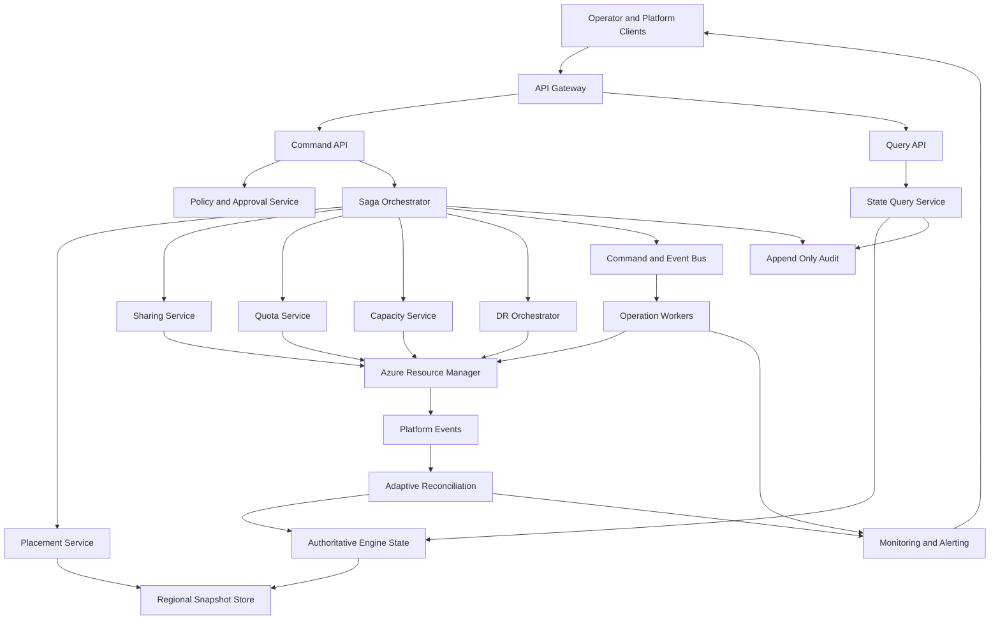
```mermaid
flowchart TB
    User[Operator and Platform Clients] --> APIM[API Gateway]
    APIM --> Command[Command API]
    APIM --> Query[Query API]
    Command --> Policy[Policy and Approval Service]
    Command --> Saga[Saga Orchestrator]
    Query --> State[State Query Service]
    Saga --> Placement[Placement Service]
    Saga --> Sharing[Sharing Service]
    Saga --> Quota[Quota Service]
    Saga --> Capacity[Capacity Service]
    Saga --> DR[DR Orchestrator]
    Placement --> Snapshot[Regional Snapshot Store]
    Sharing --> ARM[Azure Resource Manager]
    Quota --> ARM
    Capacity --> ARM
    DR --> ARM
    ARM --> Events[Platform Events]
    Events --> Reconcile[Adaptive Reconciliation]
    Reconcile --> StateDB[Authoritative Engine State]
    StateDB --> Snapshot
    Saga --> Bus[Command and Event Bus]
    Bus --> Workers[Operation Workers]
    Workers --> ARM
    Saga --> Audit[Append Only Audit]
    State --> StateDB
    State --> Audit
    Monitor[Monitoring and Alerting] --> User
    Workers --> Monitor
    Reconcile --> Monitor
```

The buildable core separates commands from queries and isolates Azure API adapters by provider. [Undocumented — architectural judgement] The state database is authoritative for engine intent, while Azure resource providers remain authoritative for Azure resource state. [Undocumented — architectural judgement]

## 24. Management Group and Subscription Topology

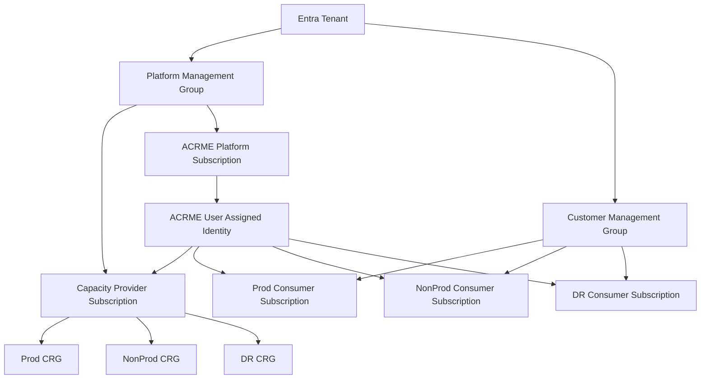
```mermaid
flowchart TB
    Tenant[Entra Tenant] --> PlatformMG[Platform Management Group]
    Tenant --> CustomerMG[Customer Management Group]
    PlatformMG --> ProviderSub[Capacity Provider Subscription]
    PlatformMG --> EngineSub[ACRME Platform Subscription]
    CustomerMG --> ProdSub[Prod Consumer Subscription]
    CustomerMG --> NonProdSub[NonProd Consumer Subscription]
    CustomerMG --> DRSub[DR Consumer Subscription]
    ProviderSub --> ProdCRG[Prod CRG]
    ProviderSub --> NonProdCRG[NonProd CRG]
    ProviderSub --> DRCRG[DR CRG]
    EngineSub --> UAMI[ACRME User Assigned Identity]
    UAMI --> ProviderSub
    UAMI --> ProdSub
    UAMI --> NonProdSub
    UAMI --> DRSub
```

Management-group placement is a governance choice, not a requirement that every customer share the same hierarchy. [Undocumented — architectural judgement] Quota-group scope and eligibility must be validated for the actual tenant and billing structure. [Undocumented — architectural judgement]

## 25. CRG Hierarchy and Sharing Architecture

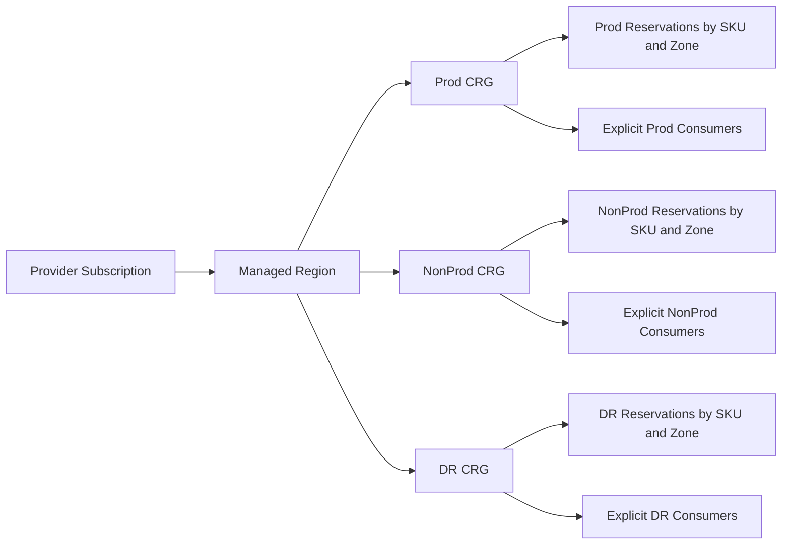
```mermaid
flowchart LR
    Provider[Provider Subscription] --> Region[Managed Region]
    Region --> ProdCRG[Prod CRG]
    Region --> NonProdCRG[NonProd CRG]
    Region --> DRCRG[DR CRG]
    ProdCRG --> ProdCR[Prod Reservations by SKU and Zone]
    NonProdCRG --> NonProdCR[NonProd Reservations by SKU and Zone]
    DRCRG --> DRCR[DR Reservations by SKU and Zone]
    ProdCRG --> ProdConsumers[Explicit Prod Consumers]
    NonProdCRG --> NonProdConsumers[Explicit NonProd Consumers]
    DRCRG --> DRConsumers[Explicit DR Consumers]
```

A single CRG can contain multiple CRs, but each reservation must be modeled by SKU and zone. [Assumed] The “three CRGs per region” rule is a policy default rather than an assertion that three Azure resources can represent every estate shape. [Undocumented — architectural judgement]

### Sharing sequence

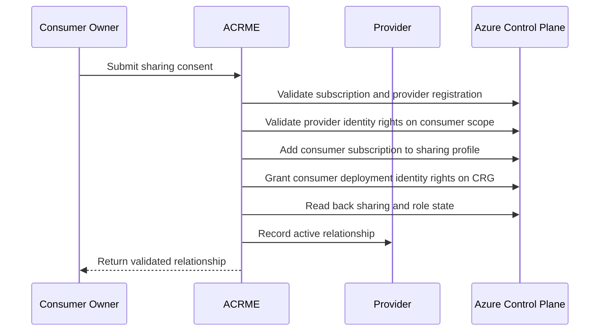
```mermaid
sequenceDiagram
    participant C as Consumer Owner
    participant E as ACRME
    participant P as Provider
    participant A as Azure Control Plane
    C->>E: Submit sharing consent
    E->>A: Validate subscription and provider registration
    E->>A: Validate provider identity rights on consumer scope
    E->>A: Add consumer subscription to sharing profile
    E->>A: Grant consumer deployment identity rights on CRG
    E->>A: Read back sharing and role state
    E->>P: Record active relationship
    E-->>C: Return validated relationship
```

Sharing is complete only after all steps are read back and recorded. [Undocumented — architectural judgement]

## 26. Quota Group Architecture

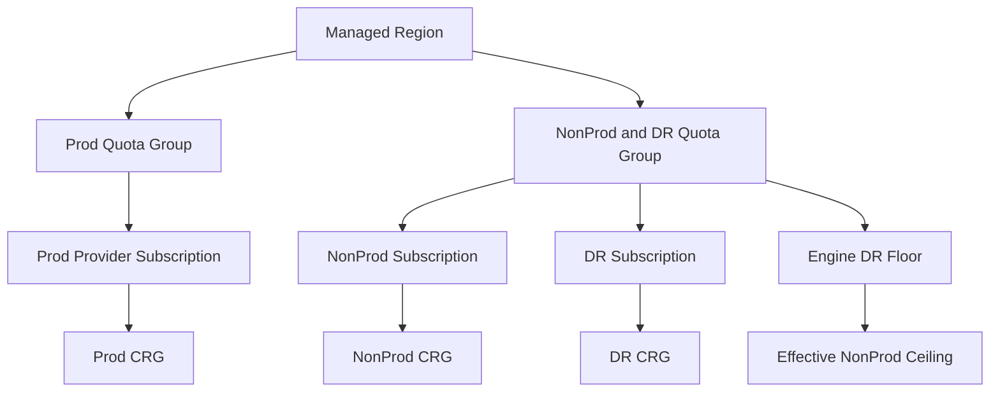
```mermaid
flowchart TB
    Region[Managed Region] --> ProdGroup[Prod Quota Group]
    Region --> SharedGroup[NonProd and DR Quota Group]
    ProdGroup --> ProdSub[Prod Provider Subscription]
    SharedGroup --> NonProdSub[NonProd Subscription]
    SharedGroup --> DRSub[DR Subscription]
    ProdSub --> ProdCRG[Prod CRG]
    NonProdSub --> NonProdCRG[NonProd CRG]
    DRSub --> DRCRG[DR CRG]
    SharedGroup --> EngineFloor[Engine DR Floor]
    EngineFloor --> NonProdCeiling[Effective NonProd Ceiling]
```

### Formulas

`DR_Floor_vCPU(destination, SKU, zone) = MAX over non-concurrent source regions (Protected_Workload_Portion(source, destination, SKU, zone))`

[Derived]

`Effective_NonProd_Ceiling = NonProd_DR_Group_Limit - DR_Floor_vCPU`

[Derived]

`NonProd_Headroom = Effective_NonProd_Ceiling - NonProd_Used_vCPU`

[Derived]

`Group_Headroom = Group_Limit - Group_Used`

[Derived]

These formulas are engine accounting controls. [Derived] They do not create a native Azure sub-reservation. [Assumed] A configured SUM basis is available for customers whose recovery objective requires simultaneous source-region failure coverage. [Derived]

### Exact controls

- Every NonProd increase performs a group check and subscription check. [Undocumented — architectural judgement]
- Every DR increase performs a group check, subscription check, SKU check, capacity check, and active-incident check. [Undocumented — architectural judgement]
- A separate detector recalculates the DR floor from authoritative assignment and allocation data. [Undocumented — architectural judgement]
- Any disagreement between command-time and detector calculations disables automatic NonProd expansion. [Undocumented — architectural judgement]
- Group propagation is polled; no fixed SLA is assumed. [Undocumented — architectural judgement]

### Quota Group `groupType` Property — Preview Status (FC-11)

The `groupType` property on a quota group, which controls whether membership is advisory (`AllocationGroup`) or enforced (`EnforcedGroup`), is documented as a preview-only feature in the Azure Quota Groups API. [Documented — Microsoft Learn / Azure Quota REST API reference: `groupType` property is present in preview API versions and is not listed as generally available.] Production engineering must not depend on `groupType` enforcement semantics until general availability is confirmed for all target regions and subscription types.

The ACRME design's group accounting controls (group headroom formulas and the dual-validation requirement) are engine-level constructs and do not depend on `groupType` enforcement being available natively in Azure. [Derived] If `groupType=EnforcedGroup` is eventually relied upon to remove the requirement for the engine's own subscription-level quota check, that dependency must go through the governance preview acceptance review gate (see POC-30) and be explicitly documented in the Decision Log before Phase 2 engineering begins.

Engineering constraint: Do not assume `groupType` semantics are stable across Azure API versions. Pin the exact preview API version in all quota-group management calls and add version-drift detection to the platform health check. [Undocumented — architectural judgement]

## 27. Region Selection Architecture

### Terminology note

Throughout this section and Section 28, **CVAL (Customer Validation)** is the customer-facing term for the Non-Production environment. In scoring formulas and snapshot fields (Sections 28–29) the identifier `NonProd` is retained for engineering consistency; CVAL and NonProd are interchangeable and refer to the same environment class. [Undocumented — architectural judgement]

---

### Region Classification Model

All regions are assigned one of three classification tiers. Classification is a governance decision, not a live Azure capability query; it is stored in `PlacementPolicy` (config-as-code, versioned and auditable) and flows through the same policy-versioning and replay path as the scoring weights. [Undocumented — architectural judgement] Each geography also carries a `DR_NOT_OFFERED` flag where legal or sovereignty constraints prevent an acceptable DR design. [Derived]

#### Standard Capacity Regions

Standard Capacity Regions are eligible for dynamic selection, automated placement, capacity scoring, and all environment assignments (Prod, CVAL, DR). These are the only regions that enter the scoring pipeline. [Undocumented — architectural judgement]

The current active strategy is North America and Europe; Asia Pacific entries remain configuration-driven and are not an implicit rollout commitment. [Derived]

| Geography | Standard Capacity Regions |
|---|---|
| North America | West US 3, Central US, Canada Central |
| Europe | Sweden Central, Belgium Central |
| Middle East | Saudi Arabia, UAE North |
| Asia Pacific | Japan East, Southeast Asia, Australia East |

#### Restricted Capacity Regions

The following five regions are under current Azure physical capacity constraints and are designated **exception-only** deployment targets. They must not enter the automated placement, scoring, ranking, or recommendation pipeline for any environment type. [Undocumented — architectural judgement]

| Region | Geography | Classification reason |
|---|---|---|
| East US 2 | North America | Azure physical capacity constraint |
| North Europe | Europe | Azure physical capacity constraint |
| West Europe | Europe | Azure physical capacity constraint |
| East Asia | Asia Pacific | Azure physical capacity constraint |
| Australia Southeast | Asia Pacific | Azure physical capacity constraint |

Restricted regions are excluded before capacity scoring, candidate ranking, recommendation generation, deployment placement evaluation, and Prod/CVAL/DR region assignment. Exclusion is applied as a **pre-filter ahead of all hard constraints** — these regions never reach the scoring pipeline. [Undocumented — architectural judgement]

#### Cross-Geo Extension Regions

Cross-Geo Extension regions serve DR placement for geographies that cannot satisfy the three-region minimum within their own geography boundary. [Undocumented — architectural judgement]

| Extension path | Source geography | DR target |
|---|---|---|
| Saudi Arabia → Belgium Central | Middle East | Europe DR coverage for Saudi Arabia Prod/CVAL |
| UAE North → Belgium Central | Middle East | Europe DR coverage for UAE North Prod/CVAL |

Cross-Geo Extension is currently approved only for Middle East DR. Belgium Central is a Standard Capacity Region and participates normally in Europe in-geo scoring; its Cross-Geo Extension role is additive and is invoked only when the DR selection algorithm cannot satisfy the three-region minimum in-geo for Middle East. Additional extension paths require a `PlacementPolicy` update, governance approval, and Decision Log entry before activation. [Undocumented — architectural judgement]

Three-region placement is the default design gate for geographies offering DR. A two-region geography cannot guarantee failover capacity and therefore requires either an approved cross-geo path or `DR_NOT_OFFERED`; it must never silently receive a DR assignment. [Derived]

---

### Region Distribution Model by Geography

| Operational group | Regions |
|---|---|
| North America | West US 3, Central US, Canada Central, East US 2 † |
| Europe | Sweden Central, Belgium Central, North Europe †, West Europe † |
| Middle East | Saudi Arabia, UAE North |
| Asia Pacific | Japan East, Southeast Asia, Australia East, Australia Southeast †, East Asia † |
| Cross-Geo Extension | Saudi Arabia → Belgium Central, UAE North → Belgium Central |

† Restricted Capacity Region — excluded from all automated placement; eligible only under the Scenario 1 restricted-region exception path (Production workload, explicit customer request, exception approval). [Undocumented — architectural judgement]

---

### Region Eligibility Decision Tree

The engine applies a mandatory two-stage filter before any region reaches the scoring pipeline:

**Stage 1 — Classification filter (enforced first, before all other checks)**

```
for each candidate region R:
  if region_class(R) == RESTRICTED:
    if input_mode == Scenario_2 and env_type == Prod:
      route to Exception Deployment Workflow
    else:
      REJECT with RESTRICTED_REGION_ERROR
  if Scenario_1 and R ∉ standard_regions(requested_geography):
    EXCLUDE
  pass to Stage 2
```

**Stage 2 — Hard constraints filter (HC-1 through HC-10)**

Surviving Standard Capacity Region candidates are evaluated against HC-1 through HC-10 (capacity floor, quota floor, zone availability, separation class, snapshot freshness, geography containment, DR coverage floor, NonProd/DR floor integrity, Middle East cross-geo requirement, cross-geo extension path approval). Regions failing any hard constraint are excluded from scoring; the remainder enter the scoring pipeline. [Derived]

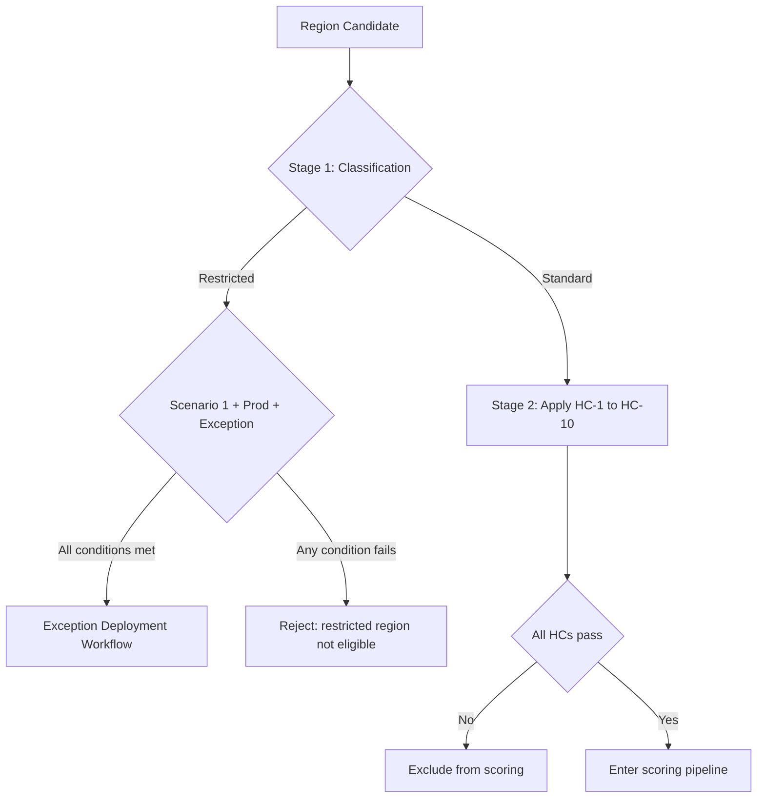
```mermaid
flowchart TD
    Candidate[Region Candidate] --> ClassCheck{Stage 1: Classification}
    ClassCheck -- Standard --> HCFilter[Stage 2: Apply HC-1 to HC-10]
    ClassCheck -- Restricted --> EnvCheck{Scenario 1 + Prod + Exception}
    EnvCheck -- All conditions met --> ExceptionFlow[Exception Deployment Workflow]
    EnvCheck -- Any condition fails --> Reject1[Reject: restricted region not eligible]
    HCFilter --> HCPass{All HCs pass}
    HCPass -- No --> Reject2[Exclude from scoring]
    HCPass -- Yes --> Scoring[Enter scoring pipeline]
```

---

### Prod region input modes

The Prod region is the anchor of every placement: CVAL and DR are selected sequentially from the fixed Prod anchor. Exact region input is the default; geography-only selection is an exception path. [Derived]

**Scenario 1 — Customer provides a specific Azure region (default).** If the supplied region is a Standard Capacity Region it is validated against HC-1 through HC-10 and, if eligible, becomes the Prod anchor directly; `PS_Prod` is used only for post-selection validation. If the supplied region is Restricted, the request is routed to the exception workflow. [Derived]

**Scenario 2 — Customer chooses an Azure geography (exception).** The engine requires an approved exception and binding customer acknowledgement, then derives the Prod region using `PS_Prod` over the Standard Capacity Regions within the chosen geography. Restricted Capacity Regions are excluded before the candidate set is formed. [Derived]

The two modes converge at the same point — a fixed, validated Prod anchor — after which the downstream design is identical for Standard placements. [Undocumented — architectural judgement]

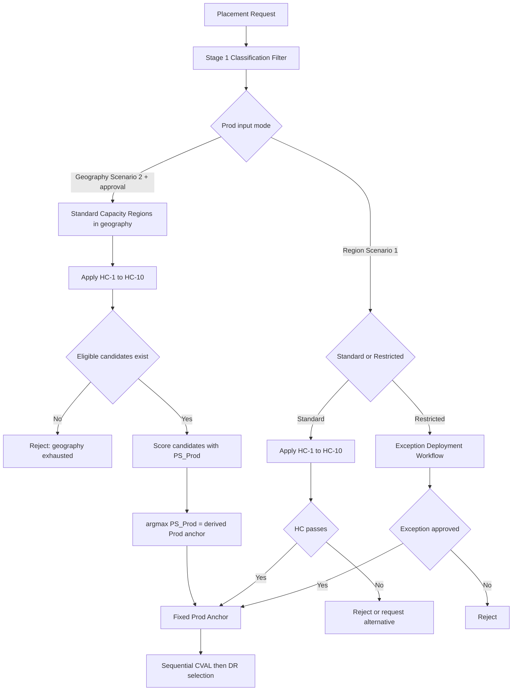
```mermaid
flowchart TD
    Input[Placement Request] --> ClassFilter[Stage 1 Classification Filter]
    ClassFilter --> Mode{Prod input mode}
    Mode -- Geography Scenario 2 + approval --> GeoStd[Standard Capacity Regions in geography]
    GeoStd --> GeoHC[Apply HC-1 to HC-10]
    GeoHC --> GeoEligible{Eligible candidates exist}
    GeoEligible -- No --> GeoReject[Reject: geography exhausted]
    GeoEligible -- Yes --> GeoScore[Score candidates with PS_Prod]
    GeoScore --> GeoPick[argmax PS_Prod = derived Prod anchor]
    GeoPick --> Anchor[Fixed Prod Anchor]
    Mode -- Region Scenario 1 --> S2Class{Standard or Restricted}
    S2Class -- Standard --> S2HC[Apply HC-1 to HC-10]
    S2HC --> S2Ok{HC passes}
    S2Ok -- No --> S2Reject[Reject or request alternative]
    S2Ok -- Yes --> Anchor
    S2Class -- Restricted --> ExceptionWf[Exception Deployment Workflow]
    ExceptionWf --> ExApproved{Exception approved}
    ExApproved -- Yes --> Anchor
    ExApproved -- No --> ExReject[Reject]
    Anchor --> SeqSelect[Sequential CVAL then DR selection]
```

#### Scenario 2 geography derivation — semantics

- **Candidate set:** Standard Capacity Regions within the chosen geography, minus any region excluded by HC-1 through HC-10. [Derived]
- **Scoring:** each surviving candidate is scored with `PS_Prod` from the same versioned regional snapshot used for CVAL/DR, so the Prod anchor is chosen on live capacity, quota headroom, distribution fairness, DR-coverage readiness, and zone diversity — identical signals to the rest of the model. [Derived]
- **Selection:** `argmax(PS_Prod)` over the eligible candidates; ties broken deterministically by the Standard Capacity Region list order for the geography (first-listed region acts as the deterministic cold-start default when no snapshot exists or all scores tie). [Undocumented — architectural judgement]
- **Determinism and audit:** derivation is deterministic given a snapshot; the derived Prod region, every candidate score, and the policy version are written to the `OperationRecord` alongside the subsequent CVAL/DR scores so the full three-environment decision is replayable. [Undocumented — architectural judgement]
- **Exhaustion:** if no Standard Capacity Region in the geography is eligible the request is rejected with a geography-scoped exhaustion error; the engine never silently falls back to a region outside the geography or to a Restricted Capacity Region. [Derived]

#### Automated placement flow

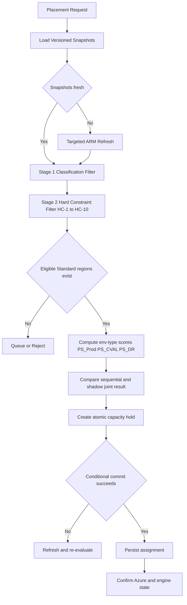
```mermaid
flowchart TD
    Request[Placement Request] --> Load[Load Versioned Snapshots]
    Load --> Fresh{Snapshots fresh}
    Fresh -- No --> Refresh[Targeted ARM Refresh]
    Fresh -- Yes --> Stage1[Stage 1 Classification Filter]
    Refresh --> Stage1
    Stage1 --> Stage2[Stage 2 Hard Constraint Filter HC-1 to HC-10]
    Stage2 --> Eligible{Eligible Standard regions exist}
    Eligible -- No --> Exhausted[Queue or Reject]
    Eligible -- Yes --> Score[Compute env-type scores PS_Prod PS_CVAL PS_DR]
    Score --> Compare[Compare sequential and shadow joint result]
    Compare --> Hold[Create atomic capacity hold]
    Hold --> Commit{Conditional commit succeeds}
    Commit -- No --> Retry[Refresh and re-evaluate]
    Commit -- Yes --> Assignment[Persist assignment]
    Assignment --> Reconcile[Confirm Azure and engine state]
```

---

### Middle East Special Handling

Middle East is a **special-case geography**: only two Standard Capacity Regions exist in-geo (Saudi Arabia, UAE North). The three-region minimum required for Prod + CVAL + DR cannot be satisfied within the geography boundary alone. The current legal direction is `DR_NOT_OFFERED`; the Belgium Central Cross-Geo Extension is usable only when DEC-001 and the customer's sovereignty/contract approval explicitly permit it. [Derived]

#### Required placement for Middle East three-region deployments

| Environment | Region | Selection rule |
|---|---|---|
| Production | Saudi Arabia **or** UAE North | `argmax(PS_Prod)` over the two in-geo Standard regions |
| CVAL | Alternate in-geo Middle East region | The in-geo Standard region not selected for Prod (deterministic, no scoring needed) |
| DR | Belgium Central | Cross-Geo Extension — mandatory; the only approved extension path for Middle East DR |

Both in-geo regions are Standard Capacity Regions and are scored normally via `PS_Prod`. The weighted model selects one for Prod; the other is assigned CVAL deterministically (only one remaining in-geo candidate exists). [Undocumented — architectural judgement]

#### Middle East placement flow

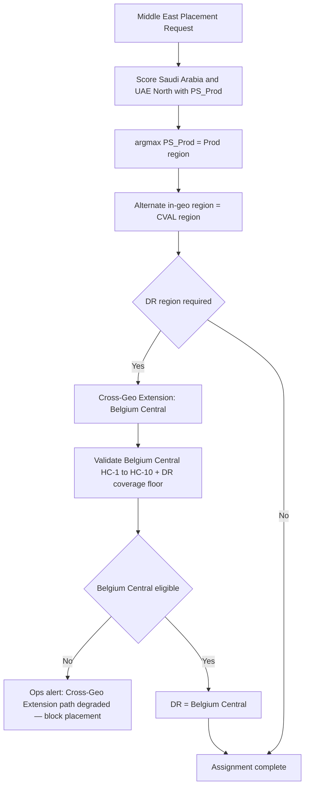
```mermaid
flowchart TD
    ME[Middle East Placement Request] --> ScoreBoth[Score Saudi Arabia and UAE North with PS_Prod]
    ScoreBoth --> ProdPick[argmax PS_Prod = Prod region]
    ProdPick --> CVALPick[Alternate in-geo region = CVAL region]
    CVALPick --> DRRequired{DR region required}
    DRRequired -- Yes --> CrossGeo[Cross-Geo Extension: Belgium Central]
    CrossGeo --> DRValidate[Validate Belgium Central HC-1 to HC-10 + DR coverage floor]
    DRValidate --> DRValid{Belgium Central eligible}
    DRValid -- No --> DRAlert[Ops alert: Cross-Geo Extension path degraded — block placement]
    DRValid -- Yes --> DRAssign[DR = Belgium Central]
    DRRequired -- No --> Complete[Assignment complete]
    DRAssign --> Complete
```

#### Cross-Geo Extension constraints

- Belgium Central must pass HC-1 through HC-10 including DR coverage floor (HC-6) before being assigned as Middle East DR. If it fails the placement is rejected with an ops alert — the engine does not silently select any alternative outside the approved extension paths. [Undocumented — architectural judgement]
- Belgium Central's Cross-Geo Extension role for Middle East DR is additive; it does not remove Belgium Central from the Europe Standard Capacity Region pool for in-geo Europe placements. [Undocumented — architectural judgement]
- DR failover from Belgium Central back to Middle East uses the standard DR Activation Architecture (Section 31) with the additional obligation to verify Belgium Central CRG sharing eligibility across subscription boundaries and the zone-alignment requirement (FC-06). [Derived]
- The extension paths Saudi Arabia → Belgium Central and UAE North → Belgium Central are the only currently approved Cross-Geo Extension paths. Any additional paths require a `PlacementPolicy` update, governance approval, and Decision Log entry before the engine will use them. [Undocumented — architectural judgement]

---

### Exception-Based Placement Workflow (Scenario 1 — Restricted region)

When a customer explicitly requests a Restricted Capacity Region all four exception conditions (EC-1 through EC-4) must be satisfied before the engine proceeds. [Undocumented — architectural judgement]

| Condition | Check |
|---|---|
| EC-1 Explicit request | Customer explicitly named the restricted region; the engine did not recommend or suggest it |
| EC-2 Production only | Workload type is Production; CVAL and DR must not use Restricted Capacity Regions under any condition |
| EC-3 Exception approval | Named exception approval record exists for this customer–region pair |
| EC-4 Scenario 1 input | Input mode is Scenario 1 (customer-supplied region); restricted regions cannot be derived by the engine |

If all four conditions are met the engine assigns the restricted region as the **Exception Prod Anchor** and marks the placement record as an **Exception Deployment**. CVAL and DR are then selected from Standard Capacity Regions only, using the normal scoring model. [Undocumented — architectural judgement]

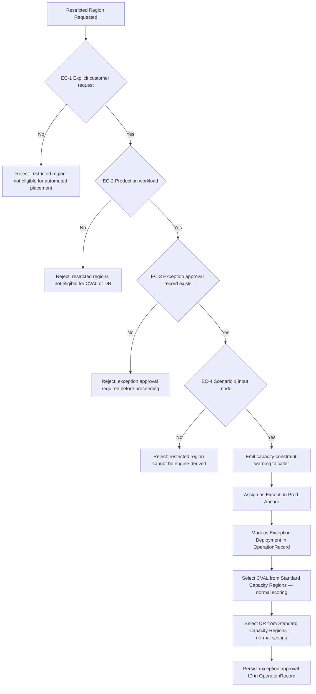
```mermaid
flowchart TD
    ExReq[Restricted Region Requested] --> EC1{EC-1 Explicit customer request}
    EC1 -- No --> R1[Reject: restricted region not eligible for automated placement]
    EC1 -- Yes --> EC2{EC-2 Production workload}
    EC2 -- No --> R2[Reject: restricted regions not eligible for CVAL or DR]
    EC2 -- Yes --> EC3{EC-3 Exception approval record exists}
    EC3 -- No --> R3[Reject: exception approval required before proceeding]
    EC3 -- Yes --> EC4{EC-4 Scenario 1 input mode}
    EC4 -- No --> R4[Reject: restricted region cannot be engine-derived]
    EC4 -- Yes --> Warn[Emit capacity-constraint warning to caller]
    Warn --> ExAnchor[Assign as Exception Prod Anchor]
    ExAnchor --> Mark[Mark as Exception Deployment in OperationRecord]
    Mark --> StdCVAL[Select CVAL from Standard Capacity Regions — normal scoring]
    StdCVAL --> StdDR[Select DR from Standard Capacity Regions — normal scoring]
    StdDR --> Audit[Persist exception approval ID in OperationRecord]
```

The engine must emit a capacity-constraint warning to the caller on exception approval. The restriction status and exception approval ID are mandatory fields in the `OperationRecord`; the commit is blocked if either is absent. [Undocumented — architectural judgement]

---

### Validation Rule Framework

| Rule | Scope | Check | Failure action |
|---|---|---|---|
| VR-1 | All paths | Region exists in classification list (Standard, Restricted, or Cross-Geo Extension) | Reject if unknown |
| VR-2 | Automated placement | Region classification is Standard | Exclude before scoring if Restricted |
| VR-3 | Scenario 1 Restricted | EC-1 through EC-4 all satisfied | Reject at first failing condition |
| VR-4 | Scenario 2 geography exception | Approval and acknowledgement exist; derived Prod region is within Standard Capacity Regions for chosen geography | Geography-scoped exhaustion error |
| VR-5 | All paths | Standard region passes HC-1 through HC-10 | Exclude from scoring; exhaustion error if all excluded |
| VR-6 | Middle East | DR region is Belgium Central via approved Cross-Geo Extension path | Block placement with ops alert if Belgium Central fails HC-1–HC-10 |
| VR-7 | Exception deployment | Exception approval ID persisted in `OperationRecord` before commit | Block commit if absent |
| VR-8 | Exception deployment | Capacity-constraint warning emitted to caller | Block commit if warning suppressed |
| VR-9 | All paths | Snapshot age within policy limit before scoring begins | Trigger targeted ARM refresh |
| VR-10 | All paths | Capacity hold acquired before assignment commit | Block commit if hold absent |
| VR-11 | Recommendation API | Restricted Capacity Regions absent from all recommendation outputs | Post-scoring filter as defence-in-depth even though pre-scoring exclusion already applies |

---

### Governance and compliance controls

- The region classification list (Standard / Restricted / Cross-Geo Extension) is version-controlled in `PlacementPolicy`; changes require a policy version increment, a Decision Log entry, and replay of the prior 30 days of placements against the new classification before activation. [Undocumented — architectural judgement]
- Exception deployment approval records are explicit engine artefacts; the engine validates the record exists before proceeding and persists its ID in the `OperationRecord`. Approval records must be revocable; a revoked approval blocks future exception deployments for the same customer–region pair without requiring a code change. [Undocumented — architectural judgement]
- The engine must never recommend, auto-select, or surface a Restricted Capacity Region in any recommendation API response. Recommendation outputs must be filtered post-scoring as a defence-in-depth measure (VR-11) even though restricted regions are excluded pre-scoring by Stage 1. [Undocumented — architectural judgement]
- Cross-Geo Extension paths are explicitly enumerated in `PlacementPolicy`; the engine rejects any DR assignment to a region not on the approved extension list even if that region is a Standard Capacity Region in another geography. [Undocumented — architectural judgement]
- Every region classification change is written to the audit trail with the approver identity, timestamp, previous classification, new classification, and affected geography. [Undocumented — architectural judgement]
- The Middle East Cross-Geo Extension dependency on Belgium Central must be included in Belgium Central's regional capacity planning targets; the capacity reservation quantities for Belgium Central must account for potential Middle East DR demand in addition to in-geo Europe demand. [Undocumented — architectural judgement]

---

### Hard constraints (HC-1 through HC-10)

HC-1 through HC-8 are defined in the [Multi-Region Placement Design](./research/multi_region_placement_design.md) (`docs/research/multi_region_placement_design.md`). HC-9 and HC-10 are added by this section.

**HC-9  STANDARD_REGION_ONLY:** Automated placement, scoring, recommendation, and all environment assignments (Prod, CVAL, DR) must use Standard Capacity Regions only. Restricted Capacity Regions are excluded before the scoring pipeline runs; their exclusion is enforced at Stage 1 of the eligibility decision tree, not as a scoring penalty. Exception deployments proceed via the Scenario 1 exception path only. [Undocumented — architectural judgement]

**HC-10  CROSS_GEO_EXTENSION_PATH_APPROVED:** Any DR assignment to a region outside the customer's chosen geography must match an explicitly enumerated Cross-Geo Extension path in the active `PlacementPolicy`. DR assignments to Standard Capacity Regions in a different geography are rejected if no approved extension path exists for the source geography. [Undocumented — architectural judgement]

The following hard constraint list applies to all placement paths:

- Restricted Capacity Regions excluded before scoring pipeline (HC-9). [Undocumented — architectural judgement]
- In Scenario 2, derived Prod region must be within the Standard Capacity Regions for the customer's chosen geography (HC-8 geography containment), with the exception approval and customer acknowledgement persisted. [Derived]
- Prod and DR must not share a region (HC-1); NonProd and DR co-location is permitted only when the DR floor and earmark controls pass. [Derived]
- CVAL and Prod must not share a region (HC-1). [Derived]
- CVAL and DR may share a region only under the approved policy (HC-1 update per D8). [Derived]
- For Middle East three-region placements, DR must be Belgium Central via the approved Cross-Geo Extension path (HC-10). [Undocumented — architectural judgement]
- CVAL and DR may not use Restricted Capacity Regions under any condition, including exception deployments (HC-9). [Undocumented — architectural judgement]
- Capacity floor, quota floor, zone availability, SKU, sharing, and DR-floor integrity checks must pass (HC-2 through HC-7). [Derived]
- Region separation class must be approved (HC-4). [Derived]
- Cross-Geo Extension DR path must be explicitly approved in active `PlacementPolicy` (HC-10). [Undocumented — architectural judgement]
- Snapshot age must be within the policy limit or refreshed before scoring. [Undocumented — architectural judgement]
- A capacity hold must be acquired before assignment commit. [Undocumented — architectural judgement]

## 28. Placement Scoring and Forecasting

The scoring formulas (`PS_Prod`, `PS_NonProd`, `PS_DR`) operate exclusively on **Standard Capacity Regions** that have passed the Stage 1 classification filter and Stage 2 hard constraint filter described in Section 27. Restricted Capacity Regions are excluded before the scoring pipeline is entered and are never assigned a score. [Undocumented — architectural judgement]

`PS_NonProd` is the engineering identifier for the CVAL (Customer Validation) environment scorer. Throughout this section, `PS_NonProd` and `PS_CVAL` are interchangeable. [Undocumented — architectural judgement]

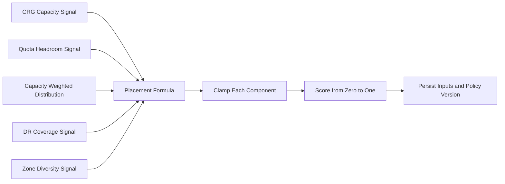
```mermaid
flowchart LR
    Capacity[CRG Capacity Signal] --> Formula[Placement Formula]
    Quota[Quota Headroom Signal] --> Formula
    Distribution[Capacity Weighted Distribution] --> Formula
    DRHealth[DR Coverage Signal] --> Formula
    Zones[Zone Diversity Signal] --> Formula
    Formula --> Clamp[Clamp Each Component]
    Clamp --> Score[Score from Zero to One]
    Score --> Audit[Persist Inputs and Policy Version]
```

### Corrected scoring model

The original default weights are retained for pilot comparison:

`alpha = 0.30, beta = 0.20, gamma = 0.25, delta = 0.15, epsilon = 0.10`

[Assumed]

Each raw ratio must be clamped:

`Clamp(x) = max(0, min(1, x))`

[Undocumented — architectural judgement]

The NonProd (CVAL) formula should not duplicate the same signal under alpha and delta. [Undocumented — architectural judgement] For pilot implementation:

`PS_NonProd = 0.35 Capacity + 0.25 Quota + 0.25 Distribution + 0.05 DR_Overflow_Integrity + 0.10 Zones`

[Undocumented — architectural judgement]

The revised weights are proposed, not empirically validated. [Assumed]

Distribution should use demand units rather than customer count:

`Distribution = 1 - Region_Assigned_Demand / Total_Assigned_Demand`

[Undocumented — architectural judgement]

### Forecast formula

`Forecast_Quantity = ceil(Forecast_Peak × (1 + Growth_Buffer) + DR_Buffer)`

[Derived]

The forecast formula is for proactive production growth planning. It is not the continuous reservation floor. The steady-state reconciliation floor is:

`Target_Reserved_Capacity = Allocated_VM_Count + Configured_Buffer`

[Derived]

Variables:

- `Forecast_Peak`: predicted peak associated VM demand in the horizon. [Derived]
- `Growth_Buffer`: policy percentage for forecast uncertainty. [Assumed]
- `DR_Buffer`: additional units required by the approved recovery policy. [Assumed]
- `Forecast_Horizon`: 30, 60, or 90 days in the original design. [Assumed]

Associated-but-deallocated VMs are reported separately and do not increase the floor unless an explicit policy requires retention. [Derived]

Forecast recommendations remain advisory until model accuracy and false-positive rates are measured. [Undocumented — architectural judgement]

## 29. State Model and Concurrency Controls

### Engine state machine

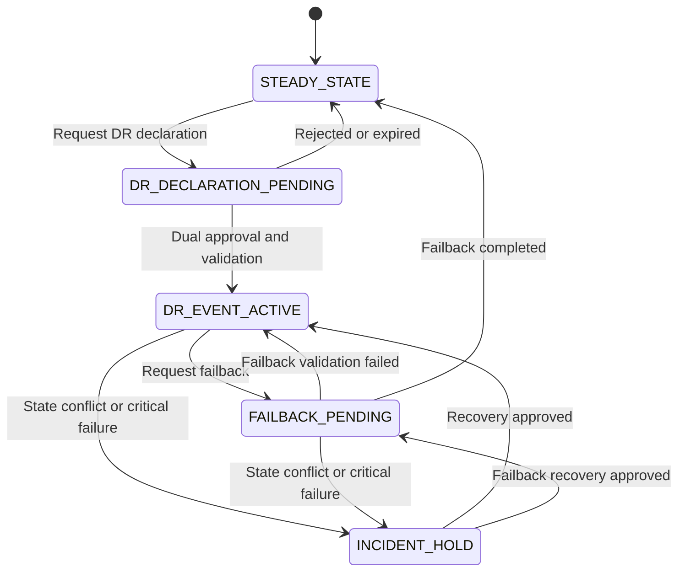
```mermaid
stateDiagram-v2
    [*] --> STEADY_STATE
    STEADY_STATE --> DR_DECLARATION_PENDING: Request DR declaration
    DR_DECLARATION_PENDING --> DR_EVENT_ACTIVE: Dual approval and validation
    DR_DECLARATION_PENDING --> STEADY_STATE: Rejected or expired
    DR_EVENT_ACTIVE --> FAILBACK_PENDING: Request failback
    FAILBACK_PENDING --> DR_EVENT_ACTIVE: Failback validation failed
    FAILBACK_PENDING --> STEADY_STATE: Failback completed
    DR_EVENT_ACTIVE --> INCIDENT_HOLD: State conflict or critical failure
    FAILBACK_PENDING --> INCIDENT_HOLD: State conflict or critical failure
    INCIDENT_HOLD --> DR_EVENT_ACTIVE: Recovery approved
    INCIDENT_HOLD --> FAILBACK_PENDING: Failback recovery approved
```

The engine state machine is a production blocker until this model is implemented with conditional writes, transition guards, and recovery tests. [Undocumented — architectural judgement]

### State entity

`EngineModeState` must include:

- Environment or control-plane scope.
- Current mode.
- State version.
- Incident ID.
- Requested by.
- Approved by.
- Transition timestamp.
- Transition reason.
- Active operation IDs.
- Lease owner and expiry.
- Recovery checkpoint.

[Undocumented — architectural judgement]

### Capacity holds

Before returning a committed assignment, the engine creates a hold keyed by region, SKU, zone, environment, and policy version. [Undocumented — architectural judgement] The hold uses optimistic concurrency and expires if Azure provisioning does not begin. [Undocumented — architectural judgement] This closes concurrent placement race B-7. [Derived]

## 30. Steady-State Capacity Lifecycle

Steady-state increases remain separate from DR crisis operations. [Derived]

The reference reconciliation job runs every six minutes; the production interval is configurable and must be tuned from API throttling, operational risk, cost, and deployment responsiveness. Each cycle compares reserved quantity, allocated VMs, associated-but-deallocated VMs, available capacity, quota, and configured buffers. [Derived]

Recommended policy:

1. Detect threshold crossing.
2. Re-read current CR, quota, sharing, and assignment state.
3. Create `CapacityIncreaseRequest`.
4. Calculate target quantity.
5. Require operator approval in Phase 1.
6. Submit quota action only if validated as required.
7. Wait for confirmed quota state without assuming a propagation SLA.
8. Update CR quantity.
9. Confirm actual quantity.
10. Refresh snapshot and close the request.

[Undocumented — architectural judgement]

Auto-decrease is excluded from Phase 1 because it can remove future capacity and interact with running VMs. [Undocumented — architectural judgement] Where Azure permits, an unused reservation is reduced to zero rather than deleted; normal reconciliation never deletes CRGs or reservation definitions. Decommissioning is a separate approved workflow. [Derived]

## 31. DR Activation Architecture

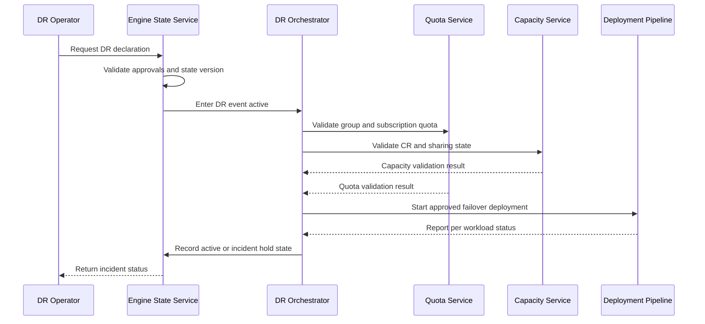
```mermaid
sequenceDiagram
    participant O as DR Operator
    participant E as Engine State Service
    participant D as DR Orchestrator
    participant Q as Quota Service
    participant C as Capacity Service
    participant P as Deployment Pipeline
    O->>E: Request DR declaration
    E->>E: Validate approvals and state version
    E->>D: Enter DR event active
    D->>Q: Validate group and subscription quota
    D->>C: Validate CR and sharing state
    C-->>D: Capacity validation result
    Q-->>D: Quota validation result
    D->>P: Start approved failover deployment
    P-->>D: Report per workload status
    D->>E: Record active or incident hold state
    E-->>O: Return incident status
```

DR activation does not automatically authorize Tier 2 or Tier 3. [Undocumented — architectural judgement] It establishes the operating mode in which separately governed emergency operations may be evaluated. [Undocumented — architectural judgement]

On an authorised declaration, the DR orchestrator reads `SourceDestinationDRIndex` and activates only the affected source region's standby set. [Derived] Customers are processed in approved priority waves; each customer's standby instances transition from `associated` to `allocated`, with the acquisition sequence evaluated in order: bootstrap capacity, available quota, releasable CVAL, approved sharing, pooled quota, then an Azure capacity request. [Derived] Every transition is auditable and failback reverses the customer activation state only after the target region passes readiness checks. [Undocumented — architectural judgement]

When CVAL is co-located with DR, `CVALEarmarkRecord` identifies capacity that may be released for that customer's activation. Earmarked capacity is counted toward DR headroom, not live CVAL headroom, so it is never credited twice. [Derived]

## 32. Tier Escalation Architecture

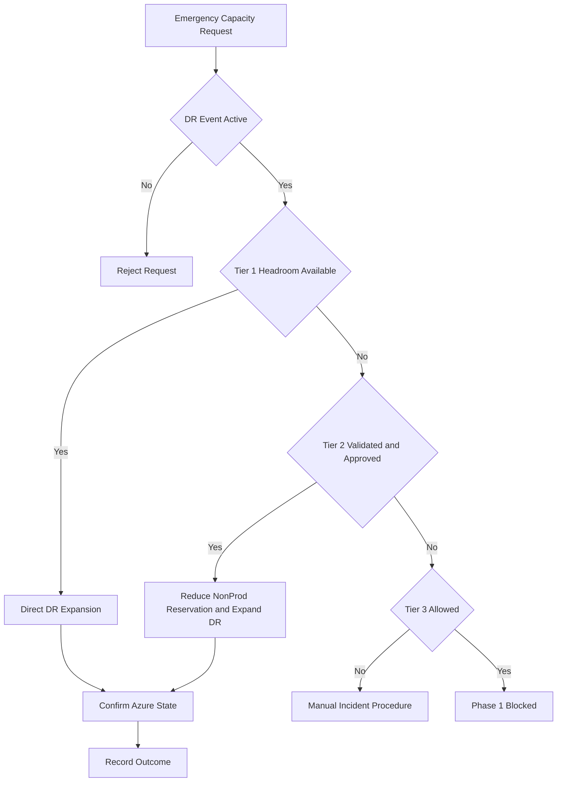
```mermaid
flowchart TD
    Start[Emergency Capacity Request] --> Mode{DR Event Active}
    Mode -- No --> Reject[Reject Request]
    Mode -- Yes --> T1{Tier 1 Headroom Available}
    T1 -- Yes --> Direct[Direct DR Expansion]
    T1 -- No --> T2{Tier 2 Validated and Approved}
    T2 -- Yes --> Transfer[Reduce NonProd Reservation and Expand DR]
    T2 -- No --> T3{Tier 3 Allowed}
    T3 -- No --> Manual[Manual Incident Procedure]
    T3 -- Yes --> Blocked[Phase 1 Blocked]
    Direct --> Confirm[Confirm Azure State]
    Transfer --> Confirm
    Confirm --> Complete[Record Outcome]
```

Tier 1 is additive capacity expansion. [Derived] Tier 2 changes reservation allocation and may remove NonProd capacity guarantees. [Derived] Tier 3 changes VM associations and is destructive from an assurance perspective even if a VM continues running. [Undocumented — architectural judgement]

Tier 3 is not automated in Phase 1. [Undocumented — architectural judgement]

## 33. AKS and VMSS Integration Architecture

### AKS controls

- New node pools may reference an approved CRG only after zone, SKU, sharing, provider quota, and consumer quota checks. [Undocumented — architectural judgement]
- Existing node-pool changes require a replacement-impact plan. [Undocumented — architectural judgement]
- Autoscaler maximum size must not exceed validated reservation plus policy-permitted over-allocation. [Undocumented — architectural judgement]
- The node identity and ACRME deployment identity must remain separate. [Undocumented — architectural judgement]
- A failed scale-out must not trigger unbounded retries. [Undocumented — architectural judgement]

### VMSS controls

| Operation | Uniform | Flexible | Phase 1 decision |
|---|---|---|---|
| Create with CRG | Validate in POC | Validate separately | Allowed only after mode-specific proof |
| Remove association from existing instances | Model and rollout dependent | Instance semantics require proof | Manual only |
| Tier 3 emergency release | High blast radius | Not equivalent to single VM | Blocked |
| Scale-in to free slots | Test required | Test required | Operator procedure only |

[Undocumented — architectural judgement]

## 34. Data Architecture

### Authoritative entities

- ManagedSubscription.
- CapacityReservationGroup.
- CapacityReservation.
- SharingRelationship.
- ZoneMappingRecord.
- SubscriptionQuotaRecord.
- QuotaGroup.
- CustomerRegionAssignment.
- PlacementHold.
- DRCapacityPair.
- CapacityIncreaseRequest.
- EmergencyCapacityTransfer.
- EngineModeState.
- IncidentRecord.
- OperationRecord.
- PolicyVersion.
- ForecastRecord.
- CustomerSeedRecord.
- SourceDestinationDRIndex.
- CVALEarmarkRecord.
- DeploymentReadinessResult.

[Derived]

### Open-gap closures

**G-20 — CustomerRegionAssignment**

Closure control: create a formal entity with assignment ID, customer ID, environment regions, score breakdown, snapshot versions, policy version, hold IDs, status, and timestamps. [Undocumented — architectural judgement]

**G-21 — IncidentRecord**

Closure control: define an internal incident entity that can reference an external ITSM identifier but does not depend on the external system as the only state source. [Undocumented — architectural judgement]

**G-23 and G-24 — API and data model backport**

Closure control: include `EmergencyCapacityTransfer` and `CapacityIncreaseRequest` in the canonical API, schema, authorization model, audit model, and backlog before implementation begins. [Undocumented — architectural judgement]

The v2.1 placement and DR contracts also require a durable customer seed, a bidirectional source-to-destination DR index, and an explicit CVAL earmark record. These are authoritative engine entities, not derived dashboard views. [Derived]

`CustomerSeedRecord` is created on first placement and contains customer/realm, geography, Prod/CVAL/DR (or `NOT_OFFERED`), products, decision timestamp, policy/engine versions, snapshot reference, exception reference, and approval metadata. Subsequent products reuse the seed; changes require an approved migration or exception workflow. [Derived]

`SourceDestinationDRIndex` is maintained in both source→destination and destination→source views and contains source region, destination region, customer/realm, standby set, SKU/quantity, activation state, last-updated time, and policy version. [Derived]

## 35. API Architecture

All state-changing endpoints return an operation resource rather than implying synchronous Azure completion. [Undocumented — architectural judgement]

### Core endpoints

- `/subscriptions`
- `/crgs`
- `/crgs/{id}/reservations`
- `/crgs/{id}/consumers`
- `/zones/resolve`
- `/quota`
- `/placement/evaluate`
- `/placement/select-regions` — accepts **either** a specific Prod region (Scenario 1, default) **or** an Azure geography (Scenario 2, approved exception); when a geography is supplied the engine derives the Prod region via `PS_Prod` over the geography's approved regions before running sequential NonProd/DR selection (Section 27). [Undocumented — architectural judgement]
- `/capacity/increase-requests`
- `/capacity/emergency-transfer`
- `/dr/incidents`
- `/dr/pairs/{id}/failover`
- `/dr/pairs/{id}/failback`
- `/operations/{id}`

[Derived]

Every mutation requires:

- Idempotency key.
- Caller identity.
- Expected state version.
- Policy version.
- Incident ID where applicable.
- Dry-run support for high-impact operations.
- Structured precondition failures.
- Operation polling URL.

[Undocumented — architectural judgement]

The placement readiness result is machine-readable and must be one of:

`READY | READY_WITH_RISK | QUOTA_DEFICIT | RESERVATION_DEFICIT | CAPACITY_UNAVAILABLE | STALE_STATE | POLICY_BLOCKED | VALIDATION_REQUIRED`

[Derived] A stale snapshot, missing zone mapping, failed quota/capacity validation, policy exception, or unresolved provider read must produce the corresponding non-ready state rather than a successful-looking default.

## 36. RBAC and Managed Identity Model

### RBAC matrix

| Identity or role | Scope | Allowed actions | Prohibited actions |
|---|---|---|---|
| ACRME Reader UAMI | Managed subscriptions | Read CRG, CR, quota, SKU, zone, and VM association state | Writes and role assignments |
| ACRME Capacity UAMI | Approved provider resource groups | CRG and CR create or update | Consumer VM mutation |
| ACRME Sharing UAMI | Approved CRG and onboarding scopes | Sharing profile and approved role-assignment workflow | DR activation |
| ACRME Consumer Compute UAMI | Explicit consumer resource groups | Approved VM association changes | Subscription-wide compute mutation |
| ACRME Quota UAMI | Approved quota scopes | Query and submit approved requests | CR or VM mutation |
| ACRME DR Operator | Engine API scope | Request failover, failback, Tier 1, and approved Tier 2 | Role assignment and policy editing |
| ACRME Emergency Operator | Engine API scope | Submit Tier 3 request after future enablement | Autonomous target selection |
| ACRME Policy Admin | Engine configuration | Version and activate policy | Execute DR operations |
| Auditor | Engine and log scope | Read audit and evidence | Mutations |

[Undocumented — architectural judgement]

### Managed Identity scope

The preferred closure for G-14 is a customer-consented User Assigned Managed Identity with resource-group-scoped custom rights for the exact VM association operations required. [Undocumented — architectural judgement] Subscription-wide Virtual Machine Contributor should not be the default. [Undocumented — architectural judgement]

If the minimum custom action set cannot be established, Tier 3 remains blocked. [Undocumented — architectural judgement]

## 37. Observability, Dashboards, and Alerts

### Proposed SLI and SLO targets

These are internal targets, not Microsoft guarantees.

| SLI | Proposed target |
|---|---|
| Query API successful response rate | 99.9% monthly [Assumed] |
| Mutation acceptance availability | 99.5% monthly [Assumed] |
| Placement recommendation latency | P95 under 500 ms from fresh cache [Assumed] |
| Critical targeted reconciliation | P95 under 2 minutes [Assumed] |
| Stable-resource reconciliation age | P95 under 15 minutes [Assumed] |
| Unresolved critical drift | Zero beyond two targeted cycles [Assumed] |
| Audit event completeness | 100% for accepted mutations [Undocumented — architectural judgement] |
| Unauthorized Tier 3 execution | Zero [Undocumented — architectural judgement] |

### Dashboards

1. Capacity by region, SKU, zone, CRG, quantity, and allocation.
2. Provider, consumer, and quota-group headroom.
3. DR coverage and floor integrity.
4. Sharing relationships and consumer-count headroom.
5. Placement scores, holds, and rejection reasons.
6. Engine mode and active incidents.
7. Reconciliation age and drift.
8. ARM and Quota throttling.
9. Operation saga state and dead letters.
10. Forecast accuracy and recommendation outcomes.

[Undocumented — architectural judgement]

### Alert catalog

| Alert | Severity | Trigger |
|---|---|---|
| EngineModeConflict | Critical | Multiple or illegal mode transitions |
| DRFloorViolation | Critical | NonProd use exceeds effective ceiling |
| UnauthorizedConsumer | Critical | Actual sharing contains unapproved subscription |
| Tier3AttemptBlocked | Critical | Tier 3 called while disabled |
| VMSSEmergencyAttempt | Critical | VMSS included in emergency transfer |
| QuotaStateUnknown | High | Required quota read unavailable or stale |
| CapacityExhausted | High | No eligible region or CR |
| SharingDrift | High | Desired and actual profiles differ |
| PlacementHoldConflict | High | Concurrent hold collision |
| ReconciliationStale | High | State age exceeds policy |
| ForcedUnsharingRequested | High | Active associations detected |
| ARMThrottling | Medium | Retry budget or throttle ratio exceeded |
| ARGDiscoveryLag | Medium | Inventory differs from ARM sample |
| ForecastError | Medium | Forecast error exceeds policy |
| IdleCapacity | Low | Sustained zero allocation |

[Undocumented — architectural judgement]

## 38. Well-Architected Framework Assessment

### Reliability

The architecture uses persisted sagas, idempotency, conditional state transitions, manual fallback, and adaptive reconciliation. [Undocumented — architectural judgement] Reliability remains constrained by preview dependencies, unknown propagation, and untested end-to-end DR. [Derived]

### Performance efficiency

Cached reads support low-latency recommendations, but fresh validation is required before commit. [Undocumented — architectural judgement] The design trades some placement latency for correctness on safety-critical operations. [Undocumented — architectural judgement]

### Cost optimization

Forecasting and idle-capacity reporting can reduce waste, but no automatic reduction is allowed in Phase 1. [Undocumented — architectural judgement] Service sizing and data-retention cost must be derived from measured workloads. [Undocumented — architectural judgement]

**Reserved Instance Discount Scope — FinOps Constraint (FC-09):** Azure Reserved Instance (1-year and 3-year) discounts are scoped to the subscription and enrollment in which the reservation is purchased. [Documented — Microsoft Learn / Azure Reservations: reservation discounts apply to usage within the same enrollment, billing account, or shared scope as configured at purchase time.] When a Capacity Reservation Group is shared across subscriptions, the consumer subscription does not automatically receive the RI discount from a reservation purchased by the provider subscription. The discount flows only if the reservation scope is explicitly set to the shared management group, billing account scope, or the consumer subscription is added to the reservation's shared scope.

FinOps engineering must validate the reservation discount scope for every provider–consumer subscription pair before cost modelling is presented to customers. [Derived] Cost models that assume the consumer subscription benefits from the provider's RI discount without validating scope configuration will overstate the cost benefit of the shared CRG arrangement. [Derived] This constraint must be reviewed during customer onboarding and documented in the capacity reservation cost summary. [Undocumented — architectural judgement]

### Security

Split identities, customer consent, narrow custom roles, approval separation, and immutable audit reduce privilege concentration. [Undocumented — architectural judgement] G-14 remains the primary unresolved security blocker. [Derived]

### Operational excellence

Versioned policy, replayable scoring, dry runs, structured operations, and runbooks improve auditability. [Undocumented — architectural judgement] Operational maturity must be demonstrated through exercises rather than inferred from documentation. [Undocumented — architectural judgement]

## 39. Gap Closure Plan

| Gap | Exact closure control | Acceptance evidence |
|---|---|---|
| G-14 Credential model | Select UAMI or approved alternative; define custom role; customer consent; revocation; test in consumer subscription | Security approval and successful least-privilege test |
| G-15 Engine mode | Implement `EngineModeState`, conditional transitions, dual approval, incident hold, and recovery | Fault-injection test with no illegal transition |
| G-20 Assignment entity | Add canonical schema and atomic capacity hold linkage | Concurrency test with no duplicate assignment |
| G-21 Incident record | Define internal incident entity plus external reference format | Failover and failback audit continuity |
| G-23 Emergency API | Add endpoint to canonical API and authorization matrix | Contract test and disabled-by-default feature flag |
| G-24 Increase request | Add entity, lifecycle, approval, retry, and cancellation | End-to-end approved increase test |
| B-1 | Execute quota-group availability gate | Every target scope passes |
| B-2 | Execute release and reuse test | Repeatable group behavior and documented limits |
| B-3 | Close with G-15 | State-machine acceptance |
| B-4 | Recalculate potential demand from assignments and allocations; event-trigger targeted refresh | Churn test updates demand correctly |
| B-5 | Validate exact quota API | Contract and integration test |
| B-6 | Measure propagation; use observed distributions, not guarantee | Runbook includes timeout and manual path |
| B-7 | Placement holds and optimistic concurrency | Parallel test produces one winner |

# Part III — Supporting Artifacts

## 40. Complete Risk Register

| ID | Description | Likelihood | Impact | Mitigation | Owner | Residual risk |
|---|---|---|---|---|---|---|
| R-01 | CRG sharing preview changes or is withdrawn | Medium | Critical | Feature flag, adapter isolation, governance acceptance | Product Owner | High |
| R-02 | 100-consumer limit causes CRG fragmentation | High | High | Shard CRGs and monitor relationship count | Capacity Architect | Medium |
| R-03 | Consumer discovery list omits shared CRGs (documented Microsoft known issue: CRG list-by-subscription returns incomplete results when no local CRG exists) | Medium | Medium | Provider-maintained inventory as authoritative source; ARG used for diagnostics only, not for mutation decisions | Operations | Low |
| R-04 | ARG returns stale state | High | High | ARM confirmation before mutation | Engineering | Low |
| R-05 | Quota Groups unavailable in target scope | Medium | Critical | POC-30 and fallback architecture | Quota Owner | High |
| R-06 | Group membership does not satisfy subscription quota | Medium | High | Mandatory subscription checks | Quota Owner | Low |
| R-07 | Engine DR floor is bypassed | Medium | Critical | Independent detector, block on disagreement | SRE | Medium |
| R-08 | Quota release propagation is delayed | High | High | Poll, timeout, pre-stage validated headroom | DR Owner | Medium |
| R-09 | CR quantity reduction behavior differs by scenario | Medium | Critical | Scenario matrix and blocked unknowns | Compute Owner | Medium |
| R-10 | Forced unsharing strands VM restart | Medium | Critical | Default deny and recovery runbook | Sharing Owner | Low |
| R-11 | Zone mapping is wrong or stale | Medium | High | Onboarding validation and targeted refresh | Placement Owner | Low |
| R-12 | Non-paired regions have correlated dependencies | Medium | Critical | Failure-domain review and customer acceptance | DR Architect | Medium |
| R-13 | DR coverage ratio is insufficient | Medium | Critical | Workload-specific recovery analysis | Business Continuity | Medium |
| R-14 | Thirty-percent transfer headroom is mis-sized | Medium | High | Scenario testing and policy tuning | Capacity Planning | Medium |
| R-15 | Auto-increase creates cost or capacity exposure | Medium | High | Approval gate and maximum delta | FinOps | Low |
| R-16 | Tier 1 runs outside a declared incident | Low | Critical | Engine-mode guard | DR Owner | Low |
| R-17 | Tier 2 removes NonProd guarantees unexpectedly | Medium | High | Approval and impact preview | DR Owner | Medium |
| R-18 | Tier 3 modifies wrong consumer VM | Medium | Critical | Block Phase 1; future explicit target list | Security | High |
| R-19 | Credential model grants excessive rights | High | Critical | Scoped UAMI and custom role | Security | Medium |
| R-20 | VMSS operation affects all instances | Medium | Critical | Reject automated Phase 1 operation | Compute Owner | Low |
| R-21 | AKS autoscaler repeatedly requests unavailable nodes | Medium | High | Pre-scale validation and bounded retries | AKS Owner | Medium |
| R-22 | Existing AKS pool update causes replacement impact | Medium | High | Change plan and dedicated POC | AKS Owner | Medium |
| R-23 | Concurrent placements over-assign capacity | High | High | Atomic holds and conditional writes | Engineering | Low |
| R-24 | Full reconciliation exceeds API budgets | High | High | Adaptive and delta-based reconciliation | SRE | Medium |
| R-25 | ARM throttling delays DR actions | Medium | Critical | Per-service budgets and manual path | SRE | Medium |
| R-26 | Engine and Azure state diverge during partial saga | Medium | High | Checkpoints and compensation | Engineering | Medium |
| R-27 | Failback starts too early | Medium | Critical | Readiness gate and explicit approval | DR Owner | Low |
| R-28 | Subscription suspension or transfer invalidates access | Medium | High | Lifecycle monitor and revalidation | Operations | Medium |
| R-29 | Forecast drives unsafe reduction | Medium | High | Advisory-only reduction | Capacity Planning | Low |
| R-30 | Cost estimates are treated as billing facts | Medium | Medium | Reconcile against billing data | FinOps | Low |
| R-31 | Audit gaps impair incident reconstruction | Low | Critical | Append-only audit and completeness SLI | Compliance | Low |
| R-32 | Break-glass bypass is abused | Low | Critical | Time-bound role, alert, post-review | Security | Medium |
| R-33 | Cosmos throughput is under-sized | Medium | High | Load test and autoscale target | Data Owner | Medium |
| R-34 | Preview POC result is presented as SLA | Medium | Critical | Evidence labels and governance review | Product Owner | Low |
| R-35 | Engine state machine permits illegal transition | Medium | Critical | Formal transition tests | Engineering | Low |
| R-36 | Multi-SKU demand invalidates simple formulas | High | High | SKU-dimensional model | Capacity Architect | Medium |
| R-37 | Customer-count fairness hides demand concentration | High | Medium | Demand-weighted distribution | Placement Owner | Low |
| R-38 | Stale potential DR demand understates floor | Medium | Critical | Recompute from assignments and allocation | DR Owner | Low |
| R-39 | Provider quota is double-counted | Medium | High | Validate API semantics and formula | Quota Owner | Low |
| R-40 | Manual Azure change is unexpectedly reverted | Medium | High | Maintenance mode and drift policy | Operations | Medium |
| R-41 | Cross-subscription zone mapping mismatch causes zonal deployment failure | High | Critical | Zone mapping table built at onboarding; zone translation applied before every consumer deployment; reject with ZoneMappingUnavailable if mapping absent | Engineering | Medium |
| R-42 | VMSS reprovisioning via shared CRG fails during zone outage | High | Critical | Document as Preview limitation; Phase 2 VMSS flows must await GA resolution or provide non-shared-CRG alternative | Compute Owner | High |
| R-43 | groupType enforcement semantics require preview API version | Medium | High | POC-30 to confirm required API version; if groupType needed, add to governance preview acceptance review | Quota Owner | Medium |
| R-44 | RI discounts do not flow to consumer subscription in shared CRG | Medium | Medium | Confirm shared enrollment or management group scope per customer before cost modelling | FinOps | Low |

## 41. Operational Runbooks

### Runbook A — Capacity exhaustion

1. Freeze new placement holds for the affected region, SKU, and zone. [Undocumented — architectural judgement]
2. Read CR quantity and allocation directly from the Compute resource provider. [Undocumented — architectural judgement]
3. Validate provider quota, consumer quota, group quota, SKU eligibility, and sharing. [Undocumented — architectural judgement]
4. Rank alternative regions without committing. [Undocumented — architectural judgement]
5. If no alternative exists, queue the placement and create an incident. [Undocumented — architectural judgement]
6. Submit an approved capacity or quota request only through a tracked operation. [Undocumented — architectural judgement]
7. Re-evaluate after confirmed state change; do not rely on elapsed time alone. [Undocumented — architectural judgement]

### Runbook B — Forced unsharing request

1. Reject by default when active associations exist. [Undocumented — architectural judgement]
2. Enumerate associations using provider state and consumer inventory. [Undocumented — architectural judgement]
3. Notify the consumer owner and obtain explicit approval. [Undocumented — architectural judgement]
4. Choose disassociation, migration, or documented force action. [Undocumented — architectural judgement]
5. Test restart of a representative workload where permitted. [Undocumented — architectural judgement]
6. Remove sharing, read back state, and monitor restart failures. [Undocumented — architectural judgement]
7. Retain the impact record. [Undocumented — architectural judgement]

### Runbook C — Tier 1 emergency expansion

1. Confirm `DR_EVENT_ACTIVE`.
2. Confirm fresh quota and capacity state.
3. Confirm the target CRG sharing relationship.
4. Calculate requested delta and policy maximum.
5. Submit CR increase with idempotency key.
6. Poll the asynchronous operation.
7. Read back CR quantity.
8. Begin VM deployment only after confirmation.
9. Record outcome and residual headroom.

[Undocumented — architectural judgement]

### Runbook D — Tier 2 quota-neutral transfer

1. Confirm Tier 2 has passed its POC and is enabled.
2. Confirm incident mode and approval.
3. Identify the exact NonProd reservation impact.
4. Validate running associations and customer impact.
5. Reduce only the approved quantity.
6. Poll group and subscription quota state.
7. Do not assume a propagation duration.
8. Expand DR only after authoritative headroom is visible.
9. If timeout occurs, stop and escalate manually.
10. Record NonProd assurance impact and restoration plan.

[Undocumented — architectural judgement]

### Runbook E — Failback

1. Confirm primary application, data, network, DNS, identity, and capacity readiness.
2. Freeze new DR scaling.
3. Obtain failback approval.
4. Restore primary workloads in waves.
5. Validate service health.
6. Remove DR traffic only after validation.
7. Deallocate DR resources conservatively.
8. Restore reservation policy.
9. Recalculate DR floor and headroom.
10. Transition to `STEADY_STATE` only after all operations close.

[Undocumented — architectural judgement]

## 42. POC and Validation Plan

The workbook is draft and pending execution; therefore its expected results are not production evidence. [Derived]

### Critical sequence

1. Sharing API and RBAC.
2. Unauthorized consumer rejection.
3. Safe and forced unsharing.
4. Provider and consumer quota independence.
5. Quantity increase, reduction floor, zero size, and running-VM behavior.
6. Zone mapping and mismatch.
6a. **Cross-subscription zone alignment** — validate that `Subscriptions - List Locations` returns `availabilityZoneMappings` for all managed regions for both provider and consumer subscriptions; confirm that a consumer VM deployment to a logical zone that does not align to the provider's physical zone fails with a placement error; confirm that the zone translation algorithm resolves the correct consumer logical zone for a given provider physical zone and successfully deploys. Record physical-to-logical mapping tables for at least two subscriptions in the same region.
7. Quota-group availability and scope.
8. Group decomposition and release behavior.
9. DR-floor enforcement.
10. Quota-increase endpoint and propagation.
11. Concurrent placement.
12. Engine-mode transitions.
13. Tier 1.
14. Tier 2.
15. Tier 3 remains disabled.
16. VMSS Uniform and Flexible behavior.
17. AKS node-pool and autoscaler behavior.
18. Scale testing.

[Undocumented — architectural judgement]

Each result must retain:

- API version.
- Region.
- SKU.
- Zone.
- VM or VMSS mode.
- Request and response identifiers.
- Timestamps.
- Before and after state.
- Retry history.
- Observed propagation distribution.
- Classification as documented, observed, assumed, or judgement.

[Undocumented — architectural judgement]

## 43. Workflow Diagrams

### Customer onboarding

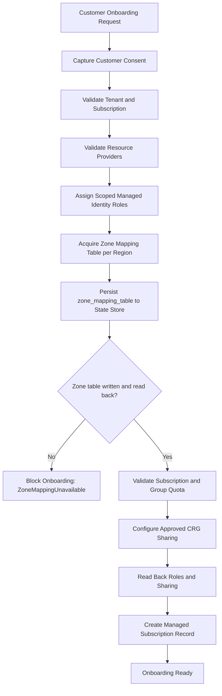
```mermaid
flowchart TD
    Start[Customer Onboarding Request] --> Consent[Capture Customer Consent]
    Consent --> Validate[Validate Tenant and Subscription]
    Validate --> Providers[Validate Resource Providers]
    Providers --> Identity[Assign Scoped Managed Identity Roles]
    Identity --> Zones[Acquire Zone Mapping Table per Region]
    Zones --> ZoneStore[Persist zone_mapping_table to State Store]
    ZoneStore --> ZoneVerify{Zone table written and read back?}
    ZoneVerify -- No --> ZoneFail[Block Onboarding: ZoneMappingUnavailable]
    ZoneVerify -- Yes --> Quota[Validate Subscription and Group Quota]
    Quota --> Sharing[Configure Approved CRG Sharing]
    Sharing --> Readback[Read Back Roles and Sharing]
    Readback --> Record[Create Managed Subscription Record]
    Record --> Ready[Onboarding Ready]
```

### Region selection

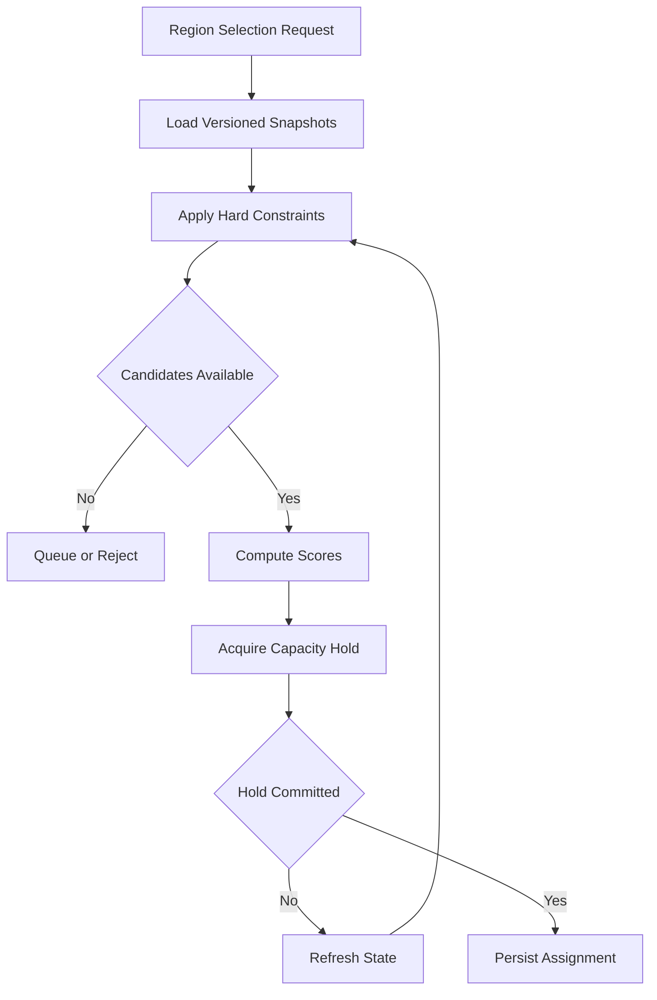
```mermaid
flowchart TD
    Request[Region Selection Request] --> Snapshots[Load Versioned Snapshots]
    Snapshots --> Constraints[Apply Hard Constraints]
    Constraints --> Candidates{Candidates Available}
    Candidates -- No --> Queue[Queue or Reject]
    Candidates -- Yes --> Scores[Compute Scores]
    Scores --> Hold[Acquire Capacity Hold]
    Hold --> Commit{Hold Committed}
    Commit -- No --> Refresh[Refresh State]
    Refresh --> Constraints
    Commit -- Yes --> Assignment[Persist Assignment]
```

### Capacity allocation

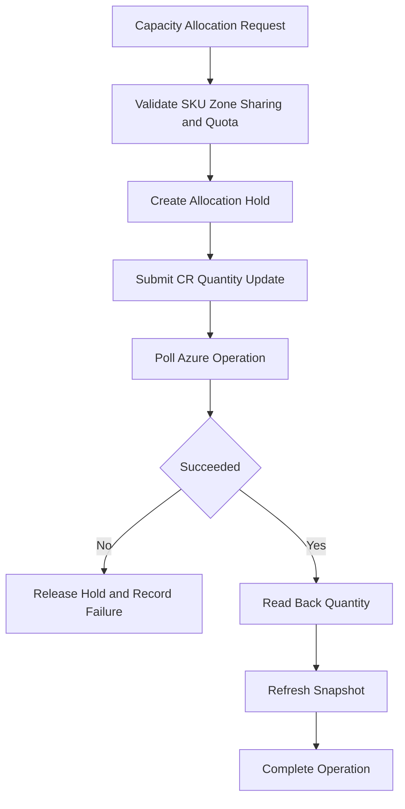
```mermaid
flowchart TD
    Request[Capacity Allocation Request] --> Precheck[Validate SKU Zone Sharing and Quota]
    Precheck --> Hold[Create Allocation Hold]
    Hold --> Submit[Submit CR Quantity Update]
    Submit --> Poll[Poll Azure Operation]
    Poll --> Success{Succeeded}
    Success -- No --> Compensate[Release Hold and Record Failure]
    Success -- Yes --> Confirm[Read Back Quantity]
    Confirm --> Snapshot[Refresh Snapshot]
    Snapshot --> Complete[Complete Operation]
```

### Quota allocation

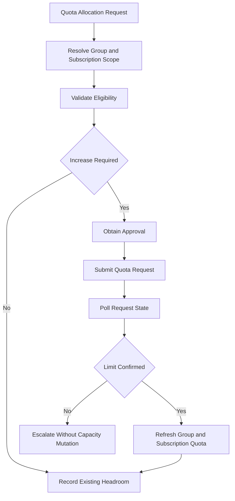
```mermaid
flowchart TD
    Request[Quota Allocation Request] --> Scope[Resolve Group and Subscription Scope]
    Scope --> Eligibility[Validate Eligibility]
    Eligibility --> Need{Increase Required}
    Need -- No --> Complete[Record Existing Headroom]
    Need -- Yes --> Approval[Obtain Approval]
    Approval --> Submit[Submit Quota Request]
    Submit --> Poll[Poll Request State]
    Poll --> Confirm{Limit Confirmed}
    Confirm -- No --> Escalate[Escalate Without Capacity Mutation]
    Confirm -- Yes --> Refresh[Refresh Group and Subscription Quota]
    Refresh --> Complete
```

### Capacity sharing

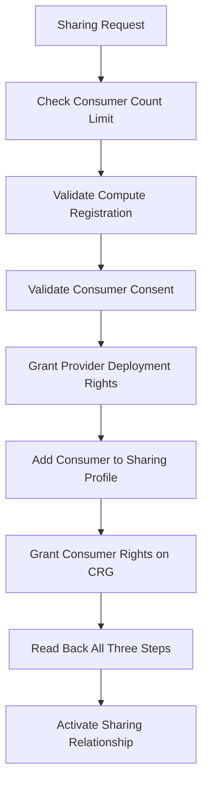
```mermaid
flowchart TD
    Request[Sharing Request] --> Limit[Check Consumer Count Limit]
    Limit --> Registration[Validate Compute Registration]
    Registration --> Consent[Validate Consumer Consent]
    Consent --> ProviderRole[Grant Provider Deployment Rights]
    ProviderRole --> Profile[Add Consumer to Sharing Profile]
    Profile --> ConsumerRole[Grant Consumer Rights on CRG]
    ConsumerRole --> Verify[Read Back All Three Steps]
    Verify --> Active[Activate Sharing Relationship]
```

### DR activation

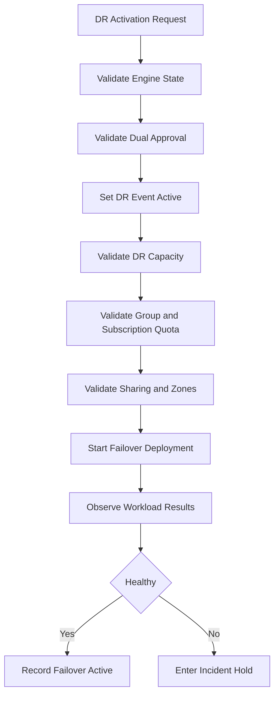
```mermaid
flowchart TD
    Request[DR Activation Request] --> State[Validate Engine State]
    State --> Approval[Validate Dual Approval]
    Approval --> Mode[Set DR Event Active]
    Mode --> Capacity[Validate DR Capacity]
    Capacity --> Quota[Validate Group and Subscription Quota]
    Quota --> Sharing[Validate Sharing and Zones]
    Sharing --> Deploy[Start Failover Deployment]
    Deploy --> Observe[Observe Workload Results]
    Observe --> Final{Healthy}
    Final -- Yes --> Active[Record Failover Active]
    Final -- No --> Hold[Enter Incident Hold]
```

### DR failback

```mermaid
flowchart TD
    Request[Failback Request] --> Primary[Validate Primary Readiness]
    Primary --> Approval[Obtain Failback Approval]
    Approval --> Mode[Set Failback Pending]
    Mode --> Restore[Restore Primary Workloads]
    Restore --> Validate[Validate Application and Data]
    Validate --> Healthy{Primary Healthy}
    Healthy -- No --> Return[Return to DR Event Active]
    Healthy -- Yes --> Drain[Drain DR Traffic]
    Drain --> Deallocate[Deallocate DR Workloads]
    Deallocate --> Reconcile[Reconcile Capacity and Quota]
    Reconcile --> Steady[Set Steady State]
```

### Quota reallocation

```mermaid
flowchart TD
    Start[Quota Reallocation Request] --> Incident[Validate Incident and Approval]
    Incident --> Impact[Calculate NonProd Impact]
    Impact --> Reduce[Reduce Approved NonProd Reservation]
    Reduce --> Poll[Poll Quota State]
    Poll --> Visible{Headroom Visible}
    Visible -- No --> Timeout[Stop and Escalate]
    Visible -- Yes --> Expand[Expand DR Reservation]
    Expand --> Confirm[Confirm DR Quantity]
    Confirm --> RestorePlan[Create NonProd Restoration Plan]
    RestorePlan --> Complete[Complete Reallocation]
```

### Capacity exhaustion handling

```mermaid
flowchart TD
    Detect[Capacity Exhaustion Detected] --> Freeze[Freeze Conflicting Holds]
    Freeze --> Refresh[Refresh Authoritative State]
    Refresh --> Alternatives[Evaluate Alternative Regions]
    Alternatives --> Found{Alternative Found}
    Found -- Yes --> Hold[Acquire Alternative Hold]
    Hold --> Place[Commit Placement]
    Found -- No --> Queue[Queue Placement]
    Queue --> Alert[Alert Capacity Operations]
    Alert --> Increase[Create Capacity Increase Request]
    Increase --> Reevaluate[Reevaluate After Confirmed Change]
```

### Capacity scaling

```mermaid
flowchart TD
    Metric[Capacity Threshold Crossed] --> Mode{Steady State}
    Mode -- No --> Suppress[Suppress Auto Scaling]
    Mode -- Yes --> Refresh[Refresh Capacity and Quota]
    Refresh --> Target[Calculate Target Quantity]
    Target --> Approval{Auto Approval Enabled}
    Approval -- No --> Pending[Wait for Operator Approval]
    Approval -- Yes --> Execute[Execute Increase]
    Pending --> Execute
    Execute --> Poll[Poll Azure State]
    Poll --> Confirm[Confirm Quantity and Headroom]
    Confirm --> Cooldown[Start Cooldown]
    Cooldown --> Complete[Complete Request]
```

## 44. Decision Log and Board Actions

| Decision | Disposition |
|---|---|
| Two quota groups per region | Retain as a pilot hypothesis; production approval depends on POC and dual subscription checks. [Undocumented — architectural judgement] |
| Shared NonProd and DR | Retain conditionally; customer acceptance and failure-domain review required. [Undocumented — architectural judgement] |
| Preview sharing dependency | Accept only for bounded pilot; separate production governance decision required. [Undocumented — architectural judgement] |
| Non-paired regional strategy | Retain only with explicit workload recovery analysis; do not market as equivalent to paired-region behavior. [Undocumented — architectural judgement] |
| DR sizing basis | Use configurable lean bootstrap and max-not-sum distributed sizing by default; retain SUM as a conservative override. [Derived] |
| Emergency headroom of 30% | Treat as scenario parameter; validate cost and RTO consequences. [Undocumented — architectural judgement] |
| Auto-increase | Approval-gated in Phase 1. [Undocumented — architectural judgement] |
| Tier 1 | Conditional automation after state and precondition gates. [Undocumented — architectural judgement] |
| Tier 2 | Disabled until quota assumptions pass. [Undocumented — architectural judgement] |
| Tier 3 | Blocked in Phase 1. [Undocumented — architectural judgement] |
| Placement weights | Use in shadow and recommendation mode; revise duplicated and unbounded terms. [Undocumented — architectural judgement] |
| ARG dependency | Inventory and diagnostics only. [Undocumented — architectural judgement] |
| Engine-enforced DR floor | Retain with independent detector and fail-closed behavior. [Undocumented — architectural judgement] |
| Credential model | Production blocker; approve scoped UAMI design or leave Tier 3 disabled. [Undocumented — architectural judgement] |
| Engine state machine | Production blocker; implement before DR automation. [Undocumented — architectural judgement] |

### Required board actions

1. Approve or reject preview use for a constrained pilot.
2. Approve the Phase 1 prohibition on Tier 3 and VMSS emergency automation.
3. Assign owners for G-14 and G-15.
4. Require executed POC evidence before quota-group engineering.
5. Require customer-specific recovery objectives for non-paired-region use.
6. Approve adaptive reconciliation with a configurable six-minute reference interval instead of a universal full scan.
7. Require a separate production authorization after pilot completion.

[Undocumented — architectural judgement]

## 45. Final Conclusion

ACRME has a substantial architecture foundation and strong requirements coverage, but it is not yet a production-safe autonomous DR control plane. [Undocumented — architectural judgement] The design’s most valuable elements are explicit sharing orchestration, desired-state reconciliation, zone-aware placement, provider-consumer quota separation, auditability, and the separation of steady-state from crisis operations. [Undocumented — architectural judgement]

Its principal weaknesses are equally clear:

- Preview sharing is a governance and behavioral dependency. [Assumed]
- The two-group quota model relies on unexecuted assumptions. [Derived]
- The engine-enforced DR floor is not a native reservation. [Derived]
- Lean bootstrap sizing, max-not-sum DR sizing, and 30% emergency headroom are policy choices/parameters, not demonstrated universal requirements. [Derived]
- Placement formulas require normalization and concurrency protection. [Derived]
- ARG cannot be an authoritative mutation source. [Undocumented — architectural judgement]
- The credential model and engine state machine are production blockers. [Undocumented — architectural judgement]
- Tier 3 is blocked, and VMSS Tier 3 is explicitly outside Phase 1. [Undocumented — architectural judgement]

The board should authorize only a conditional pilot for non-destructive, validated, operator-approved scenarios. [Undocumented — architectural judgement] Unrestricted DR automation must remain prohibited until the production gates close, the preview risk is formally accepted, the quota and CR behaviors are proven, the credential and engine-state blockers are resolved, and end-to-end failover and failback exercises demonstrate the intended recovery outcomes. [Undocumented — architectural judgement]

---

## Sources

The source research documents that this Production Readiness Review reconciles are published in this repository under [`docs/research/`](./research/):

1. [Multi-Region Placement Design](./research/multi_region_placement_design.md) — `docs/research/multi_region_placement_design.md`
2. [Design Change Summary](./research/design_change_summary.md) — `docs/research/design_change_summary.md`
3. [Requirements Traceability Review](./research/acrme_requirements_traceability_review.md) — `docs/research/acrme_requirements_traceability_review.md`
4. [Azure CR Management Engine Design](./research/azure_cr_management_engine_design.md) — `docs/research/azure_cr_management_engine_design.md`
5. [Azure CR POC Test Workbook](./research/azure_cr_poc_test_workbook.md) — `docs/research/azure_cr_poc_test_workbook.md`
