# ACRME — Technical Design Document (TDD)

| | |
|---|---|
| **Title** | Azure Capacity Reservation Management Engine (ACRME) — Technical Design Document |
| **Version** | 1.0 (net-new) |
| **Date** | 2 September 2026 |
| **Status** | Draft for review — supersedes the Production Readiness Review as the technical design of record |
| **Baseline** | Azure Capacity & Quota Management — Consolidated Requirements Baseline **v2.2** (27 Aug 2026) |
| **Owner** | Vishnuvardhan Reddy · Principal Cloud Architect |
| **Audience** | Engineering, SRE/platform operations, security, POC leads |
| **Companion** | Functional Design Document (`acrme_functional_design_document.md`) |
| **Decision records** | ADR-001 (region selection), ADR-002 (quota & capacity, single-pool), ADR-003 (capacity during DR), ADR-004 (forecast & increase), ADR-005 (distributed DR reference model) — all v2.2 |

> **Purpose.** This TDD describes **how** ACRME is built — components, runtime, topology, data, state, algorithms, interfaces, security, observability, NFRs, integration, and POC gating — traceable to Requirements Baseline v2.2 and to the companion FDD (which owns the *what*). This document is **self-contained**: all normative algorithms, formulas, schemas, enumerations, and constants are inlined, not referenced externally.

> **Reconciliation note (v2.2).** This TDD implements the confirmed v2.2 decisions: **single governed quota pool** as the primary technical model with logical earmarks for Prod/DR protection (QUA-004, ADR-002); **Switzerland North** as the EU cross-geo DR extension region (REG-002) — pre-configured but **conditional and currently inactive** for the Middle East, whose current legal position is `DR_NOT_OFFERED` pending DEC-001 (see §2.2 constraints); **max-not-sum** destination DR sizing with an authoritative `SourceDestinationDRIndex` (DR-016/017/018, ADR-005); **exact-production-region-first** validation with a governed `CustomerSeedRecord` (PLC-001..005, ADR-001); **five-state engine machine** and **standby activation waves** (DR-019, ADR-003).

---

## 1. Introduction

### 1.1 Scope
This document specifies the technical design of ACRME: the control engine that guarantees every managed Azure deployment has **both** reserved physical capacity and deployable VM-family quota — in the correct region/zone/SKU — before it proceeds, while minimising idle cost through lean distributed DR and continuous reconciliation. It covers component architecture, runtime and deployment, data and state, the placement/scoring/DR algorithms, the API surface, security, observability, non-functional behaviour, integration, and the POC dependencies that gate production reliance.

### 1.2 Relationship to the FDD
The FDD (`acrme_functional_design_document.md`) defines **what** ACRME does — capabilities, flows, states, and rules — traceable to Baseline v2.2. This TDD defines **how** those capabilities are realised. Where the FDD names a behaviour (e.g. "single governed pool", "max-not-sum DR", "readiness states"), this TDD gives the component, schema, algorithm, and interface that implements it. Section references to the FDD use the form *(FDD §4.x)*.

### 1.3 Decision records referenced
| ADR | Title | Key technical mandate used here |
|---|---|---|
| ADR-001 | Region selection & customer placement | Exact-region-first validation; seed record; staged placement pipeline; input modes |
| ADR-002 | Quota & capacity management | **Single governed pool (primary)**; logical earmarks; exception two-group topology |
| ADR-003 | Capacity management during DR | Five-state engine machine; three-tier emergency transfer; quota-neutral Tier 2 |
| ADR-004 | Forecast & increase of capacity/quota | Reservation floor vs forecast growth; auto-increase triggers; 10-step lifecycle |
| ADR-005 | Distributed DR reference model | `SourceDestinationDRIndex`; max-not-sum; overcommit ratio/gap; §12A worked model |

### 1.4 Evidence tags
Every non-trivial design assertion carries an evidence tag consistent with the requirements corpus: `[Documented]` (Microsoft Learn / Azure platform), `[Decided]` (approved ADR decision), `[Derived]` (logical consequence; POC where noted), `[Assumed]` (tunable policy default, not yet empirically validated).

---

## 2. Architecture Overview

### 2.1 Design principles (baseline §20)
1. **Readiness is capacity ∧ quota ∧ freshness.** No deployment is "ready" on a reservation alone; deployable consumer quota and non-stale state are equally required (RDY-003, NFR-002). `[Decided]`
2. **Continuous reconciliation of desired vs actual.** A reservation floor (`Allocated + Buffer`, CAP-003) is enforced every cycle; forecast growth is a separate proactive path (ADR-004). `[Decided]`
3. **Lean, distributed, reciprocal DR.** No dedicated DR regions; each region hosts Prod + CVAL + DR standby for other regions; standby is sized max-not-sum and shared across mutually exclusive failures (DR-016/017, ADR-005). `[Decided]`
4. **Single governed quota pool.** Collect all eligible per-region quota into one pool per region/quota family and allocate on demand; protect Prod/DR by logical earmark, minimising quota-increase requests to Microsoft (QUA-004, ADR-002). `[Decided]`
5. **Config-as-code, deterministic, replayable.** All policy (weights, buffers, thresholds, catalogue) is versioned; every decision records inputs, policy version, and snapshot ref for deterministic replay. `[Decided]`
6. **Fail-safe and idempotent.** Stale state blocks placement; all mutations are idempotent with operation handles and optimistic concurrency (NFR-002/007). `[Decided]`

### 2.2 Constraints (baseline §21)
- **Middle East DR is `DR_NOT_OFFERED` (current legal position, DEC-001 pending).** The Middle East programme is legal-owned and serves government/medical customers under data-residency/sovereignty laws; cross-border DR cannot meet residency requirements, so **no DR is offered there today** (baseline §2, §6, DR-014, DEC-001). Middle East **production** may still be placed and governed; the placement/DR engine emits `dr_region = NOT_OFFERED` for those geographies and creates **no** `SourceDestinationDRIndex` entry, **no** DR earmark, and **no** cross-geo activation. The Switzerland North cross-geo path (REG-002/HC-10) is **pre-configured but inactive** for the Middle East; it activates **only** if Legal clears DEC-001, via a config flip (`dr_not_offered["Middle East"] = false`) with **no code change**. `DR_NOT_OFFERED` is evaluated **before** any cross-geo extension. `[Documented]`
- **Azure Quota Group / `groupQuotas` maturity** gates single-pool enforcement (DEP-001); the two-group topology is the sanctioned fallback. `[Documented]`
- **No native intra-pool sub-reservation** in Azure quota groups — the DR earmark and Prod floor are engine-enforced arithmetic, not platform primitives (Scenario 9). `[Documented]`
- **ARM throttling budgets** bound reconciliation cadence and estate size (Compute RP: 250 reads / 5 min, 1,200 writes / hour per subscription). `[Documented]`
- **Phase 1 guardrails:** destructive VM-association transfers (Tier 3) are blocked; auto-decrease is operator-gated; forecast is advisory. `[Decided]`
- **Consumer-quota-under-shared-reservation (POC-001)** is the top unknown; readiness must validate consumer quota until proven. `[Assumed]`

---

## 3. Logical Component Architecture (§23)

ACRME is a set of cooperating services around a versioned state store and a policy (config-as-code) service. Components are deployable as modules of a single control application; boundaries are drawn for testability and independent scaling.

| Component | Responsibility | Key requirements |
|---|---|---|
| **Inventory Collector** | Polls Azure (CRGs, reservations, quota/groupQuotas, usage, associations, zones) into freshness-stamped snapshots. | DAT-001..004, CAP-001/002, NFR-002 |
| **State Reconciler** | Every cycle compares desired vs actual; enforces `Allocated + Buffer` floor; guarded scale-down; never deletes. | CAP-003/004/009/010, OPS-002 |
| **Placement & Scoring Engine** | Validates exact region (or derives on exception); computes `PS_Prod/PS_NonProd/PS_DR`; writes seed record. | PLC-001..010, REG-001..003 |
| **Quota-Pool Manager** | Maintains the single governed pool; computes earmarks; allocates on demand; enforces Prod floor & DR earmark; exception two-group mode. | QUA-001..014, ADR-002 |
| **DR Orchestrator** | Maintains `SourceDestinationDRIndex`; sizes max-not-sum; runs standby activation waves & staged acquisition; failback. | DR-001..019, ADR-005 |
| **Readiness API** | Combined capacity+quota+freshness verdict as a machine-readable state to AEP. | RDY-001..004, INT-001..007 |
| **State Store** | Versioned, optimistic-concurrency document store for entities, snapshots, operation/audit records. | DAT-001..006, NFR-007 |
| **Config / Scope-File Service** | Versioned `PlacementPolicy`, region catalogue, scope files; decision-traceable. | GOV-003, DAT-005, REG-001 |
| **Forecast & Increase Service** | Advisory `Forecast_Quantity`; auto-increase triggers; operator-gated capacity/quota increase. | CAP-005, ADR-004 |
| **Emergency Transfer Service** | Tier 1/2/3 escalation during `DR_EVENT_ACTIVE`; quota-neutral Tier 2; Tier 3 blocked in Phase 1. | ADR-003, §13 baseline |
| **Observability Emitter** | Metrics, alerts, dashboards incl. per-destination max-source coverage & source↔destination map. | OBS-001..005 |
| **Governance & Audit** | RBAC, managed identity, approval gates, break-glass, immutable audit with before/after + correlation IDs. | GOV-001..009 |

### T1 — Logical component architecture

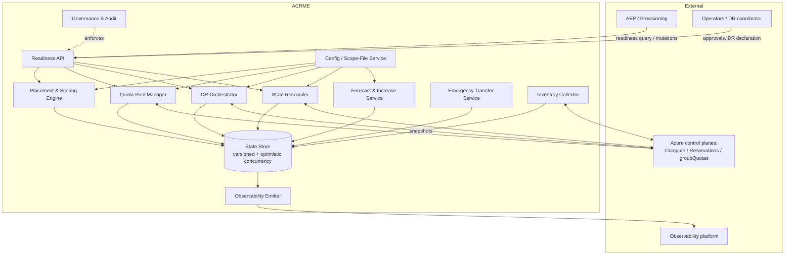

---

## 4. Runtime & Deployment (§23, CAP-006, PLC-009)

### 4.1 Execution model
- **Reconciliation job (container app):** a long-running scheduler executes the reconciliation loop on a **6-minute target interval (configurable, CAP-006)**; targeted/critical reconciles run out-of-band. It drives the Inventory Collector → State Reconciler → Quota-Pool Manager cycle and emits snapshots. `[Decided]`
- **Placement flow (function/event path, PLC-009):** onboarding and AEP readiness requests are handled synchronously against the latest snapshot; on stale state the request triggers a synchronous refresh or returns `STALE_STATE`. `[Decided]`
- **DR path:** DR declaration flips `engine_mode` to `DR_EVENT_ACTIVE`; the DR Orchestrator drives priority-wave activation out of the steady-state cadence. `[Decided]`

### 4.2 Cadence, SLOs and drift (§38, NFR)
```text
Reconciliation loop target        = 6 min (configurable; production interval TBD)   [Assumed]
Critical targeted reconcile  P95  < 2 min                                           [Assumed]
Stable-resource state age    P95  < 15 min                                          [Assumed]
Drift detection                   ≤ 2 reconciliation cycles                         [Assumed]
Snapshot max age (staleness gate) = max_snapshot_age_seconds (config, RDY-004)      [Decided]
```

### 4.3 API surface (summary; detail in §11)
A readiness/placement API (query + idempotent mutations), an operations/approval API (increase approval, DR declaration, override, sharing activation), and a read-only audit/observability API. All mutating operations are idempotent and versioned (INT-004..006). `[Decided]`

### T2 — Management group / subscription topology

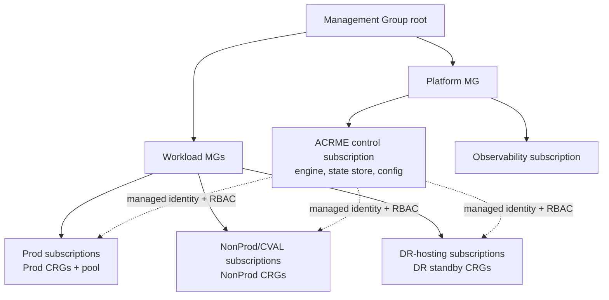

---

## 5. Topology — Subscriptions, CRGs and Quota Groups (§24, §25, §26)

### 5.1 Management group / subscription model (§24)
ACRME runs from a platform control subscription with cross-subscription managed-identity access (least-privilege RBAC) to the Prod, NonProd/CVAL, and DR-hosting subscriptions (see T2). All mutations are attributed to the control identity and audited (GOV-002). `[Decided]`

### 5.2 CRG hierarchy and cross-subscription sharing (§25, FC-06)
- **Three-CRG model per region:** exactly one Prod, one NonProd/CVAL, and one DR-standby CRG target per region per scope (CAP-001). `[Decided]`
- **Zone alignment (FC-06):** cross-subscription CRG sharing requires a validated `ZoneMappingRecord` — logical zones differ across subscriptions, so sharing is only valid when physical zones align (CAP-014..019). `[Decided]`
- **Sharing limits:** provider→consumer sharing validated for SKU/region/zone/authorisation; a per-provider consumer ceiling applies. `[Decided]`

### T3 — CRG hierarchy & cross-subscription sharing (zone alignment)

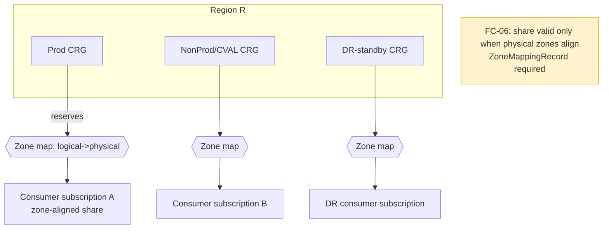

### 5.3 Quota-group architecture — single-pool decision (§26, QUA-004)
**Primary model:** one governed quota group per region and quota family, covering Prod + NonProd/CVAL + DR together. All eligible default per-region quota is collected into the pool (QUA-003) and allocated on demand. Prod and DR are protected inside the shared pool by **logical earmarks** enforced by the Quota-Pool Manager at allocation/reclamation time — not by physical group separation. Because all three environments share one pool, an emergency DR draw needs **no cross-group transfer**. `[Decided]`

**Exception topology:** two (or more) groups per region, used **only** when Azure Quota Group limits or a mandatory Prod-isolation governance boundary make one pool impossible; each case is recorded in the Decision Log and reverts to one pool when the constraint lifts (DEP-001). `[Decided]`

The pool arithmetic (`Pool_Limit`, `Prod_Reserved_Floor`, `DR_Earmark_vCPU`, `Allocatable_NonProd`, `Pool_Headroom`) is specified in §8.3. See T4.

### T4 — Quota-group / pool architecture (single-pool model)

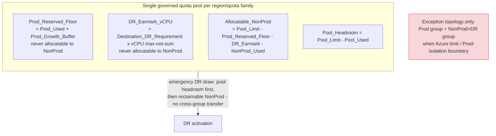

---

## 6. Data Architecture (§34, DAT-001..006)

### 6.1 Store characteristics
A versioned document store with per-document optimistic concurrency (`policy_version` / `_etag`-style guards), freshness metadata on every snapshot, and append-only operation/audit records (DAT-001..006, NFR-007). Every decision-driving read carries a `capacity_snapshot_ref` for deterministic replay. `[Decided]`

### 6.2 Core entities
The three v2.2-critical entities are **`CustomerSeedRecord`**, **`SourceDestinationDRIndex`**, and **`CVALEarmarkRecord`**, alongside reservation/quota snapshots, `PlacementPolicy`, and operation/audit records.

```text
CustomerSeedRecord {                       # PLC-003/004/005 — first-placement authority
    customer_realm_id     : string (PK)
    geography             : string (PK)
    production_region     : string
    cval_region           : string
    dr_region             : string | "NOT_OFFERED"
    products_covered      : list<string>
    decision_timestamp    : datetime
    policy_version        : string
    capacity_snapshot_ref : string
    exception_ref         : string | null
    approval_metadata     : ApprovalRecord
    input_mode            : "SPECIFIC_REGION" | "GEOGRAPHY_EXCEPTION"
}

SourceDestinationDRIndex {                 # DR-018 — reverse-of-seed, drives activation
    source_region        : string (PK)
    destination_region   : string (PK)
    customer_realm_id     : string (PK)
    standby_instance_set : list<InstanceRef>
    sku_family           : string
    quantity_vcpu        : int
    activation_state     : STANDBY | ACTIVATING | ACTIVE | FAILBACK_PENDING
    last_updated         : datetime
    policy_version       : string
}

CVALEarmarkRecord {                        # PLC-010 — prevents DR/CVAL double-count
    customer_realm_id    : string (PK)
    region               : string (PK)
    cval_capacity_vcpu   : int
    dr_earmarked_vcpu    : int             # portion counted toward DR, not live CVAL headroom
    co_located           : bool
    last_updated         : datetime
}
```

Supporting entities: `RegionalSnapshot` (freshness-stamped capacity/quota/usage/zone data), `PlacementPolicy` (weights, buffers, thresholds, catalogue — versioned), `ReservationState`/`QuotaPoolState`, `OperationRecord` (saga + compensation), `AuditEvent` (append-only), `ActivationRecord` (DR-019, §9.3), `ZoneMappingRecord` (FC-06), `SharingRelationship`, `DRDistributionPlan`.

### T5 — Data model / ERD (incl. seed record, SourceDestinationDRIndex, CVAL earmark)

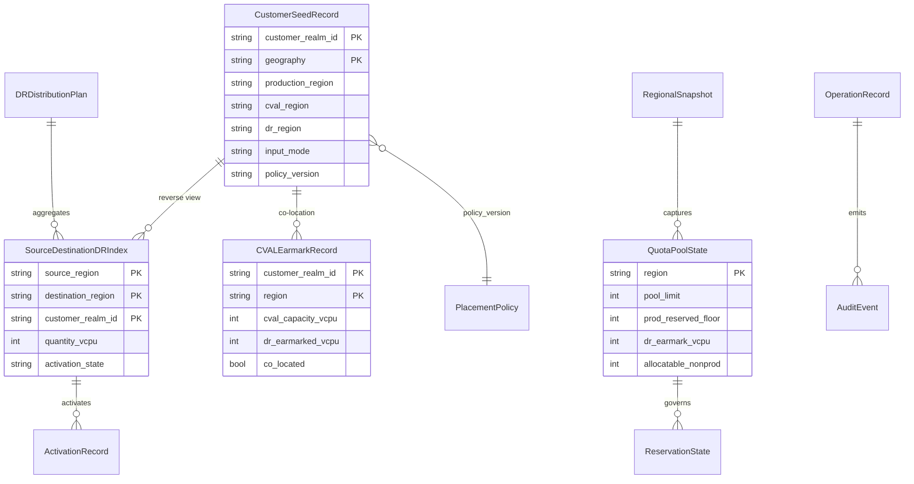

### 6.3 Freshness & versioning
Every snapshot carries `collected_at`; the readiness gate compares `now() - collected_at` against `max_snapshot_age` (RDY-004). Policy and scope files are versioned and decision-traceable; the version that drove any decision is persisted with it (DAT-005, GOV-003). `[Decided]`

---

## 7. State Model & Concurrency (§29, NFR-002/007)

### 7.1 Engine mode machine (five states)
```text
STEADY_STATE → DR_DECLARATION_PENDING → DR_EVENT_ACTIVE → FAILBACK_PENDING → STEADY_STATE
                                                     ↘ INCIDENT_HOLD (safe degraded)
```
Steady-state reconciliation and auto-increase run **only** in `STEADY_STATE`; emergency transfer is callable **only** in `DR_EVENT_ACTIVE`. Entering `DR_EVENT_ACTIVE` does not auto-authorise service-impacting CVAL action — each action retains its own policy gate. `INCIDENT_HOLD` is the safe degraded state entered when inputs cannot be trusted. `[Decided]`

### 7.2 Concurrency & reservation-of-intent
- **Optimistic concurrency:** every mutating operation reads an expected version and fails the write on mismatch, forcing a re-read (NFR-007). `[Decided]`
- **Reservation-of-intent:** placement writes an atomic hold before the seed record so two concurrent onboardings cannot double-commit the same capacity (NFR-002). `[Decided]`
- **Saga + compensation:** multi-step mutations use `OperationRecord` with a compensation chain for rollback; `VM_ImpactRecord` is immutable for any VM state change. `[Decided]`

### T6 — Five-state engine machine

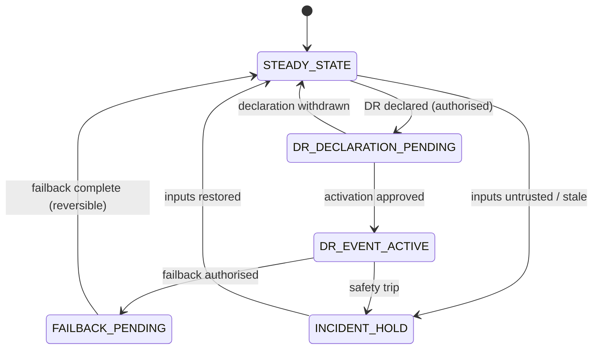

---

## 8. Placement Scoring & Forecasting (§28)

### 8.1 Input modes and pipeline
The default input is an **exact production region** which ACRME **validates** (it does not derive). A **geography** input is an **exception path** requiring approval + customer acknowledgement, after which the derived region becomes the fixed seed (ADR-001, PLC-001/002). Restricted regions never enter scoring — they route to the exception workflow.

### T7 — Staged placement pipeline

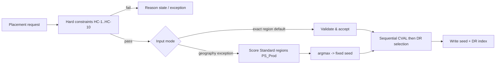

### T8 — Prod region input modes (exact vs geography exception)

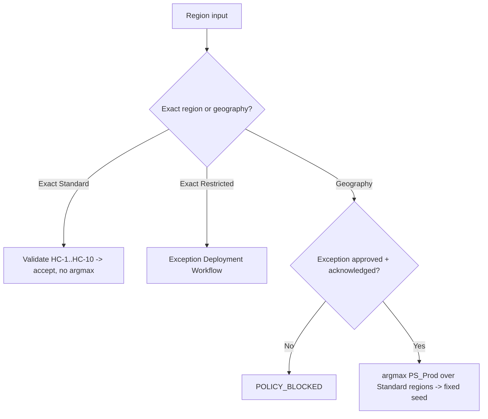

### 8.2 Scoring formulas (weights α=0.30/β=0.20/γ=0.25/δ=0.15/ε=0.10)
All five weights are tunable `PlacementPolicy` constants summing to 1.0; every component is clamped `Clamp(x)=max(0,min(1,x))` before weighting. `[Assumed]`

```text
PS_Prod(r)    = 0.30·Clamp(nonprod.effective_free / prod.quantity)
              + 0.20·Clamp(prod.quota_headroom / prod.quota_limit)
              + 0.25·Clamp(1 - prod_customer_count / total_customers)
              + 0.15·Clamp(dr.coverage_ratio)
              + 0.10·Clamp(az_count / 3)

PS_NonProd(r) = 0.30·Clamp(nonprod.effective_free / nonprod.quantity)
              + 0.20·Clamp(nonprod.quota_headroom / nonprod.quota_limit)
              + 0.25·Clamp(1 - nonprod_customer_count / total_customers)
              + 0.15·Clamp(nonprod.effective_free / nonprod.quantity)
              + 0.10·Clamp(az_count / 3)

PS_DR(r)      = 0.30·Clamp(dr.free_slots / dr.quantity)
              + 0.20·Clamp(dr.quota_headroom / dr.quota_limit)
              + 0.25·Clamp(1 - dr_customer_count / total_customers)
              + 0.15·min(1.0, dr.coverage_ratio / dr_ratio_target)
              + 0.10·Clamp(az_count / 3)
```

`PS_Prod` is dual-purpose (derive on exception; validate/audit otherwise). Every candidate score + policy version + snapshot ref is written to the `OperationRecord` for deterministic replay. A reviewer-recommended pilot `PS_NonProd` variant (removing the α/δ duplication) is recorded in the Calculation Logic Reference; the formula above is the approved design-of-record. Scoring runs in shadow/recommendation mode until empirically validated. `[Decided]`

### 8.3 Quota-pool arithmetic (single-pool, §26/QUA-004)
```text
Pool_Limit(region) = Prod_CRG_qty·vCPU·(1+prod_growth_buffer)
                   + NonProd_CRG_qty·vCPU·(1+nonprod_growth_buffer)
                   + DR_Earmark_vCPU(region)
                   + emergency_transfer_headroom_vcpu

Prod_Reserved_Floor  = Prod_Used_vCPU + Prod_Growth_Buffer_vCPU        # never allocatable to NonProd
DR_Earmark_vCPU      = Destination_DR_Requirement(region)·vCPU         # max-not-sum, never allocatable
Allocatable_NonProd  = Pool_Limit - Prod_Reserved_Floor - DR_Earmark_vCPU - NonProd_Used_vCPU
Pool_Headroom        = Pool_Limit - Pool_Used
Emergency_DR_Available= Pool_Headroom + reclaimable_NonProd_above_committed
```
NonProd allocation fail-safes when `Allocatable_NonProd` reaches zero. A dual-validation detector recomputes the DR earmark from authoritative assignment data; disagreement disables automatic NonProd expansion until reconciled (Scenario 9). `[Decided]`

### 8.4 Forecasting vs reconciliation floor
```text
Target Reserved Capacity = Allocated VM Count + Configured Buffer          # CAP-003 continuous floor
Forecast_Quantity        = ceil(Forecast_Peak·(1+Growth_Buffer) + DR_Buffer)  # ADR-004 proactive growth
```
The reconciliation floor is enforced every cycle; the forecast is advisory (horizon ∈ {30,60,90} days) and raises `ForecastApproachingQuotaLimit` with 14-day lead time at 80% of quota limit. Auto-increase target = max(floor, forecast). `[Decided]`

---

## 9. DR Sizing & Activation Algorithms (§31, App. A.6/A.7/A.8, App. D)

### 9.1 Max-not-sum sizing (DR-017, ADR-005)
```text
Destination_DR_Requirement(d) = MAX over each non-concurrent source s protected by d
                                    ( Workload_Portion(s -> d) )
DR_Capacity_Gap(d)            = max(0, Destination_DR_Requirement(d) - Usable_Destination_Capacity(d))
Overcommit_Ratio(d)          = SUM(Workload_Portion(s->d)) / MAX(Workload_Portion(s->d))
```
Single-failure assumption (DR-001): one production region fails at a time, so destination `d` needs standby for its **largest** protected source only; standby is shared/overcommitted across mutually exclusive events. `Usable_Destination_Capacity(d)` may include approved bootstrap headroom, available CRG reservations, releasable CVAL (after earmark check), and approved sharing/expansion. A per-scope **SUM override (C-11)** covers contractual simultaneous-failure protection with no code change. `[Decided]`

> **`DR_NOT_OFFERED` geographies are excluded from this sizing (DR-014, DEC-001).** Sources in a geography flagged `DR_NOT_OFFERED` — the Middle East today — contribute **no** `Workload_Portion(s → d)` term, produce **no** `SourceDestinationDRIndex` entry, and reserve **no** `DR_Earmark_vCPU` at any destination. Their production is still sized and governed, but they carry no DR requirement, so they never enter `Destination_DR_Requirement`, `DR_Capacity_Gap`, or `Overcommit_Ratio`. Should Legal clear DEC-001 (config flip `dr_not_offered["Middle East"] = false`, no code change), the affected sources begin contributing their max-not-sum term at that point. `[Documented]`

### T12 — Max-not-sum sizing (overcommit ratio)

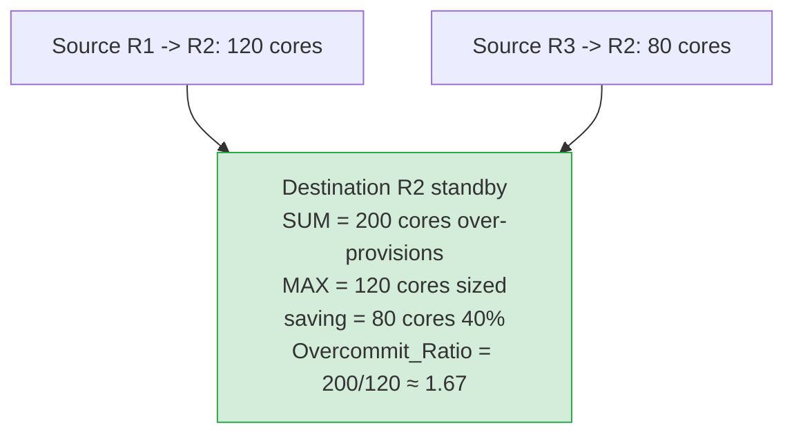

### 9.2 Standby activation waves & staged acquisition (DR-006, DR-019)
On authorised declaration the DR Orchestrator reads the `SourceDestinationDRIndex` for the failed source and activates customers in business-priority waves (P0 platform → P-1 highest → P-N), transitioning each `associated → allocated`. Per wave, staged acquisition runs in order:
```text
Stage 1: approved bootstrap / pre-staged headroom (zero Azure wait)
Stage 2: available reservation + quota already in destination
Stage 3: shut down / disassociate eligible CVAL (after DR-010 authorised trigger)
Stage 4: share/reassign reservations within supported region/zone boundaries
Stage 5: allocate pooled quota to DR subscriptions
Stage 6: request additional Azure quota/capacity where required
Stage 7: report unrecoverable capacity gaps
```
Stages 1–2 start immediately from the single pool's headroom, so P0/P-1 recovery does not wait on throttled Azure deallocation APIs. `[Decided]`

### 9.3 Activation state tracking & failback (DR-013)
```text
ActivationRecord {
    customer_realm_id, source_region, destination_region,
    priority_wave : int,
    activation_state : PENDING | ACTIVATING | ACTIVE | FAILED | FAILBACK_PENDING,
    stage_reached : int (1..7), capacity_gap_vcpu : int,
    activated_at, approved_by, incident_id
}
```
Failback reverses `ACTIVE → FAILBACK_PENDING → STANDBY` in reverse priority order; seed record and DR index are preserved (no re-derivation). `[Decided]`

### T11 — DR standby activation sequence (index lookup → waves → staged acquisition)

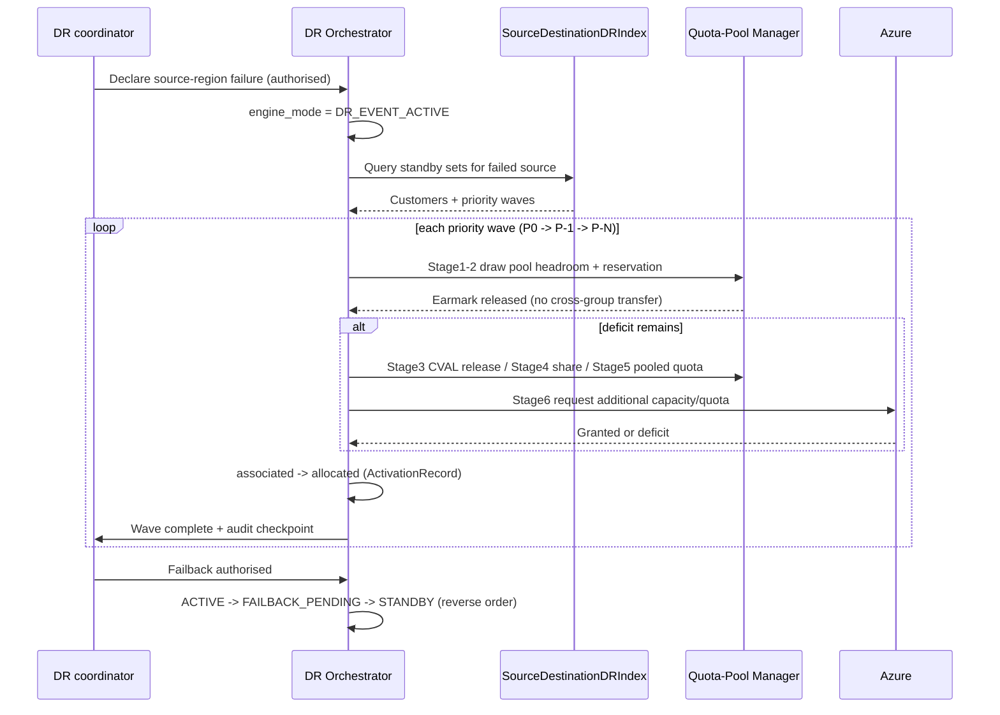

### 9.4 Tier escalation (§32) — see §13 baseline
Emergency capacity during `DR_EVENT_ACTIVE` escalates Tier 1 (direct expansion) → Tier 2 (quota-neutral transfer within the shared pool) → Tier 3 (destructive, dual-approval, **blocked in Phase 1**). In the single-pool model Tier 2 is intrinsically quota-neutral (draw and release hit the same pool). `[Decided]`

### T10 — Three-tier emergency transfer escalation

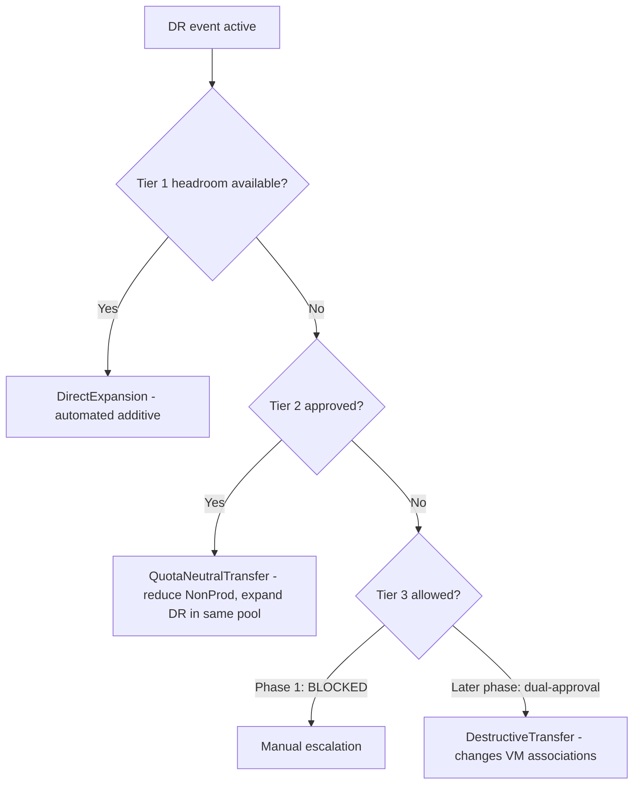

### T13 — Distributed DR reference model (§12A)
Reused reference diagram (ADR-005 §12A): `adr/diagrams/acrme_three_region_capacity_model.png` — each region concurrently hosts Prod + CVAL + DR standby tagged with its `src Rn` source; each destination is sized by max-not-sum against its largest single protected source.

---

## 10. Steady-State Capacity Lifecycle (§30)

The normative 10-step sequence runs only in `STEADY_STATE`:
```text
1. Detect threshold crossing (utilisation ≥ auto-increase threshold).
2. Re-read current CR, quota, sharing, assignment state.
3. Create CapacityIncreaseRequest.
4. Calculate target = max(Allocated+Buffer floor, Forecast_Quantity).
5. Require operator approval (Phase 1).
6. Submit quota action only if validated as required.
7. Wait for confirmed quota state — no assumed propagation SLA.
8. Update CR quantity.
9. Confirm actual quantity.
10. Refresh snapshot and close the request.
```
Triggers: `dr_autoincrease_threshold=0.35`, `prod/nonprod_autoincrease_threshold=0.20`, debounce cooldown 30 min per (region+CRG type). Guarded scale-down never drops below `Allocated`, within a DR window, during maintenance exclusion, or against cost policy; reductions go to zero, never deletion (CAP-009/010). `[Decided]`

### T9 — Steady-state 10-step capacity lifecycle

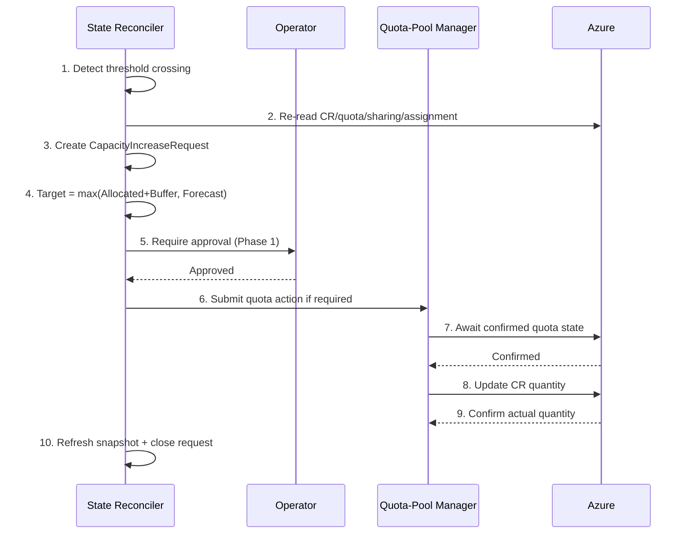

---

## 11. API Architecture (§35, INT-001..007)

### 11.1 Contracts
```text
POST /readiness            → DeploymentReadinessResult   (query; idempotent)
  in : { customer_realm_id, region (exact), sku_family, environment, product, intended_demand }
  out: { readiness_state, reasons[], operation_handle, snapshot_ref, policy_version }

POST /placement            → PlacementResult             (idempotent; writes seed + DR index)
POST /capacity/increase    → OperationRecord             (operator-gated; idempotent)
POST /dr/declare           → OperationRecord             (authorised; flips engine_mode)
POST /dr/activate-wave     → ActivationRecord[]          (per priority wave)
POST /quota/allocate       → OperationRecord             (single-pool allocation)
POST /sharing/activate     → OperationRecord             (zone-aligned share)
GET  /audit, GET /state    → read-only
```

### 11.2 Idempotency, versioning, error/readiness codes
- Every mutating call carries an **idempotency key** and an **expected-state version**; retried calls return the original result, mismatched versions return a concurrency error (INT-004..006, NFR-007). `[Decided]`
- Readiness states are the machine-readable contract to AEP:
```text
READY | READY_WITH_RISK | QUOTA_DEFICIT | RESERVATION_DEFICIT |
CAPACITY_UNAVAILABLE | STALE_STATE | POLICY_BLOCKED | VALIDATION_REQUIRED
```
- AEP **polls** operation handles rather than assuming synchronous completion, and never treats provider quota as proof of consumer deployability (INT-007, POC-001). `[Assumed]`

### 11.3 Readiness gate logic (RDY-001)
```text
READY requires ALL of:
 1. target_region ∈ approved_region_catalogue                 (REG-001)
 2. az_count ≥ 1 in target_region                             (CAP-011)
 3. sku ∈ supported_skus(target_region)
 4. reservation_policy known for (subscription, region, zone, sku)
 5. reservation exists (if required by policy)
 6. reserved_quantity ≥ requested_count OR approved_over_allocation active
 7. consumer_subscription_quota ≥ requested_units             (QUA-013 — POC-gated)
 8. snapshot_age ≤ max_snapshot_age_seconds                   (RDY-004)
 9. no blocking policy exception or hard-constraint violation
Quota_Deficit = max(0, Requested_Deployment_Units - Available_Quota)
Available_Quota = Assigned_Regional_VM_Family_Quota - Current_Regional_VM_Family_Usage
```

---

## 12. Security (§36, GOV-001..009)

- **RBAC & managed identity:** the control identity holds least-privilege, scoped roles per target subscription; no standing user credentials for mutations (GOV-001/002). `[Decided]`
- **Approval gates:** capacity/quota increase, DR declaration, CVAL release, Tier 2 transfer, seed change, and overrides are policy-gated with recorded approver identity (GOV-005..007). `[Decided]`
- **Break-glass:** an audited emergency-elevation path with dual control and time-boxed elevated RBAC; every break-glass action is immutably logged (GOV-008). `[Decided]`
- **Secrets:** managed identity + platform secret store; no secrets in config or code. `[Decided]`
- **Audit:** append-only `AuditEvent` for every decision and mutation with before/after values and correlation IDs (GOV-004/009, DAT-005). `[Decided]`

---

## 13. Observability Implementation (§37, OBS-001..005)

| Signal | Metric / alert | Requirement |
|---|---|---|
| Buffer deficit | `reservation_buffer_deficit` gauge; alert when reserved < `Allocated+Buffer` | OBS-001, CAP-003 |
| **Per-destination DR coverage** | `dr_max_source_coverage(d)`; alert when usable < `Destination_DR_Requirement(d)` (the MAX, not the SUM) | OBS-002, DR-017 |
| DR capacity gap | `dr_capacity_gap(d)` gauge | OBS-002 |
| **Source↔destination mapping** | dashboard of the `SourceDestinationDRIndex` | OBS-004 |
| Overcommit ratio | `overcommit_ratio(d)`; alert above safety ceiling | FIN-006..008, POC-011 |
| Activation state | per-wave `ActivationRecord` progress | OBS-003, DR-019 |
| Idle cost | idle reservation cost surfaced | OBS-005, FIN-001/002 |
| Staleness | `snapshot_age`; alert/refresh on breach | RDY-004, NFR-002 |
| Forecast lead-time | `ForecastApproachingQuotaLimit` (14-day lead at 80%) | OBS-001, ADR-004 |

All metrics carry region/environment/scope dimensions and policy version for replay. `[Decided]`

---

## 14. NFRs & Resilience (§38, NFR-001..010)

- **Throttling resilience:** adaptive throttle manager initialises with ARM baselines (250 reads/5 min, 1,200 writes/hour per subscription) and adapts to observed `429/Retry-After`; reconciliation cadence and estate size are bounded accordingly (§14 calc). `[Documented]`
- **Estate sizing:** `CRG_total = R·Eclass·Z·SKUset·IsolationFactor`; `Requests_per_cycle` summed across read classes / 300 s cycle to stay within budget. `[Derived]`
- **Degraded mode:** on untrusted/stale inputs the engine enters `INCIDENT_HOLD` / returns `STALE_STATE` and fails safe rather than driving placement from stale data (NFR-002). `[Decided]`
- **Simulation / dry-run:** placement, reconciliation, and **DR failover** can run in dry-run/simulation, producing the would-be decisions and readiness states without mutating Azure (NFR-006). `[Decided]`
- **Idempotency & concurrency:** all mutations idempotent + optimistic concurrency (NFR-007). Determinism/replay from `OperationRecord`. `[Decided]`

---

## 15. Integration (§33, §6 review)

- **AKS / VMSS:** reservations back node pools / scale sets; ACRME readiness gates their capacity before scale-out; associations are tracked for reconciliation. `[Decided]`
- **AEP:** the sole provisioning consumer of readiness; interacts only through the idempotent readiness/placement contract (§11) and polls operation handles. `[Decided]`
- **Azure control planes:** Compute (CRGs/reservations), Reservations, and **groupQuotas** (single-pool). Single-pool enforcement depends on `groupQuotas` / `groupType` maturity (DEP-001). `[Documented]`

---

## 16. POC & Validation Dependencies (§42)

| POC | Question | Gates | Status |
|---|---|---|---|
| **POC-001** | Does provider quota under a shared reservation guarantee consumer deployability? | Readiness gate step 7; INT-007 | **Top unknown** |
| POC-006 | Distributed DR topology behaves as modelled | ADR-005 §12A; DR-016 | Required |
| POC-007 | Lean bootstrap sizing is sufficient to initiate recovery | DR-007 bootstrap targets | Required |
| **POC-011** | max-not-sum overcommit is safe at platform scale | DR-017 sizing; overcommit safety ceiling; FIN-006..008 | Required before production dependency |
| POC-005 | VM state semantics (associated/allocated/deallocated) | DR-019 activation staging | Dependency |
| POC-031/032 | Tier 2 quota-neutral transfer within a group/pool | §13 baseline Tier 2 | Required |

Production reliance on max-not-sum DR sizing and single-pool consumer-quota behaviour is **gated** on POC-011 and POC-001 respectively; until then, readiness validates consumer quota explicitly and DR sizing carries the SUM-override safety option. `[Decided]`

---

## 17. Traceability — Requirement/Deviation → Component/Algorithm/Entity

| Requirement group (v2.2 IDs) | Component(s) | Algorithm / formula | Entity / diagram |
|---|---|---|---|
| REG-001..003 | Config/Scope-File, Placement Engine | catalogue validation; input modes | `PlacementPolicy`; T8 |
| ENV-001..007 | Placement Engine, DR Orchestrator | env separation; role flip | `CustomerSeedRecord`; T7 |
| CAP-001..019 | Inventory Collector, State Reconciler | `Allocated+Buffer` floor; zero-not-delete; over-alloc | `ReservationState`; T9, F5 |
| QUA-001..014 | Quota-Pool Manager | §8.3 pool arithmetic; earmarks; quota-as-governor | `QuotaPoolState`; T4 |
| RDY-001..004 | Readiness API | §11.3 gate logic; staleness; quota deficit | readiness states; T6 |
| PLC-001..010 | Placement & Scoring Engine | `PS_Prod/NonProd/DR`; seed reuse; co-location guard | `CustomerSeedRecord`, `CVALEarmarkRecord`; T7, T8 |
| DR-001..019 | DR Orchestrator, Emergency Transfer | max-not-sum; gap; overcommit; activation waves; staged acquisition; tiers | `SourceDestinationDRIndex`, `ActivationRecord`; T11, T12, T13, T10 |
| FIN-001..008 | Observability Emitter, Forecast Service | idle cost; overcommit ratio; cost-before-expansion | metrics; T12 |
| INT-001..007 | Readiness API | idempotency keys; expected-version; polling | `OperationRecord`; T1 |
| DAT-001..006 | State Store, Config Service | freshness metadata; versioning; audit | all entities; T5 |
| OBS-001..005 | Observability Emitter | max-source coverage; source↔dest map; activation progress | dashboards; §13 |
| GOV-001..009 | Governance & Audit | RBAC; approval gates; break-glass; immutable audit | `AuditEvent`; §12 |
| NFR-001..010 | (cross-cutting) | throttle resilience; degraded mode; idempotency; simulation | `OperationRecord`; §14 |
| OPS-001..005 | (runbooks) | DR declaration/activation/failback; quota allocation; sharing; override | `ActivationRecord`; §10, §16 |
| POC-001..011 | (gating) | consumer quota; DR topology; bootstrap; overcommit safety | §16 |
| DEC-001..003 / DEP-001 | Config/Scope-File, Quota-Pool Manager | Middle East DR policy — **current position `DR_NOT_OFFERED`, pending legal review** (production allowed, no DR, Switzerland North path inactive until config flip); failback duration; geo-exception approver; groupQuotas maturity | `PlacementPolicy`; §2.2, §5.3 |

*Every Baseline v2.2 requirement group resolves to at least one component, algorithm, and entity above. Functional-level traceability is in the FDD §9.*

---

## 18. Class Diagram (updated with new entities)

### T14 — Domain class model (updated: +CustomerSeedRecord, +SourceDestinationDRIndex, +CVALEarmarkRecord; single-pool `QuotaPoolState`; readiness enum)

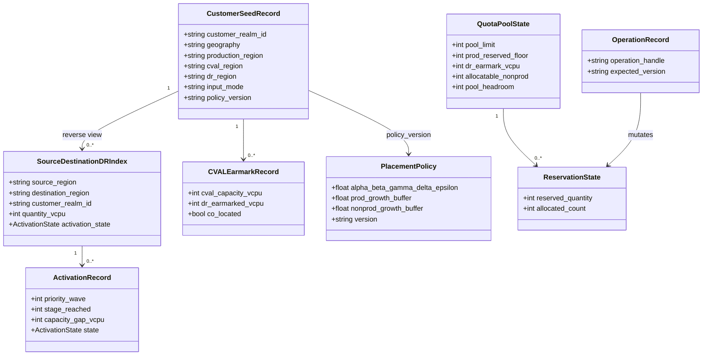

Note: the earlier UML summary's "two quota groups per region" is superseded by the **single governed `QuotaPoolState`** with logical earmarks (exception two-group topology only). `[Decided]`

---

**Document Status:** Draft for review · **Next:** ratify alongside the FDD; supersede the Production Readiness Review (archived). Production reliance on max-not-sum DR and single-pool consumer quota is gated on POC-011 / POC-001.
