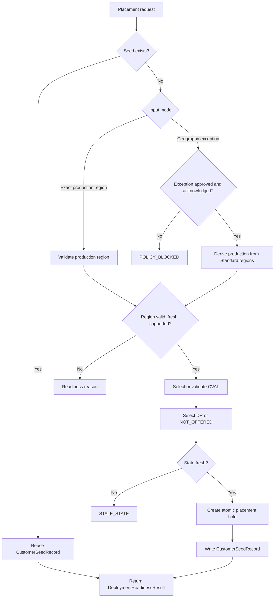

**Project:** Azure Capacity Reservation Management Engine (ACRME)  
**Classification:** Principal Cloud Architect - Architecture Governance  
**Version:** 2.2  
**Date:** 27 August 2026  
**Status:** Accepted - supersedes ADR-001 v1.2 region-selection content  
**Part of:** ACRME Architecture Decision Records - aligned to Capacity & Quota Management Requirements Baseline v2.2.

> **About ADRs.** An Architecture Decision Record captures a significant architectural decision, the context that forced it, the options considered, the choice made, and its consequences. This v2.2 ADR updates the accepted region-selection decision to match the consolidated requirements baseline. Evidence tags: `[Documented]`, `[Decided]`, `[Derived]`, `[Assumed]`.

---

# ADR-001 - Region Selection and Customer Placement

**Status:** Accepted  
**Date:** 27 August 2026  
**Deciders:** Principal Cloud Architect, Platform Engineering, DR Owner, Product Platform  
**Related requirements:** REG-001..REG-005, PLC-001..PLC-010, RDY-001..RDY-004, DR-014, DR-016..DR-019, DAT-002, DAT-005  
**Related constraints:** ENV-003, CAP-011, CAP-012, QUA-012, NFR-002, NFR-010

## Context

Requirements v2.1 changes the placement model from repeated geography-driven selection to a seeded, production-region-first model. Customers and product teams must know the exact Azure production region up front because a broad geography selection creates contract churn, data-residency ambiguity, and inconsistent product placement for the same customer. `[Derived]`

ACRME must still calculate CVAL and DR placement using current capacity, reservation, quota, zone, sharing, restriction, and DR-readiness state. The first valid decision becomes an authoritative seed that future products reuse. `[Decided]`

Key forces:

- Production protection is the primary objective. `[Decided]`
- Region, zone, quota, and capacity are hard isolation boundaries; capacity is never counted across regions or zones. `[Documented]`
- Region strategy is configuration-driven and currently focused on North America and Europe; APAC and Middle East entries are policy data, not automatic rollout commitments. `[Derived]`
- Middle East DR may be unavailable because legal/data-sovereignty constraints can require a `DR_NOT_OFFERED` result instead of a cross-border DR placement. `[Derived]`
- Placement must return a fresh, machine-readable readiness state to AEP/provisioning and must fail safely on stale or incomplete state. `[Decided]`

## Decision

Adopt a **production-region-first, seeded placement architecture**:

1. **Exact production region is the default input.** The default onboarding path requires the customer or platform workflow to provide the exact Azure production region. ACRME validates it rather than deriving it from a broad geography. `[Decided]`

2. **Geography-only selection is an exception path.** Geography input is retained only with explicit exception approval and customer acknowledgement that the selected production region becomes fixed until an approved migration changes the seed. `[Decided]`

3. **Customer seed record is authoritative.** The first placement decision writes `CustomerSeedRecord`; subsequent products/environments for the same customer and geography reuse it instead of re-running production selection. `[Decided]`

4. **CVAL and DR are selected after production is fixed.** Once the production region is validated, ACRME selects or validates CVAL and DR using current readiness, environment separation, restriction flags, workload distribution, quota/capacity state, and state freshness. `[Derived]`

5. **Placement creates readiness output, not just a region tuple.** Every evaluation returns a `DeploymentReadinessResult` state:

   ```text
   READY | READY_WITH_RISK | QUOTA_DEFICIT | RESERVATION_DEFICIT |
   CAPACITY_UNAVAILABLE | STALE_STATE | POLICY_BLOCKED | VALIDATION_REQUIRED
   ```

   `[Decided]`

6. **Atomic holds prevent double-commit.** Committed placement creates a hold keyed by customer, region, zone, SKU/family, environment, policy version, and snapshot version. Conditional writes reject concurrent requests that attempt to consume the same headroom. `[Decided]`

7. **DR placement contributes to the DR index.** The seed drives the `SourceDestinationDRIndex` maintained by ADR-003 so a declared source-region failure activates only that source's mapped standby set. `[Derived]`

## Region Classification and Policy

`PlacementPolicy` is the authoritative, versioned region catalogue. It includes region classification, supported geographies, zone support, SKU/family eligibility, separation class, approved cross-geo extension paths, `DR_NOT_OFFERED` flags, stale-state thresholds, weights, and exception metadata. `[Decided]`

| Attribute | Requirement |
|---|---|
| Standard region | Eligible for automated placement and scoring. |
| Restricted region | Never recommended, scored, or auto-selected; usable only for explicit production-region exception. |
| Cross-geo extension | Usable only when explicitly approved for the source geography. |
| `DR_NOT_OFFERED` | Produces seed value `DR region = NOT_OFFERED`; ACRME must not silently substitute another geography. |
| Policy version | Every change increments version and is recorded with approver, reason, effective date, and replay/audit metadata. |

Three to four regions per geography is the normal design goal. A two-region geography cannot guarantee in-geo Prod + CVAL + DR separation; it requires either an approved cross-geo path or `DR_NOT_OFFERED`. `[Derived]`

## Placement Flow



## CustomerSeedRecord

`CustomerSeedRecord` must include:

- seed ID and customer/realm identifier;
- geography;
- production region;
- CVAL region;
- DR region or `NOT_OFFERED`;
- products covered;
- region/zone/SKU-family policy context;
- decision timestamp;
- policy version and engine version;
- capacity/quota snapshot references and freshness;
- exception approval reference and customer acknowledgement, where applicable;
- active hold IDs;
- migration status and audit metadata. `[Decided]`

Seeds are not regenerated on upgrades, rebuilds, or routine deployments. Changes require an approved migration/exception workflow with impact analysis. `[Decided]`

## Validation Rules

| Rule | Check | Failure state |
|---|---|---|
| Exact Prod default | Request includes a specific production region unless an exception is approved. | `POLICY_BLOCKED` |
| Region catalogue | Region is present in active `PlacementPolicy`. | `VALIDATION_REQUIRED` |
| Standard automated path | Automated selection uses Standard regions only. | `POLICY_BLOCKED` |
| Restricted region exception | Restricted regions require explicit production-only request and approval. | `POLICY_BLOCKED` |
| `DR_NOT_OFFERED` | Geography/country flagged as no-DR writes `NOT_OFFERED` and blocks cross-geo substitution. | `READY_WITH_RISK` or `POLICY_BLOCKED` per policy |
| Three-region gate | Geography must provide Prod, CVAL, and DR separation or approved cross-geo/no-DR path. | `POLICY_BLOCKED` |
| Freshness | Snapshot age <= configured maximum or synchronous refresh succeeds. | `STALE_STATE` |
| Capacity | Required reserved capacity exists or over-allocation is approved. | `RESERVATION_DEFICIT` or `CAPACITY_UNAVAILABLE` |
| Quota | Consumer/deploying subscription has required quota. | `QUOTA_DEFICIT` |
| Concurrency | Atomic hold commit succeeds. | `VALIDATION_REQUIRED` |

## Consequences

**Positive**

- Avoids production-region ambiguity and customer contract churn. `[Derived]`
- Produces stable placement across products for the same customer/geography. `[Decided]`
- Makes CVAL/DR decisions replayable from seed, policy version, and snapshot references. `[Decided]`
- Gives AEP/provisioning an explicit readiness contract instead of implicit success/failure. `[Decided]`

**Negative / trade-offs**

- Geography-only onboarding now needs exception governance and customer acknowledgement. `[Decided]`
- Seed migration becomes a governed workflow, not a simple re-run of scoring. `[Derived]`
- `DR_NOT_OFFERED` can create a readiness-with-risk outcome that must be handled commercially and operationally. `[Derived]`
- Atomic holds add state-management complexity but are required to prevent double-committed capacity/quota. `[Decided]`

## Alternatives Considered

| Alternative | Why rejected or constrained |
|---|---|
| Geography selection as default | Caused ambiguous customer intent and inconsistent product placement. `[Derived]` |
| Re-run placement per product | Risks drift across products for the same customer/geography. `[Decided]` |
| Use stale daily/weekly snapshots for deployment | Can deploy into capacity/quota that is no longer available. `[Derived]` |
| Auto-select cross-geo DR for two-region geographies | Violates sovereignty/contract controls; must be explicit or `DR_NOT_OFFERED`. `[Decided]` |

---

## Appendix - ADR Summary

| ADR | Requirements Applied | Key Open Items |
|---|---|---|
| ADR-001 Region Selection and Customer Placement | REG-001..005, PLC-001..010, RDY-001..004, DR-014 | DEC-001 Middle East/no-DR policy; DEC-003 geography exception approver; production stale-state threshold |

## Appendix - Status Legend

| Status | Meaning |
|---|---|
| **Proposed** | Under discussion; not yet ratified |
| **Accepted** | Ratified and in force |
| **Deprecated** | No longer recommended but not yet replaced |
| **Superseded** | Replaced by a later ADR |

## Appendix - Evidence Tag Taxonomy

| Tag | Meaning |
|---|---|
| `[Documented]` | Traceable to Azure platform behaviour or documentation |
| `[Decided]` | An explicit ACRME design choice recorded in this ADR set |
| `[Derived]` | A logical consequence of a documented constraint or decision |
| `[Assumed]` | Architectural judgement pending proof-of-concept validation |

## Related ADRs

- **ADR-002 - Quota and Capacity Management** (`acrme_adr_002_quota_and_capacity_management.md`)
- **ADR-003 - Capacity Management during Disaster Recovery (DR)** (`acrme_adr_003_capacity_management_during_dr.md`)
- **ADR-004 - Forecast, Reconciliation, and Increase of Capacity and Quota** (`acrme_adr_004_forecast_and_increase_of_capacity_and_quota.md`)

---

**Document Status:** Accepted  
**Next Review:** After DEC-001/DEC-003 decisions, readiness API contract review, and first seed-record implementation test.
