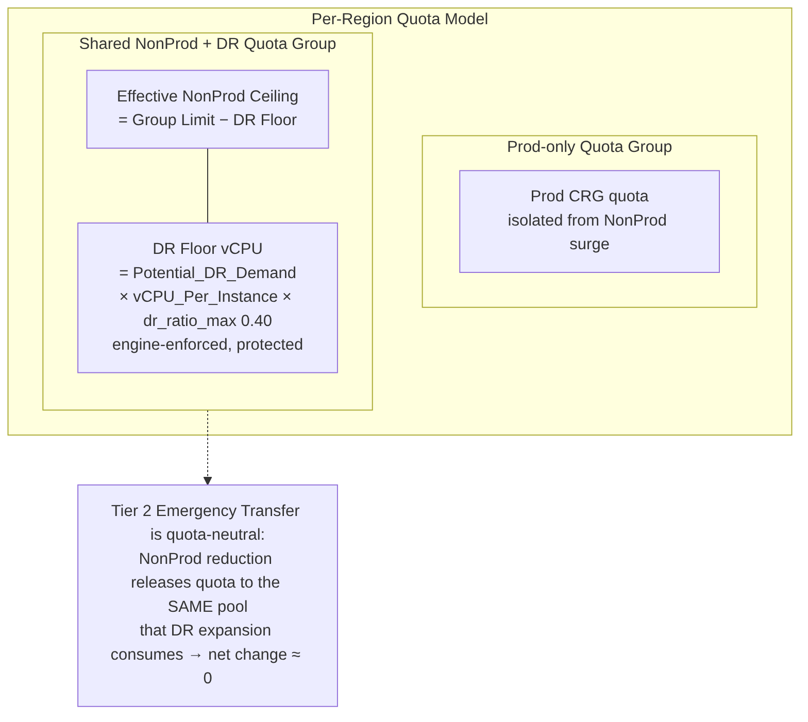

**Project:** Azure Capacity Reservation Management Engine (ACRME)  
**Classification:** Principal Cloud Architect — Architecture Governance  
**Version:** 1.2  
**Date:** August 2026  
**Status:** Accepted  
**Part of:** ACRME Architecture Decision Records — one of four standalone, self-contained records.

> **About ADRs.** An Architecture Decision Record captures a single significant architectural decision, the context that forced it, the options considered, the choice made, and its consequences. ADRs are immutable once accepted — a superseding decision is recorded as a new ADR rather than editing the original. This record is self-contained: it can be read without any companion document. Evidence tags: `[Documented]`, `[Decided]`, `[Derived]`, `[Assumed]` (see Appendix).

---

# ADR-002 — Quota and Capacity Management

**Status:** Accepted  
**Date:** August 2026  
**Deciders:** Principal Cloud Architect, Platform Engineering, FinOps  
**Related constraints:** HC-2, HC-3, HC-7 (hard constraints)  

### Context

Each customer needs three CRGs per region (Prod, NonProd, DR). Azure tracks compute quota per subscription per region per SKU family; quota exhaustion silently blocks CR creation and VM deployment. The engine must:

- Prevent a NonProd surge from consuming quota that Prod CR creation needs (isolation).
- Make emergency capacity transfer (see ADR-003) **quota-neutral** where possible — i.e. reshuffle capacity without waiting hours for an Azure quota-increase approval during a crisis.
- Provide clean per-environment cost attribution for chargeback.
- Enforce a protected DR reservation that NonProd growth can never erode.

Azure **Quota Groups** (Preview) allow multiple subscriptions/CRGs to share a group-level quota pool, but Azure does **not** natively support intra-group sub-reservations — so any sub-partition of a group pool must be enforced by the engine.

### Decision

Adopt a **Two-Quota-Group-per-region model with an engine-enforced DR floor**:

1. **Two groups per region:** one **Prod-only** group and one **shared NonProd+DR** group. `[Decided]`
   ```
   Prod_Group_Limit(R)        = base_subscription_quota_limit × (1 + emergency_transfer_headroom_vcpu / base_limit)
   NonProd_DR_Group_Limit(R)  = base_subscription_quota_limit × (1 + emergency_transfer_headroom_vcpu / base_limit)
   ```

2. **Engine-enforced DR floor** inside the NonProd+DR group (Azure has no native sub-reservation): `[Decided]`
   ```
   DR_Floor_vCPU(R)               = potential_dr_demand(R) × vCPU_per_instance × dr_ratio_max
   Effective_NonProd_Ceiling(R)   = NonProd_DR_Group_Limit(R) − DR_Floor_vCPU(R)
   ```
   The floor is always sized at **`dr_ratio_max` (0.40)** — the upper bound of the DR ratio range — so it never needs to grow if the operating ratio is later raised (0.30 → 0.40). Only actual Prod demand growth expands the floor. `[Decided]`

3. **Hard-constraint enforcement at placement:**
   - **HC-2 CAPACITY_FLOOR** — CR headroom ≥ `2 × requested_vm_count × SKU_vCPU`.
   - **HC-3 QUOTA_FLOOR** — env-type-aware group headroom check (Prod group / effective NonProd ceiling / DR headroom). Reads from the `QuotaGroup` entity, not legacy per-subscription `QuotaRecord`. `[Decided]`
   - **HC-7 DR_FLOOR_INTEGRITY** — rejects NonProd placement that would push `nonprod_quota_used` above the effective ceiling, evaluated **after** HC-3. `[Decided]`

4. **Legacy per-subscription quota tracking is retained for monitoring/audit only** and superseded for all placement and scoring checks by group-level fields. `[Decided]`

5. **Continuous protection:** the reconciliation loop watches for floor violations and emits `DRFloorViolationDetected`; NonProd CRG scale operations that approach the ceiling are operator-gated.

**Worked topology example:** Prod group 128 vCPU; NonProd+DR group 80 vCPU; DR floor 32 vCPU → effective NonProd ceiling 48 vCPU.

{ width=85% }

#### Group Accounting Formulas (normative)

All four are **engine accounting controls** — they do not create a native Azure sub-reservation: `[Documented]`
```
DR_Floor_vCPU             = Potential_DR_Demand × vCPU_Per_Instance × DR_Ratio_Max
Effective_NonProd_Ceiling = NonProd_DR_Group_Limit − DR_Floor_vCPU
NonProd_Headroom          = Effective_NonProd_Ceiling − NonProd_Used_vCPU
Group_Headroom            = Group_Limit − Group_Used
```

#### Exact Enforcement Controls

- Every **NonProd** increase performs a group check **and** a subscription check. `[Documented]`
- Every **DR** increase performs a group check, subscription check, SKU check, capacity check, **and** active-incident check.
- A **separate detector** recalculates the DR floor from authoritative assignment/allocation data. Any disagreement between the command-time and detector calculations **disables automatic NonProd expansion** (fail-safe) and raises `DRFloorViolationDetected`.
- Group propagation is **polled** — no fixed propagation SLA is assumed.

#### `groupType` Preview Dependency

The Quota-Group `groupType` property (`AllocationGroup` = advisory vs `EnforcedGroup` = enforced) is **preview-only** in the Azure Quota REST API and is not GA. `[Documented]` The engine's accounting controls are deliberately **engine-level and do not depend on `groupType` enforcement**. If `EnforcedGroup` is ever relied upon to drop the engine's own subscription-level check, that dependency must pass a preview-acceptance proof-of-concept and a recorded decision first. Engineering constraint: pin the exact preview API version in all quota-group calls and add version-drift detection to the platform health check.

### Consequences

**Positive:**
- Prod isolation is enforced at the Azure control-plane level — a NonProd surge cannot starve Prod.
- Tier 2 Emergency Capacity Transfer becomes **truly quota-neutral** (ARM operations only, no Azure approval gate) because NonProd and DR draw from the same group pool (see ADR-003).
- Clean chargeback: one Azure billing record per group per region.
- The DR floor guarantees a protected reservation NonProd can never erode.

**Negative / trade-offs:**
- The DR floor is a **soft ceiling the engine must maintain continuously** — Azure won't enforce it. A bug could allow NonProd to breach the floor; mitigated by `DRFloorViolationDetected` alerting and operator gates. `[Decided]`
- Sizing the floor at `dr_ratio_max` over-reserves quota slightly at lower operating ratios — a deliberate reliability-over-cost trade, reviewed quarterly. `[Decided]`
- `Quota_Score` and HC-3 must be environment-type-aware (three code paths).
- **Hard dependency on Azure Quota Groups GA** — validated by proof-of-concept before rollout; if `groupQuotas` returns 404 in the target tenant/region, escalate to Azure Support.

### Alternatives Considered

| Alternative | Why Rejected |
|---|---|
| **Single shared quota pool** (all three CRGs) | Breaks Prod isolation — a NonProd surge can consume Prod's quota. `[Decided]` |
| **Three separate groups** (one per CRG) | Maximum isolation but makes Tier 3 transfer non-atomic — releasing NonProd quota lands in the wrong group, forcing an Azure quota request mid-crisis (hours of RTO impact). `[Decided]` |
| **Per-subscription quota only** (legacy) | Cannot make emergency transfer quota-neutral without risky cross-subscription coordination. `[Decided]` |
| **DR floor sized at current ratio** | Undersizes the floor if the ratio is later increased, blocking DR expansion. `[Decided]` |

---

---

## Appendix — ADR Summary

| ADR | Hard Constraints Applied | Key Open Items |
|---|---|---|
| ADR-002 Quota & Capacity | HC-2, HC-3, HC-7 | Azure Quota Groups GA validated by proof-of-concept before rollout |

## Appendix — Status Legend

| Status | Meaning |
|---|---|
| **Proposed** | Under discussion; not yet ratified |
| **Accepted** | Ratified and in force |
| **Deprecated** | No longer recommended but not yet replaced |
| **Superseded** | Replaced by a later ADR |

## Appendix — Evidence Tag Taxonomy

| Tag | Meaning |
|---|---|
| `[Documented]` | Traceable to Azure platform behaviour or documentation |
| `[Decided]` | An explicit ACRME design choice recorded in this ADR set |
| `[Derived]` | A logical consequence of a documented constraint or decision |
| `[Assumed]` | Architectural judgement pending proof-of-concept validation |

## Related ADRs

- **ADR-001 — Region Selection** (`acrme_adr_001_region_selection.md`)
- **ADR-003 — Capacity Management during Disaster Recovery (DR)** (`acrme_adr_003_capacity_management_during_dr.md`)
- **ADR-004 — Forecast and Increase of Capacity and Quota** (`acrme_adr_004_forecast_and_increase_of_capacity_and_quota.md`)

---

**Document Status:** Accepted  
**Next Review:** After proof-of-concept validation of Azure Quota Groups GA and quota-release latency, and on resolution of the consumer-credential model and engine-mode state-machine items.

