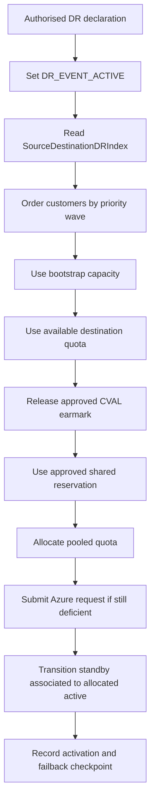

**Project:** Azure Capacity Reservation Management Engine (ACRME)  
**Classification:** Principal Cloud Architect - Architecture Governance  
**Version:** 2.1  
**Date:** 27 August 2026  
**Status:** Accepted - supersedes ADR-003 v1.2 fixed-ratio DR model  
**Part of:** ACRME Architecture Decision Records - aligned to Capacity & Quota Management Requirements v2.1.

> **About ADRs.** An Architecture Decision Record captures a significant architectural decision, the context that forced it, the options considered, the choice made, and its consequences. This v2.1 ADR updates disaster-recovery capacity management to the lean bootstrap and distributed DR model. Evidence tags: `[Documented]`, `[Decided]`, `[Derived]`, `[Assumed]`.

---

# ADR-003 - Capacity Management during Disaster Recovery (DR)

**Status:** Accepted  
**Date:** 27 August 2026  
**Deciders:** Principal Cloud Architect, DR Owner, Platform Engineering, Security, FinOps  
**Related requirements:** ENV-003..ENV-006, DR-001..DR-019, PLC-010, DAT-002, DAT-003, OBS-001..OBS-004, OPS-001  
**Related POCs/decisions:** POC-001, POC-006, POC-007, POC-011, DEC-001, DEC-002, DEP-001

## Context

The v1 DR model assumed a fixed 30-40% reserve relative to production. Requirements v2.1 explicitly rejects that as the default because idle DR reservations at platform scale are too expensive and do not reflect the single-region-failure assumption. `[Decided]`

ACRME now needs a DR model that:

- starts with configurable bootstrap capacity, not a percentage clone of production;
- reconciles reserved capacity dynamically against allocated demand and policy buffers;
- uses CVAL/NonProd as a potential DR capacity source only under authorised runbooks;
- supports reciprocal multi-source DR hosting, where any region may simultaneously host Prod, CVAL, and DR standby for different customers;
- sizes each DR destination using max-over-non-concurrent-source demand;
- activates the correct standby set by source-region failure; and
- preserves auditability and failback reversibility. `[Derived]`

## Decision

Adopt a **lean bootstrap plus distributed DR capacity architecture**:

1. **DR starts lean.** DR holds a configurable bootstrap target by workload, product, region, zone, SKU/family, and subscription model. It must not default to a fixed 30-40% copy of production. Zero bootstrap is allowed only through explicit approved policy. `[Decided]`

2. **Destination sizing uses max-not-sum.** For a destination region, standby capacity is sized to the largest non-concurrent protected source workload portion, not the sum of all sources. `[Decided]`

3. **SUM remains a conservative override.** If a customer contract, geography, or risk decision requires simultaneous source-region failure coverage, policy may switch that scope to SUM sizing. `[Decided]`

4. **Every region can have three concurrent roles.** A region may host its own production, CVAL for customers whose production is elsewhere, and standby DR for customers from multiple source regions. `[Decided]`

5. **CVAL is a DR capacity source, not free capacity.** CVAL capacity can be shut down, disassociated, or reassigned only on an authorised DR declaration and per approved priority/runbook. `[Decided]`

6. **DR activation is per customer and priority wave.** A declared region failure changes engine mode, then ACRME activates the affected source region's mapped standby instances from associated/inactive state to allocated/active state in approved business-priority waves. `[Decided]`

7. **Failback is reversible and audited.** Every activation records customer state, source/destination, capacity acquisition path, approvals, and rollback/failback checkpoint. `[Decided]`

## Distributed DR Reference Model

The authoritative mapping is `SourceDestinationDRIndex`:

| Field | Purpose |
|---|---|
| `source_region` | Failed or protected production source. |
| `destination_region` | Region holding standby DR capacity. |
| `customer_or_realm_id` | Customer/realm whose standby set is mapped. |
| `seed_id` | Link back to `CustomerSeedRecord` from ADR-001. |
| `standby_instance_set` | VM/VMSS/node-pool/application set eligible for activation. |
| `sku_family`, `sku`, `zone`, `quantity` | Capacity/quota dimensions. |
| `activation_state` | `standby`, `activation_pending`, `active`, `failback_pending`, `returned`. |
| `priority_wave` | Business priority for activation order. |
| `policy_version`, `last_updated` | Replay, freshness, and audit fields. |

The index must be queryable in both directions:

- source -> destinations, to know where a failed region's customers activate;
- destination -> sources, to compute max-source coverage and dashboard exposure. `[Decided]`

## DR Sizing Formula

For each destination, SKU, zone, and policy scope:

```text
Destination_DR_Requirement(d)
  = MAX over non-concurrent source regions s protected by d (
      Workload_Portion(s -> d)
    )
```

With vCPU expansion:

```text
DR_Floor_vCPU(d, sku, zone)
  = Destination_DR_Requirement(d, sku, zone) * vCPU_Per_Instance(sku)
```

The old formula `prod_vm_count * dr_ratio_max` is superseded. It may appear only in legacy examples, never as the default production sizing rule. `[Decided]`

## DR Activation Sequence



Capacity acquisition order:

1. existing bootstrap capacity;
2. available destination quota/capacity;
3. approved CVAL release;
4. approved capacity sharing;
5. pooled quota allocation;
6. Azure quota/capacity request with exposed deficit if Azure cannot supply it. `[Decided]`

## CVAL Earmark and No-Double-Count Rule

When CVAL and DR co-locate, ACRME must create a `CVALEarmarkRecord` that identifies which CVAL capacity is releasable for a customer's DR activation. Earmarked CVAL capacity counts toward DR headroom, not live CVAL headroom. It must never be credited as both live CVAL capacity and available DR capacity. `[Decided]`

`CVALEarmarkRecord` contains customer/realm, CVAL region, DR destination, SKU/zone/quantity, release action, approval policy, priority wave, expiry/review status, and audit references. `[Decided]`

## Engine State Machine

`engine_mode` is a persisted state machine with conditional writes and operator-gated transitions:

| State | Meaning | Permitted transitions |
|---|---|---|
| `STEADY_STATE` | Normal inventory, reconciliation, placement, and approved growth. | `DR_DECLARATION_PENDING` |
| `DR_DECLARATION_PENDING` | DR requested and awaiting approval/validation. | `DR_EVENT_ACTIVE`, `STEADY_STATE` |
| `DR_EVENT_ACTIVE` | Source-specific DR activation and emergency operations permitted. | `FAILBACK_PENDING`, `INCIDENT_HOLD` |
| `FAILBACK_PENDING` | Return/reversal is being validated and executed. | `STEADY_STATE`, `DR_EVENT_ACTIVE`, `INCIDENT_HOLD` |
| `INCIDENT_HOLD` | Safe degraded state after conflict or critical failure. | Recovery-approved transition only |

Entering `DR_EVENT_ACTIVE` does not automatically authorise service-impacting CVAL action, Tier 2, or Tier 3. Each action still requires its own policy gate. `[Decided]`

## Relationship to Emergency Tiers

The previous three-tier emergency transfer model remains as an implementation pattern, but v2.1 scopes it behind bootstrap-first activation:

| Tier | v2.1 treatment |
|---|---|
| Tier 1 - direct expansion | Permitted after DR declaration when quota/capacity/sharing preconditions are fresh. |
| Tier 2 - quota-neutral transfer | Approval-gated until quota group release and consumer quota behavior are proven. |
| Tier 3 - destructive VM association changes | Blocked in Phase 1; VMSS entries are rejected. |

## Observability and Runbooks

ACRME dashboards and alerts must show:

- DR bootstrap below target;
- destination coverage below max protected source;
- source <-> destination mapping;
- activation state by customer and priority wave;
- CVAL earmarks and releasable capacity;
- quota/capacity deficits after each acquisition stage;
- failed/stale activation state;
- failback pending age. `[Decided]`

Runbooks must cover DR declaration, standby activation, CVAL release/shutdown/disassociation, quota allocation to DR, sharing activation, manual emergency override, regional recovery, and failback. `[Decided]`

## Consequences

**Positive**

- Removes the high-cost fixed 30-40% standby reserve as the default. `[Decided]`
- Aligns standby sizing with the single-region-failure assumption. `[Derived]`
- Supports reciprocal multi-source hosting without summing unrelated non-concurrent sources. `[Decided]`
- Makes activation deterministic from the DR index and seed records. `[Decided]`

**Negative / trade-offs**

- Max-not-sum under-protects two simultaneous source-region failures unless SUM override is configured. `[Derived]`
- Capacity Reservation Sharing remains a preview/feature-maturity dependency for parts of the cost model. `[Assumed]`
- Bootstrap sizing requires workload-specific POC evidence. `[Assumed]`
- CVAL release can be service-impacting and therefore requires explicit authorisation. `[Decided]`

## Alternatives Considered

| Alternative | Disposition |
|---|---|
| Fixed 30-40% production copy | Rejected as default because of idle cost and v2.1 pivot. `[Decided]` |
| Sum all sources per destination | Rejected as default; too expensive under single-region-failure assumption. `[Decided]` |
| Zero DR bootstrap by default | Rejected; zero is allowed only by explicit approved policy. `[Decided]` |
| Treat CVAL free capacity as always available | Rejected; requires earmark, authorisation, and no-double-count controls. `[Decided]` |
| Activate all destination standby capacity during any event | Rejected; activation is source-specific via the DR index. `[Decided]` |

---

## Appendix - ADR Summary

| ADR | Requirements Applied | Key Open Items |
|---|---|---|
| ADR-003 Capacity Management during DR | ENV-003..006, DR-001..019, PLC-010, DAT-002, OBS-004 | POC-006 topology, POC-007 bootstrap sizing, POC-011 max-not-sum safety, DEC-001 Middle East DR, DEC-002 failback duration, DEP-001 sharing maturity |

## Appendix - Status Legend

| Status | Meaning |
|---|---|
| **Proposed** | Under discussion; not yet ratified |
| **Accepted** | Ratified and in force |
| **Deprecated** | No longer recommended but not yet replaced |
| **Superseded** | Replaced by a later ADR |

## Appendix - Evidence Tag Taxonomy

| Tag | Meaning |
|---|---|
| `[Documented]` | Traceable to Azure platform behaviour or documentation |
| `[Decided]` | An explicit ACRME design choice recorded in this ADR set |
| `[Derived]` | A logical consequence of a documented constraint or decision |
| `[Assumed]` | Architectural judgement pending proof-of-concept validation |

## Related ADRs

- **ADR-001 - Region Selection and Customer Placement** (`acrme_adr_001_region_selection.md`)
- **ADR-002 - Quota and Capacity Management** (`acrme_adr_002_quota_and_capacity_management.md`)
- **ADR-004 - Forecast, Reconciliation, and Increase of Capacity and Quota** (`acrme_adr_004_forecast_and_increase_of_capacity_and_quota.md`)

---

**Document Status:** Accepted  
**Next Review:** After POC-006, POC-007, POC-011, DEC-001, DEC-002, and Capacity Reservation Sharing maturity review.
