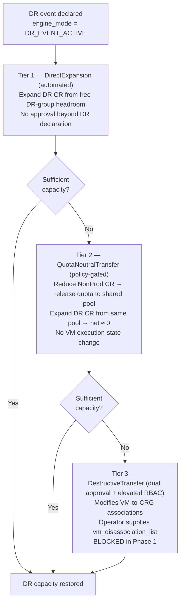
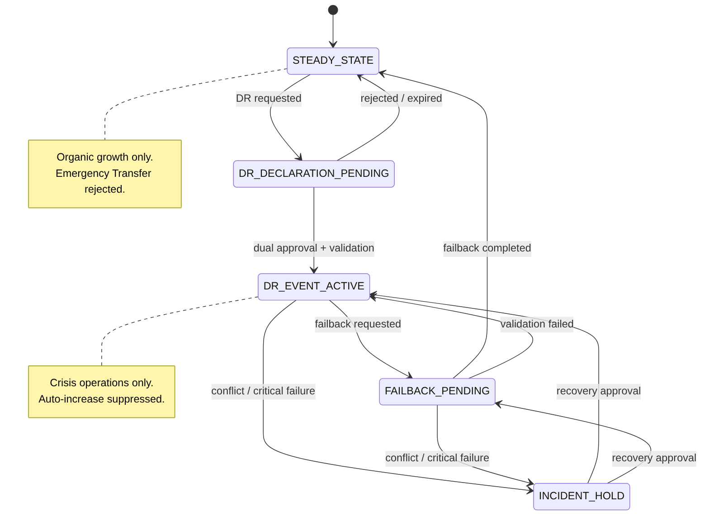

**Project:** Azure Capacity Reservation Management Engine (ACRME)  
**Classification:** Principal Cloud Architect — Architecture Governance  
**Version:** 1.2  
**Date:** August 2026  
**Status:** Accepted  
**Part of:** ACRME Architecture Decision Records — one of four standalone, self-contained records.

> **About ADRs.** An Architecture Decision Record captures a single significant architectural decision, the context that forced it, the options considered, the choice made, and its consequences. ADRs are immutable once accepted — a superseding decision is recorded as a new ADR rather than editing the original. This record is self-contained: it can be read without any companion document. Evidence tags: `[Documented]`, `[Decided]`, `[Derived]`, `[Assumed]` (see Appendix).

---

# ADR-003 — Capacity Management during Disaster Recovery (DR)

**Status:** Accepted  
**Date:** August 2026  
**Deciders:** Principal Cloud Architect, DR Owner, Platform Engineering, Security  
**Related constraints:** HC-1, HC-4, HC-6 (hard constraints)  

### Context

When a primary region fails, customers must recover in their DR region within a committed RTO. Pre-positioning a full 1:1 DR reserve is prohibitively expensive, yet under-provisioning risks a failed failover. During a crisis, waiting on Azure quota-increase approvals (hours) is unacceptable. The engine must also strictly separate **routine growth** from **destructive crisis operations** so that reconciliation can never accidentally trigger VM disruption.

Two capabilities are needed:
- A way to reuse otherwise-idle NonProd capacity as DR overflow.
- A safe, tiered escalation model for expanding DR capacity during a declared event.

### Decision

Adopt **NonProd/DR co-location with a coverage floor**, a **formal two-mode engine state**, and a **three-tier emergency transfer model**:

1. **NonProd and DR may share a region (HC-1 constraint removed).** This lets the NonProd CRG's `effective_free` (after `dr_overflow_reserve`) count as DR overflow headroom. `[Decided]`
   - **HC-6 DR_COVERAGE_FLOOR** guarantees the combined pool can absorb demand before DR placement is accepted:
     ```
     dr_crg_free_slots(R) + nonprod_crg_effective_free(R) ≥ prod_vm_count × dr_ratio_max
     ```
   - **HC-4 DR_SEPARATION_CLASS** still guarantees Prod and DR sit in non-correlated failure domains (HIGH separation for non-paired regions).

2. **Two separate operating systems gated by `engine_mode`:** `[Decided]`
   - **`STEADY_STATE`** — organic growth via the reconciliation loop and `CapacityIncreaseRequest` (see ADR-004). Emergency Transfer is **rejected** in this mode.
   - **`DR_EVENT_ACTIVE`** — crisis operations only. The auto-increase trigger is **suppressed** in this mode. Mode transitions are operator-gated with dual approval (state machine `EngineModeState`), never automatic. `[Decided]`

3. **Three-tier Emergency Capacity Transfer escalation:** `[Decided]`
   - **Tier 1 — DirectExpansion (automated):** expand DR CR quantity using free headroom in the DR group. No approval beyond DR-event declaration.
   - **Tier 2 — QuotaNeutralTransfer (policy-gated):** reduce a NonProd CR (releasing quota to the shared NonProd+DR group pool) and expand the DR CR from that same pool. Net group headroom change ≈ 0 — **quota-neutral, no VM execution-state change** (only NonProd SLA is removed). This is possible *only* because of the two-group model (see ADR-002).
   - **Tier 3 — DestructiveTransfer (dual approval + elevated RBAC):** the only tier that modifies VM-to-CRG associations. The operator supplies an explicit `vm_disassociation_list` (no automated VM selection in Phase 1); executed via 6-step Path B with Path A fallback per VM. VMSS entries are rejected in Phase 1.

4. **Quota-neutral math (Tier 2):**
   ```
   NonProd CR reduction  → releases quota to shared NonProd+DR GROUP pool
   DR CR expansion       → consumes from the SAME pool
   ⇒ net group headroom change ≈ 0  (ARM operations only; no Azure quota approval)
   ```

5. **DR reserve sizing** is `30–40%` of Prod (`dr_ratio_min=0.30`, `dr_ratio_max=0.40`, `dr_ratio_target=0.35`); the protected floor uses `dr_ratio_max` (see ADR-002).

6. **Phase-1 safety posture:** Tier 2 is approval-gated; **Tier 3 is blocked** pending the consumer-credential model and the engine-mode state machine. No invented SLA — propagation/approval times are measured and reported as unknown until observed.

{ width=33% }

#### Full Engine State Machine (normative)

`engine_mode` is not a two-value flag but a **five-state machine** persisted in Cosmos DB with conditional writes, transition guards, and recovery tests — a production blocker until implemented: `[Documented]`

| State | Meaning | Permitted transitions |
|---|---|---|
| **STEADY_STATE** | Organic growth only; Emergency Transfer rejected | → DR_DECLARATION_PENDING |
| **DR_DECLARATION_PENDING** | DR requested, awaiting dual approval + validation | → DR_EVENT_ACTIVE (approved) · → STEADY_STATE (rejected/expired) |
| **DR_EVENT_ACTIVE** | Crisis operations only; auto-increase suppressed | → FAILBACK_PENDING · → INCIDENT_HOLD |
| **FAILBACK_PENDING** | Failback requested, being validated | → STEADY_STATE (completed) · → DR_EVENT_ACTIVE (validation failed) · → INCIDENT_HOLD |
| **INCIDENT_HOLD** | State conflict / critical failure — safe hold | → DR_EVENT_ACTIVE · → FAILBACK_PENDING (on recovery approval) |

All transitions are **operator-gated with dual approval** — never automatic.

{ width=98% }

#### `EngineModeState` Entity

Must carry: environment/control-plane scope · current mode · state version · incident ID · requested-by · approved-by · transition timestamp · transition reason · active operation IDs · lease owner + expiry · recovery checkpoint. `[Documented]`

#### DR Activation Semantics

Entering `DR_EVENT_ACTIVE` **only establishes the operating mode** in which separately-governed emergency operations may be evaluated — it does **not** automatically authorize Tier 2 or Tier 3. Each tier is independently gated. The DR orchestrator validates group and subscription quota and CR/sharing state before starting any approved failover deployment, and records active-or-incident-hold state back to the state service. `[Documented]`

### Consequences

**Positive:**
- Idle NonProd capacity doubles as DR overflow, cutting the cost of pre-positioned DR reserve while HC-6 guarantees sufficiency.
- The `engine_mode` gate makes it structurally impossible for routine reconciliation to trigger destructive VM operations.
- Tier 2 delivers meaningful crisis capacity **with zero VM disruption and zero Azure quota wait** — the common escalation path avoids Tier 3 entirely.
- Every operation is tagged with its operating mode for a clean audit trail.

**Negative / trade-offs:**
- Co-location adds risk that NonProd over-consumption erodes DR overflow; mitigated by HC-6, `dr_overflow_reserve`, and floor alerting.
- `engine_mode` must be a formal Cosmos DB state propagated to every reconciliation cycle, with operator-gated, dual-approval transitions.
- **Tier 3 is blocked** until the consumer-credential model (Managed Identity vs cross-tenant service-principal) and the engine-mode state machine are resolved — a known Phase-1 limitation.
- Tier 3 requires a rare, audited break-glass role (`ACRME.SuperAdmin`) for single-approver override.
- Requires per-CRG-type `RegionalSnapshot` fields to evaluate HC-6.

### Alternatives Considered

| Alternative | Why Rejected |
|---|---|
| **Keep DR_region ≠ NonProd_region** | Prevents using NonProd as DR overflow — the whole point of co-location. `[Decided]` |
| **Remove separation with no compensating HC** | Risks NonProd over-consumption leaving no DR headroom. `[Decided]` |
| **Unified capacity engine with mode flags** | Mode flags create complex conditionals and risk triggering VM disassociation during routine reconciliation. `[Decided]` |
| **Emergency transfer as an extension of auto-increase** | Conflates policy-driven growth with operator-gated crisis response; could run destructive ops without a DR declaration. `[Decided]` |
| **Two tiers only (automated + destructive)** | Loses the quota-neutral Tier 2 — the critical low-risk intermediate that avoids Tier 3 in most crises. `[Decided]` |
| **Four tiers (separate VMSS tier)** | VMSS disassociation deferred as a Phase-1 limitation rather than a distinct tier. `[Decided]` |

---

---

## Appendix — ADR Summary

| ADR | Hard Constraints Applied | Key Open Items |
|---|---|---|
| ADR-003 Capacity during DR | HC-1, HC-4, HC-6 | Consumer-credential model and engine-mode state machine; quota-release latency measured |

## Appendix — Status Legend

| Status | Meaning |
|---|---|
| **Proposed** | Under discussion; not yet ratified |
| **Accepted** | Ratified and in force |
| **Deprecated** | No longer recommended but not yet replaced |
| **Superseded** | Replaced by a later ADR |

## Appendix — Evidence Tag Taxonomy

| Tag | Meaning |
|---|---|
| `[Documented]` | Traceable to Azure platform behaviour or documentation |
| `[Decided]` | An explicit ACRME design choice recorded in this ADR set |
| `[Derived]` | A logical consequence of a documented constraint or decision |
| `[Assumed]` | Architectural judgement pending proof-of-concept validation |

## Related ADRs

- **ADR-001 — Region Selection** (`acrme_adr_001_region_selection.md`)
- **ADR-002 — Quota and Capacity Management** (`acrme_adr_002_quota_and_capacity_management.md`)
- **ADR-004 — Forecast and Increase of Capacity and Quota** (`acrme_adr_004_forecast_and_increase_of_capacity_and_quota.md`)

---

**Document Status:** Accepted  
**Next Review:** After proof-of-concept validation of Azure Quota Groups GA and quota-release latency, and on resolution of the consumer-credential model and engine-mode state-machine items.

