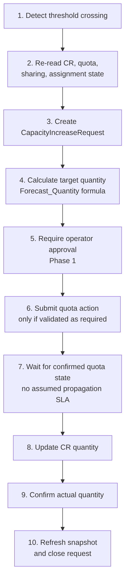

**Project:** Azure Capacity Reservation Management Engine (ACRME)  
**Classification:** Principal Cloud Architect — Architecture Governance  
**Version:** 1.2  
**Date:** August 2026  
**Status:** Accepted  
**Part of:** ACRME Architecture Decision Records — one of four standalone, self-contained records.

> **About ADRs.** An Architecture Decision Record captures a single significant architectural decision, the context that forced it, the options considered, the choice made, and its consequences. ADRs are immutable once accepted — a superseding decision is recorded as a new ADR rather than editing the original. This record is self-contained: it can be read without any companion document. Evidence tags: `[Documented]`, `[Decided]`, `[Derived]`, `[Assumed]` (see Appendix).

---

# ADR-004 — Forecast and Increase of Capacity and Quota

**Status:** Accepted  
**Date:** August 2026  
**Deciders:** Principal Cloud Architect, Platform Engineering, FinOps, Capacity Planning  
**Related constraints:** HC-3 (applied at increase-execution time)  

### Context

Reserved capacity must grow ahead of demand — but Azure quota increases take time to approve, and over-reservation wastes money. The engine needs to forecast demand, recommend right-sized capacity, and drive quota/CR increases with enough lead time, **without** ever autonomously performing material or destructive changes in Phase 1. This growth path must be architecturally distinct from crisis operations (see ADR-003).

### Decision

Adopt **forecast-driven, approval-gated capacity growth** operating exclusively in `STEADY_STATE`:

1. **Forecasting** analyses historical CR allocation and projects demand over a configurable window (default 30/60/90 days), exposing raw time series and derived recommendations via API. `[Documented]`

2. **Capacity sizing formula:** `[Documented]`
   ```
   Forecast_Quantity = ceil(Forecast_Peak × (1 + Growth_Buffer) + DR_Buffer)
   ```
   Increase when forecast demand exceeds current reserved quantity within the window; right-size down when demand is consistently below current, honouring a configurable buffer.

3. **Lead-time alerting:** when forecast demand approaches a quota limit (default **80%**), emit `ForecastApproachingQuotaLimit` with a **14-day lead time** — enough for quota-increase processing. `[Documented]`

4. **Auto-increase is approval-gated in Phase 1.** The trigger uses utilisation thresholds with **debounce/cooldown** to avoid thrashing; a `CapacityIncreaseRequest` entity carries the full lifecycle (create → approve → execute → retry → cancel), and Phase 1 requires **operator approval** before execution. `[Decided]`

5. **Quota increases** are initiated via the Azure Support REST API (`Microsoft.Capacity/.../serviceLimits`) — at group level where Quota Groups apply (see ADR-002) — subject to the same operator-approval gate. `[Documented]`

6. **Mode isolation.** Auto-increase runs **only** in `STEADY_STATE` and is **suppressed during `DR_EVENT_ACTIVE`**, keeping organic growth strictly separate from crisis transfer (see ADR-003). `[Decided]`

7. **Non-destructive guarantee.** Increases only ever raise CR quantity or request more quota; guarded reduction (right-sizing) never drops a CR below its allocated count (the platform floor) and is itself approval-gated.

#### Steady-State Capacity Lifecycle (normative 10-step policy)

The steady-state increase runs strictly separate from DR crisis operations and follows a fixed sequence, with **no assumed quota-propagation SLA**: `[Documented]`

1. Detect threshold crossing.
2. Re-read current CR, quota, sharing, and assignment state.
3. Create `CapacityIncreaseRequest`.
4. Calculate target quantity (`Forecast_Quantity` formula above).
5. **Require operator approval (Phase 1).**
6. Submit the quota action only if validated as required.
7. Wait for confirmed quota state **without assuming a propagation SLA**.
8. Update CR quantity.
9. Confirm the actual quantity.
10. Refresh the snapshot and close the request.

{ width=25% }

#### Auto-Decrease Exclusion

Auto-decrease is **excluded from Phase 1**: it can remove future capacity and interact with running VMs. Right-sizing down remains operator-driven and guarded by the platform floor (never below allocated count). `[Documented]`

#### Forecast Advisory Posture

Forecast recommendations stay **advisory until model accuracy and false-positive rates are measured**; the horizon is 30/60/90 days and `Growth_Buffer`/`DR_Buffer` are policy percentages, not fixed constants. `[Documented]`

### Consequences

**Positive:**
- Capacity grows ahead of demand with sufficient lead time for quota approvals — reducing capacity-exhaustion incidents.
- The debounce/cooldown and approval gate prevent runaway or thrashing increases.
- `CapacityIncreaseRequest` gives a fully auditable, retryable, cancellable growth workflow.
- Right-sizing recovers cost from over-reserved CRs without risking allocated VMs.

**Negative / trade-offs:**
- Approval-gated in Phase 1 means growth is not instantaneous — acceptable because Emergency Transfer (see ADR-003) covers crisis speed.
- Forecast accuracy depends on history; workload-tagged per-workload forecasts are only partially covered.
- Threshold, buffer, and cooldown values are empirical and require tuning during the pilot; SLA/propagation times are measured, not invented.
- the `CapacityIncreaseRequest` lifecycle (entity, approval, retry, cancellation) is still a backlog item requiring an end-to-end approved-increase test.

### Alternatives Considered

| Alternative | Why Rejected |
|---|---|
| **Fully autonomous auto-increase** | Removes human control over material cost/quota changes; unacceptable in Phase 1. `[Documented]` |
| **Auto-increase escalating into emergency tiers** | Conflates growth with crisis response; could run emergency ops without a DR declaration. `[Decided]` |
| **Fixed-timer cooldown** | Less adaptive than recovering the budget incrementally using observed success rates. `[Assumed]` |
| **No lead-time alerting (react on exhaustion)** | Quota approvals take too long; reacting at exhaustion guarantees deployment failures. `[Documented]` |
| **Sizing without a DR buffer** | Under-reserves relative to DR obligations; the formula includes an explicit `DR_Buffer` term. `[Documented]` |

---

---

## Appendix — ADR Summary

| ADR | Hard Constraints Applied | Key Open Items |
|---|---|---|
| ADR-004 Forecast & Increase | HC-3 (at execution) | Workload-tagged forecasts; `CapacityIncreaseRequest` lifecycle end-to-end test |

## Appendix — Status Legend

| Status | Meaning |
|---|---|
| **Proposed** | Under discussion; not yet ratified |
| **Accepted** | Ratified and in force |
| **Deprecated** | No longer recommended but not yet replaced |
| **Superseded** | Replaced by a later ADR |

## Appendix — Evidence Tag Taxonomy

| Tag | Meaning |
|---|---|
| `[Documented]` | Traceable to Azure platform behaviour or documentation |
| `[Decided]` | An explicit ACRME design choice recorded in this ADR set |
| `[Derived]` | A logical consequence of a documented constraint or decision |
| `[Assumed]` | Architectural judgement pending proof-of-concept validation |

## Related ADRs

- **ADR-001 — Region Selection** (`acrme_adr_001_region_selection.md`)
- **ADR-002 — Quota and Capacity Management** (`acrme_adr_002_quota_and_capacity_management.md`)
- **ADR-003 — Capacity Management during Disaster Recovery (DR)** (`acrme_adr_003_capacity_management_during_dr.md`)

---

**Document Status:** Accepted  
**Next Review:** After proof-of-concept validation of Azure Quota Groups GA and quota-release latency, and on resolution of the consumer-credential model and engine-mode state-machine items.

