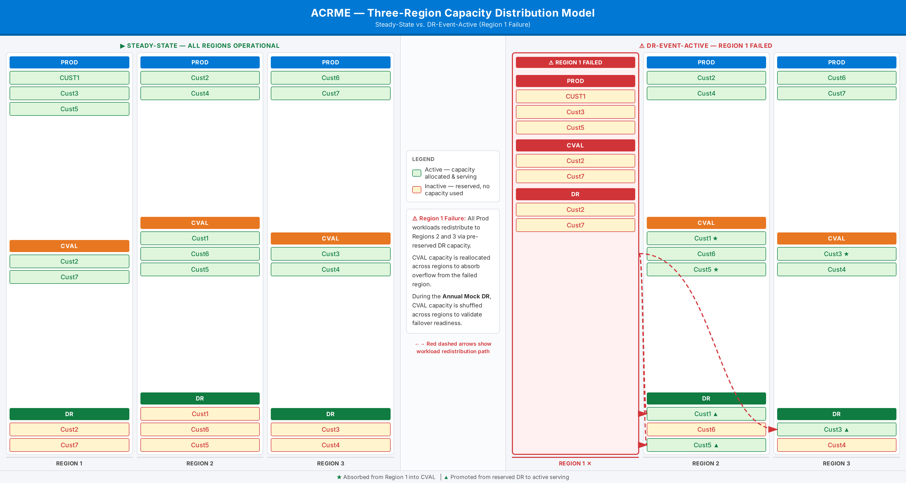
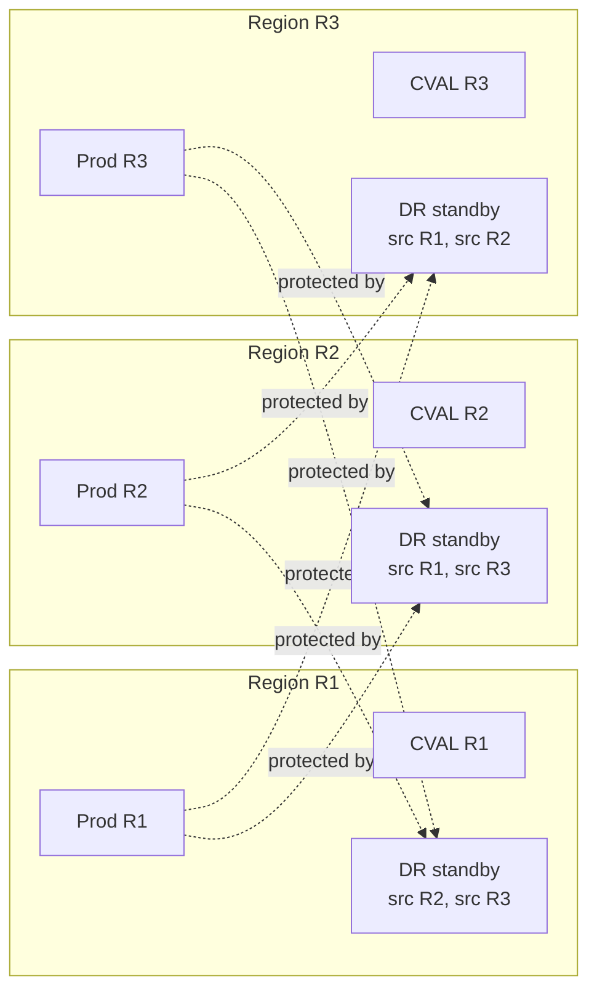

**Project:** Azure Capacity Reservation Management Engine (ACRME)  
**Classification:** Principal Cloud Architect - Architecture Governance  
**Version:** 1.0  
**Date:** 2 September 2026  
**Status:** Accepted - new ADR introduced with Requirements Baseline v2.2  
**Part of:** ACRME Architecture Decision Records - aligned to Capacity & Quota Management Requirements Baseline v2.2.

> **About ADRs.** An Architecture Decision Record captures a significant architectural decision, the context that forced it, the options considered, the choice made, and its consequences. This ADR consolidates the distributed DR reference model (§12A of the requirements baseline) that was previously distributed across ADR-003 and the calculation logic reference. Evidence tags: `[Documented]`, `[Decided]`, `[Derived]`, `[Assumed]`.

---

# ADR-005 - Distributed DR Reference Model

**Status:** Accepted  
**Date:** 2 September 2026  
**Deciders:** Principal Cloud Architect, DR Owner, Platform Engineering, FinOps, Capacity Planning  
**Related requirements:** DR-006, DR-007, DR-009, DR-013, DR-016, DR-017, DR-018, DR-019, PLC-003..PLC-005, PLC-010, DAT-002, DAT-003, OBS-001..OBS-004  
**Related POCs/decisions:** POC-006 (DR topology), POC-007 (bootstrap sizing), POC-011 (max-not-sum overcommit safety), DEC-001 (Middle East DR), DEC-002 (failback duration)  
**Related ADRs:** ADR-001 (seed record), ADR-002 (single governed quota pool, DR earmark), ADR-003 (lean bootstrap, activation, CVAL earmark, state machine)

## Context

Requirements Baseline v2.2 replaces the fixed-ratio, per-customer DR clone with a **distributed, reciprocal DR reference model** (§12A). At platform scale, dedicating a fixed 30-40% standby copy of every production region is prohibitively expensive and does not reflect the operating assumption that **one source region fails at a time**. `[Decided]`

The distributed model spreads each customer's standby capacity across the same shared regional footprint that already hosts production and CVAL. This creates a many-to-many topology in which a single region is simultaneously a **production** region for some customers, a **CVAL** host for others, and a **DR standby** host for customers whose production is in one or more *different* source regions. `[Decided]`

Because ADR-003 already carries the operational DR decisions (bootstrap, activation waves, CVAL earmark, engine state machine), this ADR fixes the **reference model itself**: the topology, the authoritative source→destination mapping, the destination-sizing boundary, the single-failure assumption, and the observability contract that makes the model auditable. It is the design anchor for the §12A worked example and the `acrme_three_region_capacity_model` diagram. `[Derived]`

## Decision

Adopt the **distributed, reciprocal DR reference model** with the following normative elements:

1. **Distributed standby, not co-located clones.** Each customer's DR standby is placed by the ADR-001 placement engine into a destination region drawn from the shared regional footprint, recorded in the seed record, and never defaulted to a fixed percentage of production. `[Decided]`

2. **Reciprocal, many-to-many roles.** Every managed region may concurrently hold three roles — Prod, CVAL, and DR standby for multiple different source regions. No region is a dedicated DR-only region. `[Decided]`

3. **Authoritative source→destination index (DR-018).** `SourceDestinationDRIndex` is the required state entity that maps each protected source region to the destination regions holding its standby capacity, per customer/realm and seed. It is the reverse view of the seed record and the driver of activation. `[Decided]`

4. **Bidirectional queryability.** The index must answer both `source → destinations` (which standby sets activate when a source fails) and `destination → sources` (which sources a destination protects, for max-source coverage and dashboards). `[Decided]`

5. **Max-not-sum destination boundary (DR-017).** A destination sizes its standby capacity to the **largest single non-concurrent protected source portion**, not the sum across sources. A configured SUM override is available where a contract or geography requires simultaneous-failure coverage. `[Decided]`

6. **Single-source-failure assumption is explicit.** The model is valid only under the assumption that at most one protected source region is in a declared DR event at a time. Concurrent multi-source failure is an out-of-model risk mitigated only by SUM override or additional earmark. `[Decided]`

7. **The DR earmark lives inside the single governed quota pool.** Per ADR-002, the max-not-sum destination requirement is reserved as `DR_Earmark_vCPU` inside the one governed quota pool for that region/family, so live NonProd/CVAL usage cannot consume standby-activation headroom. `[Decided]`

8. **Activation is source-specific and wave-ordered.** A declared source-region failure activates only that source's mapped standby set, in business-priority waves, via the ADR-003 staged acquisition sequence, and is reversible on failback. `[Decided]`

## Reference Topology

The reference footprint used in the §12A worked example spans three regions (R1, R2, R3). Each region carries its own production and CVAL workloads and hosts distributed DR standby for the *other* regions' production. The `src Rn` tag on each standby cell identifies the source region whose production that standby protects.



*Figure 1. Distributed DR reference model (§12A worked example). Each region simultaneously hosts Prod, CVAL, and DR standby for other source regions; every DR standby cell is tagged with its `src Rn` source region. See `diagrams/acrme_three_region_capacity_model.html` for the self-contained source.*



*Figure 2. Reciprocal protection: each region's production is protected by standby distributed across the other regions; each region's DR cell hosts standby for multiple source regions (many-to-many).*

## SourceDestinationDRIndex (DR-018, DAT-002)

| Field | Purpose |
|---|---|
| `source_region` | Failed or protected production source. |
| `destination_region` | Region holding standby DR capacity for that source. |
| `customer_or_realm_id` | Customer/realm whose standby set is mapped. |
| `seed_id` | Link back to `CustomerSeedRecord` (ADR-001). |
| `standby_instance_set` | VM/VMSS/node-pool/application set eligible for activation. |
| `sku_family`, `sku`, `zone`, `quantity` | Capacity/quota dimensions. |
| `activation_state` | `standby`, `activation_pending`, `active`, `failback_pending`, `returned`. |
| `priority_wave` | Business-priority order for activation (DR-009). |
| `policy_version`, `last_updated` | Replay, freshness, and audit fields. |

The index is derived from the seed records but is maintained as a first-class, independently queryable entity so activation does not require scanning all seeds at declaration time. `[Decided]`

## Destination Sizing Boundary (DR-017)

For each destination `d`, SKU, zone, and policy scope:

```text
Destination_DR_Requirement(d, sku, zone)
  = MAX over non-concurrent source regions s protected by d (
      Workload_Portion(s -> d, sku, zone)
    )

DR_Floor_vCPU(d, sku, zone)
  = Destination_DR_Requirement(d, sku, zone) * vCPU_Per_Instance(sku)

# Overcommit visibility (App. A.8):
Overcommit_Ratio(d) = ( SUM over sources s ( Workload_Portion(s -> d) ) )
                      / Destination_DR_Requirement(d)

# Coverage gap (App. A.7):
DR_Capacity_Gap(d) = Destination_DR_Requirement(d) - Standby_Provisioned(d)
```

- `MAX` is valid only under the single-source-failure assumption (Decision 6). `[Decided]`
- `Overcommit_Ratio(d) > 1` is expected and healthy — it quantifies how much cheaper the distributed max-not-sum model is than summed clones. It is surfaced, not alerted, unless it exceeds a configured safety ceiling (POC-011). `[Derived]`
- `DR_Capacity_Gap(d) > 0` means the destination cannot currently satisfy its worst-case single-source activation and must raise a coverage alert. `[Decided]`

## Worked Example (§12A)

Using the reference footprint, assume for one SKU/zone that region R1's DR cell protects R2 (portion 40 instances) and R3 (portion 55 instances), non-concurrently:

```text
Destination_DR_Requirement(R1) = MAX(40, 55) = 55 instances     # not 40 + 55 = 95
Overcommit_Ratio(R1)           = (40 + 55) / 55 = 1.73           # 73% cheaper than summed clones
```

R1 reserves standby for **55** instances (the larger single source), earmarked inside R1's single governed quota pool. If R3 is declared failed, R1 activates R3's 55-instance standby set in priority waves; R2's mapped standby (which may sit in a different destination) is untouched. `[Decided]`

## Observability Contract (OBS-001..004)

The distributed model is auditable only if the following are exposed:

- per-destination **max-source coverage** metric and a **coverage-gap** alert when `DR_Capacity_Gap(d) > 0` (OBS-001/002);
- **overcommit ratio** per destination, with a POC-011 safety-ceiling alert (OBS-002);
- a **source ↔ destination DR mapping** dashboard view driven by the index (OBS-004);
- activation state by customer and priority wave, and failback-pending age (OBS-003/004). `[Decided]`

## Consequences

**Positive**

- Removes fixed 30-40% idle standby as the default; distributed max-not-sum is materially cheaper. `[Decided]`
- Reuses the shared regional footprint (Prod/CVAL/DR reciprocal roles) instead of dedicated DR regions. `[Decided]`
- Makes activation deterministic and source-specific via the index and seed. `[Decided]`
- Pairs naturally with the single governed quota pool: the DR earmark is one line item inside the shared pool. `[Derived]`

**Negative / trade-offs**

- Under-protects genuinely concurrent multi-source failures unless SUM override or extra earmark is configured. `[Derived]`
- Requires the `SourceDestinationDRIndex` to be kept fresh and consistent with seeds. `[Decided]`
- Overcommit visibility and safety ceilings depend on POC-011 evidence. `[Assumed]`
- Cross-geo cases (e.g., Middle East → Switzerland North) add sovereignty/zone-alignment constraints to the mapping. `[Derived]`

## Alternatives Considered

| Alternative | Disposition |
|---|---|
| Fixed 30-40% per-customer DR clone | Rejected as default — idle cost, ignores single-failure assumption. `[Decided]` |
| Dedicated DR-only regions | Rejected — wastes the reciprocal capacity already present in shared regions. `[Decided]` |
| Sum-of-sources destination sizing as default | Rejected as default; retained as configurable SUM override. `[Decided]` |
| Compute activation set by scanning all seeds at declaration | Rejected — too slow; `SourceDestinationDRIndex` precomputes it. `[Decided]` |
| Earmark DR in a separate quota group | Rejected as default — single governed pool with a logical DR earmark is preferred (ADR-002). `[Decided]` |

---

## Appendix - ADR Summary

| ADR | Requirements Applied | Key Open Items |
|---|---|---|
| ADR-005 Distributed DR Reference Model | DR-006/007/009/013/016..019, PLC-003..005/010, DAT-002/003, OBS-001..004 | POC-006 topology; POC-007 bootstrap sizing; POC-011 overcommit safety ceiling; DEC-001 Middle East DR |

## Appendix - Status Legend

| Status | Meaning |
|---|---|
| **Proposed** | Under discussion; not yet ratified |
| **Accepted** | Ratified and in force |
| **Deprecated** | No longer recommended but not yet replaced |
| **Superseded** | Replaced by a later ADR |

## Appendix - Evidence Tag Taxonomy

| Tag | Meaning |
|---|---|
| `[Documented]` | Traceable to Azure platform behaviour or documentation |
| `[Decided]` | An explicit ACRME design choice recorded in this ADR set |
| `[Derived]` | A logical consequence of a documented constraint or decision |
| `[Assumed]` | Architectural judgement pending proof-of-concept validation |

## Related ADRs

- **ADR-001 - Region Selection and Customer Placement** (`acrme_adr_001_region_selection.md`)
- **ADR-002 - Quota and Capacity Management** (`acrme_adr_002_quota_and_capacity_management.md`)
- **ADR-003 - Capacity Management during Disaster Recovery (DR)** (`acrme_adr_003_capacity_management_during_dr.md`)
- **ADR-004 - Forecast, Reconciliation, and Increase of Capacity and Quota** (`acrme_adr_004_forecast_and_increase_of_capacity_and_quota.md`)

---

**Document Status:** Accepted  
**Next Review:** After POC-006, POC-007, POC-011, DEC-001, and first `SourceDestinationDRIndex` implementation test.
