# UML Diagram 1: Core Domain Model

**Purpose:** Central entities for capacity reservation management, placement, and quota governance.

**Status:** Design-first (70% complete) — entity outlines with known properties; some property types and constraints TBD.

```mermaid
classDiagram
    %% ===== AZURE RESOURCE LAYER =====
    class CapacityReservationGroup {
        +String subscriptionId
        +String resourceGroupName
        +String name
        +String location
        +List~String~ zones
        +Int totalCapacityVCPUs
        +Int allocatedVCPUs
        +String sharingProfile
        +List~String~ consumerSubscriptions
        +DateTime createdAt
        +DateTime lastModified
        +getTotalCapacity() Int
        +getAllocatedVMs() Int
        +getEffectiveFree() Int
    }

    class CapacityReservation {
        +String crgId
        +String name
        +String skuName
        +Int quantity
        +List~String~ zones
        +Int allocatedVMCount
        +ProvisioningState state
        +DateTime createdAt
        +getReservedVCPUs() Int
        +getAllocatedVCPUs() Int
        +isFullyAllocated() Boolean
    }

    %% ===== ACRME CONTROL PLANE ENTITIES =====
    class CustomerRegionAssignment {
        +String assignmentId [PK]
        +String customerId
        +String environment
        +Region prodRegion
        +Region nonProdRegion
        +Region drRegion
        +PlacementScoreBreakdown scoreBreakdown
        +String snapshotVersionProd
        +String snapshotVersionNonProd
        +String snapshotVersionDR
        +String policyVersionId
        +List~String~ holdIds
        +AssignmentStatus status
        +DateTime assignedAt
        +DateTime validUntil
        +validateRegionDistinctness() Boolean
        +getTargetCRG(environment) CapacityReservationGroup
    }

    class PlacementPolicy {
        +String policyId [PK]
        +String version
        +String customerId
        +Map~String,Float~ weights
        +List~HardConstraint~ hardConstraints
        +Float drRatioMin
        +Float drRatioMax
        +Float drAutoIncreaseThreshold
        +Float prodAutoIncreaseThreshold
        +Float nonProdAutoIncreaseThreshold
        +Boolean allowNonProdDRCoLocation
        +DateTime effectiveFrom
        +DateTime supersededAt
        +evaluateHardConstraints(region) Boolean
        +calculatePlacementScore(snapshot) Float
    }

    class RegionalSnapshot {
        +String snapshotId [PK]
        +String region
        +DateTime capturedAt
        +Int ttlSeconds
        +Map~String,QuotaData~ quotaByFamily
        +List~CRGSummary~ activeCRGs
        +Int totalReservedVCPUs
        +Int totalAllocatedVCPUs
        +Map~String,ZoneCapacity~ zoneCapacity
        +Float distanceFromProdRegion
        +isStale() Boolean
        +getEffectiveFreeCapacity() Int
    }

    class QuotaGroup {
        +String groupId [PK]
        +String subscriptionId
        +String region
        +QuotaGroupType type
        +Int totalQuotaVCPUs
        +Int reservedVCPUs
        +Int drFloorVCPUs
        +Int emergencyHeadroomVCPUs
        +Int usedVCPUs
        +DateTime createdAt
        +getAvailableForAllocation() Int
        +canAccommodate(demandVCPUs) Boolean
        +enforceFloor(drDemandVCPUs) Boolean
    }

    class CapacityIncreaseRequest {
        +String requestId [PK]
        +String crgId
        +RequestType type
        +Int currentQuantity
        +Int targetQuantity
        +String reason
        +IncreaseRequestStatus status
        +String requestedBy
        +String approvedBy
        +DateTime requestedAt
        +DateTime approvedAt
        +DateTime completedAt
        +String operationRecordId
        +requiresApproval() Boolean
        +canAutoApprove() Boolean
    }

    class EmergencyCapacityTransfer {
        +String transferId [PK]
        +TransferTier tier
        +String sourceRegion
        +String targetRegion
        +String sourceCRGId
        +String targetCRGId
        +Int transferVCPUs
        +List~String~ affectedVMIds
        +TransferStatus status
        +String requestedBy
        +String approvedBy
        +DateTime initiatedAt
        +DateTime completedAt
        +String operationRecordId
        +requiresDualApproval() Boolean
        +isQuotaNeutral() Boolean
    }

    class SharingRelationship {
        +String relationshipId [PK]
        +String providerCRGId
        +String consumerSubscriptionId
        +String consumerTenantId
        +SharingScope scope
        +DateTime sharedAt
        +DateTime revokedAt
        +Boolean isActive
        +getActiveVMCount() Int
    }

    class ZoneMappingRecord {
        +String recordId [PK]
        +String providerSubscriptionId
        +String consumerSubscriptionId
        +String region
        +Map~String,String~ zoneMapping
        +DateTime validatedAt
        +translateZone(logicalZone) String
        +isMappingAvailable() Boolean
    }

    %% ===== ENUMERATIONS =====
    class QuotaGroupType {
        <<enumeration>>
        PROD
        NONPROD_DR_SHARED
    }

    class AssignmentStatus {
        <<enumeration>>
        PENDING
        ACTIVE
        HOLD
        EXPIRED
        REVOKED
    }

    class IncreaseRequestStatus {
        <<enumeration>>
        PENDING_APPROVAL
        APPROVED
        IN_PROGRESS
        COMPLETED
        FAILED
        CANCELLED
    }

    class TransferStatus {
        <<enumeration>>
        INITIATED
        QUOTA_VALIDATED
        REDUCING_SOURCE
        EXPANDING_TARGET
        COMPLETED
        FAILED
        ROLLED_BACK
    }

    class TransferTier {
        <<enumeration>>
        TIER_1_DIRECT_EXPANSION
        TIER_2_QUOTA_NEUTRAL_TRANSFER
        TIER_3_DESTRUCTIVE_TRANSFER
    }

    %% ===== RELATIONSHIPS =====
    CapacityReservationGroup "1" --o "*" CapacityReservation : contains
    CapacityReservationGroup "1" o-- "*" SharingRelationship : provider
    CustomerRegionAssignment "*" --> "3" CapacityReservationGroup : targets (Prod|NonProd|DR)
    CustomerRegionAssignment "*" --> "1" PlacementPolicy : evaluatedBy
    CustomerRegionAssignment "*" --> "3" RegionalSnapshot : usesSnapshots
    QuotaGroup "1" --> "*" CapacityReservationGroup : governs
    CapacityIncreaseRequest "*" --> "1" CapacityReservationGroup : targets
    EmergencyCapacityTransfer "*" --> "1" CapacityReservationGroup : source
    EmergencyCapacityTransfer "*" --> "1" CapacityReservationGroup : target
    SharingRelationship "*" --> "1" ZoneMappingRecord : requiresZoneMapping
    PlacementPolicy --> QuotaGroupType : references
    QuotaGroup --> QuotaGroupType : type
    CustomerRegionAssignment --> AssignmentStatus : status
    CapacityIncreaseRequest --> IncreaseRequestStatus : status
    EmergencyCapacityTransfer --> TransferStatus : status
    EmergencyCapacityTransfer --> TransferTier : tier
```

## Known Gaps (to be resolved in design session):

### Entity Schemas (incomplete properties):
- **CustomerRegionAssignment**: Missing `PlacementScoreBreakdown` structure (alpha, beta, gamma, delta, epsilon values)
- **RegionalSnapshot**: Missing exact `CRGSummary`, `QuotaData`, `ZoneCapacity` nested structures
- **PlacementPolicy**: Missing `HardConstraint` definition (HC-1 through HC-7 structure)
- **QuotaGroup**: Exact Azure Quota API semantics for `totalQuotaVCPUs` vs `usedVCPUs` TBD
- **All entities**: Cosmos DB partition keys, indexes, TTL settings TBD

### Relationships (cardinality/constraints TBD):
- CustomerRegionAssignment → CRG: Hard constraint that Prod ≠ NonProd ≠ DR regions (enforced where?)
- QuotaGroup → CRG: One group can contain multiple CRGs in same region, exact cardinality TBD
- SharingRelationship: 100-consumer hard limit per CRG (enforced in entity or service layer?)

### Business Rules (not yet modeled):
- DR floor enforcement: `drFloorVCPUs` ≤ allocated DR capacity (where enforced?)
- Emergency headroom staging: How is `emergencyHeadroomVCPUs` pre-allocated in QuotaGroup?
- Auto-increase trigger thresholds: Separate per environment (0.35 DR, 0.20 Prod/NonProd) — stored where?
